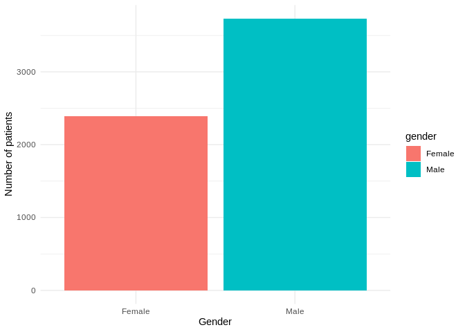

## Read data

```r
df <- read_excel("wuhan_blood_sample_data_Jan_Feb_2020.xlsx")
```

## Data summary

```r
kable(as.data.frame(summarytools::descr(df, stats = "common")))
```


|          | (%)lymphocyte| 2019-nCoV nucleic acid detection| Activation of partial thromboplastin time|        age|    albumin| Alkaline phosphatase| Amino-terminal brain natriuretic peptide precursor(NT-proBNP)| antithrombin| aspartate aminotransferase| basophil count(#)| basophil(%)|     calcium| Corrected calcium| creatinine|  D-D dimer| Direct bilirubin|      eGFR| Eosinophil count| eosinophils(%)|       ESR|     ferritin| Fibrin degradation products| fibrinogen|       gender|   globulin|    glucose| glutamic-pyruvic transaminase|      HBsAg|      HCO3-| HCV antibody quantification| hematocrit| hemoglobin| High sensitivity C-reactive protein| HIV antibody quantification| Hypersensitive cardiac troponinI| indirect bilirubin| Interleukin 10| Interleukin 1β| Interleukin 2 receptor| Interleukin 6| Interleukin 8| International standard ratio| Lactate dehydrogenase| lymphocyte count| mean corpuscular hemoglobin| mean corpuscular hemoglobin concentration| mean corpuscular volume| Mean platelet volume| monocytes count| monocytes(%)| neutrophils count| neutrophils(%)|      outcome| PATIENT_ID|    PH value| Platelet count| platelet large cell ratio| PLT distribution width| procalcitonin| Prothrombin activity| Prothrombin time| Quantification of Treponema pallidum antibodies| RBC distribution width SD| Red blood cell count| Red blood cell distribution width| Serum chloride| Serum potassium| serum sodium| Thrombin time| thrombocytocrit| Total bilirubin| Total cholesterol| total protein| Tumor necrosis factorα|       Urea|  Uric acid| White blood cell count| γ-glutamyl transpeptidase|
|:---------|-------------:|--------------------------------:|-----------------------------------------:|----------:|----------:|--------------------:|-------------------------------------------------------------:|------------:|--------------------------:|-----------------:|-----------:|-----------:|-----------------:|----------:|----------:|----------------:|---------:|----------------:|--------------:|---------:|------------:|---------------------------:|----------:|------------:|----------:|----------:|-----------------------------:|----------:|----------:|---------------------------:|----------:|----------:|-----------------------------------:|---------------------------:|--------------------------------:|------------------:|--------------:|--------------:|----------------------:|-------------:|-------------:|----------------------------:|---------------------:|----------------:|---------------------------:|-----------------------------------------:|-----------------------:|--------------------:|---------------:|------------:|-----------------:|--------------:|------------:|----------:|-----------:|--------------:|-------------------------:|----------------------:|-------------:|--------------------:|----------------:|-----------------------------------------------:|-------------------------:|--------------------:|---------------------------------:|--------------:|---------------:|------------:|-------------:|---------------:|---------------:|-----------------:|-------------:|----------------------:|----------:|----------:|----------------------:|-------------------------:|
|Mean      |      15.39165|                        -1.000000|                                 41.520070|   59.44330|  32.006317|             82.46774|                                                   3669.368421|    85.318182|                   46.52834|         0.0170846|   0.2099269|   2.0779571|         2.3548687|  109.93376|   7.943413|         9.886774|  81.56432|         0.038652|      0.6289446|  33.68930|  1379.144170|                   61.354242|   4.294435|    1.3905229|  33.241613|   8.889174|                      38.86037|   8.306308|  23.141113|                   0.1170968|  36.544514|  123.12492|                            76.24383|                   0.1001439|                      1223.229980|           6.888962|      16.068539|       6.509702|             907.164179|    112.307978|     83.087687|                    1.3127618|             474.22805|         1.016782|                    30.99760|                                 342.80355|               90.388192|            10.909281|       0.5258516|     6.155219|          7.809582|       77.60146|    0.4746732| 188.000000|   6.4835339|      184.31034|                 31.765661|              13.005220|      1.106601|             78.55083|        16.674924|                                       0.1324014|                 42.444204|              9.28780|                         13.074540|     103.135692|       4.5088469|   141.549641|     18.170318|       0.2123086|        16.69538|         3.6893555|     65.303115|              11.577612|   9.589241|  276.12709|               15.59944|                  55.34409|
|Std.Dev   |      12.93374|                         0.000000|                                 11.783239|   16.37223|   6.249461|             46.56562|                                                   9695.000276|    18.288268|                  103.28073|         0.0171678|   0.2172857|   0.1629913|         0.1285858|  134.19119|   9.211021|        21.408093|  32.22278|         0.061654|      1.0668200|  24.60345|  3454.399541|                   65.645267|   1.888833|    0.4879074|   5.509276|   5.221573|                      83.76664|  42.929819|   4.409833|                   0.2350643|   5.314735|   23.73799|                            81.08041|                   0.0400809|                      5391.612528|           7.023537|      68.441138|       7.012155|             788.009337|    537.205847|    553.152505|                    0.8083756|             369.13698|         2.059922|                     2.90913|                                  17.79971|                6.504046|             1.088321|       1.6943098|     4.075424|          6.070367|       16.64369|    0.4993989| 108.397417|   0.7267371|      104.48167|                  8.565205|               2.791223|      4.663411|             22.14339|         9.501093|                                       0.7699385|                  6.300563|             36.30541|                          1.727006|       7.746938|       0.8516411|     7.333611|      8.894196|       0.0928407|        26.56593|         0.9815529|      7.625481|              13.061641|   9.440427|  151.53874|               67.74697|                  69.45158|
|Min       |       0.00000|                        -1.000000|                                 21.800000|   18.00000|  13.600000|             17.00000|                                                      5.000000|    20.000000|                    6.00000|         0.0000000|   0.0000000|   1.1700000|         1.6500000|   11.00000|   0.210000|         1.600000|   2.00000|         0.000000|      0.0000000|   1.00000|    17.800000|                    4.000000|   0.500000|    1.0000000|  10.100000|   1.000000|                       5.00000|   0.000000|   6.300000|                   0.0200000|  14.500000|    6.40000|                             0.10000|                   0.0500000|                         1.900000|           0.100000|       5.000000|       5.000000|              61.000000|      1.500000|      5.000000|                    0.8400000|             110.00000|         0.000000|                    20.40000|                                 286.00000|               61.600000|             8.500000|       0.0100000|     0.300000|          0.060000|        1.70000|    0.0000000|   1.000000|   5.0000000|       -1.00000|                 11.200000|               8.000000|      0.020000|              6.00000|        11.500000|                                       0.0200000|                 31.300000|              0.10000|                         10.600000|      71.500000|       2.7600000|   115.400000|     13.000000|       0.0100000|         2.50000|         0.1000000|     31.800000|               4.000000|   0.800000|   43.00000|                0.13000|                   3.00000|
|Median    |      11.45000|                        -1.000000|                                 39.200000|   62.00000|  32.200000|             69.50000|                                                    585.000000|    86.000000|                   27.00000|         0.0100000|   0.2000000|   2.0800000|         2.3600000|   76.00000|   2.155000|         4.800000|  87.90000|         0.010000|      0.1000000|  28.00000|   711.000000|                   17.900000|   4.120000|    1.0000000|  32.700000|   6.990000|                      24.00000|   0.010000|  23.500000|                   0.0600000|  36.600000|  125.00000|                            51.50000|                   0.0900000|                        20.600000|           5.400000|       5.900000|       5.000000|             676.500000|     19.265000|     16.000000|                    1.1400000|             340.00000|         0.800000|                    30.90000|                                 343.00000|               90.100000|            10.800000|       0.4100000|     5.700000|          5.850000|       82.40000|    0.0000000| 188.000000|   6.5000000|      178.00000|                 30.900000|              12.400000|      0.100000|             81.00000|        14.800000|                                       0.0500000|                 40.900000|              4.14000|                         12.600000|     102.100000|       4.4100000|   140.400000|     16.800000|       0.2100000|        10.70000|         3.6300000|     65.900000|               8.600000|   5.985000|  243.70000|                7.72000|                  34.00000|
|Max       |      60.00000|                        -1.000000|                                144.000000|   95.00000|  48.600000|            620.00000|                                                  70000.000000|   136.000000|                 1858.00000|         0.1200000|   1.7000000|   2.6200000|         2.7900000| 1497.00000|  60.000000|       360.600000| 224.00000|         0.490000|      8.6000000| 110.00000| 50000.000000|                  190.800000|  10.780000|    2.0000000|  50.600000|  43.010000|                    1600.00000| 250.000000|  36.300000|                   2.0900000|  52.300000|  178.00000|                           320.00000|                   0.2700000|                     50000.000000|         145.100000|    1000.000000|      88.500000|            7500.000000|   5000.000000|   6795.000000|                   13.4800000|            1867.00000|        52.420000|                    50.80000|                                 514.00000|              118.900000|            15.000000|      39.9200000|    53.000000|         33.880000|       98.90000|    1.0000000| 375.000000|   7.5650000|      558.00000|                 62.200000|              25.300000|     57.170000|            142.00000|       120.000000|                                      11.9500000|                113.300000|            749.50000|                         27.100000|     140.400000|      12.8000000|   179.700000|    161.900000|       0.5100000|       505.70000|         7.3000000|     88.700000|             168.000000|  68.400000| 1176.00000|             1726.60000|                 732.00000|
|N.Valid   |     958.00000|                       501.000000|                                568.000000| 6120.00000| 934.000000|            930.00000|                                                    475.000000|   330.000000|                  935.00000|       957.0000000| 957.0000000| 979.0000000|       914.0000000|  936.00000| 630.000000|       930.000000| 936.00000|       957.000000|    957.0000000| 383.00000|   283.000000|                  330.000000| 566.000000| 6120.0000000| 930.000000| 775.000000|                     931.00000| 279.000000| 934.000000|                 279.0000000| 957.000000|  975.00000|                           737.00000|                 278.0000000|                       507.000000|         906.000000|     267.000000|     268.000000|             268.000000|    272.000000|    268.000000|                  659.0000000|             934.00000|       957.000000|                   957.00000|                                 957.00000|              957.000000|           862.000000|     957.0000000|   958.000000|        957.000000|      957.00000| 6120.0000000| 375.000000| 384.0000000|      957.00000|                862.000000|             862.000000|    459.000000|            659.00000|       662.000000|                                     279.0000000|                923.000000|           1127.00000|                        923.000000|     975.000000|     980.0000000|   975.000000|    566.000000|     862.0000000|       930.00000|       931.0000000|    931.000000|             268.000000| 936.000000|  934.00000|             1127.00000|                 930.00000|
|Pct.Valid |      15.65359|                         8.186274|                                  9.281046|  100.00000|  15.261438|             15.19608|                                                      7.761438|     5.392157|                   15.27778|        15.6372549|  15.6372549|  15.9967320|        14.9346405|   15.29412|  10.294118|        15.196078|  15.29412|        15.637255|     15.6372549|   6.25817|     4.624183|                    5.392157|   9.248366|  100.0000000|  15.196078|  12.663399|                      15.21242|   4.558823|  15.261438|                   4.5588235|  15.637255|   15.93137|                            12.04248|                   4.5424837|                         8.284314|          14.803922|       4.362745|       4.379085|               4.379085|      4.444444|      4.379085|                   10.7679739|              15.26144|        15.637255|                    15.63725|                                  15.63725|               15.637255|            14.084967|      15.6372549|    15.653595|         15.637255|       15.63725|  100.0000000|   6.127451|   6.2745098|       15.63725|                 14.084967|              14.084967|      7.500000|             10.76797|        10.816994|                                       4.5588235|                 15.081699|             18.41503|                         15.081699|      15.931373|      16.0130719|    15.931373|      9.248366|      14.0849673|        15.19608|        15.2124183|     15.212418|               4.379085|  15.294118|   15.26144|               18.41503|                  15.19608|

As you can see, there is no NA in `outcome` column. So every sample has been classified. `0` means that the particular patient has survived. `1` means that patient has died.

## Clean dataset

```r
df$gender<-ifelse(df$gender==1, 'Male', 'Female') 
df <- df %>% mutate(gender = as.factor(gender))
```

## Age distribution

```r
ggplot(df, aes(x=age,color=gender)) + geom_histogram() + facet_grid(. ~ gender)
```

<!-- -->
