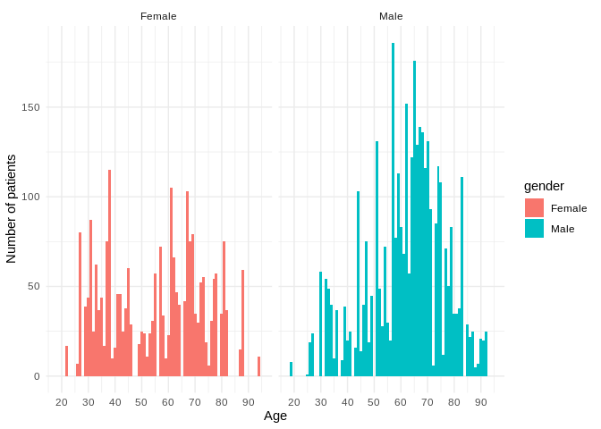

## Read data

```r
df <- read_excel("wuhan_blood_sample_data_Jan_Feb_2020.xlsx")
```

## Clean dataset

```r
df$gender<-ifelse(df$gender==1, 'Male', 'Female') 
df <- df %>% mutate(gender = as.factor(gender))
df$outcome<-ifelse(df$outcome==1, 'Death', 'Survival')
df <- df %>% mutate(outcome = as.factor(outcome))
# TODO: Calculate how long hospital therapy took instead of all dates?
df <- df %>% mutate(RE_DATE = as.Date(RE_DATE))
df <- df %>% mutate(`Admission time` = as.Date(`Admission time`))
df <- df %>% mutate(`Discharge time` =  as.Date(`Discharge time`))
```

## Data summary

```r
no_dates_df <- df %>% select(-c('Admission time', 'Discharge time', 'RE_DATE' ))
tbl_summary(
    no_dates_df,
    by = outcome
            ) %>%
    add_n() %>%
    modify_header(label = "**Variable**") %>%
    bold_labels() 
```

<!--html_preserve--><style>html {
  font-family: -apple-system, BlinkMacSystemFont, 'Segoe UI', Roboto, Oxygen, Ubuntu, Cantarell, 'Helvetica Neue', 'Fira Sans', 'Droid Sans', Arial, sans-serif;
}

#ozvyemkvfj .gt_table {
  display: table;
  border-collapse: collapse;
  margin-left: auto;
  margin-right: auto;
  color: #333333;
  font-size: 16px;
  font-weight: normal;
  font-style: normal;
  background-color: #FFFFFF;
  width: auto;
  border-top-style: solid;
  border-top-width: 2px;
  border-top-color: #A8A8A8;
  border-right-style: none;
  border-right-width: 2px;
  border-right-color: #D3D3D3;
  border-bottom-style: solid;
  border-bottom-width: 2px;
  border-bottom-color: #A8A8A8;
  border-left-style: none;
  border-left-width: 2px;
  border-left-color: #D3D3D3;
}

#ozvyemkvfj .gt_heading {
  background-color: #FFFFFF;
  text-align: center;
  border-bottom-color: #FFFFFF;
  border-left-style: none;
  border-left-width: 1px;
  border-left-color: #D3D3D3;
  border-right-style: none;
  border-right-width: 1px;
  border-right-color: #D3D3D3;
}

#ozvyemkvfj .gt_title {
  color: #333333;
  font-size: 125%;
  font-weight: initial;
  padding-top: 4px;
  padding-bottom: 4px;
  border-bottom-color: #FFFFFF;
  border-bottom-width: 0;
}

#ozvyemkvfj .gt_subtitle {
  color: #333333;
  font-size: 85%;
  font-weight: initial;
  padding-top: 0;
  padding-bottom: 4px;
  border-top-color: #FFFFFF;
  border-top-width: 0;
}

#ozvyemkvfj .gt_bottom_border {
  border-bottom-style: solid;
  border-bottom-width: 2px;
  border-bottom-color: #D3D3D3;
}

#ozvyemkvfj .gt_col_headings {
  border-top-style: solid;
  border-top-width: 2px;
  border-top-color: #D3D3D3;
  border-bottom-style: solid;
  border-bottom-width: 2px;
  border-bottom-color: #D3D3D3;
  border-left-style: none;
  border-left-width: 1px;
  border-left-color: #D3D3D3;
  border-right-style: none;
  border-right-width: 1px;
  border-right-color: #D3D3D3;
}

#ozvyemkvfj .gt_col_heading {
  color: #333333;
  background-color: #FFFFFF;
  font-size: 100%;
  font-weight: normal;
  text-transform: inherit;
  border-left-style: none;
  border-left-width: 1px;
  border-left-color: #D3D3D3;
  border-right-style: none;
  border-right-width: 1px;
  border-right-color: #D3D3D3;
  vertical-align: bottom;
  padding-top: 5px;
  padding-bottom: 6px;
  padding-left: 5px;
  padding-right: 5px;
  overflow-x: hidden;
}

#ozvyemkvfj .gt_column_spanner_outer {
  color: #333333;
  background-color: #FFFFFF;
  font-size: 100%;
  font-weight: normal;
  text-transform: inherit;
  padding-top: 0;
  padding-bottom: 0;
  padding-left: 4px;
  padding-right: 4px;
}

#ozvyemkvfj .gt_column_spanner_outer:first-child {
  padding-left: 0;
}

#ozvyemkvfj .gt_column_spanner_outer:last-child {
  padding-right: 0;
}

#ozvyemkvfj .gt_column_spanner {
  border-bottom-style: solid;
  border-bottom-width: 2px;
  border-bottom-color: #D3D3D3;
  vertical-align: bottom;
  padding-top: 5px;
  padding-bottom: 6px;
  overflow-x: hidden;
  display: inline-block;
  width: 100%;
}

#ozvyemkvfj .gt_group_heading {
  padding: 8px;
  color: #333333;
  background-color: #FFFFFF;
  font-size: 100%;
  font-weight: initial;
  text-transform: inherit;
  border-top-style: solid;
  border-top-width: 2px;
  border-top-color: #D3D3D3;
  border-bottom-style: solid;
  border-bottom-width: 2px;
  border-bottom-color: #D3D3D3;
  border-left-style: none;
  border-left-width: 1px;
  border-left-color: #D3D3D3;
  border-right-style: none;
  border-right-width: 1px;
  border-right-color: #D3D3D3;
  vertical-align: middle;
}

#ozvyemkvfj .gt_empty_group_heading {
  padding: 0.5px;
  color: #333333;
  background-color: #FFFFFF;
  font-size: 100%;
  font-weight: initial;
  border-top-style: solid;
  border-top-width: 2px;
  border-top-color: #D3D3D3;
  border-bottom-style: solid;
  border-bottom-width: 2px;
  border-bottom-color: #D3D3D3;
  vertical-align: middle;
}

#ozvyemkvfj .gt_from_md > :first-child {
  margin-top: 0;
}

#ozvyemkvfj .gt_from_md > :last-child {
  margin-bottom: 0;
}

#ozvyemkvfj .gt_row {
  padding-top: 8px;
  padding-bottom: 8px;
  padding-left: 5px;
  padding-right: 5px;
  margin: 10px;
  border-top-style: solid;
  border-top-width: 1px;
  border-top-color: #D3D3D3;
  border-left-style: none;
  border-left-width: 1px;
  border-left-color: #D3D3D3;
  border-right-style: none;
  border-right-width: 1px;
  border-right-color: #D3D3D3;
  vertical-align: middle;
  overflow-x: hidden;
}

#ozvyemkvfj .gt_stub {
  color: #333333;
  background-color: #FFFFFF;
  font-size: 100%;
  font-weight: initial;
  text-transform: inherit;
  border-right-style: solid;
  border-right-width: 2px;
  border-right-color: #D3D3D3;
  padding-left: 12px;
}

#ozvyemkvfj .gt_summary_row {
  color: #333333;
  background-color: #FFFFFF;
  text-transform: inherit;
  padding-top: 8px;
  padding-bottom: 8px;
  padding-left: 5px;
  padding-right: 5px;
}

#ozvyemkvfj .gt_first_summary_row {
  padding-top: 8px;
  padding-bottom: 8px;
  padding-left: 5px;
  padding-right: 5px;
  border-top-style: solid;
  border-top-width: 2px;
  border-top-color: #D3D3D3;
}

#ozvyemkvfj .gt_grand_summary_row {
  color: #333333;
  background-color: #FFFFFF;
  text-transform: inherit;
  padding-top: 8px;
  padding-bottom: 8px;
  padding-left: 5px;
  padding-right: 5px;
}

#ozvyemkvfj .gt_first_grand_summary_row {
  padding-top: 8px;
  padding-bottom: 8px;
  padding-left: 5px;
  padding-right: 5px;
  border-top-style: double;
  border-top-width: 6px;
  border-top-color: #D3D3D3;
}

#ozvyemkvfj .gt_striped {
  background-color: rgba(128, 128, 128, 0.05);
}

#ozvyemkvfj .gt_table_body {
  border-top-style: solid;
  border-top-width: 2px;
  border-top-color: #D3D3D3;
  border-bottom-style: solid;
  border-bottom-width: 2px;
  border-bottom-color: #D3D3D3;
}

#ozvyemkvfj .gt_footnotes {
  color: #333333;
  background-color: #FFFFFF;
  border-bottom-style: none;
  border-bottom-width: 2px;
  border-bottom-color: #D3D3D3;
  border-left-style: none;
  border-left-width: 2px;
  border-left-color: #D3D3D3;
  border-right-style: none;
  border-right-width: 2px;
  border-right-color: #D3D3D3;
}

#ozvyemkvfj .gt_footnote {
  margin: 0px;
  font-size: 90%;
  padding: 4px;
}

#ozvyemkvfj .gt_sourcenotes {
  color: #333333;
  background-color: #FFFFFF;
  border-bottom-style: none;
  border-bottom-width: 2px;
  border-bottom-color: #D3D3D3;
  border-left-style: none;
  border-left-width: 2px;
  border-left-color: #D3D3D3;
  border-right-style: none;
  border-right-width: 2px;
  border-right-color: #D3D3D3;
}

#ozvyemkvfj .gt_sourcenote {
  font-size: 90%;
  padding: 4px;
}

#ozvyemkvfj .gt_left {
  text-align: left;
}

#ozvyemkvfj .gt_center {
  text-align: center;
}

#ozvyemkvfj .gt_right {
  text-align: right;
  font-variant-numeric: tabular-nums;
}

#ozvyemkvfj .gt_font_normal {
  font-weight: normal;
}

#ozvyemkvfj .gt_font_bold {
  font-weight: bold;
}

#ozvyemkvfj .gt_font_italic {
  font-style: italic;
}

#ozvyemkvfj .gt_super {
  font-size: 65%;
}

#ozvyemkvfj .gt_footnote_marks {
  font-style: italic;
  font-size: 65%;
}
</style>
<div id="ozvyemkvfj" style="overflow-x:auto;overflow-y:auto;width:auto;height:auto;"><table class="gt_table">
  
  <thead class="gt_col_headings">
    <tr>
      <th class="gt_col_heading gt_columns_bottom_border gt_left" rowspan="1" colspan="1"><strong>Variable</strong></th>
      <th class="gt_col_heading gt_columns_bottom_border gt_center" rowspan="1" colspan="1"><strong>N</strong></th>
      <th class="gt_col_heading gt_columns_bottom_border gt_center" rowspan="1" colspan="1"><strong>Death</strong>, N = 2,905<sup class="gt_footnote_marks">1</sup></th>
      <th class="gt_col_heading gt_columns_bottom_border gt_center" rowspan="1" colspan="1"><strong>Survival</strong>, N = 3,215<sup class="gt_footnote_marks">1</sup></th>
    </tr>
  </thead>
  <tbody class="gt_table_body">
    <tr>
      <td class="gt_row gt_left" style="font-weight: bold;">PATIENT_ID</td>
      <td class="gt_row gt_center">375</td>
      <td class="gt_row gt_center">288 (245, 332)</td>
      <td class="gt_row gt_center">101 (51, 151)</td>
    </tr>
    <tr>
      <td class="gt_row gt_left" style="text-align: left; text-indent: 10px;">Unknown</td>
      <td class="gt_row gt_center"></td>
      <td class="gt_row gt_center">2,731</td>
      <td class="gt_row gt_center">3,014</td>
    </tr>
    <tr>
      <td class="gt_row gt_left" style="font-weight: bold;">age</td>
      <td class="gt_row gt_center">6,120</td>
      <td class="gt_row gt_center">70 (63, 78)</td>
      <td class="gt_row gt_center">51 (37, 62)</td>
    </tr>
    <tr>
      <td class="gt_row gt_left" style="font-weight: bold;">gender</td>
      <td class="gt_row gt_center">6,120</td>
      <td class="gt_row gt_center"></td>
      <td class="gt_row gt_center"></td>
    </tr>
    <tr>
      <td class="gt_row gt_left" style="text-align: left; text-indent: 10px;">Female</td>
      <td class="gt_row gt_center"></td>
      <td class="gt_row gt_center">751 (26%)</td>
      <td class="gt_row gt_center">1,639 (51%)</td>
    </tr>
    <tr>
      <td class="gt_row gt_left" style="text-align: left; text-indent: 10px;">Male</td>
      <td class="gt_row gt_center"></td>
      <td class="gt_row gt_center">2,154 (74%)</td>
      <td class="gt_row gt_center">1,576 (49%)</td>
    </tr>
    <tr>
      <td class="gt_row gt_left" style="font-weight: bold;">Hypersensitive cardiac troponinI</td>
      <td class="gt_row gt_center">507</td>
      <td class="gt_row gt_center">70 (18, 631)</td>
      <td class="gt_row gt_center">3 (2, 7)</td>
    </tr>
    <tr>
      <td class="gt_row gt_left" style="text-align: left; text-indent: 10px;">Unknown</td>
      <td class="gt_row gt_center"></td>
      <td class="gt_row gt_center">2,572</td>
      <td class="gt_row gt_center">3,041</td>
    </tr>
    <tr>
      <td class="gt_row gt_left" style="font-weight: bold;">hemoglobin</td>
      <td class="gt_row gt_center">975</td>
      <td class="gt_row gt_center">123 (110, 135)</td>
      <td class="gt_row gt_center">127 (116, 138)</td>
    </tr>
    <tr>
      <td class="gt_row gt_left" style="text-align: left; text-indent: 10px;">Unknown</td>
      <td class="gt_row gt_center"></td>
      <td class="gt_row gt_center">2,438</td>
      <td class="gt_row gt_center">2,707</td>
    </tr>
    <tr>
      <td class="gt_row gt_left" style="font-weight: bold;">Serum chloride</td>
      <td class="gt_row gt_center">975</td>
      <td class="gt_row gt_center">104 (100, 111)</td>
      <td class="gt_row gt_center">101 (99, 103)</td>
    </tr>
    <tr>
      <td class="gt_row gt_left" style="text-align: left; text-indent: 10px;">Unknown</td>
      <td class="gt_row gt_center"></td>
      <td class="gt_row gt_center">2,403</td>
      <td class="gt_row gt_center">2,742</td>
    </tr>
    <tr>
      <td class="gt_row gt_left" style="font-weight: bold;">Prothrombin time</td>
      <td class="gt_row gt_center">662</td>
      <td class="gt_row gt_center">16.3 (15.0, 18.2)</td>
      <td class="gt_row gt_center">13.6 (13.1, 14.1)</td>
    </tr>
    <tr>
      <td class="gt_row gt_left" style="text-align: left; text-indent: 10px;">Unknown</td>
      <td class="gt_row gt_center"></td>
      <td class="gt_row gt_center">2,531</td>
      <td class="gt_row gt_center">2,927</td>
    </tr>
    <tr>
      <td class="gt_row gt_left" style="font-weight: bold;">procalcitonin</td>
      <td class="gt_row gt_center">459</td>
      <td class="gt_row gt_center">0.38 (0.14, 1.13)</td>
      <td class="gt_row gt_center">0.04 (0.02, 0.06)</td>
    </tr>
    <tr>
      <td class="gt_row gt_left" style="text-align: left; text-indent: 10px;">Unknown</td>
      <td class="gt_row gt_center"></td>
      <td class="gt_row gt_center">2,681</td>
      <td class="gt_row gt_center">2,980</td>
    </tr>
    <tr>
      <td class="gt_row gt_left" style="font-weight: bold;">eosinophils(%)</td>
      <td class="gt_row gt_center">957</td>
      <td class="gt_row gt_center">0.00 (0.00, 0.10)</td>
      <td class="gt_row gt_center">0.70 (0.00, 1.80)</td>
    </tr>
    <tr>
      <td class="gt_row gt_left" style="text-align: left; text-indent: 10px;">Unknown</td>
      <td class="gt_row gt_center"></td>
      <td class="gt_row gt_center">2,443</td>
      <td class="gt_row gt_center">2,720</td>
    </tr>
    <tr>
      <td class="gt_row gt_left" style="font-weight: bold;">Interleukin 2 receptor</td>
      <td class="gt_row gt_center">268</td>
      <td class="gt_row gt_center">1,180 (807, 1,603)</td>
      <td class="gt_row gt_center">529 (400, 742)</td>
    </tr>
    <tr>
      <td class="gt_row gt_left" style="text-align: left; text-indent: 10px;">Unknown</td>
      <td class="gt_row gt_center"></td>
      <td class="gt_row gt_center">2,804</td>
      <td class="gt_row gt_center">3,048</td>
    </tr>
    <tr>
      <td class="gt_row gt_left" style="font-weight: bold;">Alkaline phosphatase</td>
      <td class="gt_row gt_center">930</td>
      <td class="gt_row gt_center">83 (64, 123)</td>
      <td class="gt_row gt_center">60 (50, 75)</td>
    </tr>
    <tr>
      <td class="gt_row gt_left" style="text-align: left; text-indent: 10px;">Unknown</td>
      <td class="gt_row gt_center"></td>
      <td class="gt_row gt_center">2,448</td>
      <td class="gt_row gt_center">2,742</td>
    </tr>
    <tr>
      <td class="gt_row gt_left" style="font-weight: bold;">albumin</td>
      <td class="gt_row gt_center">934</td>
      <td class="gt_row gt_center">28 (24, 31)</td>
      <td class="gt_row gt_center">36 (34, 39)</td>
    </tr>
    <tr>
      <td class="gt_row gt_left" style="text-align: left; text-indent: 10px;">Unknown</td>
      <td class="gt_row gt_center"></td>
      <td class="gt_row gt_center">2,444</td>
      <td class="gt_row gt_center">2,742</td>
    </tr>
    <tr>
      <td class="gt_row gt_left" style="font-weight: bold;">basophil(%)</td>
      <td class="gt_row gt_center">957</td>
      <td class="gt_row gt_center">0.10 (0.10, 0.20)</td>
      <td class="gt_row gt_center">0.20 (0.10, 0.40)</td>
    </tr>
    <tr>
      <td class="gt_row gt_left" style="text-align: left; text-indent: 10px;">Unknown</td>
      <td class="gt_row gt_center"></td>
      <td class="gt_row gt_center">2,443</td>
      <td class="gt_row gt_center">2,720</td>
    </tr>
    <tr>
      <td class="gt_row gt_left" style="font-weight: bold;">Interleukin 10</td>
      <td class="gt_row gt_center">267</td>
      <td class="gt_row gt_center">11 (6, 17)</td>
      <td class="gt_row gt_center">5 (5, 8)</td>
    </tr>
    <tr>
      <td class="gt_row gt_left" style="text-align: left; text-indent: 10px;">Unknown</td>
      <td class="gt_row gt_center"></td>
      <td class="gt_row gt_center">2,805</td>
      <td class="gt_row gt_center">3,048</td>
    </tr>
    <tr>
      <td class="gt_row gt_left" style="font-weight: bold;">Total bilirubin</td>
      <td class="gt_row gt_center">930</td>
      <td class="gt_row gt_center">14 (10, 25)</td>
      <td class="gt_row gt_center">8 (6, 12)</td>
    </tr>
    <tr>
      <td class="gt_row gt_left" style="text-align: left; text-indent: 10px;">Unknown</td>
      <td class="gt_row gt_center"></td>
      <td class="gt_row gt_center">2,448</td>
      <td class="gt_row gt_center">2,742</td>
    </tr>
    <tr>
      <td class="gt_row gt_left" style="font-weight: bold;">Platelet count</td>
      <td class="gt_row gt_center">957</td>
      <td class="gt_row gt_center">112 (55, 174)</td>
      <td class="gt_row gt_center">229 (176, 290)</td>
    </tr>
    <tr>
      <td class="gt_row gt_left" style="text-align: left; text-indent: 10px;">Unknown</td>
      <td class="gt_row gt_center"></td>
      <td class="gt_row gt_center">2,443</td>
      <td class="gt_row gt_center">2,720</td>
    </tr>
    <tr>
      <td class="gt_row gt_left" style="font-weight: bold;">monocytes(%)</td>
      <td class="gt_row gt_center">958</td>
      <td class="gt_row gt_center">3.0 (2.0, 4.7)</td>
      <td class="gt_row gt_center">8.2 (6.3, 10.0)</td>
    </tr>
    <tr>
      <td class="gt_row gt_left" style="text-align: left; text-indent: 10px;">Unknown</td>
      <td class="gt_row gt_center"></td>
      <td class="gt_row gt_center">2,443</td>
      <td class="gt_row gt_center">2,719</td>
    </tr>
    <tr>
      <td class="gt_row gt_left" style="font-weight: bold;">antithrombin</td>
      <td class="gt_row gt_center">330</td>
      <td class="gt_row gt_center">80 (70, 92)</td>
      <td class="gt_row gt_center">93 (86, 103)</td>
    </tr>
    <tr>
      <td class="gt_row gt_left" style="text-align: left; text-indent: 10px;">Unknown</td>
      <td class="gt_row gt_center"></td>
      <td class="gt_row gt_center">2,688</td>
      <td class="gt_row gt_center">3,102</td>
    </tr>
    <tr>
      <td class="gt_row gt_left" style="font-weight: bold;">Interleukin 8</td>
      <td class="gt_row gt_center">268</td>
      <td class="gt_row gt_center">30 (18, 61)</td>
      <td class="gt_row gt_center">11 (7, 19)</td>
    </tr>
    <tr>
      <td class="gt_row gt_left" style="text-align: left; text-indent: 10px;">Unknown</td>
      <td class="gt_row gt_center"></td>
      <td class="gt_row gt_center">2,804</td>
      <td class="gt_row gt_center">3,048</td>
    </tr>
    <tr>
      <td class="gt_row gt_left" style="font-weight: bold;">indirect bilirubin</td>
      <td class="gt_row gt_center">906</td>
      <td class="gt_row gt_center">6.2 (4.2, 9.2)</td>
      <td class="gt_row gt_center">4.9 (3.4, 7.1)</td>
    </tr>
    <tr>
      <td class="gt_row gt_left" style="text-align: left; text-indent: 10px;">Unknown</td>
      <td class="gt_row gt_center"></td>
      <td class="gt_row gt_center">2,453</td>
      <td class="gt_row gt_center">2,761</td>
    </tr>
    <tr>
      <td class="gt_row gt_left" style="font-weight: bold;">Red blood cell distribution width</td>
      <td class="gt_row gt_center">923</td>
      <td class="gt_row gt_center">13.20 (12.40, 14.40)</td>
      <td class="gt_row gt_center">12.20 (11.80, 12.80)</td>
    </tr>
    <tr>
      <td class="gt_row gt_left" style="text-align: left; text-indent: 10px;">Unknown</td>
      <td class="gt_row gt_center"></td>
      <td class="gt_row gt_center">2,451</td>
      <td class="gt_row gt_center">2,746</td>
    </tr>
    <tr>
      <td class="gt_row gt_left" style="font-weight: bold;">neutrophils(%)</td>
      <td class="gt_row gt_center">957</td>
      <td class="gt_row gt_center">92 (88, 95)</td>
      <td class="gt_row gt_center">66 (56, 76)</td>
    </tr>
    <tr>
      <td class="gt_row gt_left" style="text-align: left; text-indent: 10px;">Unknown</td>
      <td class="gt_row gt_center"></td>
      <td class="gt_row gt_center">2,443</td>
      <td class="gt_row gt_center">2,720</td>
    </tr>
    <tr>
      <td class="gt_row gt_left" style="font-weight: bold;">total protein</td>
      <td class="gt_row gt_center">931</td>
      <td class="gt_row gt_center">62 (57, 68)</td>
      <td class="gt_row gt_center">68 (65, 72)</td>
    </tr>
    <tr>
      <td class="gt_row gt_left" style="text-align: left; text-indent: 10px;">Unknown</td>
      <td class="gt_row gt_center"></td>
      <td class="gt_row gt_center">2,448</td>
      <td class="gt_row gt_center">2,741</td>
    </tr>
    <tr>
      <td class="gt_row gt_left" style="font-weight: bold;">Quantification of Treponema pallidum antibodies</td>
      <td class="gt_row gt_center">279</td>
      <td class="gt_row gt_center">0.06 (0.04, 0.07)</td>
      <td class="gt_row gt_center">0.05 (0.04, 0.07)</td>
    </tr>
    <tr>
      <td class="gt_row gt_left" style="text-align: left; text-indent: 10px;">Unknown</td>
      <td class="gt_row gt_center"></td>
      <td class="gt_row gt_center">2,777</td>
      <td class="gt_row gt_center">3,064</td>
    </tr>
    <tr>
      <td class="gt_row gt_left" style="font-weight: bold;">Prothrombin activity</td>
      <td class="gt_row gt_center">659</td>
      <td class="gt_row gt_center">66 (56, 78)</td>
      <td class="gt_row gt_center">94 (88, 103)</td>
    </tr>
    <tr>
      <td class="gt_row gt_left" style="text-align: left; text-indent: 10px;">Unknown</td>
      <td class="gt_row gt_center"></td>
      <td class="gt_row gt_center">2,534</td>
      <td class="gt_row gt_center">2,927</td>
    </tr>
    <tr>
      <td class="gt_row gt_left" style="font-weight: bold;">HBsAg</td>
      <td class="gt_row gt_center">279</td>
      <td class="gt_row gt_center">0.01 (0.00, 0.02)</td>
      <td class="gt_row gt_center">0.00 (0.00, 0.01)</td>
    </tr>
    <tr>
      <td class="gt_row gt_left" style="text-align: left; text-indent: 10px;">Unknown</td>
      <td class="gt_row gt_center"></td>
      <td class="gt_row gt_center">2,776</td>
      <td class="gt_row gt_center">3,065</td>
    </tr>
    <tr>
      <td class="gt_row gt_left" style="font-weight: bold;">mean corpuscular volume</td>
      <td class="gt_row gt_center">957</td>
      <td class="gt_row gt_center">91.3 (87.1, 96.4)</td>
      <td class="gt_row gt_center">89.8 (86.8, 91.9)</td>
    </tr>
    <tr>
      <td class="gt_row gt_left" style="text-align: left; text-indent: 10px;">Unknown</td>
      <td class="gt_row gt_center"></td>
      <td class="gt_row gt_center">2,443</td>
      <td class="gt_row gt_center">2,720</td>
    </tr>
    <tr>
      <td class="gt_row gt_left" style="font-weight: bold;">hematocrit</td>
      <td class="gt_row gt_center">957</td>
      <td class="gt_row gt_center">35.9 (32.5, 39.8)</td>
      <td class="gt_row gt_center">37.1 (34.3, 39.9)</td>
    </tr>
    <tr>
      <td class="gt_row gt_left" style="text-align: left; text-indent: 10px;">Unknown</td>
      <td class="gt_row gt_center"></td>
      <td class="gt_row gt_center">2,443</td>
      <td class="gt_row gt_center">2,720</td>
    </tr>
    <tr>
      <td class="gt_row gt_left" style="font-weight: bold;">White blood cell count</td>
      <td class="gt_row gt_center">1,127</td>
      <td class="gt_row gt_center">12 (8, 17)</td>
      <td class="gt_row gt_center">6 (4, 8)</td>
    </tr>
    <tr>
      <td class="gt_row gt_left" style="text-align: left; text-indent: 10px;">Unknown</td>
      <td class="gt_row gt_center"></td>
      <td class="gt_row gt_center">2,393</td>
      <td class="gt_row gt_center">2,600</td>
    </tr>
    <tr>
      <td class="gt_row gt_left" style="font-weight: bold;">Tumor necrosis factorα</td>
      <td class="gt_row gt_center">268</td>
      <td class="gt_row gt_center">11 (8, 17)</td>
      <td class="gt_row gt_center">8 (6, 10)</td>
    </tr>
    <tr>
      <td class="gt_row gt_left" style="text-align: left; text-indent: 10px;">Unknown</td>
      <td class="gt_row gt_center"></td>
      <td class="gt_row gt_center">2,804</td>
      <td class="gt_row gt_center">3,048</td>
    </tr>
    <tr>
      <td class="gt_row gt_left" style="font-weight: bold;">mean corpuscular hemoglobin concentration</td>
      <td class="gt_row gt_center">957</td>
      <td class="gt_row gt_center">342 (331, 350)</td>
      <td class="gt_row gt_center">343 (335, 350)</td>
    </tr>
    <tr>
      <td class="gt_row gt_left" style="text-align: left; text-indent: 10px;">Unknown</td>
      <td class="gt_row gt_center"></td>
      <td class="gt_row gt_center">2,443</td>
      <td class="gt_row gt_center">2,720</td>
    </tr>
    <tr>
      <td class="gt_row gt_left" style="font-weight: bold;">fibrinogen</td>
      <td class="gt_row gt_center">566</td>
      <td class="gt_row gt_center">3.92 (2.44, 5.63)</td>
      <td class="gt_row gt_center">4.40 (3.56, 5.34)</td>
    </tr>
    <tr>
      <td class="gt_row gt_left" style="text-align: left; text-indent: 10px;">Unknown</td>
      <td class="gt_row gt_center"></td>
      <td class="gt_row gt_center">2,578</td>
      <td class="gt_row gt_center">2,976</td>
    </tr>
    <tr>
      <td class="gt_row gt_left" style="font-weight: bold;">Interleukin 1β</td>
      <td class="gt_row gt_center">268</td>
      <td class="gt_row gt_center">5.0 (5.0, 5.0)</td>
      <td class="gt_row gt_center">5.0 (5.0, 5.0)</td>
    </tr>
    <tr>
      <td class="gt_row gt_left" style="text-align: left; text-indent: 10px;">Unknown</td>
      <td class="gt_row gt_center"></td>
      <td class="gt_row gt_center">2,804</td>
      <td class="gt_row gt_center">3,048</td>
    </tr>
    <tr>
      <td class="gt_row gt_left" style="font-weight: bold;">Urea</td>
      <td class="gt_row gt_center">936</td>
      <td class="gt_row gt_center">11 (7, 17)</td>
      <td class="gt_row gt_center">4 (3, 5)</td>
    </tr>
    <tr>
      <td class="gt_row gt_left" style="text-align: left; text-indent: 10px;">Unknown</td>
      <td class="gt_row gt_center"></td>
      <td class="gt_row gt_center">2,430</td>
      <td class="gt_row gt_center">2,754</td>
    </tr>
    <tr>
      <td class="gt_row gt_left" style="font-weight: bold;">lymphocyte count</td>
      <td class="gt_row gt_center">957</td>
      <td class="gt_row gt_center">0.46 (0.31, 0.69)</td>
      <td class="gt_row gt_center">1.25 (0.87, 1.62)</td>
    </tr>
    <tr>
      <td class="gt_row gt_left" style="text-align: left; text-indent: 10px;">Unknown</td>
      <td class="gt_row gt_center"></td>
      <td class="gt_row gt_center">2,443</td>
      <td class="gt_row gt_center">2,720</td>
    </tr>
    <tr>
      <td class="gt_row gt_left" style="font-weight: bold;">PH value</td>
      <td class="gt_row gt_center">384</td>
      <td class="gt_row gt_center">6.50 (6.00, 7.41)</td>
      <td class="gt_row gt_center">6.50 (6.00, 7.00)</td>
    </tr>
    <tr>
      <td class="gt_row gt_left" style="text-align: left; text-indent: 10px;">Unknown</td>
      <td class="gt_row gt_center"></td>
      <td class="gt_row gt_center">2,730</td>
      <td class="gt_row gt_center">3,006</td>
    </tr>
    <tr>
      <td class="gt_row gt_left" style="font-weight: bold;">Red blood cell count</td>
      <td class="gt_row gt_center">1,127</td>
      <td class="gt_row gt_center">4.0 (3.6, 4.6)</td>
      <td class="gt_row gt_center">4.2 (3.8, 4.7)</td>
    </tr>
    <tr>
      <td class="gt_row gt_left" style="text-align: left; text-indent: 10px;">Unknown</td>
      <td class="gt_row gt_center"></td>
      <td class="gt_row gt_center">2,393</td>
      <td class="gt_row gt_center">2,600</td>
    </tr>
    <tr>
      <td class="gt_row gt_left" style="font-weight: bold;">Eosinophil count</td>
      <td class="gt_row gt_center">957</td>
      <td class="gt_row gt_center">0.00 (0.00, 0.01)</td>
      <td class="gt_row gt_center">0.03 (0.00, 0.09)</td>
    </tr>
    <tr>
      <td class="gt_row gt_left" style="text-align: left; text-indent: 10px;">Unknown</td>
      <td class="gt_row gt_center"></td>
      <td class="gt_row gt_center">2,443</td>
      <td class="gt_row gt_center">2,720</td>
    </tr>
    <tr>
      <td class="gt_row gt_left" style="font-weight: bold;">Corrected calcium</td>
      <td class="gt_row gt_center">914</td>
      <td class="gt_row gt_center">2.35 (2.27, 2.44)</td>
      <td class="gt_row gt_center">2.37 (2.27, 2.44)</td>
    </tr>
    <tr>
      <td class="gt_row gt_left" style="text-align: left; text-indent: 10px;">Unknown</td>
      <td class="gt_row gt_center"></td>
      <td class="gt_row gt_center">2,453</td>
      <td class="gt_row gt_center">2,753</td>
    </tr>
    <tr>
      <td class="gt_row gt_left" style="font-weight: bold;">Serum potassium</td>
      <td class="gt_row gt_center">980</td>
      <td class="gt_row gt_center">4.60 (4.04, 5.27)</td>
      <td class="gt_row gt_center">4.28 (3.92, 4.62)</td>
    </tr>
    <tr>
      <td class="gt_row gt_left" style="text-align: left; text-indent: 10px;">Unknown</td>
      <td class="gt_row gt_center"></td>
      <td class="gt_row gt_center">2,401</td>
      <td class="gt_row gt_center">2,739</td>
    </tr>
    <tr>
      <td class="gt_row gt_left" style="font-weight: bold;">glucose</td>
      <td class="gt_row gt_center">775</td>
      <td class="gt_row gt_center">9.1 (6.9, 13.3)</td>
      <td class="gt_row gt_center">5.7 (5.0, 7.6)</td>
    </tr>
    <tr>
      <td class="gt_row gt_left" style="text-align: left; text-indent: 10px;">Unknown</td>
      <td class="gt_row gt_center"></td>
      <td class="gt_row gt_center">2,535</td>
      <td class="gt_row gt_center">2,810</td>
    </tr>
    <tr>
      <td class="gt_row gt_left" style="font-weight: bold;">neutrophils count</td>
      <td class="gt_row gt_center">957</td>
      <td class="gt_row gt_center">10.8 (7.0, 15.2)</td>
      <td class="gt_row gt_center">3.5 (2.4, 5.2)</td>
    </tr>
    <tr>
      <td class="gt_row gt_left" style="text-align: left; text-indent: 10px;">Unknown</td>
      <td class="gt_row gt_center"></td>
      <td class="gt_row gt_center">2,443</td>
      <td class="gt_row gt_center">2,720</td>
    </tr>
    <tr>
      <td class="gt_row gt_left" style="font-weight: bold;">Direct bilirubin</td>
      <td class="gt_row gt_center">930</td>
      <td class="gt_row gt_center">8 (5, 14)</td>
      <td class="gt_row gt_center">4 (2, 5)</td>
    </tr>
    <tr>
      <td class="gt_row gt_left" style="text-align: left; text-indent: 10px;">Unknown</td>
      <td class="gt_row gt_center"></td>
      <td class="gt_row gt_center">2,448</td>
      <td class="gt_row gt_center">2,742</td>
    </tr>
    <tr>
      <td class="gt_row gt_left" style="font-weight: bold;">Mean platelet volume</td>
      <td class="gt_row gt_center">862</td>
      <td class="gt_row gt_center">11.30 (10.70, 12.20)</td>
      <td class="gt_row gt_center">10.40 (9.90, 11.00)</td>
    </tr>
    <tr>
      <td class="gt_row gt_left" style="text-align: left; text-indent: 10px;">Unknown</td>
      <td class="gt_row gt_center"></td>
      <td class="gt_row gt_center">2,533</td>
      <td class="gt_row gt_center">2,725</td>
    </tr>
    <tr>
      <td class="gt_row gt_left" style="font-weight: bold;">ferritin</td>
      <td class="gt_row gt_center">283</td>
      <td class="gt_row gt_center">1,636 (928, 2,517)</td>
      <td class="gt_row gt_center">504 (235, 834)</td>
    </tr>
    <tr>
      <td class="gt_row gt_left" style="text-align: left; text-indent: 10px;">Unknown</td>
      <td class="gt_row gt_center"></td>
      <td class="gt_row gt_center">2,811</td>
      <td class="gt_row gt_center">3,026</td>
    </tr>
    <tr>
      <td class="gt_row gt_left" style="font-weight: bold;">RBC distribution width SD</td>
      <td class="gt_row gt_center">923</td>
      <td class="gt_row gt_center">43.7 (39.9, 48.5)</td>
      <td class="gt_row gt_center">39.5 (37.6, 41.4)</td>
    </tr>
    <tr>
      <td class="gt_row gt_left" style="text-align: left; text-indent: 10px;">Unknown</td>
      <td class="gt_row gt_center"></td>
      <td class="gt_row gt_center">2,451</td>
      <td class="gt_row gt_center">2,746</td>
    </tr>
    <tr>
      <td class="gt_row gt_left" style="font-weight: bold;">Thrombin time</td>
      <td class="gt_row gt_center">566</td>
      <td class="gt_row gt_center">17.30 (15.80, 19.75)</td>
      <td class="gt_row gt_center">16.40 (15.60, 17.30)</td>
    </tr>
    <tr>
      <td class="gt_row gt_left" style="text-align: left; text-indent: 10px;">Unknown</td>
      <td class="gt_row gt_center"></td>
      <td class="gt_row gt_center">2,578</td>
      <td class="gt_row gt_center">2,976</td>
    </tr>
    <tr>
      <td class="gt_row gt_left" style="font-weight: bold;">(%)lymphocyte</td>
      <td class="gt_row gt_center">958</td>
      <td class="gt_row gt_center">4 (2, 7)</td>
      <td class="gt_row gt_center">24 (16, 33)</td>
    </tr>
    <tr>
      <td class="gt_row gt_left" style="text-align: left; text-indent: 10px;">Unknown</td>
      <td class="gt_row gt_center"></td>
      <td class="gt_row gt_center">2,443</td>
      <td class="gt_row gt_center">2,719</td>
    </tr>
    <tr>
      <td class="gt_row gt_left" style="font-weight: bold;">HCV antibody quantification</td>
      <td class="gt_row gt_center">279</td>
      <td class="gt_row gt_center">0.07 (0.04, 0.11)</td>
      <td class="gt_row gt_center">0.06 (0.04, 0.08)</td>
    </tr>
    <tr>
      <td class="gt_row gt_left" style="text-align: left; text-indent: 10px;">Unknown</td>
      <td class="gt_row gt_center"></td>
      <td class="gt_row gt_center">2,776</td>
      <td class="gt_row gt_center">3,065</td>
    </tr>
    <tr>
      <td class="gt_row gt_left" style="font-weight: bold;">D-D dimer</td>
      <td class="gt_row gt_center">630</td>
      <td class="gt_row gt_center">19 (3, 21)</td>
      <td class="gt_row gt_center">1 (0, 1)</td>
    </tr>
    <tr>
      <td class="gt_row gt_left" style="text-align: left; text-indent: 10px;">Unknown</td>
      <td class="gt_row gt_center"></td>
      <td class="gt_row gt_center">2,549</td>
      <td class="gt_row gt_center">2,941</td>
    </tr>
    <tr>
      <td class="gt_row gt_left" style="font-weight: bold;">Total cholesterol</td>
      <td class="gt_row gt_center">931</td>
      <td class="gt_row gt_center">3.32 (2.72, 3.88)</td>
      <td class="gt_row gt_center">3.93 (3.39, 4.48)</td>
    </tr>
    <tr>
      <td class="gt_row gt_left" style="text-align: left; text-indent: 10px;">Unknown</td>
      <td class="gt_row gt_center"></td>
      <td class="gt_row gt_center">2,448</td>
      <td class="gt_row gt_center">2,741</td>
    </tr>
    <tr>
      <td class="gt_row gt_left" style="font-weight: bold;">aspartate aminotransferase</td>
      <td class="gt_row gt_center">935</td>
      <td class="gt_row gt_center">38 (25, 59)</td>
      <td class="gt_row gt_center">21 (17, 29)</td>
    </tr>
    <tr>
      <td class="gt_row gt_left" style="text-align: left; text-indent: 10px;">Unknown</td>
      <td class="gt_row gt_center"></td>
      <td class="gt_row gt_center">2,444</td>
      <td class="gt_row gt_center">2,741</td>
    </tr>
    <tr>
      <td class="gt_row gt_left" style="font-weight: bold;">Uric acid</td>
      <td class="gt_row gt_center">934</td>
      <td class="gt_row gt_center">245 (166, 374)</td>
      <td class="gt_row gt_center">240 (193, 304)</td>
    </tr>
    <tr>
      <td class="gt_row gt_left" style="text-align: left; text-indent: 10px;">Unknown</td>
      <td class="gt_row gt_center"></td>
      <td class="gt_row gt_center">2,432</td>
      <td class="gt_row gt_center">2,754</td>
    </tr>
    <tr>
      <td class="gt_row gt_left" style="font-weight: bold;">HCO3-</td>
      <td class="gt_row gt_center">934</td>
      <td class="gt_row gt_center">21.8 (18.8, 24.7)</td>
      <td class="gt_row gt_center">24.7 (22.8, 26.7)</td>
    </tr>
    <tr>
      <td class="gt_row gt_left" style="text-align: left; text-indent: 10px;">Unknown</td>
      <td class="gt_row gt_center"></td>
      <td class="gt_row gt_center">2,432</td>
      <td class="gt_row gt_center">2,754</td>
    </tr>
    <tr>
      <td class="gt_row gt_left" style="font-weight: bold;">calcium</td>
      <td class="gt_row gt_center">979</td>
      <td class="gt_row gt_center">2.00 (1.90, 2.08)</td>
      <td class="gt_row gt_center">2.17 (2.10, 2.25)</td>
    </tr>
    <tr>
      <td class="gt_row gt_left" style="text-align: left; text-indent: 10px;">Unknown</td>
      <td class="gt_row gt_center"></td>
      <td class="gt_row gt_center">2,400</td>
      <td class="gt_row gt_center">2,741</td>
    </tr>
    <tr>
      <td class="gt_row gt_left" style="font-weight: bold;">Amino-terminal brain natriuretic peptide precursor(NT-proBNP)</td>
      <td class="gt_row gt_center">475</td>
      <td class="gt_row gt_center">1,467 (516, 4,578)</td>
      <td class="gt_row gt_center">64 (23, 166)</td>
    </tr>
    <tr>
      <td class="gt_row gt_left" style="text-align: left; text-indent: 10px;">Unknown</td>
      <td class="gt_row gt_center"></td>
      <td class="gt_row gt_center">2,586</td>
      <td class="gt_row gt_center">3,059</td>
    </tr>
    <tr>
      <td class="gt_row gt_left" style="font-weight: bold;">Lactate dehydrogenase</td>
      <td class="gt_row gt_center">934</td>
      <td class="gt_row gt_center">593 (431, 840)</td>
      <td class="gt_row gt_center">220 (189, 278)</td>
    </tr>
    <tr>
      <td class="gt_row gt_left" style="text-align: left; text-indent: 10px;">Unknown</td>
      <td class="gt_row gt_center"></td>
      <td class="gt_row gt_center">2,444</td>
      <td class="gt_row gt_center">2,742</td>
    </tr>
    <tr>
      <td class="gt_row gt_left" style="font-weight: bold;">platelet large cell ratio</td>
      <td class="gt_row gt_center">862</td>
      <td class="gt_row gt_center">35 (30, 42)</td>
      <td class="gt_row gt_center">28 (23, 33)</td>
    </tr>
    <tr>
      <td class="gt_row gt_left" style="text-align: left; text-indent: 10px;">Unknown</td>
      <td class="gt_row gt_center"></td>
      <td class="gt_row gt_center">2,533</td>
      <td class="gt_row gt_center">2,725</td>
    </tr>
    <tr>
      <td class="gt_row gt_left" style="font-weight: bold;">Interleukin 6</td>
      <td class="gt_row gt_center">272</td>
      <td class="gt_row gt_center">66 (30, 142)</td>
      <td class="gt_row gt_center">8 (2, 21)</td>
    </tr>
    <tr>
      <td class="gt_row gt_left" style="text-align: left; text-indent: 10px;">Unknown</td>
      <td class="gt_row gt_center"></td>
      <td class="gt_row gt_center">2,805</td>
      <td class="gt_row gt_center">3,043</td>
    </tr>
    <tr>
      <td class="gt_row gt_left" style="font-weight: bold;">Fibrin degradation products</td>
      <td class="gt_row gt_center">330</td>
      <td class="gt_row gt_center">114 (18, 150)</td>
      <td class="gt_row gt_center">4 (4, 4)</td>
    </tr>
    <tr>
      <td class="gt_row gt_left" style="text-align: left; text-indent: 10px;">Unknown</td>
      <td class="gt_row gt_center"></td>
      <td class="gt_row gt_center">2,688</td>
      <td class="gt_row gt_center">3,102</td>
    </tr>
    <tr>
      <td class="gt_row gt_left" style="font-weight: bold;">monocytes count</td>
      <td class="gt_row gt_center">957</td>
      <td class="gt_row gt_center">0.36 (0.20, 0.58)</td>
      <td class="gt_row gt_center">0.43 (0.32, 0.58)</td>
    </tr>
    <tr>
      <td class="gt_row gt_left" style="text-align: left; text-indent: 10px;">Unknown</td>
      <td class="gt_row gt_center"></td>
      <td class="gt_row gt_center">2,443</td>
      <td class="gt_row gt_center">2,720</td>
    </tr>
    <tr>
      <td class="gt_row gt_left" style="font-weight: bold;">PLT distribution width</td>
      <td class="gt_row gt_center">862</td>
      <td class="gt_row gt_center">13.60 (12.10, 15.93)</td>
      <td class="gt_row gt_center">11.70 (10.70, 13.00)</td>
    </tr>
    <tr>
      <td class="gt_row gt_left" style="text-align: left; text-indent: 10px;">Unknown</td>
      <td class="gt_row gt_center"></td>
      <td class="gt_row gt_center">2,533</td>
      <td class="gt_row gt_center">2,725</td>
    </tr>
    <tr>
      <td class="gt_row gt_left" style="font-weight: bold;">globulin</td>
      <td class="gt_row gt_center">930</td>
      <td class="gt_row gt_center">34.1 (30.2, 38.2)</td>
      <td class="gt_row gt_center">31.8 (29.5, 35.2)</td>
    </tr>
    <tr>
      <td class="gt_row gt_left" style="text-align: left; text-indent: 10px;">Unknown</td>
      <td class="gt_row gt_center"></td>
      <td class="gt_row gt_center">2,448</td>
      <td class="gt_row gt_center">2,742</td>
    </tr>
    <tr>
      <td class="gt_row gt_left" style="font-weight: bold;">γ-glutamyl transpeptidase</td>
      <td class="gt_row gt_center">930</td>
      <td class="gt_row gt_center">42 (27, 79)</td>
      <td class="gt_row gt_center">29 (19, 46)</td>
    </tr>
    <tr>
      <td class="gt_row gt_left" style="text-align: left; text-indent: 10px;">Unknown</td>
      <td class="gt_row gt_center"></td>
      <td class="gt_row gt_center">2,448</td>
      <td class="gt_row gt_center">2,742</td>
    </tr>
    <tr>
      <td class="gt_row gt_left" style="font-weight: bold;">International standard ratio</td>
      <td class="gt_row gt_center">659</td>
      <td class="gt_row gt_center">1.31 (1.17, 1.48)</td>
      <td class="gt_row gt_center">1.04 (0.99, 1.09)</td>
    </tr>
    <tr>
      <td class="gt_row gt_left" style="text-align: left; text-indent: 10px;">Unknown</td>
      <td class="gt_row gt_center"></td>
      <td class="gt_row gt_center">2,534</td>
      <td class="gt_row gt_center">2,927</td>
    </tr>
    <tr>
      <td class="gt_row gt_left" style="font-weight: bold;">basophil count(#)</td>
      <td class="gt_row gt_center">957</td>
      <td class="gt_row gt_center">0.010 (0.010, 0.030)</td>
      <td class="gt_row gt_center">0.010 (0.010, 0.020)</td>
    </tr>
    <tr>
      <td class="gt_row gt_left" style="text-align: left; text-indent: 10px;">Unknown</td>
      <td class="gt_row gt_center"></td>
      <td class="gt_row gt_center">2,443</td>
      <td class="gt_row gt_center">2,720</td>
    </tr>
    <tr>
      <td class="gt_row gt_left" style="font-weight: bold;">2019-nCoV nucleic acid detection</td>
      <td class="gt_row gt_center">501</td>
      <td class="gt_row gt_center"></td>
      <td class="gt_row gt_center"></td>
    </tr>
    <tr>
      <td class="gt_row gt_left" style="text-align: left; text-indent: 10px;">-1</td>
      <td class="gt_row gt_center"></td>
      <td class="gt_row gt_center">57 (100%)</td>
      <td class="gt_row gt_center">444 (100%)</td>
    </tr>
    <tr>
      <td class="gt_row gt_left" style="text-align: left; text-indent: 10px;">Unknown</td>
      <td class="gt_row gt_center"></td>
      <td class="gt_row gt_center">2,848</td>
      <td class="gt_row gt_center">2,771</td>
    </tr>
    <tr>
      <td class="gt_row gt_left" style="font-weight: bold;">mean corpuscular hemoglobin</td>
      <td class="gt_row gt_center">957</td>
      <td class="gt_row gt_center">31.20 (29.90, 32.70)</td>
      <td class="gt_row gt_center">30.70 (29.60, 31.90)</td>
    </tr>
    <tr>
      <td class="gt_row gt_left" style="text-align: left; text-indent: 10px;">Unknown</td>
      <td class="gt_row gt_center"></td>
      <td class="gt_row gt_center">2,443</td>
      <td class="gt_row gt_center">2,720</td>
    </tr>
    <tr>
      <td class="gt_row gt_left" style="font-weight: bold;">Activation of partial thromboplastin time</td>
      <td class="gt_row gt_center">568</td>
      <td class="gt_row gt_center">40 (36, 45)</td>
      <td class="gt_row gt_center">39 (35, 43)</td>
    </tr>
    <tr>
      <td class="gt_row gt_left" style="text-align: left; text-indent: 10px;">Unknown</td>
      <td class="gt_row gt_center"></td>
      <td class="gt_row gt_center">2,576</td>
      <td class="gt_row gt_center">2,976</td>
    </tr>
    <tr>
      <td class="gt_row gt_left" style="font-weight: bold;">High sensitivity C-reactive protein</td>
      <td class="gt_row gt_center">737</td>
      <td class="gt_row gt_center">114 (65, 191)</td>
      <td class="gt_row gt_center">7 (2, 35)</td>
    </tr>
    <tr>
      <td class="gt_row gt_left" style="text-align: left; text-indent: 10px;">Unknown</td>
      <td class="gt_row gt_center"></td>
      <td class="gt_row gt_center">2,548</td>
      <td class="gt_row gt_center">2,835</td>
    </tr>
    <tr>
      <td class="gt_row gt_left" style="font-weight: bold;">HIV antibody quantification</td>
      <td class="gt_row gt_center">278</td>
      <td class="gt_row gt_center">0.08 (0.07, 0.11)</td>
      <td class="gt_row gt_center">0.09 (0.08, 0.11)</td>
    </tr>
    <tr>
      <td class="gt_row gt_left" style="text-align: left; text-indent: 10px;">Unknown</td>
      <td class="gt_row gt_center"></td>
      <td class="gt_row gt_center">2,776</td>
      <td class="gt_row gt_center">3,066</td>
    </tr>
    <tr>
      <td class="gt_row gt_left" style="font-weight: bold;">serum sodium</td>
      <td class="gt_row gt_center">975</td>
      <td class="gt_row gt_center">142 (138, 148)</td>
      <td class="gt_row gt_center">140 (138, 141)</td>
    </tr>
    <tr>
      <td class="gt_row gt_left" style="text-align: left; text-indent: 10px;">Unknown</td>
      <td class="gt_row gt_center"></td>
      <td class="gt_row gt_center">2,403</td>
      <td class="gt_row gt_center">2,742</td>
    </tr>
    <tr>
      <td class="gt_row gt_left" style="font-weight: bold;">thrombocytocrit</td>
      <td class="gt_row gt_center">862</td>
      <td class="gt_row gt_center">0.15 (0.10, 0.21)</td>
      <td class="gt_row gt_center">0.24 (0.19, 0.30)</td>
    </tr>
    <tr>
      <td class="gt_row gt_left" style="text-align: left; text-indent: 10px;">Unknown</td>
      <td class="gt_row gt_center"></td>
      <td class="gt_row gt_center">2,533</td>
      <td class="gt_row gt_center">2,725</td>
    </tr>
    <tr>
      <td class="gt_row gt_left" style="font-weight: bold;">ESR</td>
      <td class="gt_row gt_center">383</td>
      <td class="gt_row gt_center">36 (16, 59)</td>
      <td class="gt_row gt_center">26 (13, 40)</td>
    </tr>
    <tr>
      <td class="gt_row gt_left" style="text-align: left; text-indent: 10px;">Unknown</td>
      <td class="gt_row gt_center"></td>
      <td class="gt_row gt_center">2,746</td>
      <td class="gt_row gt_center">2,991</td>
    </tr>
    <tr>
      <td class="gt_row gt_left" style="font-weight: bold;">glutamic-pyruvic transaminase</td>
      <td class="gt_row gt_center">931</td>
      <td class="gt_row gt_center">26 (18, 44)</td>
      <td class="gt_row gt_center">21 (15, 36)</td>
    </tr>
    <tr>
      <td class="gt_row gt_left" style="text-align: left; text-indent: 10px;">Unknown</td>
      <td class="gt_row gt_center"></td>
      <td class="gt_row gt_center">2,448</td>
      <td class="gt_row gt_center">2,741</td>
    </tr>
    <tr>
      <td class="gt_row gt_left" style="font-weight: bold;">eGFR</td>
      <td class="gt_row gt_center">936</td>
      <td class="gt_row gt_center">72 (43, 91)</td>
      <td class="gt_row gt_center">100 (85, 114)</td>
    </tr>
    <tr>
      <td class="gt_row gt_left" style="text-align: left; text-indent: 10px;">Unknown</td>
      <td class="gt_row gt_center"></td>
      <td class="gt_row gt_center">2,430</td>
      <td class="gt_row gt_center">2,754</td>
    </tr>
    <tr>
      <td class="gt_row gt_left" style="font-weight: bold;">creatinine</td>
      <td class="gt_row gt_center">936</td>
      <td class="gt_row gt_center">88 (68, 130)</td>
      <td class="gt_row gt_center">64 (54, 83)</td>
    </tr>
    <tr>
      <td class="gt_row gt_left" style="text-align: left; text-indent: 10px;">Unknown</td>
      <td class="gt_row gt_center"></td>
      <td class="gt_row gt_center">2,430</td>
      <td class="gt_row gt_center">2,754</td>
    </tr>
  </tbody>
  
  <tfoot>
    <tr class="gt_footnotes">
      <td colspan="4">
        <p class="gt_footnote">
          <sup class="gt_footnote_marks">
            <em>1</em>
          </sup>
           
          Statistics presented: Median (IQR); n (%)
          <br />
        </p>
      </td>
    </tr>
  </tfoot>
</table></div><!--/html_preserve-->

## Age and gender distribution

```r
ggplot(df, aes(x=gender, fill=gender)) + geom_histogram(stat = "count") + ylab("Number of patients") +
  xlab("Gender") + theme_minimal()
```

<!-- -->

```r
 ggplot(df, aes(x=age,fill=gender)) + geom_histogram(binwidth = 1) + facet_grid(. ~ gender) + scale_x_continuous(name="Age", limits=c(min(df$age), max(df$age)), breaks = seq(0, 100, by=10)) +
   ylab("Number of patients") +
   theme_minimal()
```

<!-- -->
