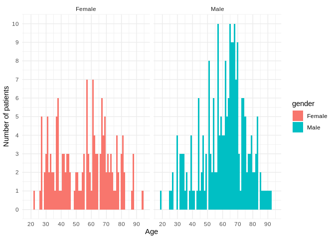
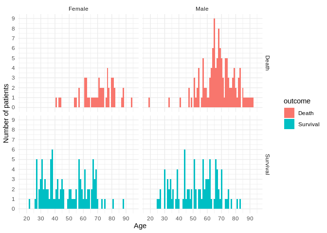
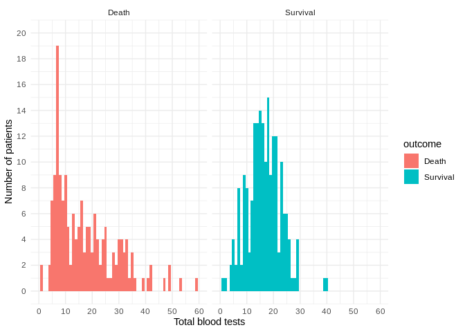

## Read data

```r
df <- read_excel("wuhan_blood_sample_data_Jan_Feb_2020.xlsx")
```

## Clean dataset

```r
patients_df <- df %>% group_by(`Admission time`, `Discharge time`, gender, age, outcome) %>%
summarise(PATIENT_ID = sum(PATIENT_ID, na.rm = TRUE), `Total blood tests` = n()) 

patients_df <- patients_df %>%
    mutate(`Days in hospital` = ceiling(difftime(`Discharge time`, `Admission time`, units = "days")))


df <- full_join(patients_df %>% ungroup() %>% select(`Admission time`, PATIENT_ID), df %>% select(-PATIENT_ID), by="Admission time")

df$gender<-ifelse(df$gender==1, 'Male', 'Female') 
df <- df %>% mutate(gender = as.factor(gender))

patients_df$gender<-ifelse(patients_df$gender==1, 'Male', 'Female') 
patients_df <- patients_df %>% mutate(gender = as.factor(gender))

df$outcome<-ifelse(df$outcome==1, 'Death', 'Survival')
df <- df %>% mutate(outcome = as.factor(outcome))

patients_df$outcome<-ifelse(patients_df$outcome==1, 'Death', 'Survival')
patients_df <- patients_df %>% mutate(outcome = as.factor(outcome))
```

## Patients summary

```r
patients_summary <- patients_df %>% ungroup() %>% select(-c(age, PATIENT_ID))

tbl_summary(
    patients_summary,
    by = outcome,
    label = gender ~ "Gender",
) %>%
    add_n() %>%
    modify_header(label = "") %>%
    add_overall() %>%
    bold_labels() 
```

<!--html_preserve--><style>html {
  font-family: -apple-system, BlinkMacSystemFont, 'Segoe UI', Roboto, Oxygen, Ubuntu, Cantarell, 'Helvetica Neue', 'Fira Sans', 'Droid Sans', Arial, sans-serif;
}

#ucmatmnhiz .gt_table {
  display: table;
  border-collapse: collapse;
  margin-left: auto;
  margin-right: auto;
  color: #333333;
  font-size: 16px;
  font-weight: normal;
  font-style: normal;
  background-color: #FFFFFF;
  width: auto;
  border-top-style: solid;
  border-top-width: 2px;
  border-top-color: #A8A8A8;
  border-right-style: none;
  border-right-width: 2px;
  border-right-color: #D3D3D3;
  border-bottom-style: solid;
  border-bottom-width: 2px;
  border-bottom-color: #A8A8A8;
  border-left-style: none;
  border-left-width: 2px;
  border-left-color: #D3D3D3;
}

#ucmatmnhiz .gt_heading {
  background-color: #FFFFFF;
  text-align: center;
  border-bottom-color: #FFFFFF;
  border-left-style: none;
  border-left-width: 1px;
  border-left-color: #D3D3D3;
  border-right-style: none;
  border-right-width: 1px;
  border-right-color: #D3D3D3;
}

#ucmatmnhiz .gt_title {
  color: #333333;
  font-size: 125%;
  font-weight: initial;
  padding-top: 4px;
  padding-bottom: 4px;
  border-bottom-color: #FFFFFF;
  border-bottom-width: 0;
}

#ucmatmnhiz .gt_subtitle {
  color: #333333;
  font-size: 85%;
  font-weight: initial;
  padding-top: 0;
  padding-bottom: 4px;
  border-top-color: #FFFFFF;
  border-top-width: 0;
}

#ucmatmnhiz .gt_bottom_border {
  border-bottom-style: solid;
  border-bottom-width: 2px;
  border-bottom-color: #D3D3D3;
}

#ucmatmnhiz .gt_col_headings {
  border-top-style: solid;
  border-top-width: 2px;
  border-top-color: #D3D3D3;
  border-bottom-style: solid;
  border-bottom-width: 2px;
  border-bottom-color: #D3D3D3;
  border-left-style: none;
  border-left-width: 1px;
  border-left-color: #D3D3D3;
  border-right-style: none;
  border-right-width: 1px;
  border-right-color: #D3D3D3;
}

#ucmatmnhiz .gt_col_heading {
  color: #333333;
  background-color: #FFFFFF;
  font-size: 100%;
  font-weight: normal;
  text-transform: inherit;
  border-left-style: none;
  border-left-width: 1px;
  border-left-color: #D3D3D3;
  border-right-style: none;
  border-right-width: 1px;
  border-right-color: #D3D3D3;
  vertical-align: bottom;
  padding-top: 5px;
  padding-bottom: 6px;
  padding-left: 5px;
  padding-right: 5px;
  overflow-x: hidden;
}

#ucmatmnhiz .gt_column_spanner_outer {
  color: #333333;
  background-color: #FFFFFF;
  font-size: 100%;
  font-weight: normal;
  text-transform: inherit;
  padding-top: 0;
  padding-bottom: 0;
  padding-left: 4px;
  padding-right: 4px;
}

#ucmatmnhiz .gt_column_spanner_outer:first-child {
  padding-left: 0;
}

#ucmatmnhiz .gt_column_spanner_outer:last-child {
  padding-right: 0;
}

#ucmatmnhiz .gt_column_spanner {
  border-bottom-style: solid;
  border-bottom-width: 2px;
  border-bottom-color: #D3D3D3;
  vertical-align: bottom;
  padding-top: 5px;
  padding-bottom: 6px;
  overflow-x: hidden;
  display: inline-block;
  width: 100%;
}

#ucmatmnhiz .gt_group_heading {
  padding: 8px;
  color: #333333;
  background-color: #FFFFFF;
  font-size: 100%;
  font-weight: initial;
  text-transform: inherit;
  border-top-style: solid;
  border-top-width: 2px;
  border-top-color: #D3D3D3;
  border-bottom-style: solid;
  border-bottom-width: 2px;
  border-bottom-color: #D3D3D3;
  border-left-style: none;
  border-left-width: 1px;
  border-left-color: #D3D3D3;
  border-right-style: none;
  border-right-width: 1px;
  border-right-color: #D3D3D3;
  vertical-align: middle;
}

#ucmatmnhiz .gt_empty_group_heading {
  padding: 0.5px;
  color: #333333;
  background-color: #FFFFFF;
  font-size: 100%;
  font-weight: initial;
  border-top-style: solid;
  border-top-width: 2px;
  border-top-color: #D3D3D3;
  border-bottom-style: solid;
  border-bottom-width: 2px;
  border-bottom-color: #D3D3D3;
  vertical-align: middle;
}

#ucmatmnhiz .gt_from_md > :first-child {
  margin-top: 0;
}

#ucmatmnhiz .gt_from_md > :last-child {
  margin-bottom: 0;
}

#ucmatmnhiz .gt_row {
  padding-top: 8px;
  padding-bottom: 8px;
  padding-left: 5px;
  padding-right: 5px;
  margin: 10px;
  border-top-style: solid;
  border-top-width: 1px;
  border-top-color: #D3D3D3;
  border-left-style: none;
  border-left-width: 1px;
  border-left-color: #D3D3D3;
  border-right-style: none;
  border-right-width: 1px;
  border-right-color: #D3D3D3;
  vertical-align: middle;
  overflow-x: hidden;
}

#ucmatmnhiz .gt_stub {
  color: #333333;
  background-color: #FFFFFF;
  font-size: 100%;
  font-weight: initial;
  text-transform: inherit;
  border-right-style: solid;
  border-right-width: 2px;
  border-right-color: #D3D3D3;
  padding-left: 12px;
}

#ucmatmnhiz .gt_summary_row {
  color: #333333;
  background-color: #FFFFFF;
  text-transform: inherit;
  padding-top: 8px;
  padding-bottom: 8px;
  padding-left: 5px;
  padding-right: 5px;
}

#ucmatmnhiz .gt_first_summary_row {
  padding-top: 8px;
  padding-bottom: 8px;
  padding-left: 5px;
  padding-right: 5px;
  border-top-style: solid;
  border-top-width: 2px;
  border-top-color: #D3D3D3;
}

#ucmatmnhiz .gt_grand_summary_row {
  color: #333333;
  background-color: #FFFFFF;
  text-transform: inherit;
  padding-top: 8px;
  padding-bottom: 8px;
  padding-left: 5px;
  padding-right: 5px;
}

#ucmatmnhiz .gt_first_grand_summary_row {
  padding-top: 8px;
  padding-bottom: 8px;
  padding-left: 5px;
  padding-right: 5px;
  border-top-style: double;
  border-top-width: 6px;
  border-top-color: #D3D3D3;
}

#ucmatmnhiz .gt_striped {
  background-color: rgba(128, 128, 128, 0.05);
}

#ucmatmnhiz .gt_table_body {
  border-top-style: solid;
  border-top-width: 2px;
  border-top-color: #D3D3D3;
  border-bottom-style: solid;
  border-bottom-width: 2px;
  border-bottom-color: #D3D3D3;
}

#ucmatmnhiz .gt_footnotes {
  color: #333333;
  background-color: #FFFFFF;
  border-bottom-style: none;
  border-bottom-width: 2px;
  border-bottom-color: #D3D3D3;
  border-left-style: none;
  border-left-width: 2px;
  border-left-color: #D3D3D3;
  border-right-style: none;
  border-right-width: 2px;
  border-right-color: #D3D3D3;
}

#ucmatmnhiz .gt_footnote {
  margin: 0px;
  font-size: 90%;
  padding: 4px;
}

#ucmatmnhiz .gt_sourcenotes {
  color: #333333;
  background-color: #FFFFFF;
  border-bottom-style: none;
  border-bottom-width: 2px;
  border-bottom-color: #D3D3D3;
  border-left-style: none;
  border-left-width: 2px;
  border-left-color: #D3D3D3;
  border-right-style: none;
  border-right-width: 2px;
  border-right-color: #D3D3D3;
}

#ucmatmnhiz .gt_sourcenote {
  font-size: 90%;
  padding: 4px;
}

#ucmatmnhiz .gt_left {
  text-align: left;
}

#ucmatmnhiz .gt_center {
  text-align: center;
}

#ucmatmnhiz .gt_right {
  text-align: right;
  font-variant-numeric: tabular-nums;
}

#ucmatmnhiz .gt_font_normal {
  font-weight: normal;
}

#ucmatmnhiz .gt_font_bold {
  font-weight: bold;
}

#ucmatmnhiz .gt_font_italic {
  font-style: italic;
}

#ucmatmnhiz .gt_super {
  font-size: 65%;
}

#ucmatmnhiz .gt_footnote_marks {
  font-style: italic;
  font-size: 65%;
}
</style>
<div id="ucmatmnhiz" style="overflow-x:auto;overflow-y:auto;width:auto;height:auto;"><table class="gt_table">
  
  <thead class="gt_col_headings">
    <tr>
      <th class="gt_col_heading gt_columns_bottom_border gt_left" rowspan="1" colspan="1"></th>
      <th class="gt_col_heading gt_columns_bottom_border gt_center" rowspan="1" colspan="1"><strong>Overall</strong>, N = 375<sup class="gt_footnote_marks">1</sup></th>
      <th class="gt_col_heading gt_columns_bottom_border gt_center" rowspan="1" colspan="1"><strong>N</strong></th>
      <th class="gt_col_heading gt_columns_bottom_border gt_center" rowspan="1" colspan="1"><strong>Survival</strong>, N = 201<sup class="gt_footnote_marks">1</sup></th>
      <th class="gt_col_heading gt_columns_bottom_border gt_center" rowspan="1" colspan="1"><strong>Death</strong>, N = 174<sup class="gt_footnote_marks">1</sup></th>
    </tr>
  </thead>
  <tbody class="gt_table_body">
    <tr>
      <td class="gt_row gt_left" style="font-weight: bold;">Gender</td>
      <td class="gt_row gt_center"></td>
      <td class="gt_row gt_center">375</td>
      <td class="gt_row gt_center"></td>
      <td class="gt_row gt_center"></td>
    </tr>
    <tr>
      <td class="gt_row gt_left" style="text-align: left; text-indent: 10px;">Male</td>
      <td class="gt_row gt_center">224 (60%)</td>
      <td class="gt_row gt_center"></td>
      <td class="gt_row gt_center">98 (49%)</td>
      <td class="gt_row gt_center">126 (72%)</td>
    </tr>
    <tr>
      <td class="gt_row gt_left" style="text-align: left; text-indent: 10px;">Female</td>
      <td class="gt_row gt_center">151 (40%)</td>
      <td class="gt_row gt_center"></td>
      <td class="gt_row gt_center">103 (51%)</td>
      <td class="gt_row gt_center">48 (28%)</td>
    </tr>
    <tr>
      <td class="gt_row gt_left" style="font-weight: bold;">Total blood tests</td>
      <td class="gt_row gt_center">16 (9, 21)</td>
      <td class="gt_row gt_center">375</td>
      <td class="gt_row gt_center">16 (12, 20)</td>
      <td class="gt_row gt_center">14 (7, 24)</td>
    </tr>
    <tr>
      <td class="gt_row gt_left" style="font-weight: bold;">Days in hospital</td>
      <td class="gt_row gt_center">10 (5, 16)</td>
      <td class="gt_row gt_center">375</td>
      <td class="gt_row gt_center">14 (10, 18)</td>
      <td class="gt_row gt_center">6 (3, 10)</td>
    </tr>
  </tbody>
  
  <tfoot>
    <tr class="gt_footnotes">
      <td colspan="5">
        <p class="gt_footnote">
          <sup class="gt_footnote_marks">
            <em>1</em>
          </sup>
           
          Statistics presented: n (%); Median (IQR)
          <br />
        </p>
      </td>
    </tr>
  </tfoot>
</table></div><!--/html_preserve-->

```r
 ggplot(patients_df, aes(x=age,fill=gender)) + geom_histogram(binwidth = 1) + facet_grid(. ~ gender) + scale_x_continuous(name="Age", limits=c(min(df$age), max(df$age)), breaks = seq(0, 100, by=10)) + scale_y_continuous(name = "Number of patients", limits = c(0,10), breaks = seq(0,10, by=1)) +
    theme_minimal()
```

<!-- -->

### Patients grouped by outcome, age and gender

```r
 ggplot(patients_df, aes(x=age,fill=outcome)) + geom_histogram(binwidth = 1) + facet_grid(outcome ~ gender) + scale_x_continuous(name="Age", limits=c(min(df$age), max(df$age)), breaks = seq(0, 100, by=10)) + scale_y_continuous(name = "Number of patients", limits = c(0,9), breaks = seq(0,9, by=1)) +
    theme_minimal()
```

<!-- -->

### Patients grouped by outcome and hospitalization duration

```r
ggplot(patients_df, aes(x=`Days in hospital`, fill=outcome)) + geom_histogram(binwidth = 1) + facet_grid(. ~ outcome)  + ylab("Number of patients") +
    theme_minimal()
```

<!-- -->

### Patients grouped by outcome and total blood tests taken

```r
ggplot(patients_df, aes(x=`Total blood tests`, fill=outcome)) + geom_histogram(binwidth = 1) + facet_grid(. ~ outcome)  + ylab("Number of patients") +
  scale_x_continuous(name="Total blood tests", limits=c(0, 60), breaks = seq(0, 60, by=10)) +
   scale_y_continuous(name = "Number of patients", limits = c(0,20), breaks = seq(0,20, by=2)) +
    theme_minimal()
```

<!-- -->

## Biomarkers

```r
no_dates_df <- df %>% select(-c('Admission time', 'Discharge time', 'RE_DATE', 'PATIENT_ID', 'age', 'gender' ))
tbl_summary(
    no_dates_df,
    by = outcome,
    missing = "no"
            ) %>%
    add_n() %>%
    modify_header(label = "**Biomarker**") %>%
  modify_spanning_header(c("stat_1", "stat_2") ~ "**Final patient outcome related to the test**") %>%
    bold_labels() 
```

<!--html_preserve--><style>html {
  font-family: -apple-system, BlinkMacSystemFont, 'Segoe UI', Roboto, Oxygen, Ubuntu, Cantarell, 'Helvetica Neue', 'Fira Sans', 'Droid Sans', Arial, sans-serif;
}

#ecclfqmtax .gt_table {
  display: table;
  border-collapse: collapse;
  margin-left: auto;
  margin-right: auto;
  color: #333333;
  font-size: 16px;
  font-weight: normal;
  font-style: normal;
  background-color: #FFFFFF;
  width: auto;
  border-top-style: solid;
  border-top-width: 2px;
  border-top-color: #A8A8A8;
  border-right-style: none;
  border-right-width: 2px;
  border-right-color: #D3D3D3;
  border-bottom-style: solid;
  border-bottom-width: 2px;
  border-bottom-color: #A8A8A8;
  border-left-style: none;
  border-left-width: 2px;
  border-left-color: #D3D3D3;
}

#ecclfqmtax .gt_heading {
  background-color: #FFFFFF;
  text-align: center;
  border-bottom-color: #FFFFFF;
  border-left-style: none;
  border-left-width: 1px;
  border-left-color: #D3D3D3;
  border-right-style: none;
  border-right-width: 1px;
  border-right-color: #D3D3D3;
}

#ecclfqmtax .gt_title {
  color: #333333;
  font-size: 125%;
  font-weight: initial;
  padding-top: 4px;
  padding-bottom: 4px;
  border-bottom-color: #FFFFFF;
  border-bottom-width: 0;
}

#ecclfqmtax .gt_subtitle {
  color: #333333;
  font-size: 85%;
  font-weight: initial;
  padding-top: 0;
  padding-bottom: 4px;
  border-top-color: #FFFFFF;
  border-top-width: 0;
}

#ecclfqmtax .gt_bottom_border {
  border-bottom-style: solid;
  border-bottom-width: 2px;
  border-bottom-color: #D3D3D3;
}

#ecclfqmtax .gt_col_headings {
  border-top-style: solid;
  border-top-width: 2px;
  border-top-color: #D3D3D3;
  border-bottom-style: solid;
  border-bottom-width: 2px;
  border-bottom-color: #D3D3D3;
  border-left-style: none;
  border-left-width: 1px;
  border-left-color: #D3D3D3;
  border-right-style: none;
  border-right-width: 1px;
  border-right-color: #D3D3D3;
}

#ecclfqmtax .gt_col_heading {
  color: #333333;
  background-color: #FFFFFF;
  font-size: 100%;
  font-weight: normal;
  text-transform: inherit;
  border-left-style: none;
  border-left-width: 1px;
  border-left-color: #D3D3D3;
  border-right-style: none;
  border-right-width: 1px;
  border-right-color: #D3D3D3;
  vertical-align: bottom;
  padding-top: 5px;
  padding-bottom: 6px;
  padding-left: 5px;
  padding-right: 5px;
  overflow-x: hidden;
}

#ecclfqmtax .gt_column_spanner_outer {
  color: #333333;
  background-color: #FFFFFF;
  font-size: 100%;
  font-weight: normal;
  text-transform: inherit;
  padding-top: 0;
  padding-bottom: 0;
  padding-left: 4px;
  padding-right: 4px;
}

#ecclfqmtax .gt_column_spanner_outer:first-child {
  padding-left: 0;
}

#ecclfqmtax .gt_column_spanner_outer:last-child {
  padding-right: 0;
}

#ecclfqmtax .gt_column_spanner {
  border-bottom-style: solid;
  border-bottom-width: 2px;
  border-bottom-color: #D3D3D3;
  vertical-align: bottom;
  padding-top: 5px;
  padding-bottom: 6px;
  overflow-x: hidden;
  display: inline-block;
  width: 100%;
}

#ecclfqmtax .gt_group_heading {
  padding: 8px;
  color: #333333;
  background-color: #FFFFFF;
  font-size: 100%;
  font-weight: initial;
  text-transform: inherit;
  border-top-style: solid;
  border-top-width: 2px;
  border-top-color: #D3D3D3;
  border-bottom-style: solid;
  border-bottom-width: 2px;
  border-bottom-color: #D3D3D3;
  border-left-style: none;
  border-left-width: 1px;
  border-left-color: #D3D3D3;
  border-right-style: none;
  border-right-width: 1px;
  border-right-color: #D3D3D3;
  vertical-align: middle;
}

#ecclfqmtax .gt_empty_group_heading {
  padding: 0.5px;
  color: #333333;
  background-color: #FFFFFF;
  font-size: 100%;
  font-weight: initial;
  border-top-style: solid;
  border-top-width: 2px;
  border-top-color: #D3D3D3;
  border-bottom-style: solid;
  border-bottom-width: 2px;
  border-bottom-color: #D3D3D3;
  vertical-align: middle;
}

#ecclfqmtax .gt_from_md > :first-child {
  margin-top: 0;
}

#ecclfqmtax .gt_from_md > :last-child {
  margin-bottom: 0;
}

#ecclfqmtax .gt_row {
  padding-top: 8px;
  padding-bottom: 8px;
  padding-left: 5px;
  padding-right: 5px;
  margin: 10px;
  border-top-style: solid;
  border-top-width: 1px;
  border-top-color: #D3D3D3;
  border-left-style: none;
  border-left-width: 1px;
  border-left-color: #D3D3D3;
  border-right-style: none;
  border-right-width: 1px;
  border-right-color: #D3D3D3;
  vertical-align: middle;
  overflow-x: hidden;
}

#ecclfqmtax .gt_stub {
  color: #333333;
  background-color: #FFFFFF;
  font-size: 100%;
  font-weight: initial;
  text-transform: inherit;
  border-right-style: solid;
  border-right-width: 2px;
  border-right-color: #D3D3D3;
  padding-left: 12px;
}

#ecclfqmtax .gt_summary_row {
  color: #333333;
  background-color: #FFFFFF;
  text-transform: inherit;
  padding-top: 8px;
  padding-bottom: 8px;
  padding-left: 5px;
  padding-right: 5px;
}

#ecclfqmtax .gt_first_summary_row {
  padding-top: 8px;
  padding-bottom: 8px;
  padding-left: 5px;
  padding-right: 5px;
  border-top-style: solid;
  border-top-width: 2px;
  border-top-color: #D3D3D3;
}

#ecclfqmtax .gt_grand_summary_row {
  color: #333333;
  background-color: #FFFFFF;
  text-transform: inherit;
  padding-top: 8px;
  padding-bottom: 8px;
  padding-left: 5px;
  padding-right: 5px;
}

#ecclfqmtax .gt_first_grand_summary_row {
  padding-top: 8px;
  padding-bottom: 8px;
  padding-left: 5px;
  padding-right: 5px;
  border-top-style: double;
  border-top-width: 6px;
  border-top-color: #D3D3D3;
}

#ecclfqmtax .gt_striped {
  background-color: rgba(128, 128, 128, 0.05);
}

#ecclfqmtax .gt_table_body {
  border-top-style: solid;
  border-top-width: 2px;
  border-top-color: #D3D3D3;
  border-bottom-style: solid;
  border-bottom-width: 2px;
  border-bottom-color: #D3D3D3;
}

#ecclfqmtax .gt_footnotes {
  color: #333333;
  background-color: #FFFFFF;
  border-bottom-style: none;
  border-bottom-width: 2px;
  border-bottom-color: #D3D3D3;
  border-left-style: none;
  border-left-width: 2px;
  border-left-color: #D3D3D3;
  border-right-style: none;
  border-right-width: 2px;
  border-right-color: #D3D3D3;
}

#ecclfqmtax .gt_footnote {
  margin: 0px;
  font-size: 90%;
  padding: 4px;
}

#ecclfqmtax .gt_sourcenotes {
  color: #333333;
  background-color: #FFFFFF;
  border-bottom-style: none;
  border-bottom-width: 2px;
  border-bottom-color: #D3D3D3;
  border-left-style: none;
  border-left-width: 2px;
  border-left-color: #D3D3D3;
  border-right-style: none;
  border-right-width: 2px;
  border-right-color: #D3D3D3;
}

#ecclfqmtax .gt_sourcenote {
  font-size: 90%;
  padding: 4px;
}

#ecclfqmtax .gt_left {
  text-align: left;
}

#ecclfqmtax .gt_center {
  text-align: center;
}

#ecclfqmtax .gt_right {
  text-align: right;
  font-variant-numeric: tabular-nums;
}

#ecclfqmtax .gt_font_normal {
  font-weight: normal;
}

#ecclfqmtax .gt_font_bold {
  font-weight: bold;
}

#ecclfqmtax .gt_font_italic {
  font-style: italic;
}

#ecclfqmtax .gt_super {
  font-size: 65%;
}

#ecclfqmtax .gt_footnote_marks {
  font-style: italic;
  font-size: 65%;
}
</style>
<div id="ecclfqmtax" style="overflow-x:auto;overflow-y:auto;width:auto;height:auto;"><table class="gt_table">
  
  <thead class="gt_col_headings">
    <tr>
      <th class="gt_col_heading gt_center gt_columns_bottom_border" rowspan="2" colspan="1"><strong>Biomarker</strong></th>
      <th class="gt_col_heading gt_center gt_columns_bottom_border" rowspan="2" colspan="1"><strong>N</strong></th>
      <th class="gt_center gt_columns_top_border gt_column_spanner_outer" rowspan="1" colspan="2">
        <span class="gt_column_spanner"><strong>Final patient outcome related to the test</strong></span>
      </th>
    </tr>
    <tr>
      <th class="gt_col_heading gt_columns_bottom_border gt_center" rowspan="1" colspan="1"><strong>Death</strong>, N = 2,905<sup class="gt_footnote_marks">1</sup></th>
      <th class="gt_col_heading gt_columns_bottom_border gt_center" rowspan="1" colspan="1"><strong>Survival</strong>, N = 3,215<sup class="gt_footnote_marks">1</sup></th>
    </tr>
  </thead>
  <tbody class="gt_table_body">
    <tr>
      <td class="gt_row gt_left" style="font-weight: bold;">Hypersensitive cardiac troponinI</td>
      <td class="gt_row gt_center">507</td>
      <td class="gt_row gt_center">70 (18, 631)</td>
      <td class="gt_row gt_center">3 (2, 7)</td>
    </tr>
    <tr>
      <td class="gt_row gt_left" style="font-weight: bold;">hemoglobin</td>
      <td class="gt_row gt_center">975</td>
      <td class="gt_row gt_center">123 (110, 135)</td>
      <td class="gt_row gt_center">127 (116, 138)</td>
    </tr>
    <tr>
      <td class="gt_row gt_left" style="font-weight: bold;">Serum chloride</td>
      <td class="gt_row gt_center">975</td>
      <td class="gt_row gt_center">104 (100, 111)</td>
      <td class="gt_row gt_center">101 (99, 103)</td>
    </tr>
    <tr>
      <td class="gt_row gt_left" style="font-weight: bold;">Prothrombin time</td>
      <td class="gt_row gt_center">662</td>
      <td class="gt_row gt_center">16.3 (15.0, 18.2)</td>
      <td class="gt_row gt_center">13.6 (13.1, 14.1)</td>
    </tr>
    <tr>
      <td class="gt_row gt_left" style="font-weight: bold;">procalcitonin</td>
      <td class="gt_row gt_center">459</td>
      <td class="gt_row gt_center">0.38 (0.14, 1.13)</td>
      <td class="gt_row gt_center">0.04 (0.02, 0.06)</td>
    </tr>
    <tr>
      <td class="gt_row gt_left" style="font-weight: bold;">eosinophils(%)</td>
      <td class="gt_row gt_center">957</td>
      <td class="gt_row gt_center">0.00 (0.00, 0.10)</td>
      <td class="gt_row gt_center">0.70 (0.00, 1.80)</td>
    </tr>
    <tr>
      <td class="gt_row gt_left" style="font-weight: bold;">Interleukin 2 receptor</td>
      <td class="gt_row gt_center">268</td>
      <td class="gt_row gt_center">1,180 (807, 1,603)</td>
      <td class="gt_row gt_center">529 (400, 742)</td>
    </tr>
    <tr>
      <td class="gt_row gt_left" style="font-weight: bold;">Alkaline phosphatase</td>
      <td class="gt_row gt_center">930</td>
      <td class="gt_row gt_center">83 (64, 123)</td>
      <td class="gt_row gt_center">60 (50, 75)</td>
    </tr>
    <tr>
      <td class="gt_row gt_left" style="font-weight: bold;">albumin</td>
      <td class="gt_row gt_center">934</td>
      <td class="gt_row gt_center">28 (24, 31)</td>
      <td class="gt_row gt_center">36 (34, 39)</td>
    </tr>
    <tr>
      <td class="gt_row gt_left" style="font-weight: bold;">basophil(%)</td>
      <td class="gt_row gt_center">957</td>
      <td class="gt_row gt_center">0.10 (0.10, 0.20)</td>
      <td class="gt_row gt_center">0.20 (0.10, 0.40)</td>
    </tr>
    <tr>
      <td class="gt_row gt_left" style="font-weight: bold;">Interleukin 10</td>
      <td class="gt_row gt_center">267</td>
      <td class="gt_row gt_center">11 (6, 17)</td>
      <td class="gt_row gt_center">5 (5, 8)</td>
    </tr>
    <tr>
      <td class="gt_row gt_left" style="font-weight: bold;">Total bilirubin</td>
      <td class="gt_row gt_center">930</td>
      <td class="gt_row gt_center">14 (10, 25)</td>
      <td class="gt_row gt_center">8 (6, 12)</td>
    </tr>
    <tr>
      <td class="gt_row gt_left" style="font-weight: bold;">Platelet count</td>
      <td class="gt_row gt_center">957</td>
      <td class="gt_row gt_center">112 (55, 174)</td>
      <td class="gt_row gt_center">229 (176, 290)</td>
    </tr>
    <tr>
      <td class="gt_row gt_left" style="font-weight: bold;">monocytes(%)</td>
      <td class="gt_row gt_center">958</td>
      <td class="gt_row gt_center">3.0 (2.0, 4.7)</td>
      <td class="gt_row gt_center">8.2 (6.3, 10.0)</td>
    </tr>
    <tr>
      <td class="gt_row gt_left" style="font-weight: bold;">antithrombin</td>
      <td class="gt_row gt_center">330</td>
      <td class="gt_row gt_center">80 (70, 92)</td>
      <td class="gt_row gt_center">93 (86, 103)</td>
    </tr>
    <tr>
      <td class="gt_row gt_left" style="font-weight: bold;">Interleukin 8</td>
      <td class="gt_row gt_center">268</td>
      <td class="gt_row gt_center">30 (18, 61)</td>
      <td class="gt_row gt_center">11 (7, 19)</td>
    </tr>
    <tr>
      <td class="gt_row gt_left" style="font-weight: bold;">indirect bilirubin</td>
      <td class="gt_row gt_center">906</td>
      <td class="gt_row gt_center">6.2 (4.2, 9.2)</td>
      <td class="gt_row gt_center">4.9 (3.4, 7.1)</td>
    </tr>
    <tr>
      <td class="gt_row gt_left" style="font-weight: bold;">Red blood cell distribution width</td>
      <td class="gt_row gt_center">923</td>
      <td class="gt_row gt_center">13.20 (12.40, 14.40)</td>
      <td class="gt_row gt_center">12.20 (11.80, 12.80)</td>
    </tr>
    <tr>
      <td class="gt_row gt_left" style="font-weight: bold;">neutrophils(%)</td>
      <td class="gt_row gt_center">957</td>
      <td class="gt_row gt_center">92 (88, 95)</td>
      <td class="gt_row gt_center">66 (56, 76)</td>
    </tr>
    <tr>
      <td class="gt_row gt_left" style="font-weight: bold;">total protein</td>
      <td class="gt_row gt_center">931</td>
      <td class="gt_row gt_center">62 (57, 68)</td>
      <td class="gt_row gt_center">68 (65, 72)</td>
    </tr>
    <tr>
      <td class="gt_row gt_left" style="font-weight: bold;">Quantification of Treponema pallidum antibodies</td>
      <td class="gt_row gt_center">279</td>
      <td class="gt_row gt_center">0.06 (0.04, 0.07)</td>
      <td class="gt_row gt_center">0.05 (0.04, 0.07)</td>
    </tr>
    <tr>
      <td class="gt_row gt_left" style="font-weight: bold;">Prothrombin activity</td>
      <td class="gt_row gt_center">659</td>
      <td class="gt_row gt_center">66 (56, 78)</td>
      <td class="gt_row gt_center">94 (88, 103)</td>
    </tr>
    <tr>
      <td class="gt_row gt_left" style="font-weight: bold;">HBsAg</td>
      <td class="gt_row gt_center">279</td>
      <td class="gt_row gt_center">0.01 (0.00, 0.02)</td>
      <td class="gt_row gt_center">0.00 (0.00, 0.01)</td>
    </tr>
    <tr>
      <td class="gt_row gt_left" style="font-weight: bold;">mean corpuscular volume</td>
      <td class="gt_row gt_center">957</td>
      <td class="gt_row gt_center">91.3 (87.1, 96.4)</td>
      <td class="gt_row gt_center">89.8 (86.8, 91.9)</td>
    </tr>
    <tr>
      <td class="gt_row gt_left" style="font-weight: bold;">hematocrit</td>
      <td class="gt_row gt_center">957</td>
      <td class="gt_row gt_center">35.9 (32.5, 39.8)</td>
      <td class="gt_row gt_center">37.1 (34.3, 39.9)</td>
    </tr>
    <tr>
      <td class="gt_row gt_left" style="font-weight: bold;">White blood cell count</td>
      <td class="gt_row gt_center">1,127</td>
      <td class="gt_row gt_center">12 (8, 17)</td>
      <td class="gt_row gt_center">6 (4, 8)</td>
    </tr>
    <tr>
      <td class="gt_row gt_left" style="font-weight: bold;">Tumor necrosis factorα</td>
      <td class="gt_row gt_center">268</td>
      <td class="gt_row gt_center">11 (8, 17)</td>
      <td class="gt_row gt_center">8 (6, 10)</td>
    </tr>
    <tr>
      <td class="gt_row gt_left" style="font-weight: bold;">mean corpuscular hemoglobin concentration</td>
      <td class="gt_row gt_center">957</td>
      <td class="gt_row gt_center">342 (331, 350)</td>
      <td class="gt_row gt_center">343 (335, 350)</td>
    </tr>
    <tr>
      <td class="gt_row gt_left" style="font-weight: bold;">fibrinogen</td>
      <td class="gt_row gt_center">566</td>
      <td class="gt_row gt_center">3.92 (2.44, 5.63)</td>
      <td class="gt_row gt_center">4.40 (3.56, 5.34)</td>
    </tr>
    <tr>
      <td class="gt_row gt_left" style="font-weight: bold;">Interleukin 1β</td>
      <td class="gt_row gt_center">268</td>
      <td class="gt_row gt_center">5.0 (5.0, 5.0)</td>
      <td class="gt_row gt_center">5.0 (5.0, 5.0)</td>
    </tr>
    <tr>
      <td class="gt_row gt_left" style="font-weight: bold;">Urea</td>
      <td class="gt_row gt_center">936</td>
      <td class="gt_row gt_center">11 (7, 17)</td>
      <td class="gt_row gt_center">4 (3, 5)</td>
    </tr>
    <tr>
      <td class="gt_row gt_left" style="font-weight: bold;">lymphocyte count</td>
      <td class="gt_row gt_center">957</td>
      <td class="gt_row gt_center">0.46 (0.31, 0.69)</td>
      <td class="gt_row gt_center">1.25 (0.87, 1.62)</td>
    </tr>
    <tr>
      <td class="gt_row gt_left" style="font-weight: bold;">PH value</td>
      <td class="gt_row gt_center">384</td>
      <td class="gt_row gt_center">6.50 (6.00, 7.41)</td>
      <td class="gt_row gt_center">6.50 (6.00, 7.00)</td>
    </tr>
    <tr>
      <td class="gt_row gt_left" style="font-weight: bold;">Red blood cell count</td>
      <td class="gt_row gt_center">1,127</td>
      <td class="gt_row gt_center">4.0 (3.6, 4.6)</td>
      <td class="gt_row gt_center">4.2 (3.8, 4.7)</td>
    </tr>
    <tr>
      <td class="gt_row gt_left" style="font-weight: bold;">Eosinophil count</td>
      <td class="gt_row gt_center">957</td>
      <td class="gt_row gt_center">0.00 (0.00, 0.01)</td>
      <td class="gt_row gt_center">0.03 (0.00, 0.09)</td>
    </tr>
    <tr>
      <td class="gt_row gt_left" style="font-weight: bold;">Corrected calcium</td>
      <td class="gt_row gt_center">914</td>
      <td class="gt_row gt_center">2.35 (2.27, 2.44)</td>
      <td class="gt_row gt_center">2.37 (2.27, 2.44)</td>
    </tr>
    <tr>
      <td class="gt_row gt_left" style="font-weight: bold;">Serum potassium</td>
      <td class="gt_row gt_center">980</td>
      <td class="gt_row gt_center">4.60 (4.04, 5.27)</td>
      <td class="gt_row gt_center">4.28 (3.92, 4.62)</td>
    </tr>
    <tr>
      <td class="gt_row gt_left" style="font-weight: bold;">glucose</td>
      <td class="gt_row gt_center">775</td>
      <td class="gt_row gt_center">9.1 (6.9, 13.3)</td>
      <td class="gt_row gt_center">5.7 (5.0, 7.6)</td>
    </tr>
    <tr>
      <td class="gt_row gt_left" style="font-weight: bold;">neutrophils count</td>
      <td class="gt_row gt_center">957</td>
      <td class="gt_row gt_center">10.8 (7.0, 15.2)</td>
      <td class="gt_row gt_center">3.5 (2.4, 5.2)</td>
    </tr>
    <tr>
      <td class="gt_row gt_left" style="font-weight: bold;">Direct bilirubin</td>
      <td class="gt_row gt_center">930</td>
      <td class="gt_row gt_center">8 (5, 14)</td>
      <td class="gt_row gt_center">4 (2, 5)</td>
    </tr>
    <tr>
      <td class="gt_row gt_left" style="font-weight: bold;">Mean platelet volume</td>
      <td class="gt_row gt_center">862</td>
      <td class="gt_row gt_center">11.30 (10.70, 12.20)</td>
      <td class="gt_row gt_center">10.40 (9.90, 11.00)</td>
    </tr>
    <tr>
      <td class="gt_row gt_left" style="font-weight: bold;">ferritin</td>
      <td class="gt_row gt_center">283</td>
      <td class="gt_row gt_center">1,636 (928, 2,517)</td>
      <td class="gt_row gt_center">504 (235, 834)</td>
    </tr>
    <tr>
      <td class="gt_row gt_left" style="font-weight: bold;">RBC distribution width SD</td>
      <td class="gt_row gt_center">923</td>
      <td class="gt_row gt_center">43.7 (39.9, 48.5)</td>
      <td class="gt_row gt_center">39.5 (37.6, 41.4)</td>
    </tr>
    <tr>
      <td class="gt_row gt_left" style="font-weight: bold;">Thrombin time</td>
      <td class="gt_row gt_center">566</td>
      <td class="gt_row gt_center">17.30 (15.80, 19.75)</td>
      <td class="gt_row gt_center">16.40 (15.60, 17.30)</td>
    </tr>
    <tr>
      <td class="gt_row gt_left" style="font-weight: bold;">(%)lymphocyte</td>
      <td class="gt_row gt_center">958</td>
      <td class="gt_row gt_center">4 (2, 7)</td>
      <td class="gt_row gt_center">24 (16, 33)</td>
    </tr>
    <tr>
      <td class="gt_row gt_left" style="font-weight: bold;">HCV antibody quantification</td>
      <td class="gt_row gt_center">279</td>
      <td class="gt_row gt_center">0.07 (0.04, 0.11)</td>
      <td class="gt_row gt_center">0.06 (0.04, 0.08)</td>
    </tr>
    <tr>
      <td class="gt_row gt_left" style="font-weight: bold;">D-D dimer</td>
      <td class="gt_row gt_center">630</td>
      <td class="gt_row gt_center">19 (3, 21)</td>
      <td class="gt_row gt_center">1 (0, 1)</td>
    </tr>
    <tr>
      <td class="gt_row gt_left" style="font-weight: bold;">Total cholesterol</td>
      <td class="gt_row gt_center">931</td>
      <td class="gt_row gt_center">3.32 (2.72, 3.88)</td>
      <td class="gt_row gt_center">3.93 (3.39, 4.48)</td>
    </tr>
    <tr>
      <td class="gt_row gt_left" style="font-weight: bold;">aspartate aminotransferase</td>
      <td class="gt_row gt_center">935</td>
      <td class="gt_row gt_center">38 (25, 59)</td>
      <td class="gt_row gt_center">21 (17, 29)</td>
    </tr>
    <tr>
      <td class="gt_row gt_left" style="font-weight: bold;">Uric acid</td>
      <td class="gt_row gt_center">934</td>
      <td class="gt_row gt_center">245 (166, 374)</td>
      <td class="gt_row gt_center">240 (193, 304)</td>
    </tr>
    <tr>
      <td class="gt_row gt_left" style="font-weight: bold;">HCO3-</td>
      <td class="gt_row gt_center">934</td>
      <td class="gt_row gt_center">21.8 (18.8, 24.7)</td>
      <td class="gt_row gt_center">24.7 (22.8, 26.7)</td>
    </tr>
    <tr>
      <td class="gt_row gt_left" style="font-weight: bold;">calcium</td>
      <td class="gt_row gt_center">979</td>
      <td class="gt_row gt_center">2.00 (1.90, 2.08)</td>
      <td class="gt_row gt_center">2.17 (2.10, 2.25)</td>
    </tr>
    <tr>
      <td class="gt_row gt_left" style="font-weight: bold;">Amino-terminal brain natriuretic peptide precursor(NT-proBNP)</td>
      <td class="gt_row gt_center">475</td>
      <td class="gt_row gt_center">1,467 (516, 4,578)</td>
      <td class="gt_row gt_center">64 (23, 166)</td>
    </tr>
    <tr>
      <td class="gt_row gt_left" style="font-weight: bold;">Lactate dehydrogenase</td>
      <td class="gt_row gt_center">934</td>
      <td class="gt_row gt_center">593 (431, 840)</td>
      <td class="gt_row gt_center">220 (189, 278)</td>
    </tr>
    <tr>
      <td class="gt_row gt_left" style="font-weight: bold;">platelet large cell ratio</td>
      <td class="gt_row gt_center">862</td>
      <td class="gt_row gt_center">35 (30, 42)</td>
      <td class="gt_row gt_center">28 (23, 33)</td>
    </tr>
    <tr>
      <td class="gt_row gt_left" style="font-weight: bold;">Interleukin 6</td>
      <td class="gt_row gt_center">272</td>
      <td class="gt_row gt_center">66 (30, 142)</td>
      <td class="gt_row gt_center">8 (2, 21)</td>
    </tr>
    <tr>
      <td class="gt_row gt_left" style="font-weight: bold;">Fibrin degradation products</td>
      <td class="gt_row gt_center">330</td>
      <td class="gt_row gt_center">114 (18, 150)</td>
      <td class="gt_row gt_center">4 (4, 4)</td>
    </tr>
    <tr>
      <td class="gt_row gt_left" style="font-weight: bold;">monocytes count</td>
      <td class="gt_row gt_center">957</td>
      <td class="gt_row gt_center">0.36 (0.20, 0.58)</td>
      <td class="gt_row gt_center">0.43 (0.32, 0.58)</td>
    </tr>
    <tr>
      <td class="gt_row gt_left" style="font-weight: bold;">PLT distribution width</td>
      <td class="gt_row gt_center">862</td>
      <td class="gt_row gt_center">13.60 (12.10, 15.93)</td>
      <td class="gt_row gt_center">11.70 (10.70, 13.00)</td>
    </tr>
    <tr>
      <td class="gt_row gt_left" style="font-weight: bold;">globulin</td>
      <td class="gt_row gt_center">930</td>
      <td class="gt_row gt_center">34.1 (30.2, 38.2)</td>
      <td class="gt_row gt_center">31.8 (29.5, 35.2)</td>
    </tr>
    <tr>
      <td class="gt_row gt_left" style="font-weight: bold;">γ-glutamyl transpeptidase</td>
      <td class="gt_row gt_center">930</td>
      <td class="gt_row gt_center">42 (27, 79)</td>
      <td class="gt_row gt_center">29 (19, 46)</td>
    </tr>
    <tr>
      <td class="gt_row gt_left" style="font-weight: bold;">International standard ratio</td>
      <td class="gt_row gt_center">659</td>
      <td class="gt_row gt_center">1.31 (1.17, 1.48)</td>
      <td class="gt_row gt_center">1.04 (0.99, 1.09)</td>
    </tr>
    <tr>
      <td class="gt_row gt_left" style="font-weight: bold;">basophil count(#)</td>
      <td class="gt_row gt_center">957</td>
      <td class="gt_row gt_center">0.010 (0.010, 0.030)</td>
      <td class="gt_row gt_center">0.010 (0.010, 0.020)</td>
    </tr>
    <tr>
      <td class="gt_row gt_left" style="font-weight: bold;">2019-nCoV nucleic acid detection</td>
      <td class="gt_row gt_center">501</td>
      <td class="gt_row gt_center"></td>
      <td class="gt_row gt_center"></td>
    </tr>
    <tr>
      <td class="gt_row gt_left" style="text-align: left; text-indent: 10px;">-1</td>
      <td class="gt_row gt_center"></td>
      <td class="gt_row gt_center">57 (100%)</td>
      <td class="gt_row gt_center">444 (100%)</td>
    </tr>
    <tr>
      <td class="gt_row gt_left" style="font-weight: bold;">mean corpuscular hemoglobin</td>
      <td class="gt_row gt_center">957</td>
      <td class="gt_row gt_center">31.20 (29.90, 32.70)</td>
      <td class="gt_row gt_center">30.70 (29.60, 31.90)</td>
    </tr>
    <tr>
      <td class="gt_row gt_left" style="font-weight: bold;">Activation of partial thromboplastin time</td>
      <td class="gt_row gt_center">568</td>
      <td class="gt_row gt_center">40 (36, 45)</td>
      <td class="gt_row gt_center">39 (35, 43)</td>
    </tr>
    <tr>
      <td class="gt_row gt_left" style="font-weight: bold;">High sensitivity C-reactive protein</td>
      <td class="gt_row gt_center">737</td>
      <td class="gt_row gt_center">114 (65, 191)</td>
      <td class="gt_row gt_center">7 (2, 35)</td>
    </tr>
    <tr>
      <td class="gt_row gt_left" style="font-weight: bold;">HIV antibody quantification</td>
      <td class="gt_row gt_center">278</td>
      <td class="gt_row gt_center">0.08 (0.07, 0.11)</td>
      <td class="gt_row gt_center">0.09 (0.08, 0.11)</td>
    </tr>
    <tr>
      <td class="gt_row gt_left" style="font-weight: bold;">serum sodium</td>
      <td class="gt_row gt_center">975</td>
      <td class="gt_row gt_center">142 (138, 148)</td>
      <td class="gt_row gt_center">140 (138, 141)</td>
    </tr>
    <tr>
      <td class="gt_row gt_left" style="font-weight: bold;">thrombocytocrit</td>
      <td class="gt_row gt_center">862</td>
      <td class="gt_row gt_center">0.15 (0.10, 0.21)</td>
      <td class="gt_row gt_center">0.24 (0.19, 0.30)</td>
    </tr>
    <tr>
      <td class="gt_row gt_left" style="font-weight: bold;">ESR</td>
      <td class="gt_row gt_center">383</td>
      <td class="gt_row gt_center">36 (16, 59)</td>
      <td class="gt_row gt_center">26 (13, 40)</td>
    </tr>
    <tr>
      <td class="gt_row gt_left" style="font-weight: bold;">glutamic-pyruvic transaminase</td>
      <td class="gt_row gt_center">931</td>
      <td class="gt_row gt_center">26 (18, 44)</td>
      <td class="gt_row gt_center">21 (15, 36)</td>
    </tr>
    <tr>
      <td class="gt_row gt_left" style="font-weight: bold;">eGFR</td>
      <td class="gt_row gt_center">936</td>
      <td class="gt_row gt_center">72 (43, 91)</td>
      <td class="gt_row gt_center">100 (85, 114)</td>
    </tr>
    <tr>
      <td class="gt_row gt_left" style="font-weight: bold;">creatinine</td>
      <td class="gt_row gt_center">936</td>
      <td class="gt_row gt_center">88 (68, 130)</td>
      <td class="gt_row gt_center">64 (54, 83)</td>
    </tr>
  </tbody>
  
  <tfoot>
    <tr class="gt_footnotes">
      <td colspan="4">
        <p class="gt_footnote">
          <sup class="gt_footnote_marks">
            <em>1</em>
          </sup>
           
          Statistics presented: Median (IQR); n (%)
          <br />
        </p>
      </td>
    </tr>
  </tfoot>
</table></div><!--/html_preserve-->

### Finding correlation


```r
cor_df <-df

cor_df$outcome<-ifelse(cor_df$outcome=='Death', 1, 0)
cor_df$gender<-ifelse(cor_df$gender=='Male', 1, 0)

cor_df <- cor_df %>% rename(isMale=gender)
cor_df <- cor_df %>% rename(Death=outcome)

#cor_df %>% select (-c(`Admission time`, PATIENT_ID, RE_DATE, `Discharge time` ))

cor_df <- cor_df %>% select (-c(`Admission time`, PATIENT_ID, RE_DATE, `Discharge time` ))

corrMatrix <- cor(cor_df[sapply(cor_df, is.numeric)], use='pairwise.complete.obs')

correlation_df <- as.data.frame(corrMatrix)

#correlation_df[3,]

correlation_df %>% rownames_to_column('variable') %>% filter(variable != 'Death') %>% select(variable, Death) %>% mutate(Death = abs(Death)) %>%
  arrange(desc(Death)) %>%
  rename(`Outcome correlation` = Death) %>%
  head(10) 
```

<div class="kable-table">

|variable                            | Outcome correlation|
|:-----------------------------------|-------------------:|
|neutrophils(%)                      |           0.7258383|
|(%)lymphocyte                       |           0.7230203|
|albumin                             |           0.6892432|
|Prothrombin activity                |           0.6562405|
|High sensitivity C-reactive protein |           0.6524696|
|D-D dimer                           |           0.6368244|
|Lactate dehydrogenase               |           0.6230357|
|neutrophils count                   |           0.6071749|
|Fibrin degradation products         |           0.6044110|
|age                                 |           0.5860651|

</div>

```r
#highlyCorrelated <- findCorrelation(corrMatrix, cutoff=0.5)
```

Taking only these patients that have all of the following biomarkers tested: Lactate dehydrogenase, Lymphocyte count, High sensitivity C-reactive protein.


```r
new_df  <- df

new_df$outcome<-ifelse(df$outcome=='Death', 1, 0)

new_df <- new_df %>% select(PATIENT_ID, `Lactate dehydrogenase`, `lymphocyte count`, `High sensitivity C-reactive protein`, outcome) %>%
    group_by(PATIENT_ID) %>%
    summarise(LDH_mean = mean(`Lactate dehydrogenase`, na.rm = TRUE), Lymphocyte_mean = mean(`lymphocyte count`, na.rm = TRUE), hs_CRP_mean = mean(`High sensitivity C-reactive protein`, na.rm = TRUE), death = sum(outcome) > 0)

new_df <- new_df %>% filter(!is.nan(LDH_mean) & !is.nan(Lymphocyte_mean) & !is.nan(hs_CRP_mean))

new_df$death<-ifelse(new_df$death==TRUE, 'Death', 'Survival')
new_df <- new_df %>% mutate(death = as.factor(death)) %>% rename(outcome = death)


mycolors <- c('royalblue1', 'darkcyan')
new_df$color <- mycolors[ as.numeric(new_df$outcome) ]

par(mar=c(0,0,0,0))
plot3d( 
    x=new_df$LDH_mean, y=new_df$Lymphocyte_mean, z=new_df$hs_CRP_mean, 
    col = new_df$color, 
    type = 's', 
    radius = 10,
    legend=TRUE,
    xlab="LDH_mean", ylab="Lymphocyte_mean", zlab="hs_CRP_mean")
legend3d("topright", legend = c('Death', 'Survival'), pch = 10, col = mycolors, cex=0.8, inset=c(0.02))

writeWebGL( filename="3dscatter.html" ,  width=600, height=600)

#p <- ggplot((df %>% filter(!is.na())), aes(RE_DATE, `Lactate dehydrogenase`, colour = outcome)) +
#    geom_point(alpha = 0.7) +
#   labs(title = 'PATIENT_ID: {frame_time}', x = 'GDP per capita', y = 'life expectancy') +
#    transition_time(PATIENT_ID) +
#    ease_aes('linear')

#animate(p, 375, 1)
```


Patients summary then:


```r
tbl_summary(
    new_df %>% rename(`Lactate dehydrogenase` = LDH_mean, `Lymphocyte count` = Lymphocyte_mean, `High sensitivity C-reactive protein`= hs_CRP_mean) %>% select(-PATIENT_ID, -color),
    by = outcome
) %>%
    add_n() %>%
    modify_header(label = "**Mean value of**") %>%
    add_overall() %>%
    bold_labels() 
```

<!--html_preserve--><style>html {
  font-family: -apple-system, BlinkMacSystemFont, 'Segoe UI', Roboto, Oxygen, Ubuntu, Cantarell, 'Helvetica Neue', 'Fira Sans', 'Droid Sans', Arial, sans-serif;
}

#xcrhqeiqjm .gt_table {
  display: table;
  border-collapse: collapse;
  margin-left: auto;
  margin-right: auto;
  color: #333333;
  font-size: 16px;
  font-weight: normal;
  font-style: normal;
  background-color: #FFFFFF;
  width: auto;
  border-top-style: solid;
  border-top-width: 2px;
  border-top-color: #A8A8A8;
  border-right-style: none;
  border-right-width: 2px;
  border-right-color: #D3D3D3;
  border-bottom-style: solid;
  border-bottom-width: 2px;
  border-bottom-color: #A8A8A8;
  border-left-style: none;
  border-left-width: 2px;
  border-left-color: #D3D3D3;
}

#xcrhqeiqjm .gt_heading {
  background-color: #FFFFFF;
  text-align: center;
  border-bottom-color: #FFFFFF;
  border-left-style: none;
  border-left-width: 1px;
  border-left-color: #D3D3D3;
  border-right-style: none;
  border-right-width: 1px;
  border-right-color: #D3D3D3;
}

#xcrhqeiqjm .gt_title {
  color: #333333;
  font-size: 125%;
  font-weight: initial;
  padding-top: 4px;
  padding-bottom: 4px;
  border-bottom-color: #FFFFFF;
  border-bottom-width: 0;
}

#xcrhqeiqjm .gt_subtitle {
  color: #333333;
  font-size: 85%;
  font-weight: initial;
  padding-top: 0;
  padding-bottom: 4px;
  border-top-color: #FFFFFF;
  border-top-width: 0;
}

#xcrhqeiqjm .gt_bottom_border {
  border-bottom-style: solid;
  border-bottom-width: 2px;
  border-bottom-color: #D3D3D3;
}

#xcrhqeiqjm .gt_col_headings {
  border-top-style: solid;
  border-top-width: 2px;
  border-top-color: #D3D3D3;
  border-bottom-style: solid;
  border-bottom-width: 2px;
  border-bottom-color: #D3D3D3;
  border-left-style: none;
  border-left-width: 1px;
  border-left-color: #D3D3D3;
  border-right-style: none;
  border-right-width: 1px;
  border-right-color: #D3D3D3;
}

#xcrhqeiqjm .gt_col_heading {
  color: #333333;
  background-color: #FFFFFF;
  font-size: 100%;
  font-weight: normal;
  text-transform: inherit;
  border-left-style: none;
  border-left-width: 1px;
  border-left-color: #D3D3D3;
  border-right-style: none;
  border-right-width: 1px;
  border-right-color: #D3D3D3;
  vertical-align: bottom;
  padding-top: 5px;
  padding-bottom: 6px;
  padding-left: 5px;
  padding-right: 5px;
  overflow-x: hidden;
}

#xcrhqeiqjm .gt_column_spanner_outer {
  color: #333333;
  background-color: #FFFFFF;
  font-size: 100%;
  font-weight: normal;
  text-transform: inherit;
  padding-top: 0;
  padding-bottom: 0;
  padding-left: 4px;
  padding-right: 4px;
}

#xcrhqeiqjm .gt_column_spanner_outer:first-child {
  padding-left: 0;
}

#xcrhqeiqjm .gt_column_spanner_outer:last-child {
  padding-right: 0;
}

#xcrhqeiqjm .gt_column_spanner {
  border-bottom-style: solid;
  border-bottom-width: 2px;
  border-bottom-color: #D3D3D3;
  vertical-align: bottom;
  padding-top: 5px;
  padding-bottom: 6px;
  overflow-x: hidden;
  display: inline-block;
  width: 100%;
}

#xcrhqeiqjm .gt_group_heading {
  padding: 8px;
  color: #333333;
  background-color: #FFFFFF;
  font-size: 100%;
  font-weight: initial;
  text-transform: inherit;
  border-top-style: solid;
  border-top-width: 2px;
  border-top-color: #D3D3D3;
  border-bottom-style: solid;
  border-bottom-width: 2px;
  border-bottom-color: #D3D3D3;
  border-left-style: none;
  border-left-width: 1px;
  border-left-color: #D3D3D3;
  border-right-style: none;
  border-right-width: 1px;
  border-right-color: #D3D3D3;
  vertical-align: middle;
}

#xcrhqeiqjm .gt_empty_group_heading {
  padding: 0.5px;
  color: #333333;
  background-color: #FFFFFF;
  font-size: 100%;
  font-weight: initial;
  border-top-style: solid;
  border-top-width: 2px;
  border-top-color: #D3D3D3;
  border-bottom-style: solid;
  border-bottom-width: 2px;
  border-bottom-color: #D3D3D3;
  vertical-align: middle;
}

#xcrhqeiqjm .gt_from_md > :first-child {
  margin-top: 0;
}

#xcrhqeiqjm .gt_from_md > :last-child {
  margin-bottom: 0;
}

#xcrhqeiqjm .gt_row {
  padding-top: 8px;
  padding-bottom: 8px;
  padding-left: 5px;
  padding-right: 5px;
  margin: 10px;
  border-top-style: solid;
  border-top-width: 1px;
  border-top-color: #D3D3D3;
  border-left-style: none;
  border-left-width: 1px;
  border-left-color: #D3D3D3;
  border-right-style: none;
  border-right-width: 1px;
  border-right-color: #D3D3D3;
  vertical-align: middle;
  overflow-x: hidden;
}

#xcrhqeiqjm .gt_stub {
  color: #333333;
  background-color: #FFFFFF;
  font-size: 100%;
  font-weight: initial;
  text-transform: inherit;
  border-right-style: solid;
  border-right-width: 2px;
  border-right-color: #D3D3D3;
  padding-left: 12px;
}

#xcrhqeiqjm .gt_summary_row {
  color: #333333;
  background-color: #FFFFFF;
  text-transform: inherit;
  padding-top: 8px;
  padding-bottom: 8px;
  padding-left: 5px;
  padding-right: 5px;
}

#xcrhqeiqjm .gt_first_summary_row {
  padding-top: 8px;
  padding-bottom: 8px;
  padding-left: 5px;
  padding-right: 5px;
  border-top-style: solid;
  border-top-width: 2px;
  border-top-color: #D3D3D3;
}

#xcrhqeiqjm .gt_grand_summary_row {
  color: #333333;
  background-color: #FFFFFF;
  text-transform: inherit;
  padding-top: 8px;
  padding-bottom: 8px;
  padding-left: 5px;
  padding-right: 5px;
}

#xcrhqeiqjm .gt_first_grand_summary_row {
  padding-top: 8px;
  padding-bottom: 8px;
  padding-left: 5px;
  padding-right: 5px;
  border-top-style: double;
  border-top-width: 6px;
  border-top-color: #D3D3D3;
}

#xcrhqeiqjm .gt_striped {
  background-color: rgba(128, 128, 128, 0.05);
}

#xcrhqeiqjm .gt_table_body {
  border-top-style: solid;
  border-top-width: 2px;
  border-top-color: #D3D3D3;
  border-bottom-style: solid;
  border-bottom-width: 2px;
  border-bottom-color: #D3D3D3;
}

#xcrhqeiqjm .gt_footnotes {
  color: #333333;
  background-color: #FFFFFF;
  border-bottom-style: none;
  border-bottom-width: 2px;
  border-bottom-color: #D3D3D3;
  border-left-style: none;
  border-left-width: 2px;
  border-left-color: #D3D3D3;
  border-right-style: none;
  border-right-width: 2px;
  border-right-color: #D3D3D3;
}

#xcrhqeiqjm .gt_footnote {
  margin: 0px;
  font-size: 90%;
  padding: 4px;
}

#xcrhqeiqjm .gt_sourcenotes {
  color: #333333;
  background-color: #FFFFFF;
  border-bottom-style: none;
  border-bottom-width: 2px;
  border-bottom-color: #D3D3D3;
  border-left-style: none;
  border-left-width: 2px;
  border-left-color: #D3D3D3;
  border-right-style: none;
  border-right-width: 2px;
  border-right-color: #D3D3D3;
}

#xcrhqeiqjm .gt_sourcenote {
  font-size: 90%;
  padding: 4px;
}

#xcrhqeiqjm .gt_left {
  text-align: left;
}

#xcrhqeiqjm .gt_center {
  text-align: center;
}

#xcrhqeiqjm .gt_right {
  text-align: right;
  font-variant-numeric: tabular-nums;
}

#xcrhqeiqjm .gt_font_normal {
  font-weight: normal;
}

#xcrhqeiqjm .gt_font_bold {
  font-weight: bold;
}

#xcrhqeiqjm .gt_font_italic {
  font-style: italic;
}

#xcrhqeiqjm .gt_super {
  font-size: 65%;
}

#xcrhqeiqjm .gt_footnote_marks {
  font-style: italic;
  font-size: 65%;
}
</style>
<div id="xcrhqeiqjm" style="overflow-x:auto;overflow-y:auto;width:auto;height:auto;"><table class="gt_table">
  
  <thead class="gt_col_headings">
    <tr>
      <th class="gt_col_heading gt_columns_bottom_border gt_left" rowspan="1" colspan="1"><strong>Mean value of</strong></th>
      <th class="gt_col_heading gt_columns_bottom_border gt_center" rowspan="1" colspan="1"><strong>Overall</strong>, N = 351<sup class="gt_footnote_marks">1</sup></th>
      <th class="gt_col_heading gt_columns_bottom_border gt_center" rowspan="1" colspan="1"><strong>N</strong></th>
      <th class="gt_col_heading gt_columns_bottom_border gt_center" rowspan="1" colspan="1"><strong>Death</strong>, N = 159<sup class="gt_footnote_marks">1</sup></th>
      <th class="gt_col_heading gt_columns_bottom_border gt_center" rowspan="1" colspan="1"><strong>Survival</strong>, N = 192<sup class="gt_footnote_marks">1</sup></th>
    </tr>
  </thead>
  <tbody class="gt_table_body">
    <tr>
      <td class="gt_row gt_left" style="font-weight: bold;">Lactate dehydrogenase</td>
      <td class="gt_row gt_center">300 (224, 603)</td>
      <td class="gt_row gt_center">351</td>
      <td class="gt_row gt_center">620 (455, 858)</td>
      <td class="gt_row gt_center">229 (198, 268)</td>
    </tr>
    <tr>
      <td class="gt_row gt_left" style="font-weight: bold;">Lymphocyte count</td>
      <td class="gt_row gt_center">0.92 (0.55, 1.37)</td>
      <td class="gt_row gt_center">351</td>
      <td class="gt_row gt_center">0.52 (0.40, 0.72)</td>
      <td class="gt_row gt_center">1.27 (1.04, 1.57)</td>
    </tr>
    <tr>
      <td class="gt_row gt_left" style="font-weight: bold;">High sensitivity C-reactive protein</td>
      <td class="gt_row gt_center">50 (11, 118)</td>
      <td class="gt_row gt_center">351</td>
      <td class="gt_row gt_center">121 (73, 168)</td>
      <td class="gt_row gt_center">13 (3, 32)</td>
    </tr>
  </tbody>
  
  <tfoot>
    <tr class="gt_footnotes">
      <td colspan="5">
        <p class="gt_footnote">
          <sup class="gt_footnote_marks">
            <em>1</em>
          </sup>
           
          Statistics presented: Median (IQR)
          <br />
        </p>
      </td>
    </tr>
  </tfoot>
</table></div><!--/html_preserve-->


Correlation between lactate dehydrogenase, lymphocyte count and high sensitivity C-reactive protein:

```r
htmltools::includeHTML("./3dscatter.html")
```

<!--html_preserve-->    <html><head>
	<TITLE>RGL model</TITLE>
    </head>
    <body onload="rgl.start();"> 
    
    <div align="center">
<script>/*
 * Copyright (C) 2009 Apple Inc. All Rights Reserved.
 *
 * Redistribution and use in source and binary forms, with or without
 * modification, are permitted provided that the following conditions
 * are met:
 * 1. Redistributions of source code must retain the above copyright
 *    notice, this list of conditions and the following disclaimer.
 * 2. Redistributions in binary form must reproduce the above copyright
 *    notice, this list of conditions and the following disclaimer in the
 *    documentation and/or other materials provided with the distribution.
 *
 * THIS SOFTWARE IS PROVIDED BY APPLE INC. ``AS IS'' AND ANY
 * EXPRESS OR IMPLIED WARRANTIES, INCLUDING, BUT NOT LIMITED TO, THE
 * IMPLIED WARRANTIES OF MERCHANTABILITY AND FITNESS FOR A PARTICULAR
 * PURPOSE ARE DISCLAIMED.  IN NO EVENT SHALL APPLE INC. OR
 * CONTRIBUTORS BE LIABLE FOR ANY DIRECT, INDIRECT, INCIDENTAL, SPECIAL,
 * EXEMPLARY, OR CONSEQUENTIAL DAMAGES (INCLUDING, BUT NOT LIMITED TO,
 * PROCUREMENT OF SUBSTITUTE GOODS OR SERVICES; LOSS OF USE, DATA, OR
 * PROFITS; OR BUSINESS INTERRUPTION) HOWEVER CAUSED AND ON ANY THEORY
 * OF LIABILITY, WHETHER IN CONTRACT, STRICT LIABILITY, OR TORT
 * (INCLUDING NEGLIGENCE OR OTHERWISE) ARISING IN ANY WAY OUT OF THE USE
 * OF THIS SOFTWARE, EVEN IF ADVISED OF THE POSSIBILITY OF SUCH DAMAGE.

 * Copyright (2016) Duncan Murdoch - fixed CanvasMatrix4.ortho,
 * cleaned up.
 */
/*
    CanvasMatrix4 class

    This class implements a 4x4 matrix. It has functions which
    duplicate the functionality of the OpenGL matrix stack and
    glut functions.

    IDL:

    [
        Constructor(in CanvasMatrix4 matrix),           // copy passed matrix into new CanvasMatrix4
        Constructor(in sequence<float> array)           // create new CanvasMatrix4 with 16 floats (row major)
        Constructor()                                   // create new CanvasMatrix4 with identity matrix
    ]
    interface CanvasMatrix4 {
        attribute float m11;
        attribute float m12;
        attribute float m13;
        attribute float m14;
        attribute float m21;
        attribute float m22;
        attribute float m23;
        attribute float m24;
        attribute float m31;
        attribute float m32;
        attribute float m33;
        attribute float m34;
        attribute float m41;
        attribute float m42;
        attribute float m43;
        attribute float m44;

        void load(in CanvasMatrix4 matrix);                 // copy the values from the passed matrix
        void load(in sequence<float> array);                // copy 16 floats into the matrix
        sequence<float> getAsArray();                       // return the matrix as an array of 16 floats
        WebGLFloatArray getAsCanvasFloatArray();           // return the matrix as a WebGLFloatArray with 16 values
        void makeIdentity();                                // replace the matrix with identity
        void transpose();                                   // replace the matrix with its transpose
        void invert();                                      // replace the matrix with its inverse

        void translate(in float x, in float y, in float z); // multiply the matrix by passed translation values on the right
        void scale(in float x, in float y, in float z);     // multiply the matrix by passed scale values on the right
        void rotate(in float angle,                         // multiply the matrix by passed rotation values on the right
                    in float x, in float y, in float z);    // (angle is in degrees)
        void multRight(in CanvasMatrix matrix);             // multiply the matrix by the passed matrix on the right
        void multLeft(in CanvasMatrix matrix);              // multiply the matrix by the passed matrix on the left
        void ortho(in float left, in float right,           // multiply the matrix by the passed ortho values on the right
                   in float bottom, in float top,
                   in float near, in float far);
        void frustum(in float left, in float right,         // multiply the matrix by the passed frustum values on the right
                     in float bottom, in float top,
                     in float near, in float far);
        void perspective(in float fovy, in float aspect,    // multiply the matrix by the passed perspective values on the right
                         in float zNear, in float zFar);
        void lookat(in float eyex, in float eyey, in float eyez,    // multiply the matrix by the passed lookat
                    in float ctrx, in float ctry, in float ctrz,    // values on the right
                    in float upx, in float upy, in float upz);
    }
*/

CanvasMatrix4 = function(m)
{
    if (typeof m == 'object') {
        if ("length" in m && m.length >= 16) {
            this.load(m[0], m[1], m[2], m[3], m[4], m[5], m[6], m[7], m[8], m[9], m[10], m[11], m[12], m[13], m[14], m[15]);
            return;
        }
        else if (m instanceof CanvasMatrix4) {
            this.load(m);
            return;
        }
    }
    this.makeIdentity();
};

CanvasMatrix4.prototype.load = function()
{
    if (arguments.length == 1 && typeof arguments[0] == 'object') {
        var matrix = arguments[0];

        if ("length" in matrix && matrix.length == 16) {
            this.m11 = matrix[0];
            this.m12 = matrix[1];
            this.m13 = matrix[2];
            this.m14 = matrix[3];

            this.m21 = matrix[4];
            this.m22 = matrix[5];
            this.m23 = matrix[6];
            this.m24 = matrix[7];

            this.m31 = matrix[8];
            this.m32 = matrix[9];
            this.m33 = matrix[10];
            this.m34 = matrix[11];

            this.m41 = matrix[12];
            this.m42 = matrix[13];
            this.m43 = matrix[14];
            this.m44 = matrix[15];
            return;
        }

        if (arguments[0] instanceof CanvasMatrix4) {

            this.m11 = matrix.m11;
            this.m12 = matrix.m12;
            this.m13 = matrix.m13;
            this.m14 = matrix.m14;

            this.m21 = matrix.m21;
            this.m22 = matrix.m22;
            this.m23 = matrix.m23;
            this.m24 = matrix.m24;

            this.m31 = matrix.m31;
            this.m32 = matrix.m32;
            this.m33 = matrix.m33;
            this.m34 = matrix.m34;

            this.m41 = matrix.m41;
            this.m42 = matrix.m42;
            this.m43 = matrix.m43;
            this.m44 = matrix.m44;
            return;
        }
    }

    this.makeIdentity();
};

CanvasMatrix4.prototype.getAsArray = function()
{
    return [
        this.m11, this.m12, this.m13, this.m14,
        this.m21, this.m22, this.m23, this.m24,
        this.m31, this.m32, this.m33, this.m34,
        this.m41, this.m42, this.m43, this.m44
    ];
};

CanvasMatrix4.prototype.getAsWebGLFloatArray = function()
{
    return new WebGLFloatArray(this.getAsArray());
};

CanvasMatrix4.prototype.makeIdentity = function()
{
    this.m11 = 1;
    this.m12 = 0;
    this.m13 = 0;
    this.m14 = 0;

    this.m21 = 0;
    this.m22 = 1;
    this.m23 = 0;
    this.m24 = 0;

    this.m31 = 0;
    this.m32 = 0;
    this.m33 = 1;
    this.m34 = 0;

    this.m41 = 0;
    this.m42 = 0;
    this.m43 = 0;
    this.m44 = 1;
};

CanvasMatrix4.prototype.transpose = function()
{
    var tmp = this.m12;
    this.m12 = this.m21;
    this.m21 = tmp;

    tmp = this.m13;
    this.m13 = this.m31;
    this.m31 = tmp;

    tmp = this.m14;
    this.m14 = this.m41;
    this.m41 = tmp;

    tmp = this.m23;
    this.m23 = this.m32;
    this.m32 = tmp;

    tmp = this.m24;
    this.m24 = this.m42;
    this.m42 = tmp;

    tmp = this.m34;
    this.m34 = this.m43;
    this.m43 = tmp;
};

CanvasMatrix4.prototype.invert = function()
{
    // Calculate the 4x4 determinant
    // If the determinant is zero,
    // then the inverse matrix is not unique.
    var det = this._determinant4x4();

    if (Math.abs(det) < 1e-8)
        return null;

    this._makeAdjoint();

    // Scale the adjoint matrix to get the inverse
    this.m11 /= det;
    this.m12 /= det;
    this.m13 /= det;
    this.m14 /= det;

    this.m21 /= det;
    this.m22 /= det;
    this.m23 /= det;
    this.m24 /= det;

    this.m31 /= det;
    this.m32 /= det;
    this.m33 /= det;
    this.m34 /= det;

    this.m41 /= det;
    this.m42 /= det;
    this.m43 /= det;
    this.m44 /= det;
};

CanvasMatrix4.prototype.translate = function(x,y,z)
{
    if (x === undefined)
        x = 0;
    if (y === undefined)
        y = 0;
    if (z === undefined)
        z = 0;

    var matrix = new CanvasMatrix4();
    matrix.m41 = x;
    matrix.m42 = y;
    matrix.m43 = z;

    this.multRight(matrix);
};

CanvasMatrix4.prototype.scale = function(x,y,z)
{
    if (x === undefined)
        x = 1;
    if (z === undefined) {
        if (y === undefined) {
            y = x;
            z = x;
        }
        else
            z = 1;
    }
    else if (y === undefined)
        y = x;

    var matrix = new CanvasMatrix4();
    matrix.m11 = x;
    matrix.m22 = y;
    matrix.m33 = z;

    this.multRight(matrix);
};

CanvasMatrix4.prototype.rotate = function(angle,x,y,z)
{
    // angles are in degrees. Switch to radians
    angle = angle / 180 * Math.PI;

    angle /= 2;
    var sinA = Math.sin(angle);
    var cosA = Math.cos(angle);
    var sinA2 = sinA * sinA;

    // normalize
    var length = Math.sqrt(x * x + y * y + z * z);
    if (length === 0) {
        // bad vector, just use something reasonable
        x = 0;
        y = 0;
        z = 1;
    } else if (length != 1) {
        x /= length;
        y /= length;
        z /= length;
    }

    var mat = new CanvasMatrix4();

    // optimize case where axis is along major axis
    if (x == 1 && y === 0 && z === 0) {
        mat.m11 = 1;
        mat.m12 = 0;
        mat.m13 = 0;
        mat.m21 = 0;
        mat.m22 = 1 - 2 * sinA2;
        mat.m23 = 2 * sinA * cosA;
        mat.m31 = 0;
        mat.m32 = -2 * sinA * cosA;
        mat.m33 = 1 - 2 * sinA2;
        mat.m14 = mat.m24 = mat.m34 = 0;
        mat.m41 = mat.m42 = mat.m43 = 0;
        mat.m44 = 1;
    } else if (x === 0 && y == 1 && z === 0) {
        mat.m11 = 1 - 2 * sinA2;
        mat.m12 = 0;
        mat.m13 = -2 * sinA * cosA;
        mat.m21 = 0;
        mat.m22 = 1;
        mat.m23 = 0;
        mat.m31 = 2 * sinA * cosA;
        mat.m32 = 0;
        mat.m33 = 1 - 2 * sinA2;
        mat.m14 = mat.m24 = mat.m34 = 0;
        mat.m41 = mat.m42 = mat.m43 = 0;
        mat.m44 = 1;
    } else if (x === 0 && y === 0 && z == 1) {
        mat.m11 = 1 - 2 * sinA2;
        mat.m12 = 2 * sinA * cosA;
        mat.m13 = 0;
        mat.m21 = -2 * sinA * cosA;
        mat.m22 = 1 - 2 * sinA2;
        mat.m23 = 0;
        mat.m31 = 0;
        mat.m32 = 0;
        mat.m33 = 1;
        mat.m14 = mat.m24 = mat.m34 = 0;
        mat.m41 = mat.m42 = mat.m43 = 0;
        mat.m44 = 1;
    } else {
        var x2 = x*x;
        var y2 = y*y;
        var z2 = z*z;

        mat.m11 = 1 - 2 * (y2 + z2) * sinA2;
        mat.m12 = 2 * (x * y * sinA2 + z * sinA * cosA);
        mat.m13 = 2 * (x * z * sinA2 - y * sinA * cosA);
        mat.m21 = 2 * (y * x * sinA2 - z * sinA * cosA);
        mat.m22 = 1 - 2 * (z2 + x2) * sinA2;
        mat.m23 = 2 * (y * z * sinA2 + x * sinA * cosA);
        mat.m31 = 2 * (z * x * sinA2 + y * sinA * cosA);
        mat.m32 = 2 * (z * y * sinA2 - x * sinA * cosA);
        mat.m33 = 1 - 2 * (x2 + y2) * sinA2;
        mat.m14 = mat.m24 = mat.m34 = 0;
        mat.m41 = mat.m42 = mat.m43 = 0;
        mat.m44 = 1;
    }
    this.multRight(mat);
};

CanvasMatrix4.prototype.multRight = function(mat)
{
    var m11 = (this.m11 * mat.m11 + this.m12 * mat.m21 +
               this.m13 * mat.m31 + this.m14 * mat.m41);
    var m12 = (this.m11 * mat.m12 + this.m12 * mat.m22 +
               this.m13 * mat.m32 + this.m14 * mat.m42);
    var m13 = (this.m11 * mat.m13 + this.m12 * mat.m23 +
               this.m13 * mat.m33 + this.m14 * mat.m43);
    var m14 = (this.m11 * mat.m14 + this.m12 * mat.m24 +
               this.m13 * mat.m34 + this.m14 * mat.m44);

    var m21 = (this.m21 * mat.m11 + this.m22 * mat.m21 +
               this.m23 * mat.m31 + this.m24 * mat.m41);
    var m22 = (this.m21 * mat.m12 + this.m22 * mat.m22 +
               this.m23 * mat.m32 + this.m24 * mat.m42);
    var m23 = (this.m21 * mat.m13 + this.m22 * mat.m23 +
               this.m23 * mat.m33 + this.m24 * mat.m43);
    var m24 = (this.m21 * mat.m14 + this.m22 * mat.m24 +
               this.m23 * mat.m34 + this.m24 * mat.m44);

    var m31 = (this.m31 * mat.m11 + this.m32 * mat.m21 +
               this.m33 * mat.m31 + this.m34 * mat.m41);
    var m32 = (this.m31 * mat.m12 + this.m32 * mat.m22 +
               this.m33 * mat.m32 + this.m34 * mat.m42);
    var m33 = (this.m31 * mat.m13 + this.m32 * mat.m23 +
               this.m33 * mat.m33 + this.m34 * mat.m43);
    var m34 = (this.m31 * mat.m14 + this.m32 * mat.m24 +
               this.m33 * mat.m34 + this.m34 * mat.m44);

    var m41 = (this.m41 * mat.m11 + this.m42 * mat.m21 +
               this.m43 * mat.m31 + this.m44 * mat.m41);
    var m42 = (this.m41 * mat.m12 + this.m42 * mat.m22 +
               this.m43 * mat.m32 + this.m44 * mat.m42);
    var m43 = (this.m41 * mat.m13 + this.m42 * mat.m23 +
               this.m43 * mat.m33 + this.m44 * mat.m43);
    var m44 = (this.m41 * mat.m14 + this.m42 * mat.m24 +
               this.m43 * mat.m34 + this.m44 * mat.m44);

    this.m11 = m11;
    this.m12 = m12;
    this.m13 = m13;
    this.m14 = m14;

    this.m21 = m21;
    this.m22 = m22;
    this.m23 = m23;
    this.m24 = m24;

    this.m31 = m31;
    this.m32 = m32;
    this.m33 = m33;
    this.m34 = m34;

    this.m41 = m41;
    this.m42 = m42;
    this.m43 = m43;
    this.m44 = m44;
};

CanvasMatrix4.prototype.multLeft = function(mat)
{
    var m11 = (mat.m11 * this.m11 + mat.m12 * this.m21 +
               mat.m13 * this.m31 + mat.m14 * this.m41);
    var m12 = (mat.m11 * this.m12 + mat.m12 * this.m22 +
               mat.m13 * this.m32 + mat.m14 * this.m42);
    var m13 = (mat.m11 * this.m13 + mat.m12 * this.m23 +
               mat.m13 * this.m33 + mat.m14 * this.m43);
    var m14 = (mat.m11 * this.m14 + mat.m12 * this.m24 +
               mat.m13 * this.m34 + mat.m14 * this.m44);

    var m21 = (mat.m21 * this.m11 + mat.m22 * this.m21 +
               mat.m23 * this.m31 + mat.m24 * this.m41);
    var m22 = (mat.m21 * this.m12 + mat.m22 * this.m22 +
               mat.m23 * this.m32 + mat.m24 * this.m42);
    var m23 = (mat.m21 * this.m13 + mat.m22 * this.m23 +
               mat.m23 * this.m33 + mat.m24 * this.m43);
    var m24 = (mat.m21 * this.m14 + mat.m22 * this.m24 +
               mat.m23 * this.m34 + mat.m24 * this.m44);

    var m31 = (mat.m31 * this.m11 + mat.m32 * this.m21 +
               mat.m33 * this.m31 + mat.m34 * this.m41);
    var m32 = (mat.m31 * this.m12 + mat.m32 * this.m22 +
               mat.m33 * this.m32 + mat.m34 * this.m42);
    var m33 = (mat.m31 * this.m13 + mat.m32 * this.m23 +
               mat.m33 * this.m33 + mat.m34 * this.m43);
    var m34 = (mat.m31 * this.m14 + mat.m32 * this.m24 +
               mat.m33 * this.m34 + mat.m34 * this.m44);

    var m41 = (mat.m41 * this.m11 + mat.m42 * this.m21 +
               mat.m43 * this.m31 + mat.m44 * this.m41);
    var m42 = (mat.m41 * this.m12 + mat.m42 * this.m22 +
               mat.m43 * this.m32 + mat.m44 * this.m42);
    var m43 = (mat.m41 * this.m13 + mat.m42 * this.m23 +
               mat.m43 * this.m33 + mat.m44 * this.m43);
    var m44 = (mat.m41 * this.m14 + mat.m42 * this.m24 +
               mat.m43 * this.m34 + mat.m44 * this.m44);

    this.m11 = m11;
    this.m12 = m12;
    this.m13 = m13;
    this.m14 = m14;

    this.m21 = m21;
    this.m22 = m22;
    this.m23 = m23;
    this.m24 = m24;

    this.m31 = m31;
    this.m32 = m32;
    this.m33 = m33;
    this.m34 = m34;

    this.m41 = m41;
    this.m42 = m42;
    this.m43 = m43;
    this.m44 = m44;
};

CanvasMatrix4.prototype.ortho = function(left, right, bottom, top, near, far)
{
    var tx = (left + right) / (left - right);
    var ty = (top + bottom) / (bottom - top);
    var tz = (far + near) / (near - far);

    var matrix = new CanvasMatrix4();
    matrix.m11 = 2 / (right - left);
    matrix.m12 = 0;
    matrix.m13 = 0;
    matrix.m14 = 0;
    matrix.m21 = 0;
    matrix.m22 = 2 / (top - bottom);
    matrix.m23 = 0;
    matrix.m24 = 0;
    matrix.m31 = 0;
    matrix.m32 = 0;
    matrix.m33 = -2 / (far - near);
    matrix.m34 = 0;
    matrix.m41 = tx;
    matrix.m42 = ty;
    matrix.m43 = tz;
    matrix.m44 = 1;

    this.multRight(matrix);
};

CanvasMatrix4.prototype.frustum = function(left, right, bottom, top, near, far)
{
    var matrix = new CanvasMatrix4();
    var A = (right + left) / (right - left);
    var B = (top + bottom) / (top - bottom);
    var C = -(far + near) / (far - near);
    var D = -(2 * far * near) / (far - near);

    matrix.m11 = (2 * near) / (right - left);
    matrix.m12 = 0;
    matrix.m13 = 0;
    matrix.m14 = 0;

    matrix.m21 = 0;
    matrix.m22 = 2 * near / (top - bottom);
    matrix.m23 = 0;
    matrix.m24 = 0;

    matrix.m31 = A;
    matrix.m32 = B;
    matrix.m33 = C;
    matrix.m34 = -1;

    matrix.m41 = 0;
    matrix.m42 = 0;
    matrix.m43 = D;
    matrix.m44 = 0;

    this.multRight(matrix);
};

CanvasMatrix4.prototype.perspective = function(fovy, aspect, zNear, zFar)
{
    var top = Math.tan(fovy * Math.PI / 360) * zNear;
    var bottom = -top;
    var left = aspect * bottom;
    var right = aspect * top;
    this.frustum(left, right, bottom, top, zNear, zFar);
};

CanvasMatrix4.prototype.lookat = function(eyex, eyey, eyez, centerx, centery, centerz, upx, upy, upz)
{
    var matrix = new CanvasMatrix4();

    // Make rotation matrix

    // Z vector
    var zx = eyex - centerx;
    var zy = eyey - centery;
    var zz = eyez - centerz;
    var mag = Math.sqrt(zx * zx + zy * zy + zz * zz);
    if (mag) {
        zx /= mag;
        zy /= mag;
        zz /= mag;
    }

    // Y vector
    var yx = upx;
    var yy = upy;
    var yz = upz;

    // X vector = Y cross Z
    xx =  yy * zz - yz * zy;
    xy = -yx * zz + yz * zx;
    xz =  yx * zy - yy * zx;

    // Recompute Y = Z cross X
    yx = zy * xz - zz * xy;
    yy = -zx * xz + zz * xx;
    yx = zx * xy - zy * xx;

    // cross product gives area of parallelogram, which is < 1.0 for
    // non-perpendicular unit-length vectors; so normalize x, y here

    mag = Math.sqrt(xx * xx + xy * xy + xz * xz);
    if (mag) {
        xx /= mag;
        xy /= mag;
        xz /= mag;
    }

    mag = Math.sqrt(yx * yx + yy * yy + yz * yz);
    if (mag) {
        yx /= mag;
        yy /= mag;
        yz /= mag;
    }

    matrix.m11 = xx;
    matrix.m12 = xy;
    matrix.m13 = xz;
    matrix.m14 = 0;

    matrix.m21 = yx;
    matrix.m22 = yy;
    matrix.m23 = yz;
    matrix.m24 = 0;

    matrix.m31 = zx;
    matrix.m32 = zy;
    matrix.m33 = zz;
    matrix.m34 = 0;

    matrix.m41 = 0;
    matrix.m42 = 0;
    matrix.m43 = 0;
    matrix.m44 = 1;
    matrix.translate(-eyex, -eyey, -eyez);

    this.multRight(matrix);
};

// Support functions
CanvasMatrix4.prototype._determinant2x2 = function(a, b, c, d)
{
    return a * d - b * c;
};

CanvasMatrix4.prototype._determinant3x3 = function(a1, a2, a3, b1, b2, b3, c1, c2, c3)
{
    return a1 * this._determinant2x2(b2, b3, c2, c3) -
         b1 * this._determinant2x2(a2, a3, c2, c3) +
         c1 * this._determinant2x2(a2, a3, b2, b3);
};

CanvasMatrix4.prototype._determinant4x4 = function()
{
    var a1 = this.m11;
    var b1 = this.m12;
    var c1 = this.m13;
    var d1 = this.m14;

    var a2 = this.m21;
    var b2 = this.m22;
    var c2 = this.m23;
    var d2 = this.m24;

    var a3 = this.m31;
    var b3 = this.m32;
    var c3 = this.m33;
    var d3 = this.m34;

    var a4 = this.m41;
    var b4 = this.m42;
    var c4 = this.m43;
    var d4 = this.m44;

    return a1 * this._determinant3x3(b2, b3, b4, c2, c3, c4, d2, d3, d4) -
         b1 * this._determinant3x3(a2, a3, a4, c2, c3, c4, d2, d3, d4) +
         c1 * this._determinant3x3(a2, a3, a4, b2, b3, b4, d2, d3, d4) -
         d1 * this._determinant3x3(a2, a3, a4, b2, b3, b4, c2, c3, c4);
};

CanvasMatrix4.prototype._makeAdjoint = function()
{
    var a1 = this.m11;
    var b1 = this.m12;
    var c1 = this.m13;
    var d1 = this.m14;

    var a2 = this.m21;
    var b2 = this.m22;
    var c2 = this.m23;
    var d2 = this.m24;

    var a3 = this.m31;
    var b3 = this.m32;
    var c3 = this.m33;
    var d3 = this.m34;

    var a4 = this.m41;
    var b4 = this.m42;
    var c4 = this.m43;
    var d4 = this.m44;

    // Row column labeling reversed since we transpose rows & columns
    this.m11  =   this._determinant3x3(b2, b3, b4, c2, c3, c4, d2, d3, d4);
    this.m21  = - this._determinant3x3(a2, a3, a4, c2, c3, c4, d2, d3, d4);
    this.m31  =   this._determinant3x3(a2, a3, a4, b2, b3, b4, d2, d3, d4);
    this.m41  = - this._determinant3x3(a2, a3, a4, b2, b3, b4, c2, c3, c4);

    this.m12  = - this._determinant3x3(b1, b3, b4, c1, c3, c4, d1, d3, d4);
    this.m22  =   this._determinant3x3(a1, a3, a4, c1, c3, c4, d1, d3, d4);
    this.m32  = - this._determinant3x3(a1, a3, a4, b1, b3, b4, d1, d3, d4);
    this.m42  =   this._determinant3x3(a1, a3, a4, b1, b3, b4, c1, c3, c4);

    this.m13  =   this._determinant3x3(b1, b2, b4, c1, c2, c4, d1, d2, d4);
    this.m23  = - this._determinant3x3(a1, a2, a4, c1, c2, c4, d1, d2, d4);
    this.m33  =   this._determinant3x3(a1, a2, a4, b1, b2, b4, d1, d2, d4);
    this.m43  = - this._determinant3x3(a1, a2, a4, b1, b2, b4, c1, c2, c4);

    this.m14  = - this._determinant3x3(b1, b2, b3, c1, c2, c3, d1, d2, d3);
    this.m24  =   this._determinant3x3(a1, a2, a3, c1, c2, c3, d1, d2, d3);
    this.m34  = - this._determinant3x3(a1, a2, a3, b1, b2, b3, d1, d2, d3);
    this.m44  =   this._determinant3x3(a1, a2, a3, b1, b2, b3, c1, c2, c3);
};</script>
<script>// To generate the help pages for this library, use

// jsdoc --destination ../../../doc/rglwidgetClass --template ~/node_modules/jsdoc-baseline rglClass.src.js

// To validate, use

// setwd(".../inst/htmlwidgets/lib/rglClass")
// hints <- js::jshint(readLines("rglClass.src.js"))
// hints[, c("line", "reason")]

/**
 * The class of an rgl widget
 * @class
*/
rglwidgetClass = function() {
    this.canvas = null;
    this.userMatrix = new CanvasMatrix4();
    this.types = [];
    this.prMatrix = new CanvasMatrix4();
    this.mvMatrix = new CanvasMatrix4();
    this.vp = null;
    this.prmvMatrix = null;
    this.origs = null;
    this.gl = null;
    this.scene = null;
    this.select = {state: "inactive", subscene: null, region: {p1: {x:0, y:0}, p2: {x:0, y:0}}};
    this.drawing = false;
};

    /**
     * Multiply matrix by vector
     * @returns {number[]}
     * @param M {number[][]} Left operand
     * @param v {number[]} Right operand
     */
    rglwidgetClass.prototype.multMV = function(M, v) {
        return [ M.m11 * v[0] + M.m12 * v[1] + M.m13 * v[2] + M.m14 * v[3],
                 M.m21 * v[0] + M.m22 * v[1] + M.m23 * v[2] + M.m24 * v[3],
                 M.m31 * v[0] + M.m32 * v[1] + M.m33 * v[2] + M.m34 * v[3],
                 M.m41 * v[0] + M.m42 * v[1] + M.m43 * v[2] + M.m44 * v[3]
               ];
    };
    
    /**
     * Multiply row vector by Matrix
     * @returns {number[]}
     * @param v {number[]} left operand
     * @param M {number[][]} right operand
     */
    rglwidgetClass.prototype.multVM = function(v, M) {
        return [ M.m11 * v[0] + M.m21 * v[1] + M.m31 * v[2] + M.m41 * v[3],
                 M.m12 * v[0] + M.m22 * v[1] + M.m32 * v[2] + M.m42 * v[3],
                 M.m13 * v[0] + M.m23 * v[1] + M.m33 * v[2] + M.m43 * v[3],
                 M.m14 * v[0] + M.m24 * v[1] + M.m34 * v[2] + M.m44 * v[3]
               ];
    };
    
    /**
     * Euclidean length of a vector
     * @returns {number}
     * @param v {number[]}
     */
    rglwidgetClass.prototype.vlen = function(v) {
      return Math.sqrt(this.dotprod(v, v));
    };

    /**
     * Dot product of two vectors
     * @instance rglwidgetClass
     * @returns {number}
     * @param a {number[]}
     * @param b {number[]}
     */
    rglwidgetClass.prototype.dotprod = function(a, b) {
      return a[0]*b[0] + a[1]*b[1] + a[2]*b[2];
    };

    /**
     * Cross product of two vectors
     * @returns {number[]}
     * @param a {number[]}
     * @param b {number[]}
     */
    rglwidgetClass.prototype.xprod = function(a, b) {
      return [a[1]*b[2] - a[2]*b[1],
          a[2]*b[0] - a[0]*b[2],
          a[0]*b[1] - a[1]*b[0]];
    };

    /**
     * Bind vectors or matrices by columns
     * @returns {number[][]}
     * @param a {number[]|number[][]}
     * @param b {number[]|number[][]}
     */
    rglwidgetClass.prototype.cbind = function(a, b) {
      if (b.length < a.length)
        b = this.repeatToLen(b, a.length);
      else if (a.length < b.length)
        a = this.repeatToLen(a, b.length);
      return a.map(function(currentValue, index, array) {
            return currentValue.concat(b[index]);
      });
    };

    /**
     * Swap elements
     * @returns {any[]}
     * @param a {any[]}
     * @param i {number} Element to swap
     * @param j {number} Other element to swap
     */
    rglwidgetClass.prototype.swap = function(a, i, j) {
      var temp = a[i];
      a[i] = a[j];
      a[j] = temp;
    };

    /**
     * Flatten a matrix into a vector
     * @returns {any[]}
     * @param a {any[][]}
     */
    rglwidgetClass.prototype.flatten = function(arr, result) {
      var value;
      if (typeof result === "undefined") result = [];
      for (var i = 0, length = arr.length; i < length; i++) {
        value = arr[i];
        if (Array.isArray(value)) {
          this.flatten(value, result);
        } else {
          result.push(value);
        }
      }
      return result;
    };

    /**
     * set element of 1d or 2d array as if it was flattened.
     * Column major, zero based!
     * @returns {any[]|any[][]}
     * @param {any[]|any[][]} a - array
     * @param {number} i - element
     * @param {any} value
     */
    rglwidgetClass.prototype.setElement = function(a, i, value) {
      if (Array.isArray(a[0])) {
        var dim = a.length,
            col = Math.floor(i/dim),
            row = i % dim;
        a[row][col] = value;
      } else {
        a[i] = value;
      }
    };

    /**
     * Transpose an array
     * @returns {any[][]}
     * @param {any[][]} a
     */
    rglwidgetClass.prototype.transpose = function(a) {
      var newArray = [],
          n = a.length,
          m = a[0].length,
          i;
      for(i = 0; i < m; i++){
        newArray.push([]);
      }

      for(i = 0; i < n; i++){
        for(var j = 0; j < m; j++){
          newArray[j].push(a[i][j]);
        }
      }
      return newArray;
    };

    /**
     * Calculate sum of squares of a numeric vector
     * @returns {number}
     * @param {number[]} x
     */
    rglwidgetClass.prototype.sumsq = function(x) {
      var result = 0, i;
      for (i=0; i < x.length; i++)
        result += x[i]*x[i];
      return result;
    };

    /**
     * Convert a matrix to a CanvasMatrix4
     * @returns {CanvasMatrix4}
     * @param {number[][]|number[]} mat
     */
    rglwidgetClass.prototype.toCanvasMatrix4 = function(mat) {
      if (mat instanceof CanvasMatrix4)
        return mat;
      var result = new CanvasMatrix4();
      mat = this.flatten(this.transpose(mat));
      result.load(mat);
      return result;
    };

    /**
     * Convert an R-style numeric colour string to an rgb vector
     * @returns {number[]}
     * @param {string} s
     */
    rglwidgetClass.prototype.stringToRgb = function(s) {
      s = s.replace("#", "");
      var bigint = parseInt(s, 16);
      return [((bigint >> 16) & 255)/255,
              ((bigint >> 8) & 255)/255,
               (bigint & 255)/255];
    };

    /**
     * Take a component-by-component product of two 3 vectors
     * @returns {number[]}
     * @param {number[]} x
     * @param {number[]} y
     */
    rglwidgetClass.prototype.componentProduct = function(x, y) {
      if (typeof y === "undefined") {
        this.alertOnce("Bad arg to componentProduct");
      }
      var result = new Float32Array(3), i;
      for (i = 0; i<3; i++)
        result[i] = x[i]*y[i];
      return result;
    };

    /**
     * Get next higher power of two
     * @returns { number }
     * @param { number } value - input value
     */
    rglwidgetClass.prototype.getPowerOfTwo = function(value) {
      var pow = 1;
      while(pow<value) {
        pow *= 2;
      }
      return pow;
    };

    /**
     * Unique entries
     * @returns { any[] }
     * @param { any[] } arr - An array
     */
    rglwidgetClass.prototype.unique = function(arr) {
      arr = [].concat(arr);
      return arr.filter(function(value, index, self) {
        return self.indexOf(value) === index;
      });
    };

    /**
     * Shallow compare of arrays
     * @returns { boolean }
     * @param { any[] } a - An array
     * @param { any[] } b - Another array
     */
    rglwidgetClass.prototype.equalArrays = function(a, b) {
      return a === b || (a && b &&
                      a.length === b.length &&
                      a.every(function(v, i) {return v === b[i];}));
    };
    
    /**
     * Repeat an array to a desired length
     * @returns {any[]}
     * @param {any | any[]} arr The input array
     * @param {number} len The desired output length
     */
    rglwidgetClass.prototype.repeatToLen = function(arr, len) {
      arr = [].concat(arr);
      while (arr.length < len/2)
        arr = arr.concat(arr);
      return arr.concat(arr.slice(0, len - arr.length));
    };

    /**
     * Give a single alert message, not to be repeated.
     * @param {string} msg  The message to give.
     */
    rglwidgetClass.prototype.alertOnce = function(msg) {
      if (typeof this.alerted !== "undefined")
        return;
      this.alerted = true;
      alert(msg);
    };

    rglwidgetClass.prototype.f_is_lit = 1;
    rglwidgetClass.prototype.f_is_smooth = 2;
    rglwidgetClass.prototype.f_has_texture = 4;
    rglwidgetClass.prototype.f_depth_sort = 8;
    rglwidgetClass.prototype.f_fixed_quads = 16;
    rglwidgetClass.prototype.f_is_transparent = 32;
    rglwidgetClass.prototype.f_is_lines = 64;
    rglwidgetClass.prototype.f_sprites_3d = 128;
    rglwidgetClass.prototype.f_sprite_3d = 256;
    rglwidgetClass.prototype.f_is_subscene = 512;
    rglwidgetClass.prototype.f_is_clipplanes = 1024;
    rglwidgetClass.prototype.f_fixed_size = 2048;
    rglwidgetClass.prototype.f_is_points = 4096;
    rglwidgetClass.prototype.f_is_twosided = 8192;
    rglwidgetClass.prototype.f_fat_lines = 16384;
    rglwidgetClass.prototype.f_is_brush = 32768;

    /**
     * Which list does a particular id come from?
     * @returns { string }
     * @param {number} id The id to look up.
     */
    rglwidgetClass.prototype.whichList = function(id) {
      var obj = this.getObj(id),
          flags = obj.flags;
        if (obj.type === "light")
          return "lights";
        if (flags & this.f_is_subscene)
            return "subscenes";
        if (flags & this.f_is_clipplanes)
            return "clipplanes";
        if (flags & this.f_is_transparent)
            return "transparent";
        return "opaque";
    };

    /**
     * Get an object by id number.
     * @returns { Object }
     * @param {number} id
     */
    rglwidgetClass.prototype.getObj = function(id) {
      if (typeof id !== "number") {
        this.alertOnce("getObj id is "+typeof id);
      }
      return this.scene.objects[id];
    };

    /**
     * Get ids of a particular type from a subscene or the whole scene
     * @returns { number[] }
     * @param {string} type What type of object?
     * @param {number} subscene  Which subscene?  If not given, find in the whole scene
     */
    rglwidgetClass.prototype.getIdsByType = function(type, subscene) {
      var
        result = [], i, self = this;
      if (typeof subscene === "undefined") {
        Object.keys(this.scene.objects).forEach(
          function(key) {
            key = parseInt(key, 10);
            if (self.getObj(key).type === type)
              result.push(key);
          });
      } else {
        ids = this.getObj(subscene).objects;
        for (i=0; i < ids.length; i++) {
          if (this.getObj(ids[i]).type === type) {
            result.push(ids[i]);
          }
        }
      }
      return result;
    };

    /**
     * Get a particular material property for an id
     * @returns { any }
     * @param {number} id  Which object?
     * @param {string} property Which material property?
     */
    rglwidgetClass.prototype.getMaterial = function(id, property) {
      var obj = this.getObj(id), mat;
      if (typeof obj.material === "undefined")
        console.error("material undefined");
      mat = obj.material[property];
      if (typeof mat === "undefined")
          mat = this.scene.material[property];
      return mat;
    };

    /**
     * Is a particular id in a subscene?
     * @returns { boolean }
     * @param {number} id Which id?
     * @param {number} subscene Which subscene id?
     */
    rglwidgetClass.prototype.inSubscene = function(id, subscene) {
      return this.getObj(subscene).objects.indexOf(id) > -1;
    };

    /**
     * Add an id to a subscene.
     * @param {number} id Which id?
     * @param {number} subscene Which subscene id?
     */
    rglwidgetClass.prototype.addToSubscene = function(id, subscene) {
      var thelist,
          thesub = this.getObj(subscene),
          ids = [id],
          obj = this.getObj(id), i;
      if (typeof obj != "undefined" && typeof (obj.newIds) !== "undefined") {
        ids = ids.concat(obj.newIds);
      }
      thesub.objects = [].concat(thesub.objects);
      for (i = 0; i < ids.length; i++) {
        id = ids[i];
        if (thesub.objects.indexOf(id) == -1) {
          thelist = this.whichList(id);
          thesub.objects.push(id);
          thesub[thelist].push(id);
        }
      }
    };

    /**
     * Delete an id from a subscene
     * @param { number } id - the id to add
     * @param { number } subscene - the id of the subscene
     */
    rglwidgetClass.prototype.delFromSubscene = function(id, subscene) {
      var thelist,
          thesub = this.getObj(subscene),
          obj = this.getObj(id),
          ids = [id], i;
      if (typeof obj !== "undefined" && typeof (obj.newIds) !== "undefined")
        ids = ids.concat(obj.newIds);
      thesub.objects = [].concat(thesub.objects); // It might be a scalar
      for (j=0; j<ids.length;j++) {
        id = ids[j];
        i = thesub.objects.indexOf(id);
        if (i > -1) {
          thesub.objects.splice(i, 1);
          thelist = this.whichList(id);
          i = thesub[thelist].indexOf(id);
          thesub[thelist].splice(i, 1);
        }
      }
    };

    /**
     * Set the ids in a subscene
     * @param { number[] } ids - the ids to set
     * @param { number } subsceneid - the id of the subscene
     */
    rglwidgetClass.prototype.setSubsceneEntries = function(ids, subsceneid) {
      var sub = this.getObj(subsceneid);
      sub.objects = ids;
      this.initSubscene(subsceneid);
    };

    /**
     * Get the ids in a subscene
     * @returns {number[]}
     * @param { number } subscene - the id of the subscene
     */
    rglwidgetClass.prototype.getSubsceneEntries = function(subscene) {
      return this.getObj(subscene).objects;
    };

    /**
     * Get the ids of the subscenes within a subscene
     * @returns { number[] }
     * @param { number } subscene - the id of the subscene
     */
    rglwidgetClass.prototype.getChildSubscenes = function(subscene) {
      return this.getObj(subscene).subscenes;
    };

    /**
     * Start drawing
     * @returns { boolean } Previous state
     */
    rglwidgetClass.prototype.startDrawing = function() {
    	var value = this.drawing;
    	this.drawing = true;
    	return value;
    };

    /**
     * Stop drawing and check for context loss
     * @param { boolean } saved - Previous state
     */
    rglwidgetClass.prototype.stopDrawing = function(saved) {
      this.drawing = saved;
      if (!saved && this.gl && this.gl.isContextLost())
        this.restartCanvas();
    };

    /**
     * Generate the vertex shader for an object
     * @returns {string}
     * @param { number } id - Id of object
     */
    rglwidgetClass.prototype.getVertexShader = function(id) {
      var obj = this.getObj(id),
          userShader = obj.userVertexShader,
          flags = obj.flags,
          type = obj.type,
          is_lit = flags & this.f_is_lit,
          has_texture = flags & this.f_has_texture,
          fixed_quads = flags & this.f_fixed_quads,
          sprites_3d = flags & this.f_sprites_3d,
          sprite_3d = flags & this.f_sprite_3d,
          nclipplanes = this.countClipplanes(),
          fixed_size = flags & this.f_fixed_size,
          is_points = flags & this.f_is_points,
          is_twosided = flags & this.f_is_twosided,
          fat_lines = flags & this.f_fat_lines,
          is_brush = flags & this.f_is_brush,
          result;

      if (type === "clipplanes" || sprites_3d) return;

      if (typeof userShader !== "undefined") return userShader;

      result = "  /* ****** "+type+" object "+id+" vertex shader ****** */\n"+
      "  attribute vec3 aPos;\n"+
      "  attribute vec4 aCol;\n"+
      " uniform mat4 mvMatrix;\n"+
      " uniform mat4 prMatrix;\n"+
      " varying vec4 vCol;\n"+
      " varying vec4 vPosition;\n";

      if ((is_lit && !fixed_quads && !is_brush) || sprite_3d)
        result = result + "  attribute vec3 aNorm;\n"+
                          " uniform mat4 normMatrix;\n"+
                          " varying vec3 vNormal;\n";

      if (has_texture || type === "text")
        result = result + " attribute vec2 aTexcoord;\n"+
                          " varying vec2 vTexcoord;\n";

      if (fixed_size)
        result = result + "  uniform vec2 textScale;\n";

      if (fixed_quads)
        result = result + "  attribute vec2 aOfs;\n";
      else if (sprite_3d)
        result = result + "  uniform vec3 uOrig;\n"+
                          "  uniform float uSize;\n"+
                          "  uniform mat4 usermat;\n";

      if (is_twosided)
        result = result + "  attribute vec3 aPos1;\n"+
                          "  attribute vec3 aPos2;\n"+
                          "  varying float normz;\n";

      if (fat_lines) {
      	result = result +   "  attribute vec3 aNext;\n"+
                            "  attribute vec2 aPoint;\n"+
                            "  varying vec2 vPoint;\n"+
                            "  varying float vLength;\n"+
                            "  uniform float uAspect;\n"+
                            "  uniform float uLwd;\n";
      }
      
      result = result + "  void main(void) {\n";

      if ((nclipplanes || (!fixed_quads && !sprite_3d)) && !is_brush)
        result = result + "    vPosition = mvMatrix * vec4(aPos, 1.);\n";

      if (!fixed_quads && !sprite_3d && !is_brush)
        result = result + "    gl_Position = prMatrix * vPosition;\n";

      if (is_points) {
        var size = this.getMaterial(id, "size");
        result = result + "    gl_PointSize = "+size.toFixed(1)+";\n";
      }

      result = result + "    vCol = aCol;\n";

      if (is_lit && !fixed_quads && !sprite_3d && !is_brush)
        result = result + "    vNormal = normalize((normMatrix * vec4(aNorm, 1.)).xyz);\n";

      if (has_texture || type == "text")
        result = result + "    vTexcoord = aTexcoord;\n";

      if (fixed_size)
        result = result + "    vec4 pos = prMatrix * mvMatrix * vec4(aPos, 1.);\n"+
                          "   pos = pos/pos.w;\n"+
                          "   gl_Position = pos + vec4(aOfs*textScale, 0.,0.);\n";

      if (type == "sprites" && !fixed_size)
        result = result + "    vec4 pos = mvMatrix * vec4(aPos, 1.);\n"+
                          "   pos = pos/pos.w + vec4(aOfs, 0., 0.);\n"+
                          "   gl_Position = prMatrix*pos;\n";

      if (sprite_3d)
        result = result + "   vNormal = normalize((normMatrix * vec4(aNorm, 1.)).xyz);\n"+
                          "   vec4 pos = mvMatrix * vec4(uOrig, 1.);\n"+
                          "   vPosition = pos/pos.w + vec4(uSize*(vec4(aPos, 1.)*usermat).xyz,0.);\n"+
                          "   gl_Position = prMatrix * vPosition;\n";

      if (is_twosided)
        result = result + "   vec4 pos1 = prMatrix*(mvMatrix*vec4(aPos1, 1.));\n"+
                          "   pos1 = pos1/pos1.w - gl_Position/gl_Position.w;\n"+
                          "   vec4 pos2 = prMatrix*(mvMatrix*vec4(aPos2, 1.));\n"+
                          "   pos2 = pos2/pos2.w - gl_Position/gl_Position.w;\n"+
                          "   normz = pos1.x*pos2.y - pos1.y*pos2.x;\n";
                          
      if (fat_lines) 
        /* This code was inspired by Matt Deslauriers' code in https://mattdesl.svbtle.com/drawing-lines-is-hard */
        result = result + "   vec2 aspectVec = vec2(uAspect, 1.0);\n"+
                          "   mat4 projViewModel = prMatrix * mvMatrix;\n"+
                          "   vec4 currentProjected = projViewModel * vec4(aPos, 1.0);\n"+
                          "   currentProjected = currentProjected/currentProjected.w;\n"+
                          "   vec4 nextProjected = projViewModel * vec4(aNext, 1.0);\n"+
                          "   vec2 currentScreen = currentProjected.xy * aspectVec;\n"+
                          "   vec2 nextScreen = (nextProjected.xy / nextProjected.w) * aspectVec;\n"+
                          "   float len = uLwd;\n"+
                          "   vec2 dir = vec2(1.0, 0.0);\n"+
                          "   vPoint = aPoint;\n"+
                          "   vLength = length(nextScreen - currentScreen)/2.0;\n"+
                          "   vLength = vLength/(vLength + len);\n"+
                          "   if (vLength > 0.0) {\n"+
                          "     dir = normalize(nextScreen - currentScreen);\n"+
                          "   }\n"+
                          "   vec2 normal = vec2(-dir.y, dir.x);\n"+
                          "   dir.x /= uAspect;\n"+
                          "   normal.x /= uAspect;\n"+
                          "   vec4 offset = vec4(len*(normal*aPoint.x*aPoint.y - dir), 0.0, 0.0);\n"+
                          "   gl_Position = currentProjected + offset;\n";

      if (is_brush)
        result = result + "   gl_Position = vec4(aPos, 1.);\n";
        
      result = result + "  }\n";

      // console.log(result);
      return result;
    };

    /**
     * Generate the fragment shader for an object
     * @returns {string}
     * @param { number } id - Id of object
     */
    rglwidgetClass.prototype.getFragmentShader = function(id) {
      var obj = this.getObj(id),
          userShader = obj.userFragmentShader,
          flags = obj.flags,
          type = obj.type,
          is_lit = flags & this.f_is_lit,
          has_texture = flags & this.f_has_texture,
          fixed_quads = flags & this.f_fixed_quads,
          sprites_3d = flags & this.f_sprites_3d,
          is_twosided = (flags & this.f_is_twosided) > 0,
          fat_lines = flags & this.f_fat_lines,
          is_transparent = flags & this.f_is_transparent,
          nclipplanes = this.countClipplanes(), i,
          texture_format, nlights,
          result;

      if (type === "clipplanes" || sprites_3d) return;

      if (typeof userShader !== "undefined") return userShader;

      if (has_texture)
        texture_format = this.getMaterial(id, "textype");

      result = "/* ****** "+type+" object "+id+" fragment shader ****** */\n"+
               "#ifdef GL_ES\n"+
               "#ifdef GL_FRAGMENT_PRECISION_HIGH\n"+
               "  precision highp float;\n"+
               "#else\n"+
               "  precision mediump float;\n"+
               "#endif\n"+
               "#endif\n"+
               "  varying vec4 vCol; // carries alpha\n"+
               "  varying vec4 vPosition;\n";

      if (has_texture || type === "text")
        result = result + "  varying vec2 vTexcoord;\n"+
                          " uniform sampler2D uSampler;\n";

      if (is_lit && !fixed_quads)
        result = result + "  varying vec3 vNormal;\n";

      for (i = 0; i < nclipplanes; i++)
        result = result + "  uniform vec4 vClipplane"+i+";\n";

      if (is_lit) {
        nlights = this.countLights();
        if (nlights)
            result = result + "  uniform mat4 mvMatrix;\n";
        else
            is_lit = false;
      }

      if (is_lit) {
        result = result + "   uniform vec3 emission;\n"+
                          "   uniform float shininess;\n";

        for (i=0; i < nlights; i++) {
          result = result + "   uniform vec3 ambient" + i + ";\n"+
                            "   uniform vec3 specular" + i +"; // light*material\n"+
                            "   uniform vec3 diffuse" + i + ";\n"+
                            "   uniform vec3 lightDir" + i + ";\n"+
                            "   uniform bool viewpoint" + i + ";\n"+
                            "   uniform bool finite" + i + ";\n";
        }
      }

      if (is_twosided)
        result = result + "   uniform bool front;\n"+
                          "   varying float normz;\n";
                          
      if (fat_lines)
        result = result + "   varying vec2 vPoint;\n"+
                          "   varying float vLength;\n";

      result = result + "  void main(void) {\n";
      
      if (fat_lines) {
        result = result + "    vec2 point = vPoint;\n"+
                          "    bool neg = point.y < 0.0;\n"+
                          "    point.y = neg ? "+
                          "      (point.y + vLength)/(1.0 - vLength) :\n"+
                          "     -(point.y - vLength)/(1.0 - vLength);\n";
        if (is_transparent && type == "linestrip")
          result = result+"    if (neg && length(point) <= 1.0) discard;\n";
        result = result + "    point.y = min(point.y, 0.0);\n"+
                          "    if (length(point) > 1.0) discard;\n";
      }

      for (i=0; i < nclipplanes;i++)
        result = result + "    if (dot(vPosition, vClipplane"+i+") < 0.0) discard;\n";

      if (fixed_quads) {
        result = result +   "    vec3 n = vec3(0., 0., 1.);\n";
      } else if (is_lit) {
      	result = result +   "    vec3 n = normalize(vNormal);\n";
      }

      if (is_twosided) {
      	result = result +   "    if ((normz <= 0.) != front) discard;\n";
      }

      if (is_lit) {
        result = result + "    vec3 eye = normalize(-vPosition.xyz);\n"+
                          "   vec3 lightdir;\n"+
                          "   vec4 colDiff;\n"+
                          "   vec3 halfVec;\n"+
                          "   vec4 lighteffect = vec4(emission, 0.);\n"+
                          "   vec3 col;\n"+
                          "   float nDotL;\n";
        if (!fixed_quads) {
          result = result +   "   n = -faceforward(n, n, eye);\n";
        }
        for (i=0; i < nlights; i++) {
          result = result + "   colDiff = vec4(vCol.rgb * diffuse" + i + ", vCol.a);\n"+
                            "   lightdir = lightDir" + i + ";\n"+
                            "   if (!viewpoint" + i +")\n"+
                            "     lightdir = (mvMatrix * vec4(lightdir, 1.)).xyz;\n"+
                            "   if (!finite" + i + ") {\n"+
                            "     halfVec = normalize(lightdir + eye);\n"+
                            "   } else {\n"+
                            "     lightdir = normalize(lightdir - vPosition.xyz);\n"+
                            "     halfVec = normalize(lightdir + eye);\n"+
                            "   }\n"+
                            "    col = ambient" + i + ";\n"+
                            "   nDotL = dot(n, lightdir);\n"+
                            "   col = col + max(nDotL, 0.) * colDiff.rgb;\n"+
                            "   col = col + pow(max(dot(halfVec, n), 0.), shininess) * specular" + i + ";\n"+
                            "   lighteffect = lighteffect + vec4(col, colDiff.a);\n";
        }

      } else {
        result = result +   "   vec4 colDiff = vCol;\n"+
                            "    vec4 lighteffect = colDiff;\n";
      }

      if (type === "text")
        result = result +   "    vec4 textureColor = lighteffect*texture2D(uSampler, vTexcoord);\n";

      if (has_texture) {
        result = result + {
            rgb:            "   vec4 textureColor = lighteffect*vec4(texture2D(uSampler, vTexcoord).rgb, 1.);\n",
            rgba:           "   vec4 textureColor = lighteffect*texture2D(uSampler, vTexcoord);\n",
            alpha:          "   vec4 textureColor = texture2D(uSampler, vTexcoord);\n"+
                            "   float luminance = dot(vec3(1.,1.,1.), textureColor.rgb)/3.;\n"+
                            "   textureColor =  vec4(lighteffect.rgb, lighteffect.a*luminance);\n",
            luminance:      "   vec4 textureColor = vec4(lighteffect.rgb*dot(texture2D(uSampler, vTexcoord).rgb, vec3(1.,1.,1.))/3., lighteffect.a);\n",
          "luminance.alpha":"    vec4 textureColor = texture2D(uSampler, vTexcoord);\n"+
                            "   float luminance = dot(vec3(1.,1.,1.),textureColor.rgb)/3.;\n"+
                            "   textureColor = vec4(lighteffect.rgb*luminance, lighteffect.a*textureColor.a);\n"
          }[texture_format]+
                            "   gl_FragColor = textureColor;\n";
      } else if (type === "text") {
        result = result +   "    if (textureColor.a < 0.1)\n"+
                            "     discard;\n"+
                            "   else\n"+
                            "     gl_FragColor = textureColor;\n";
      } else
        result = result +   "   gl_FragColor = lighteffect;\n";

      //if (fat_lines)
      //  result = result +   "   gl_FragColor = vec4(0.0, abs(point.x), abs(point.y), 1.0);"
      result = result + "  }\n";

      // console.log(result);
      return result;
    };

    /**
     * Call gl functions to create and compile shader
     * @returns {Object}
     * @param { number } shaderType - gl code for shader type
     * @param { string } code - code for the shader
     */
    rglwidgetClass.prototype.getShader = function(shaderType, code) {
        var gl = this.gl, shader;
        shader = gl.createShader(shaderType);
        gl.shaderSource(shader, code);
        gl.compileShader(shader);
        if (!gl.getShaderParameter(shader, gl.COMPILE_STATUS) && !gl.isContextLost())
            alert(gl.getShaderInfoLog(shader));
        return shader;
    };

    /**
     * Handle a texture after its image has been loaded
     * @param { Object } texture - the gl texture object
     * @param { Object } textureCanvas - the canvas holding the image
     */
    rglwidgetClass.prototype.handleLoadedTexture = function(texture, textureCanvas) {
      var gl = this.gl || this.initGL();
      gl.pixelStorei(gl.UNPACK_FLIP_Y_WEBGL, true);

      gl.bindTexture(gl.TEXTURE_2D, texture);
      gl.texImage2D(gl.TEXTURE_2D, 0, gl.RGBA, gl.RGBA, gl.UNSIGNED_BYTE, textureCanvas);
      gl.texParameteri(gl.TEXTURE_2D, gl.TEXTURE_MAG_FILTER, gl.LINEAR);
      gl.texParameteri(gl.TEXTURE_2D, gl.TEXTURE_MIN_FILTER, gl.LINEAR_MIPMAP_NEAREST);
      gl.generateMipmap(gl.TEXTURE_2D);

      gl.bindTexture(gl.TEXTURE_2D, null);
    };

    /**
     * Get maximum dimension of texture in current browser.
     * @returns {number}
     */
    rglwidgetClass.prototype.getMaxTexSize = function() {
      var gl = this.gl || this.initGL();	
      return Math.min(4096, gl.getParameter(gl.MAX_TEXTURE_SIZE));
    };
    
    /**
     * Load an image to a texture
     * @param { string } uri - The image location
     * @param { Object } texture - the gl texture object
     */
    rglwidgetClass.prototype.loadImageToTexture = function(uri, texture) {
      var canvas = this.textureCanvas,
          ctx = canvas.getContext("2d"),
          image = new Image(),
          self = this;

       image.onload = function() {
         var w = image.width,
             h = image.height,
             canvasX = self.getPowerOfTwo(w),
             canvasY = self.getPowerOfTwo(h),
             gl = self.gl || self.initGL(),
             maxTexSize = self.getMaxTexSize();
         while (canvasX > 1 && canvasY > 1 && (canvasX > maxTexSize || canvasY > maxTexSize)) {
           canvasX /= 2;
           canvasY /= 2;
         }
         canvas.width = canvasX;
         canvas.height = canvasY;
         ctx.imageSmoothingEnabled = true;
         ctx.drawImage(image, 0, 0, canvasX, canvasY);
         self.handleLoadedTexture(texture, canvas);
         self.drawScene();
       };
       image.src = uri;
     };

    /**
     * Draw text to the texture canvas
     * @returns { Object } object with text measurements
     * @param { string } text - the text
     * @param { number } cex - expansion
     * @param { string } family - font family
     * @param { number } font - font number
     */
    rglwidgetClass.prototype.drawTextToCanvas = function(text, cex, family, font) {
       var canvasX, canvasY,
           textY,
           scaling = 20,
           textColour = "white",

           backgroundColour = "rgba(0,0,0,0)",
           canvas = this.textureCanvas,
           ctx = canvas.getContext("2d"),
           i, textHeight = 0, textHeights = [], width, widths = [], 
           offsetx, offsety = 0, line, lines = [], offsetsx = [],
           offsetsy = [], lineoffsetsy = [], fontStrings = [],
           maxTexSize = this.getMaxTexSize(),
           getFontString = function(i) {
             textHeights[i] = scaling*cex[i];
             var fontString = textHeights[i] + "px",
                 family0 = family[i],
                 font0 = font[i];
             if (family0 === "sans")
               family0 = "sans-serif";
             else if (family0 === "mono")
               family0 = "monospace";
             fontString = fontString + " " + family0;
             if (font0 === 2 || font0 === 4)
               fontString = "bold " + fontString;
             if (font0 === 3 || font0 === 4)
               fontString = "italic " + fontString;
             return fontString;
           };
       cex = this.repeatToLen(cex, text.length);
       family = this.repeatToLen(family, text.length);
       font = this.repeatToLen(font, text.length);

       canvasX = 1;
       line = -1;
       offsetx = maxTexSize;
       for (i = 0; i < text.length; i++)  {
         ctx.font = fontStrings[i] = getFontString(i);
         width = widths[i] = ctx.measureText(text[i]).width;
         if (offsetx + width > maxTexSize) {
           line += 1;
           offsety = lineoffsetsy[line] = offsety + 2*textHeight;
           if (offsety > maxTexSize)
             console.error("Too many strings for texture.");
           textHeight = 0;
           offsetx = 0;
         }
         textHeight = Math.max(textHeight, textHeights[i]);
         offsetsx[i] = offsetx;
         offsetx += width;
         canvasX = Math.max(canvasX, offsetx);
         lines[i] = line;
       }
       offsety = lineoffsetsy[line] = offsety + 2*textHeight;
       for (i = 0; i < text.length; i++) {
       	 offsetsy[i] = lineoffsetsy[lines[i]];
       }
       
       canvasX = this.getPowerOfTwo(canvasX);
       canvasY = this.getPowerOfTwo(offsety);

       canvas.width = canvasX;
       canvas.height = canvasY;

       ctx.fillStyle = backgroundColour;
       ctx.fillRect(0, 0, ctx.canvas.width, ctx.canvas.height);

       ctx.textBaseline = "alphabetic";
       for(i = 0; i < text.length; i++) {
         ctx.font = fontStrings[i];
         ctx.fillStyle = textColour;
         ctx.textAlign = "left";
         ctx.fillText(text[i], offsetsx[i],  offsetsy[i]);
       }
       return {canvasX:canvasX, canvasY:canvasY,
               widths:widths, textHeights:textHeights,
               offsetsx:offsetsx, offsetsy:offsetsy};
     };

    /**
     * Set the gl viewport and scissor test
     * @param { number } id - id of subscene
     */
    rglwidgetClass.prototype.setViewport = function(id) {
       var gl = this.gl || this.initGL(),
         vp = this.getObj(id).par3d.viewport,
         x = vp.x*this.canvas.width,
         y = vp.y*this.canvas.height,
         width = vp.width*this.canvas.width,
         height = vp.height*this.canvas.height;
       this.vp = {x:x, y:y, width:width, height:height};
       gl.viewport(x, y, width, height);
       gl.scissor(x, y, width, height);
       gl.enable(gl.SCISSOR_TEST);
     };

    /**
     * Set the projection matrix for a subscene
     * @param { number } id - id of subscene
     */
    rglwidgetClass.prototype.setprMatrix = function(id) {
       var subscene = this.getObj(id),
          embedding = subscene.embeddings.projection;
       if (embedding === "replace")
         this.prMatrix.makeIdentity();
       else
         this.setprMatrix(subscene.parent);
       if (embedding === "inherit")
         return;
       // This is based on the Frustum::enclose code from geom.cpp
       var bbox = subscene.par3d.bbox,
           scale = subscene.par3d.scale,
           ranges = [(bbox[1]-bbox[0])*scale[0]/2,
                     (bbox[3]-bbox[2])*scale[1]/2,
                     (bbox[5]-bbox[4])*scale[2]/2],
           radius = Math.sqrt(this.sumsq(ranges))*1.1; // A bit bigger to handle labels
       if (radius <= 0) radius = 1;
       var observer = subscene.par3d.observer,
           distance = observer[2],
           FOV = subscene.par3d.FOV, ortho = FOV === 0,
           t = ortho ? 1 : Math.tan(FOV*Math.PI/360),
           near = distance - radius,
           far = distance + radius,
           hlen,
           aspect = this.vp.width/this.vp.height,
           z = subscene.par3d.zoom,
           userProjection = subscene.par3d.userProjection;
       if (far < 0.0)
         far = 1.0;
       if (near < far/100.0)
         near = far/100.0;
       hlen = t*near;
       if (ortho) {
         if (aspect > 1)
           this.prMatrix.ortho(-hlen*aspect*z, hlen*aspect*z,
                          -hlen*z, hlen*z, near, far);
         else
           this.prMatrix.ortho(-hlen*z, hlen*z,
                          -hlen*z/aspect, hlen*z/aspect,
                          near, far);
       } else {
         if (aspect > 1)
           this.prMatrix.frustum(-hlen*aspect*z, hlen*aspect*z,
                          -hlen*z, hlen*z, near, far);
         else
           this.prMatrix.frustum(-hlen*z, hlen*z,
                          -hlen*z/aspect, hlen*z/aspect,
                          near, far);
       }
       this.prMatrix.multRight(userProjection);
     };

    /**
     * Set the model-view matrix for a subscene
     * @param { number } id - id of the subscene
     */
    rglwidgetClass.prototype.setmvMatrix = function(id) {
       var observer = this.getObj(id).par3d.observer;
       this.mvMatrix.makeIdentity();
       this.setmodelMatrix(id);
       this.mvMatrix.translate(-observer[0], -observer[1], -observer[2]);

     };

    /**
     * Set the model matrix for a subscene
     * @param { number } id - id of the subscene
     */
    rglwidgetClass.prototype.setmodelMatrix = function(id) {
      var subscene = this.getObj(id),
          embedding = subscene.embeddings.model;
      if (embedding !== "inherit") {
        var scale = subscene.par3d.scale,
            bbox = subscene.par3d.bbox,
            center = [(bbox[0]+bbox[1])/2,
                      (bbox[2]+bbox[3])/2,
                      (bbox[4]+bbox[5])/2];
         this.mvMatrix.translate(-center[0], -center[1], -center[2]);
         this.mvMatrix.scale(scale[0], scale[1], scale[2]);
         this.mvMatrix.multRight( subscene.par3d.userMatrix );
       }
       if (embedding !== "replace")
         this.setmodelMatrix(subscene.parent);
     };

    /**
     * Set the normals matrix for a subscene
     * @param { number } subsceneid - id of the subscene
     */
    rglwidgetClass.prototype.setnormMatrix = function(subsceneid) {
       var self = this,
       recurse = function(id) {
         var sub = self.getObj(id),
             embedding = sub.embeddings.model;
         if (embedding !== "inherit") {
           var scale = sub.par3d.scale;
           self.normMatrix.scale(1/scale[0], 1/scale[1], 1/scale[2]);
           self.normMatrix.multRight(sub.par3d.userMatrix);
         }
         if (embedding !== "replace")
           recurse(sub.parent);
       };
       self.normMatrix.makeIdentity();
       recurse(subsceneid);
     };

    /**
     * Set the combined projection-model-view matrix
     */
    rglwidgetClass.prototype.setprmvMatrix = function() {
       this.prmvMatrix = new CanvasMatrix4( this.mvMatrix );
       this.prmvMatrix.multRight( this.prMatrix );
     };

    /**
     * Count clipping planes in a scene
     * @returns {number}
     */
    rglwidgetClass.prototype.countClipplanes = function() {
      return this.countObjs("clipplanes");
    };

    /**
     * Count lights in a scene
     * @returns { number }
     */
    rglwidgetClass.prototype.countLights = function() {
      return this.countObjs("light");
    };

    /**
     * Count objects of specific type in a scene
     * @returns { number }
     * @param { string } type - Type of object to count
     */
    rglwidgetClass.prototype.countObjs = function(type) {
      var self = this,
          bound = 0;

      Object.keys(this.scene.objects).forEach(
        function(key) {
          if (self.getObj(parseInt(key, 10)).type === type)
            bound = bound + 1;
        });
      return bound;
    };

    /**
     * Initialize a subscene
     * @param { number } id - id of subscene.
     */
    rglwidgetClass.prototype.initSubscene = function(id) {
      var sub = this.getObj(id),
          i, obj;

      if (sub.type !== "subscene")
        return;

      sub.par3d.userMatrix = this.toCanvasMatrix4(sub.par3d.userMatrix);
      sub.par3d.userProjection = this.toCanvasMatrix4(sub.par3d.userProjection);
      sub.par3d.userProjection.transpose();
      sub.par3d.listeners = [].concat(sub.par3d.listeners);
      sub.backgroundId = undefined;
      sub.subscenes = [];
      sub.clipplanes = [];
      sub.transparent = [];
      sub.opaque = [];
      sub.lights = [];
      for (i=0; i < sub.objects.length; i++) {
        obj = this.getObj(sub.objects[i]);
        if (typeof obj === "undefined") {
          sub.objects.splice(i, 1);
          i--;
        } else if (obj.type === "background")
          sub.backgroundId = obj.id;
        else
          sub[this.whichList(obj.id)].push(obj.id);
      }
    };

    /**
     * Copy object
     * @param { number } id - id of object to copy
     * @param { string } reuse - Document id of scene to reuse
     */
    rglwidgetClass.prototype.copyObj = function(id, reuse) {
      var obj = this.getObj(id),
          prev = document.getElementById(reuse);
      if (prev !== null) {
        prev = prev.rglinstance;
        var
          prevobj = prev.getObj(id),
          fields = ["flags", "type",
                    "colors", "vertices", "centers",
                    "normals", "offsets",
                    "texts", "cex", "family", "font", "adj",
                    "material",
                    "radii",
                    "texcoords",
                    "userMatrix", "ids",
                    "dim",
                    "par3d", "userMatrix",
                    "viewpoint", "finite",
                    "pos"],
          i;
        for (i = 0; i < fields.length; i++) {
          if (typeof prevobj[fields[i]] !== "undefined")
            obj[fields[i]] = prevobj[fields[i]];
        }
      } else
        console.warn("copyObj failed");
    };

    /**
     * Update the triangles used to display a plane
     * @param { number } id - id of the plane
     * @param { Object } bbox - bounding box in which to display the plane
     */
    rglwidgetClass.prototype.planeUpdateTriangles = function(id, bbox) {
      var perms = [[0,0,1], [1,2,2], [2,1,0]],
          x, xrow, elem, A, d, nhits, i, j, k, u, v, w, intersect, which, v0, v2, vx, reverse,
          face1 = [], face2 = [], normals = [],
          obj = this.getObj(id),
          nPlanes = obj.normals.length;
      obj.bbox = bbox;
      obj.vertices = [];
      obj.initialized = false;
      for (elem = 0; elem < nPlanes; elem++) {
//    Vertex Av = normal.getRecycled(elem);
        x = [];
        A = obj.normals[elem];
        d = obj.offsets[elem][0];
        nhits = 0;
        for (i=0; i<3; i++)
          for (j=0; j<2; j++)
            for (k=0; k<2; k++) {
              u = perms[0][i];
              v = perms[1][i];
              w = perms[2][i];
              if (A[w] !== 0.0) {
                intersect = -(d + A[u]*bbox[j+2*u] + A[v]*bbox[k+2*v])/A[w];
                if (bbox[2*w] < intersect && intersect < bbox[1+2*w]) {
                  xrow = [];
                  xrow[u] = bbox[j+2*u];
                  xrow[v] = bbox[k+2*v];
                  xrow[w] = intersect;
                  x.push(xrow);
                  face1[nhits] = j + 2*u;
                  face2[nhits] = k + 2*v;
                  nhits++;
                }
              }
            }

            if (nhits > 3) {
            /* Re-order the intersections so the triangles work */
              for (i=0; i<nhits-2; i++) {
                which = 0; /* initialize to suppress warning */
                for (j=i+1; j<nhits; j++) {
                  if (face1[i] == face1[j] || face1[i] == face2[j] ||
                      face2[i] == face1[j] || face2[i] == face2[j] ) {
                    which = j;
                    break;
                  }
                }
                if (which > i+1) {
                  this.swap(x, i+1, which);
                  this.swap(face1, i+1, which);
                  this.swap(face2, i+1, which);
                }
              }
            }
            if (nhits >= 3) {
      /* Put in order so that the normal points out the FRONT of the faces */
              v0 = [x[0][0] - x[1][0] , x[0][1] - x[1][1], x[0][2] - x[1][2]];
              v2 = [x[2][0] - x[1][0] , x[2][1] - x[1][1], x[2][2] - x[1][2]];
              /* cross-product */
              vx = this.xprod(v0, v2);
              reverse = this.dotprod(vx, A) > 0;

              for (i=0; i<nhits-2; i++) {
                obj.vertices.push(x[0]);
                normals.push(A);
                for (j=1; j<3; j++) {
                  obj.vertices.push(x[i + (reverse ? 3-j : j)]);
                  normals.push(A);
                }
              }
            }
      }
      obj.pnormals = normals;
    };
    
    rglwidgetClass.prototype.getAdj = function (pos, offset, text) {
      switch(pos) {
        case 1: return [0.5, 1 + offset];
        case 2: return [1 + offset/text.length, 0.5];
        case 3: return [0.5, -offset];
        case 4: return [-offset/text.length, 0.5];
      }
    }

    /**
     * Initialize object for display
     * @param { number } id - id of object to initialize
     */
    rglwidgetClass.prototype.initObj = function(id) {
      var obj = this.getObj(id),
          flags = obj.flags,
          type = obj.type,
          is_lit = flags & this.f_is_lit,
          is_lines = flags & this.f_is_lines,
          fat_lines = flags & this.f_fat_lines,
          has_texture = flags & this.f_has_texture,
          fixed_quads = flags & this.f_fixed_quads,
          is_transparent = obj.is_transparent,
          depth_sort = flags & this.f_depth_sort,
          sprites_3d = flags & this.f_sprites_3d,
          sprite_3d = flags & this.f_sprite_3d,
          fixed_size = flags & this.f_fixed_size,
          is_twosided = (flags & this.f_is_twosided) > 0,
          is_brush = flags & this.f_is_brush,
          gl = this.gl || this.initGL(),
          polygon_offset,
          texinfo, drawtype, nclipplanes, f, nrows, oldrows,
          i,j,v,v1,v2, mat, uri, matobj, pass, passes, pmode,
          dim, nx, nz, attr;

    if (typeof id !== "number") {
      this.alertOnce("initObj id is "+typeof id);
    }

    obj.initialized = true;

    if (type === "bboxdeco" || type === "subscene")
      return;

    if (type === "light") {
      obj.ambient = new Float32Array(obj.colors[0].slice(0,3));
      obj.diffuse = new Float32Array(obj.colors[1].slice(0,3));
      obj.specular = new Float32Array(obj.colors[2].slice(0,3));
      obj.lightDir = new Float32Array(obj.vertices[0]);
      return;
    }

    if (type === "clipplanes") {
      obj.vClipplane = this.flatten(this.cbind(obj.normals, obj.offsets));
      return;
    }

    if (type === "background" && typeof obj.ids !== "undefined") {
      obj.quad = this.flatten([].concat(obj.ids));
      return;
    }

    polygon_offset = this.getMaterial(id, "polygon_offset");
    if (polygon_offset[0] != 0 || polygon_offset[1] != 0)
      obj.polygon_offset = polygon_offset;

    if (is_transparent) {
      depth_sort = ["triangles", "quads", "surface",
                    "spheres", "sprites", "text"].indexOf(type) >= 0;
    }
    
    if (is_brush)
      this.initSelection(id);

    if (typeof obj.vertices === "undefined")
      obj.vertices = [];

    v = obj.vertices;
    obj.vertexCount = v.length;
    if (!obj.vertexCount) return;

    if (is_twosided) {
      if (typeof obj.userAttributes === "undefined")
        obj.userAttributes = {};
      v1 = Array(v.length);
      v2 = Array(v.length);
      if (obj.type == "triangles" || obj.type == "quads") {
      	if (obj.type == "triangles")
      	  nrow = 3;
      	else
      	  nrow = 4;
        for (i=0; i<Math.floor(v.length/nrow); i++)
          for (j=0; j<nrow; j++) {
            v1[nrow*i + j] = v[nrow*i + ((j+1) % nrow)];
            v2[nrow*i + j] = v[nrow*i + ((j+2) % nrow)];
          }
      } else if (obj.type == "surface") {
        dim = obj.dim[0];
        nx = dim[0];
        nz = dim[1];
        for (j=0; j<nx; j++) {
          for (i=0; i<nz; i++) {
            if (i+1 < nz && j+1 < nx) {
              v2[j + nx*i] = v[j + nx*(i+1)];
              v1[j + nx*i] = v[j+1 + nx*(i+1)];
            } else if (i+1 < nz) {
              v2[j + nx*i] = v[j-1 + nx*i];
              v1[j + nx*i] = v[j + nx*(i+1)];
            } else {
              v2[j + nx*i] = v[j + nx*(i-1)];
              v1[j + nx*i] = v[j-1 + nx*(i-1)];
            }
          }
        }
      }
      obj.userAttributes.aPos1 = v1;
      obj.userAttributes.aPos2 = v2;
    }

    if (!sprites_3d) {
      if (gl.isContextLost()) return;
      obj.prog = gl.createProgram();
      gl.attachShader(obj.prog, this.getShader( gl.VERTEX_SHADER,
        this.getVertexShader(id) ));
      gl.attachShader(obj.prog, this.getShader( gl.FRAGMENT_SHADER,
                      this.getFragmentShader(id) ));
      //  Force aPos to location 0, aCol to location 1
      gl.bindAttribLocation(obj.prog, 0, "aPos");
      gl.bindAttribLocation(obj.prog, 1, "aCol");
      gl.linkProgram(obj.prog);
      var linked = gl.getProgramParameter(obj.prog, gl.LINK_STATUS);
      if (!linked) {

        // An error occurred while linking
        var lastError = gl.getProgramInfoLog(obj.prog);
        console.warn("Error in program linking:" + lastError);

        gl.deleteProgram(obj.prog);
        return;
      }
    }

    if (type === "text") {
      texinfo = this.drawTextToCanvas(obj.texts,
                                      this.flatten(obj.cex),
                                      this.flatten(obj.family),
                                      this.flatten(obj.family));
    }

    if (fixed_quads && !sprites_3d) {
      obj.ofsLoc = gl.getAttribLocation(obj.prog, "aOfs");
    }

    if (sprite_3d) {
      obj.origLoc = gl.getUniformLocation(obj.prog, "uOrig");
      obj.sizeLoc = gl.getUniformLocation(obj.prog, "uSize");
      obj.usermatLoc = gl.getUniformLocation(obj.prog, "usermat");
    }

    if (has_texture || type == "text") {
      if (!obj.texture)
        obj.texture = gl.createTexture();
      obj.texLoc = gl.getAttribLocation(obj.prog, "aTexcoord");
      obj.sampler = gl.getUniformLocation(obj.prog, "uSampler");
    }

    if (has_texture) {
      mat = obj.material;
      if (typeof mat.uri !== "undefined")
        uri = mat.uri;
      else if (typeof mat.uriElementId === "undefined") {
        matobj = this.getObj(mat.uriId);
        if (typeof matobj !== "undefined") {
          uri = matobj.material.uri;
        } else {
          uri = "";
        }
      } else
        uri = document.getElementById(mat.uriElementId).rglinstance.getObj(mat.uriId).material.uri;

      this.loadImageToTexture(uri, obj.texture);
    }

    if (type === "text") {
      this.handleLoadedTexture(obj.texture, this.textureCanvas);
    }

    var stride = 3, nc, cofs, nofs, radofs, oofs, tofs, vnew, fnew,
        nextofs = -1, pointofs = -1, alias, colors, key, selection, filter, adj, pos, offset;

    obj.alias = undefined;
    
    colors = obj.colors;

    j = this.scene.crosstalk.id.indexOf(id);
    if (j >= 0) {
      key = this.scene.crosstalk.key[j];
      options = this.scene.crosstalk.options[j];
      colors = colors.slice(0); 
      for (i = 0; i < v.length; i++)
        colors[i] = obj.colors[i % obj.colors.length].slice(0);
      if ( (selection = this.scene.crosstalk.selection) &&
           (selection.length || !options.selectedIgnoreNone) )
        for (i = 0; i < v.length; i++) {
          if (!selection.includes(key[i])) {
            if (options.deselectedColor)
              colors[i] = options.deselectedColor.slice(0);
            colors[i][3] = colors[i][3]*options.deselectedFade;   /* default: mostly transparent if not selected */
          } else if (options.selectedColor)
            colors[i] = options.selectedColor.slice(0);
        }
      if ( (filter = this.scene.crosstalk.filter) )
        for (i = 0; i < v.length; i++) 
          if (!filter.includes(key[i])) {
            if (options.filteredColor)
              colors[i] = options.filteredColor.slice(0);
            colors[i][3] = colors[i][3]*options.filteredFade;   /* default: completely hidden if filtered */
          }
    }  
    
    nc = obj.colorCount = colors.length;
    if (nc > 1) {
      cofs = stride;
      stride = stride + 4;
      v = this.cbind(v, colors);
    } else {
      cofs = -1;
      obj.onecolor = this.flatten(colors);
    }

    if (typeof obj.normals !== "undefined") {
      nofs = stride;
      stride = stride + 3;
      v = this.cbind(v, typeof obj.pnormals !== "undefined" ? obj.pnormals : obj.normals);
    } else
      nofs = -1;

    if (typeof obj.radii !== "undefined") {
      radofs = stride;
      stride = stride + 1;
      // FIXME:  always concat the radii?
      if (obj.radii.length === v.length) {
        v = this.cbind(v, obj.radii);
      } else if (obj.radii.length === 1) {
        v = v.map(function(row, i, arr) { return row.concat(obj.radii[0]);});
      }
    } else
      radofs = -1;
      
    // Add default indices
    f = Array(v.length);
    for (i = 0; i < v.length; i++)
      f[i] = i;
    obj.f = [f,f];

    if (type == "sprites" && !sprites_3d) {
      tofs = stride;
      stride += 2;
      oofs = stride;
      stride += 2;
      vnew = new Array(4*v.length);
      fnew = new Array(4*v.length);
      alias = new Array(v.length);
      var rescale = fixed_size ? 72 : 1,
          size = obj.radii, s = rescale*size[0]/2;
      last = v.length;
      f = obj.f[0];
      for (i=0; i < v.length; i++) {
        if (size.length > 1)
          s = rescale*size[i]/2;
        vnew[i]  = v[i].concat([0,0,-s,-s]);
        fnew[4*i] = f[i];
        vnew[last]= v[i].concat([1,0, s,-s]);
        fnew[4*i+1] = last++;
        vnew[last]= v[i].concat([1,1, s, s]);
        fnew[4*i+2] = last++;
        vnew[last]= v[i].concat([0,1,-s, s]);
        fnew[4*i+3] = last++;
        alias[i] = [last-3, last-2, last-1];
      }
      v = vnew;
      obj.vertexCount = v.length;
      obj.f = [fnew, fnew];
    } else if (type === "text") {
      tofs = stride;
      stride += 2;
      oofs = stride;
      stride += 2;
      vnew = new Array(4*v.length);
      f = obj.f[0];
      fnew = new Array(4*f.length);
      alias = new Array(v.length);
      last = v.length;
      adj = this.flatten(obj.adj);
      if (typeof obj.pos !== "undefined") {
        pos = this.flatten(obj.pos);
        offset = adj[0];
      }
      for (i=0; i < v.length; i++) {
        if (typeof pos !== "undefined")
          adj = this.getAdj(pos[i % pos.length], offset, obj.texts[i]);
        vnew[i]  = v[i].concat([0,-0.5]).concat(adj);
        fnew[4*i] = f[i];
        vnew[last] = v[i].concat([1,-0.5]).concat(adj);
        fnew[4*i+1] = last++;
        vnew[last] = v[i].concat([1, 1.5]).concat(adj);
        fnew[4*i+2] = last++;
        vnew[last] = v[i].concat([0, 1.5]).concat(adj);
        fnew[4*i+3] = last++;
        alias[i] = [last-3, last-2, last-1];
        for (j=0; j < 4; j++) {
          v1 = vnew[fnew[4*i+j]];
          v1[tofs+2] = 2*(v1[tofs]-v1[tofs+2])*texinfo.widths[i];
          v1[tofs+3] = 2*(v1[tofs+1]-v1[tofs+3])*texinfo.textHeights[i];
          v1[tofs] = (texinfo.offsetsx[i] + v1[tofs]*texinfo.widths[i])/texinfo.canvasX;
          v1[tofs+1] = 1.0-(texinfo.offsetsy[i] -
              v1[tofs+1]*texinfo.textHeights[i])/texinfo.canvasY;
          vnew[fnew[4*i+j]] = v1;
        }
      }
      v = vnew;
      obj.vertexCount = v.length;
      obj.f = [fnew, fnew];
    } else if (typeof obj.texcoords !== "undefined") {
      tofs = stride;
      stride += 2;
      oofs = -1;
      v = this.cbind(v, obj.texcoords);
    } else {
      tofs = -1;
      oofs = -1;
    }
    
    obj.alias = alias;
                          
    if (typeof obj.userAttributes !== "undefined") {
      obj.userAttribOffsets = {};
      obj.userAttribLocations = {};
      obj.userAttribSizes = {};
      for (attr in obj.userAttributes) {
      	obj.userAttribLocations[attr] = gl.getAttribLocation(obj.prog, attr);
      	if (obj.userAttribLocations[attr] >= 0) { // Attribute may not have been used
      	  obj.userAttribOffsets[attr] = stride;
      	  v = this.cbind(v, obj.userAttributes[attr]);
      	  stride = v[0].length;
      	  obj.userAttribSizes[attr] = stride - obj.userAttribOffsets[attr];
      	}
      }
    }

    if (typeof obj.userUniforms !== "undefined") {
      obj.userUniformLocations = {};
      for (attr in obj.userUniforms)
        obj.userUniformLocations[attr] = gl.getUniformLocation(obj.prog, attr);
    }

    if (sprites_3d) {
      obj.userMatrix = new CanvasMatrix4(obj.userMatrix);
      obj.objects = this.flatten([].concat(obj.ids));
      is_lit = false;
      for (i=0; i < obj.objects.length; i++)
        this.initObj(obj.objects[i]);
    }

    if (is_lit && !fixed_quads) {
       obj.normLoc = gl.getAttribLocation(obj.prog, "aNorm");
    }

    nclipplanes = this.countClipplanes();
    if (nclipplanes && !sprites_3d) {
      obj.clipLoc = [];
      for (i=0; i < nclipplanes; i++)
        obj.clipLoc[i] = gl.getUniformLocation(obj.prog,"vClipplane" + i);
    }

    if (is_lit) {
      obj.emissionLoc = gl.getUniformLocation(obj.prog, "emission");
      obj.emission = new Float32Array(this.stringToRgb(this.getMaterial(id, "emission")));
      obj.shininessLoc = gl.getUniformLocation(obj.prog, "shininess");
      obj.shininess = this.getMaterial(id, "shininess");
      obj.nlights = this.countLights();
      obj.ambientLoc = [];
      obj.ambient = new Float32Array(this.stringToRgb(this.getMaterial(id, "ambient")));
      obj.specularLoc = [];
      obj.specular = new Float32Array(this.stringToRgb(this.getMaterial(id, "specular")));
      obj.diffuseLoc = [];
      obj.lightDirLoc = [];
      obj.viewpointLoc = [];
      obj.finiteLoc = [];
      for (i=0; i < obj.nlights; i++) {
        obj.ambientLoc[i] = gl.getUniformLocation(obj.prog, "ambient" + i);
        obj.specularLoc[i] = gl.getUniformLocation(obj.prog, "specular" + i);
        obj.diffuseLoc[i] = gl.getUniformLocation(obj.prog, "diffuse" + i);
        obj.lightDirLoc[i] = gl.getUniformLocation(obj.prog, "lightDir" + i);
        obj.viewpointLoc[i] = gl.getUniformLocation(obj.prog, "viewpoint" + i);
        obj.finiteLoc[i] = gl.getUniformLocation(obj.prog, "finite" + i);
      }
    }
    
    obj.passes = is_twosided + 1;
    obj.pmode = new Array(obj.passes);
    for (pass = 0; pass < obj.passes; pass++) {
      if (type === "triangles" || type === "quads" || type === "surface")
      	pmode = this.getMaterial(id, (pass === 0) ? "front" : "back");
      else pmode = "filled";
      obj.pmode[pass] = pmode;
    }
    
 
      obj.f.length = obj.passes;
      for (pass = 0; pass < obj.passes; pass++) {
      	f = fnew = obj.f[pass];
        pmode = obj.pmode[pass];
      	if (pmode === "culled")
      	  f = [];
        else if (pmode === "points") {
          // stay with default
        } else if ((type === "quads" || type === "text" ||
             type === "sprites") && !sprites_3d) {
          nrows = Math.floor(obj.vertexCount/4);
          if (pmode === "filled") {
            fnew = Array(6*nrows);
            for (i=0; i < nrows; i++) {
              fnew[6*i] = f[4*i];
              fnew[6*i+1] = f[4*i + 1];
              fnew[6*i+2] = f[4*i + 2];
              fnew[6*i+3] = f[4*i];
              fnew[6*i+4] = f[4*i + 2];
              fnew[6*i+5] = f[4*i + 3];
            }
          } else {
            fnew = Array(8*nrows);
            for (i=0; i < nrows; i++) {
              fnew[8*i] = f[4*i];
              fnew[8*i+1] = f[4*i + 1];
              fnew[8*i+2] = f[4*i + 1];
              fnew[8*i+3] = f[4*i + 2];
              fnew[8*i+4] = f[4*i + 2];
              fnew[8*i+5] = f[4*i + 3];
              fnew[8*i+6] = f[4*i + 3];
              fnew[8*i+7] = f[4*i];
            }
          }
        } else if (type === "triangles") {
          nrows = Math.floor(obj.vertexCount/3);
          if (pmode === "filled") {
            fnew = Array(3*nrows);
            for (i=0; i < fnew.length; i++) {
              fnew[i] = f[i];
            }
          } else if (pmode === "lines") {
            fnew = Array(6*nrows);
      	    for (i=0; i < nrows; i++) {
      	      fnew[6*i] = f[3*i];
      	      fnew[6*i + 1] = f[3*i + 1];
      	      fnew[6*i + 2] = f[3*i + 1];
      	      fnew[6*i + 3] = f[3*i + 2];
      	      fnew[6*i + 4] = f[3*i + 2];
      	      fnew[6*i + 5] = f[3*i];
      	    }
          }
        } else if (type === "spheres") {
          // default
        } else if (type === "surface") {
          dim = obj.dim[0];
          nx = dim[0];
          nz = dim[1];
          if (pmode === "filled") {
            fnew = [];
            for (j=0; j<nx-1; j++) {
              for (i=0; i<nz-1; i++) {
                fnew.push(f[j + nx*i],
                       f[j + nx*(i+1)],
                       f[j + 1 + nx*(i+1)],
                       f[j + nx*i],
                       f[j + 1 + nx*(i+1)],
                       f[j + 1 + nx*i]);
              }
            }
          } else if (pmode === "lines") {
            fnew = [];
            for (j=0; j<nx; j++) {
              for (i=0; i<nz; i++) {
                if (i+1 < nz)
                  fnew.push(f[j + nx*i],
                         f[j + nx*(i+1)]);
                if (j+1 < nx)
                  fnew.push(f[j + nx*i],
                         f[j+1 + nx*i]);
              }
            }
          }
        }
        obj.f[pass] = fnew;
        if (depth_sort) {
          drawtype = "DYNAMIC_DRAW";
        } else {
          drawtype = "STATIC_DRAW";
        }
      }
    
    
    if (fat_lines) {
      alias = undefined;
      obj.nextLoc = gl.getAttribLocation(obj.prog, "aNext");
      obj.pointLoc = gl.getAttribLocation(obj.prog, "aPoint");
      obj.aspectLoc = gl.getUniformLocation(obj.prog, "uAspect");
      obj.lwdLoc = gl.getUniformLocation(obj.prog, "uLwd");
      // Expand vertices to turn each segment into a pair of triangles
        
      	for (pass = 0; pass < obj.passes; pass++) {
      	  f = obj.f[pass];	
          oldrows = f.length;
      	  if (obj.pmode[pass] === "lines") 
      	    break;
      	}
      
      if (type === "linestrip") 
        nrows = 4*(oldrows - 1); 
      else
        nrows = 2*oldrows;
      vnew = new Array(nrows);
      fnew = new Array(1.5*nrows);
      var fnext = new Array(nrows),
          fpt = new Array(nrows), 
          pt, start, gap = type === "linestrip" ? 3 : 1;
      
      // We're going to turn each pair of vertices into 4 new ones, with the "next" and "pt" attributes
      // added.
      // We do this by copying the originals in the first pass, adding the new attributes, then in a 
      // second pass add new vertices at the end.

      for (i = 0; i < v.length; i++) {
        vnew[i] = v[i].concat([0,0,0,0,0]); 
      }

      nextofs = stride;
      pointofs = stride + 3;
      stride = stride + 5;
            
      // Now add the extras
      last = v.length - 1;
      ind = 0;
      alias = new Array(f.length);
      for (i = 0; i < f.length; i++)
        alias[i] = [];
      for (i = 0; i < f.length - 1; i++) {
      	if (type !== "linestrip" && i % 2 == 1)
      	  continue;
      	k = ++last;
      	vnew[k] = vnew[f[i]].slice();
      	for (j=0; j<3; j++)
      	  vnew[k][nextofs + j] = vnew[f[i+1]][j];
      	vnew[k][pointofs] = -1;
      	vnew[k][pointofs+1] = -1;
      	fnew[ind] = k;
      	last++;
      	vnew[last] = vnew[k].slice();
      	vnew[last][pointofs] = 1;
      	fnew[ind+1] = last;
      	alias[f[i]].push(last-1, last);
      	last++;
      	k = last;
      	vnew[k] = vnew[f[i+1]].slice();
      	for (j=0; j<3; j++)
      	  vnew[k][nextofs + j] = vnew[f[i]][j];
      	vnew[k][pointofs] = -1;
      	vnew[k][pointofs+1] = 1;
      	fnew[ind+2] = k;
      	fnew[ind+3] = fnew[ind+1];
      	last++;
      	vnew[last] = vnew[k].slice();
      	vnew[last][pointofs] = 1;
      	fnew[ind+4] = last;
      	fnew[ind+5] = fnew[ind+2];
      	ind += 6;
      	alias[f[i+1]].push(last-1, last);
      }
      vnew.length = last+1;
      v = vnew;
      obj.vertexCount = v.length;
      if (typeof alias !== "undefined" && typeof obj.alias !== "undefined") {  // Already have aliases from previous section?
        var oldalias = obj.alias, newalias = Array(obj.alias.length);
        for (i = 0; i < newalias.length; i++) {
          newalias[i] = oldalias[i].slice();
          for (j = 0; j < oldalias[i].length; j++)
            Array.prototype.push.apply(newalias[i], alias[oldalias[j]]); // pushes each element 
        }
        obj.alias = newalias;
      } else
        obj.alias = alias;
      
      for (pass = 0; pass < obj.passes; pass++)
      	if (type === "lines" || type === "linestrip" || obj.pmode[pass] == "lines") {
          obj.f[pass] = fnew;
        }
      
      if (depth_sort) 
        drawtype = "DYNAMIC_DRAW";
      else
        drawtype = "STATIC_DRAW";
    }
    
      for (pass = 0; pass < obj.passes; pass++) {
        if (obj.vertexCount > 65535) {
          if (this.index_uint) {
            obj.f[pass] = new Uint32Array(obj.f[pass]);
            obj.index_uint = true;
          } else
            this.alertOnce("Object has "+obj.vertexCount+" vertices, not supported in this browser.");
        } else {
          obj.f[pass] = new Uint16Array(obj.f[pass]);
          obj.index_uint = false;
        }
      }
    
    if (stride !== v[0].length) {
      this.alertOnce("problem in stride calculation");
    }

    obj.vOffsets = {vofs:0, cofs:cofs, nofs:nofs, radofs:radofs, oofs:oofs, tofs:tofs,
                    nextofs:nextofs, pointofs:pointofs, stride:stride};

    obj.values = new Float32Array(this.flatten(v));

    if (type !== "spheres" && !sprites_3d) {
      obj.buf = gl.createBuffer();
      gl.bindBuffer(gl.ARRAY_BUFFER, obj.buf);
      gl.bufferData(gl.ARRAY_BUFFER, obj.values, gl.STATIC_DRAW); //
      obj.ibuf = Array(obj.passes);
      obj.ibuf[0] = gl.createBuffer();
      gl.bindBuffer(gl.ELEMENT_ARRAY_BUFFER, obj.ibuf[0]);
      gl.bufferData(gl.ELEMENT_ARRAY_BUFFER, obj.f[0], gl[drawtype]);
      if (is_twosided) {
      	obj.ibuf[1] = gl.createBuffer();
      	gl.bindBuffer(gl.ELEMENT_ARRAY_BUFFER, obj.ibuf[1]);
      	gl.bufferData(gl.ELEMENT_ARRAY_BUFFER, obj.f[1], gl[drawtype]);
      }
    }

    if (!sprites_3d) {
      obj.mvMatLoc = gl.getUniformLocation(obj.prog, "mvMatrix");
      obj.prMatLoc = gl.getUniformLocation(obj.prog, "prMatrix");
    }

    if (fixed_size) {
      obj.textScaleLoc = gl.getUniformLocation(obj.prog, "textScale");
    }

    if (is_lit && !sprites_3d) {
      obj.normMatLoc = gl.getUniformLocation(obj.prog, "normMatrix");
    }

    if (is_twosided) {
      obj.frontLoc = gl.getUniformLocation(obj.prog, "front");
    }
  };

    /**
     * Set gl depth test based on object's material
     * @param { number } id - object to use
     */
    rglwidgetClass.prototype.setDepthTest = function(id) {
      var gl = this.gl || this.initGL(),
          tests = {never: gl.NEVER,
                   less:  gl.LESS,
                   equal: gl.EQUAL,
                   lequal:gl.LEQUAL,
                   greater: gl.GREATER,
                   notequal: gl.NOTEQUAL,
                   gequal: gl.GEQUAL,
                   always: gl.ALWAYS},
           test = tests[this.getMaterial(id, "depth_test")];
      gl.depthFunc(test);
    };

    rglwidgetClass.prototype.mode4type = {points : "POINTS",
                     linestrip : "LINE_STRIP",
                     abclines : "LINES",
                     lines : "LINES",
                     sprites : "TRIANGLES",
                     planes : "TRIANGLES",
                     text : "TRIANGLES",
                     quads : "TRIANGLES",
                     surface : "TRIANGLES",
                     triangles : "TRIANGLES"};

    /**
     * Sort objects from back to front
     * @returns { number[] }
     * @param { Object } obj - object to sort
     */
    rglwidgetClass.prototype.depthSort = function(obj) {
      var n = obj.centers.length,
          depths = new Float32Array(n),
          result = new Array(n),
          compare = function(i,j) { return depths[j] - depths[i]; },
          z, w;
      for(i=0; i<n; i++) {
        z = this.prmvMatrix.m13*obj.centers[i][0] +
            this.prmvMatrix.m23*obj.centers[i][1] +
            this.prmvMatrix.m33*obj.centers[i][2] +
            this.prmvMatrix.m43;
        w = this.prmvMatrix.m14*obj.centers[i][0] +
            this.prmvMatrix.m24*obj.centers[i][1] +
            this.prmvMatrix.m34*obj.centers[i][2] +
            this.prmvMatrix.m44;
        depths[i] = z/w;
        result[i] = i;
      }
      result.sort(compare);
      return result;
    };
    
    rglwidgetClass.prototype.disableArrays = function(obj, enabled) {
      var gl = this.gl || this.initGL(),
          objLocs = ["normLoc", "texLoc", "ofsLoc", "pointLoc", "nextLoc"],
          thisLocs = ["posLoc", "colLoc"], i, attr;
      for (i = 0; i < objLocs.length; i++) 
        if (enabled[objLocs[i]]) gl.disableVertexAttribArray(obj[objLocs[i]]);
      for (i = 0; i < thisLocs.length; i++)
        if (enabled[thisLocs[i]]) gl.disableVertexAttribArray(this[objLocs[i]]);
      if (typeof obj.userAttributes !== "undefined") {
      	for (attr in obj.userAttribSizes) {  // Not all attributes may have been used
      	  gl.disableVertexAttribArray( obj.userAttribLocations[attr] );
      	}
      }
    }
    
    /**
     * Draw an object in a subscene
     * @param { number } id - object to draw
     * @param { number } subsceneid - id of subscene
     */
    rglwidgetClass.prototype.drawObj = function(id, subsceneid) {
      var obj = this.getObj(id),
          subscene = this.getObj(subsceneid),
          flags = obj.flags,
          type = obj.type,
          is_lit = flags & this.f_is_lit,
          has_texture = flags & this.f_has_texture,
          fixed_quads = flags & this.f_fixed_quads,
          is_transparent = flags & this.f_is_transparent,
          depth_sort = flags & this.f_depth_sort,
          sprites_3d = flags & this.f_sprites_3d,
          sprite_3d = flags & this.f_sprite_3d,
          is_lines = flags & this.f_is_lines,
          fat_lines = flags & this.f_fat_lines,
          is_points = flags & this.f_is_points,
          fixed_size = flags & this.f_fixed_size,
          is_twosided = (flags & this.f_is_twosided) > 0,
          gl = this.gl || this.initGL(),
          mat,
          sphereMV, baseofs, ofs, sscale, i, count, light,
          pass, mode, pmode, attr,
          enabled = {};

      if (typeof id !== "number") {
        this.alertOnce("drawObj id is "+typeof id);
      }

      if (type === "planes") {
        if (obj.bbox !== subscene.par3d.bbox || !obj.initialized) {
          this.planeUpdateTriangles(id, subscene.par3d.bbox);
        }
      }

      if (!obj.initialized)
        this.initObj(id);

      if (type === "clipplanes") {
        count = obj.offsets.length;
        var IMVClip = [];
        for (i=0; i < count; i++) {
          IMVClip[i] = this.multMV(this.invMatrix, obj.vClipplane.slice(4*i, 4*(i+1)));
         }
         obj.IMVClip = IMVClip;
        return;
      }

      if (type === "light" || type === "bboxdeco" || !obj.vertexCount)
        return;
    
      if (!is_transparent &&
    	  obj.someHidden) {
        is_transparent = true;
        depth_sort = ["triangles", "quads", "surface",
                      "spheres", "sprites", "text"].indexOf(type) >= 0;
      }        

      this.setDepthTest(id);
      
      if (sprites_3d) {
        var norigs = obj.vertices.length,
            savenorm = new CanvasMatrix4(this.normMatrix);
        this.origs = obj.vertices;
        this.usermat = new Float32Array(obj.userMatrix.getAsArray());
        this.radii = obj.radii;
        this.normMatrix = subscene.spriteNormmat;
        for (this.iOrig=0; this.iOrig < norigs; this.iOrig++) {
          for (i=0; i < obj.objects.length; i++) {
            this.drawObj(obj.objects[i], subsceneid);
          }
        }
        this.normMatrix = savenorm;
        return;
      } else {
        gl.useProgram(obj.prog);
      }

      if (typeof obj.polygon_offset !== "undefined") {
        gl.polygonOffset(obj.polygon_offset[0],
                          obj.polygon_offset[1]);
        gl.enable(gl.POLYGON_OFFSET_FILL);
      }

      if (sprite_3d) {
        gl.uniform3fv(obj.origLoc, new Float32Array(this.origs[this.iOrig]));
        if (this.radii.length > 1) {
          gl.uniform1f(obj.sizeLoc, this.radii[this.iOrig][0]);
        } else {
          gl.uniform1f(obj.sizeLoc, this.radii[0][0]);
        }
        gl.uniformMatrix4fv(obj.usermatLoc, false, this.usermat);
      }

      if (type === "spheres") {
        gl.bindBuffer(gl.ARRAY_BUFFER, this.sphere.buf);
      } else {
        gl.bindBuffer(gl.ARRAY_BUFFER, obj.buf);
      }

      gl.uniformMatrix4fv( obj.prMatLoc, false, new Float32Array(this.prMatrix.getAsArray()) );
      gl.uniformMatrix4fv( obj.mvMatLoc, false, new Float32Array(this.mvMatrix.getAsArray()) );
      var clipcheck = 0,
          clipplaneids = subscene.clipplanes,
          clip, j;
      for (i=0; i < clipplaneids.length; i++) {
        clip = this.getObj(clipplaneids[i]);
        for (j=0; j < clip.offsets.length; j++) {
          gl.uniform4fv(obj.clipLoc[clipcheck + j], clip.IMVClip[j]);
        }
        clipcheck += clip.offsets.length;
      }
      if (typeof obj.clipLoc !== "undefined")
        for (i=clipcheck; i < obj.clipLoc.length; i++)
          gl.uniform4f(obj.clipLoc[i], 0,0,0,0);

      if (is_lit) {
        gl.uniformMatrix4fv( obj.normMatLoc, false, new Float32Array(this.normMatrix.getAsArray()) );
        gl.uniform3fv( obj.emissionLoc, obj.emission);
        gl.uniform1f( obj.shininessLoc, obj.shininess);
        for (i=0; i < subscene.lights.length; i++) {
          light = this.getObj(subscene.lights[i]);
          if (!light.initialized) this.initObj(subscene.lights[i]);
          gl.uniform3fv( obj.ambientLoc[i], this.componentProduct(light.ambient, obj.ambient));
          gl.uniform3fv( obj.specularLoc[i], this.componentProduct(light.specular, obj.specular));
          gl.uniform3fv( obj.diffuseLoc[i], light.diffuse);
          gl.uniform3fv( obj.lightDirLoc[i], light.lightDir);
          gl.uniform1i( obj.viewpointLoc[i], light.viewpoint);
          gl.uniform1i( obj.finiteLoc[i], light.finite);
        }
        for (i=subscene.lights.length; i < obj.nlights; i++) {
          gl.uniform3f( obj.ambientLoc[i], 0,0,0);
          gl.uniform3f( obj.specularLoc[i], 0,0,0);
          gl.uniform3f( obj.diffuseLoc[i], 0,0,0);
        }
      }

      if (fixed_size) {
        gl.uniform2f( obj.textScaleLoc, 0.75/this.vp.width, 0.75/this.vp.height);
      }

      gl.enableVertexAttribArray( this.posLoc );
      enabled.posLoc = true;

      var nc = obj.colorCount;
      count = obj.vertexCount;

      if (type === "spheres") {
        subscene = this.getObj(subsceneid);
        var scale = subscene.par3d.scale,
            scount = count, indices;
        gl.vertexAttribPointer(this.posLoc,  3, gl.FLOAT, false, 4*this.sphere.vOffsets.stride,  0);
        gl.enableVertexAttribArray(obj.normLoc );
        enabled.normLoc = true;
        gl.vertexAttribPointer(obj.normLoc,  3, gl.FLOAT, false, 4*this.sphere.vOffsets.stride,  0);
        gl.disableVertexAttribArray( this.colLoc );
        var sphereNorm = new CanvasMatrix4();
        sphereNorm.scale(scale[0], scale[1], scale[2]);
        sphereNorm.multRight(this.normMatrix);
        gl.uniformMatrix4fv( obj.normMatLoc, false, new Float32Array(sphereNorm.getAsArray()) );

        if (nc == 1) {
          gl.vertexAttrib4fv( this.colLoc, new Float32Array(obj.onecolor));
        }

        if (has_texture) {
          gl.enableVertexAttribArray( obj.texLoc );
          enabled.texLoc = true;
          gl.vertexAttribPointer(obj.texLoc, 2, gl.FLOAT, false, 4*this.sphere.vOffsets.stride,
                                 4*this.sphere.vOffsets.tofs);
          gl.activeTexture(gl.TEXTURE0);
          gl.bindTexture(gl.TEXTURE_2D, obj.texture);
          gl.uniform1i( obj.sampler, 0);
        }

        if (depth_sort)
          indices = this.depthSort(obj);

        for (i = 0; i < scount; i++) {
          sphereMV = new CanvasMatrix4();

          if (depth_sort) {
            baseofs = indices[i]*obj.vOffsets.stride;
          } else {
            baseofs = i*obj.vOffsets.stride;
          }

          ofs = baseofs + obj.vOffsets.radofs;
          sscale = obj.values[ofs];

          sphereMV.scale(sscale/scale[0], sscale/scale[1], sscale/scale[2]);
          sphereMV.translate(obj.values[baseofs],
                             obj.values[baseofs+1],
                             obj.values[baseofs+2]);
          sphereMV.multRight(this.mvMatrix);
          gl.uniformMatrix4fv( obj.mvMatLoc, false, new Float32Array(sphereMV.getAsArray()) );

          if (nc > 1) {
            ofs = baseofs + obj.vOffsets.cofs;
            gl.vertexAttrib4f( this.colLoc, obj.values[ofs],
                                        obj.values[ofs+1],
                                       obj.values[ofs+2],
                                       obj.values[ofs+3] );
          }
          gl.bindBuffer(gl.ELEMENT_ARRAY_BUFFER, this.sphere.ibuf);
          gl.drawElements(gl.TRIANGLES, this.sphere.sphereCount, gl.UNSIGNED_SHORT, 0);
        }
        
        this.disableArrays(obj, enabled);
        if (typeof obj.polygon_offset !== "undefined") 
          gl.disable(gl.POLYGON_OFFSET_FILL);
          
        return;
      } else {
        if (obj.colorCount === 1) {
          gl.disableVertexAttribArray( this.colLoc );
          gl.vertexAttrib4fv( this.colLoc, new Float32Array(obj.onecolor));
        } else {
          gl.enableVertexAttribArray( this.colLoc );
          enabled.colLoc = true;
          gl.vertexAttribPointer(this.colLoc, 4, gl.FLOAT, false, 4*obj.vOffsets.stride, 4*obj.vOffsets.cofs);
        }
      }

      if (is_lit && obj.vOffsets.nofs > 0) {
        gl.enableVertexAttribArray( obj.normLoc );
        enabled.normLoc = true;
        gl.vertexAttribPointer(obj.normLoc, 3, gl.FLOAT, false, 4*obj.vOffsets.stride, 4*obj.vOffsets.nofs);
      }

      if (has_texture || type === "text") {
        gl.enableVertexAttribArray( obj.texLoc );
        enabled.texLoc = true;
        gl.vertexAttribPointer(obj.texLoc, 2, gl.FLOAT, false, 4*obj.vOffsets.stride, 4*obj.vOffsets.tofs);
        gl.activeTexture(gl.TEXTURE0);
        gl.bindTexture(gl.TEXTURE_2D, obj.texture);
        gl.uniform1i( obj.sampler, 0);
      }

      if (fixed_quads) {
        gl.enableVertexAttribArray( obj.ofsLoc );
        enabled.ofsLoc = true;
        gl.vertexAttribPointer(obj.ofsLoc, 2, gl.FLOAT, false, 4*obj.vOffsets.stride, 4*obj.vOffsets.oofs);
      }

      if (typeof obj.userAttributes !== "undefined") {
      	for (attr in obj.userAttribSizes) {  // Not all attributes may have been used
      	  gl.enableVertexAttribArray( obj.userAttribLocations[attr] );
      	  gl.vertexAttribPointer( obj.userAttribLocations[attr], obj.userAttribSizes[attr],
      	  			  gl.FLOAT, false, 4*obj.vOffsets.stride, 4*obj.userAttribOffsets[attr]);
      	}
      }

      if (typeof obj.userUniforms !== "undefined") {
      	for (attr in obj.userUniformLocations) {
      	  var loc = obj.userUniformLocations[attr];
      	  if (loc !== null) {
      	    var uniform = obj.userUniforms[attr];
      	    if (typeof uniform.length === "undefined")
      	      gl.uniform1f(loc, uniform);
      	    else if (typeof uniform[0].length === "undefined") {
      	      uniform = new Float32Array(uniform);
      	      switch(uniform.length) {
      	      	case 2: gl.uniform2fv(loc, uniform); break;
      	      	case 3: gl.uniform3fv(loc, uniform); break;
      	      	case 4: gl.uniform4fv(loc, uniform); break;
      	      	default: console.warn("bad uniform length");
      	      }
      	    } else if (uniform.length == 4 && uniform[0].length == 4)
      	      gl.uniformMatrix4fv(loc, false, new Float32Array(uniform.getAsArray()));
      	    else
      	      console.warn("unsupported uniform matrix");
      	  }
      	}
      }

      for (pass = 0; pass < obj.passes; pass++) {
      	pmode = obj.pmode[pass];
        if (pmode === "culled")
          continue;

      	mode = fat_lines && (is_lines || pmode == "lines") ? "TRIANGLES" : this.mode4type[type];
        if (depth_sort && pmode == "filled") {// Don't try depthsorting on wireframe or points
          var faces = this.depthSort(obj),
              nfaces = faces.length,
              frowsize = Math.floor(obj.f[pass].length/nfaces);

          if (type !== "spheres") {
            var f = obj.index_uint ? new Uint32Array(obj.f[pass].length) : new Uint16Array(obj.f[pass].length);
            for (i=0; i<nfaces; i++) {
              for (j=0; j<frowsize; j++) {
                f[frowsize*i + j] = obj.f[pass][frowsize*faces[i] + j];
              }
            }
            gl.bindBuffer(gl.ELEMENT_ARRAY_BUFFER, obj.ibuf[pass]);
            gl.bufferData(gl.ELEMENT_ARRAY_BUFFER, f, gl.DYNAMIC_DRAW);
          }
        }

      	if (is_twosided)
      	  gl.uniform1i(obj.frontLoc, pass !== 0);

        if (type !== "spheres") 
          gl.bindBuffer(gl.ELEMENT_ARRAY_BUFFER, obj.ibuf[pass]);

        if (type === "sprites" || type === "text" || type === "quads") {
          count = count * 6/4;
        } else if (type === "surface") {
          count = obj.f[pass].length;
        }

        count = obj.f[pass].length;
      	if (!is_lines && pmode === "lines" && !fat_lines) {
          mode = "LINES";
        } else if (pmode === "points") {
          mode = "POINTS";
        }
                          
        if ((is_lines || pmode === "lines") && fat_lines) {
          gl.enableVertexAttribArray(obj.pointLoc);
          enabled.pointLoc = true;
          gl.vertexAttribPointer(obj.pointLoc, 2, gl.FLOAT, false, 4*obj.vOffsets.stride, 4*obj.vOffsets.pointofs);
          gl.enableVertexAttribArray(obj.nextLoc );
          enabled.nextLoc = true;
          gl.vertexAttribPointer(obj.nextLoc, 3, gl.FLOAT, false, 4*obj.vOffsets.stride, 4*obj.vOffsets.nextofs);
          gl.uniform1f(obj.aspectLoc, this.vp.width/this.vp.height);
          gl.uniform1f(obj.lwdLoc, this.getMaterial(id, "lwd")/this.vp.height);
        }

        gl.vertexAttribPointer(this.posLoc,  3, gl.FLOAT, false, 4*obj.vOffsets.stride,  4*obj.vOffsets.vofs);

        gl.drawElements(gl[mode], count, obj.index_uint ? gl.UNSIGNED_INT : gl.UNSIGNED_SHORT, 0);
        this.disableArrays(obj, enabled);
     }
     
     if (typeof obj.polygon_offset !== "undefined") 
       gl.disable(gl.POLYGON_OFFSET_FILL);
   };

    /**
     * Draw the background for a subscene
     * @param { number } id - id of background object
     * @param { number } subsceneid - id of subscene
     */
    rglwidgetClass.prototype.drawBackground = function(id, subsceneid) {
      var gl = this.gl || this.initGL(),
          obj = this.getObj(id),
          bg, i;

      if (!obj.initialized)
        this.initObj(id);

      if (obj.colors.length) {
        bg = obj.colors[0];
        gl.clearColor(bg[0], bg[1], bg[2], bg[3]);
        gl.depthMask(true);
        gl.clear(gl.COLOR_BUFFER_BIT | gl.DEPTH_BUFFER_BIT);
      }
      if (typeof obj.quad !== "undefined") {
        this.prMatrix.makeIdentity();
        this.mvMatrix.makeIdentity();
        gl.disable(gl.BLEND);
        gl.disable(gl.DEPTH_TEST);
        gl.depthMask(false);
        for (i=0; i < obj.quad.length; i++)
          this.drawObj(obj.quad[i], subsceneid);
      }
    };

    /**
     * Draw a subscene
     * @param { number } subsceneid - id of subscene
     * @param { boolean } opaquePass - is this the opaque drawing pass?
     */
    rglwidgetClass.prototype.drawSubscene = function(subsceneid, opaquePass) {
      var gl = this.gl || this.initGL(),
          sub = this.getObj(subsceneid),
          objects = this.scene.objects,
          subids = sub.objects,
          subscene_has_faces = false,
          subscene_needs_sorting = false,
          flags, i, obj;
      if (sub.par3d.skipRedraw)
        return;
      for (i=0; i < subids.length; i++) {
      	obj = objects[subids[i]];
        flags = obj.flags;
        if (typeof flags !== "undefined") {
          subscene_has_faces |= (flags & this.f_is_lit)
                           & !(flags & this.f_fixed_quads);
          obj.is_transparent = (flags & this.f_is_transparent) || obj.someHidden;
          subscene_needs_sorting |= (flags & this.f_depth_sort) || obj.is_transparent;
        }
      }

      this.setViewport(subsceneid);

      if (typeof sub.backgroundId !== "undefined" && opaquePass)
          this.drawBackground(sub.backgroundId, subsceneid);

      if (subids.length) {
        this.setprMatrix(subsceneid);
        this.setmvMatrix(subsceneid);

        if (subscene_has_faces) {
          this.setnormMatrix(subsceneid);
          if ((sub.flags & this.f_sprites_3d) &&
              typeof sub.spriteNormmat === "undefined") {
            sub.spriteNormmat = new CanvasMatrix4(this.normMatrix);
          }
        }

        if (subscene_needs_sorting)
          this.setprmvMatrix();

        var clipids = sub.clipplanes;
        if (typeof clipids === "undefined") {
          console.warn("bad clipids");
        }
        if (clipids.length > 0) {
          this.invMatrix = new CanvasMatrix4(this.mvMatrix);
          this.invMatrix.invert();
          for (i = 0; i < clipids.length; i++)
            this.drawObj(clipids[i], subsceneid);
        }

        subids = sub.opaque.concat(sub.transparent);
        if (opaquePass) {
          gl.enable(gl.DEPTH_TEST);
          gl.depthMask(true);
          gl.disable(gl.BLEND);
          for (i = 0; i < subids.length; i++) {
            if (!this.getObj(subids[i]).is_transparent)	
              this.drawObj(subids[i], subsceneid);
          }
        } else {
          gl.depthMask(false);
          gl.blendFuncSeparate(gl.SRC_ALPHA, gl.ONE_MINUS_SRC_ALPHA,
                               gl.ONE, gl.ONE);
          gl.enable(gl.BLEND);
          for (i = 0; i < subids.length; i++) {
            if (this.getObj(subids[i]).is_transparent)
              this.drawObj(subids[i], subsceneid);
          }
        }
        subids = sub.subscenes;
        for (i = 0; i < subids.length; i++) {
          this.drawSubscene(subids[i], opaquePass);
        }
      }
    };
    
    /**
     * Respond to brush change
     */
    rglwidgetClass.prototype.selectionChanged = function() {
      var i, j, k, id, subid = this.select.subscene, subscene,
          objids, obj,
          p1 = this.select.region.p1, p2 = this.select.region.p2,
          filter, selection = [], handle, keys, xmin, x, xmax, ymin, y, ymax, z, v,
          someHidden;
      if (!subid)
        return;
      subscene = this.getObj(subid);
      objids = subscene.objects;
      filter = this.scene.crosstalk.filter;
      this.setmvMatrix(subid);
      this.setprMatrix(subid);
      this.setprmvMatrix();
      xmin = Math.min(p1.x, p2.x);
      xmax = Math.max(p1.x, p2.x);
      ymin = Math.min(p1.y, p2.y);
      ymax = Math.max(p1.y, p2.y);
      for (i = 0; i < objids.length; i++) {
      	id = objids[i];
      	j = this.scene.crosstalk.id.indexOf(id);
      	if (j >= 0) {
      	  keys = this.scene.crosstalk.key[j];
      	  obj = this.getObj(id);
      	  someHidden = false;
      	  for (k = 0; k < keys.length; k++) {
      	    if (filter && filter.indexOf(keys[k]) < 0) {
      	      someHidden = true;
      	      continue;
      	    }
      	    v = [].concat(obj.vertices[k]).concat(1.0);
            v = this.multVM(v, this.prmvMatrix);
            x = v[0]/v[3];
            y = v[1]/v[3];
            z = v[2]/v[3];
            if (xmin <= x && x <= xmax && ymin <= y && y <= ymax && -1.0 <= z && z <= 1.0) {
              selection.push(keys[k]);
            } else
              someHidden = true;
      	  }
      	  obj.someHidden = someHidden && (filter || selection.length);
      	  obj.initialized = false;
      	  /* Who should we notify?  Only shared data in the current subscene, or everyone? */
      	  if (!this.equalArrays(selection, this.scene.crosstalk.selection)) {
      	    handle = this.scene.crosstalk.sel_handle[j];
      	    handle.set(selection, {rglSubsceneId: this.select.subscene});
      	  }
      	}
      }
    };
    
    /**
     * Respond to selection or filter change from crosstalk
     * @param { Object } event - crosstalk event
     * @param { boolean } filter - filter or selection?
     */
    rglwidgetClass.prototype.selection = function(event, filter) {
      	var i, j, ids, obj, keys, crosstalk = this.scene.crosstalk,
      	    selection, someHidden;

      	// Record the message and find out if this event makes some objects have mixed values:
      	
      	crosstalk = this.scene.crosstalk;
      	
      	if (filter) {
      	  filter = crosstalk.filter = event.value;
      	  selection = crosstalk.selection;
      	} else {  
          selection = crosstalk.selection = event.value;
          filter = crosstalk.filter;
      	}
        ids = crosstalk.id;
        for (i = 0; i < ids.length ; i++) {
          obj = this.getObj(ids[i]);
          obj.initialized = false;
          keys = crosstalk.key[i];
          someHidden = false;
          for (j = 0; j < keys.length && !someHidden; j++) {
            if ((filter && filter.indexOf(keys[j]) < 0) ||
                (selection.length && selection.indexOf(keys[j]) < 0))
                someHidden = true;
          }
          obj.someHidden = someHidden;
        }
        this.drawScene();
    };
    
    /**
     * Clear the selection brush
     * @param { number } except - Subscene that should ignore this request
     */
    rglwidgetClass.prototype.clearBrush = function(except) {
      if (this.select.subscene != except) {
        this.select.state = "inactive";
        this.delFromSubscene(this.scene.brushId, this.select.subscene);
      }
      this.drawScene();
    };

    /**
     * Compute mouse coordinates relative to current canvas
     * @returns { Object }
     * @param { Object } event - event object from mouse click
     */
    rglwidgetClass.prototype.relMouseCoords = function(event) {
      var totalOffsetX = 0,
      totalOffsetY = 0,
      currentElement = this.canvas;

      do {
        totalOffsetX += currentElement.offsetLeft;
        totalOffsetY += currentElement.offsetTop;
        currentElement = currentElement.offsetParent;
      }
      while(currentElement);

      var canvasX = event.pageX - totalOffsetX,
          canvasY = event.pageY - totalOffsetY;

      return {x:canvasX, y:canvasY};
    };

    /**
     * Set mouse handlers for the scene
     */
    rglwidgetClass.prototype.setMouseHandlers = function() {
      var self = this, activeSubscene, handler,
          handlers = {}, drag = 0;

      handlers.rotBase = 0;

      this.screenToVector = function(x, y) {
        var viewport = this.getObj(activeSubscene).par3d.viewport,
          width = viewport.width*this.canvas.width,
          height = viewport.height*this.canvas.height,
          radius = Math.max(width, height)/2.0,
          cx = width/2.0,
          cy = height/2.0,
          px = (x-cx)/radius,
          py = (y-cy)/radius,
          plen = Math.sqrt(px*px+py*py);
        if (plen > 1.e-6) {
          px = px/plen;
          py = py/plen;
        }
        var angle = (Math.SQRT2 - plen)/Math.SQRT2*Math.PI/2,
          z = Math.sin(angle),
          zlen = Math.sqrt(1.0 - z*z);
        px = px * zlen;
        py = py * zlen;
        return [px, py, z];
      };

      handlers.trackballdown = function(x,y) {
        var activeSub = this.getObj(activeSubscene),
            activeModel = this.getObj(this.useid(activeSub.id, "model")),
            i, l = activeModel.par3d.listeners;
        handlers.rotBase = this.screenToVector(x, y);
        this.saveMat = [];
        for (i = 0; i < l.length; i++) {
          activeSub = this.getObj(l[i]);
          activeSub.saveMat = new CanvasMatrix4(activeSub.par3d.userMatrix);
        }
      };

      handlers.trackballmove = function(x,y) {
        var rotCurrent = this.screenToVector(x,y),
            rotBase = handlers.rotBase,
            dot = rotBase[0]*rotCurrent[0] +
                  rotBase[1]*rotCurrent[1] +
                  rotBase[2]*rotCurrent[2],
            angle = Math.acos( dot/this.vlen(rotBase)/this.vlen(rotCurrent) )*180.0/Math.PI,
            axis = this.xprod(rotBase, rotCurrent),
            objects = this.scene.objects,
            activeSub = this.getObj(activeSubscene),
            activeModel = this.getObj(this.useid(activeSub.id, "model")),
            l = activeModel.par3d.listeners,
            i;
        for (i = 0; i < l.length; i++) {
          activeSub = this.getObj(l[i]);
          activeSub.par3d.userMatrix.load(objects[l[i]].saveMat);
          activeSub.par3d.userMatrix.rotate(angle, axis[0], axis[1], axis[2]);
        }
        this.drawScene();
      };
      handlers.trackballend = 0;

      this.clamp = function(x, lo, hi) {
      	return Math.max(lo, Math.min(x, hi));
      };

      this.screenToPolar = function(x,y) {
        var viewport = this.getObj(activeSubscene).par3d.viewport,
          width = viewport.width*this.canvas.width,
          height = viewport.height*this.canvas.height,
    	  r = Math.min(width, height)/2,
    	  dx = this.clamp(x - width/2, -r, r),
    	  dy = this.clamp(y - height/2, -r, r);
    	  return [Math.asin(dx/r), Math.asin(-dy/r)];
      };

      handlers.polardown = function(x,y) {
        var activeSub = this.getObj(activeSubscene),
            activeModel = this.getObj(this.useid(activeSub.id, "model")),
            i, l = activeModel.par3d.listeners;
        handlers.dragBase = this.screenToPolar(x, y);
        this.saveMat = [];
        for (i = 0; i < l.length; i++) {
          activeSub = this.getObj(l[i]);
          activeSub.saveMat = new CanvasMatrix4(activeSub.par3d.userMatrix);
          activeSub.camBase = [-Math.atan2(activeSub.saveMat.m13, activeSub.saveMat.m11),
                               Math.atan2(activeSub.saveMat.m32, activeSub.saveMat.m22)];
        }
      };

      handlers.polarmove = function(x,y) {
        var dragCurrent = this.screenToPolar(x,y),
            activeSub = this.getObj(activeSubscene),
            activeModel = this.getObj(this.useid(activeSub.id, "model")),
            objects = this.scene.objects,
            l = activeModel.par3d.listeners,
            i, changepos = [];
        for (i = 0; i < l.length; i++) {
          activeSub = this.getObj(l[i]);
          for (j=0; j<2; j++)
            changepos[j] = -(dragCurrent[j] - handlers.dragBase[j]);
          activeSub.par3d.userMatrix.makeIdentity();
          activeSub.par3d.userMatrix.rotate(changepos[0]*180/Math.PI, 0,-1,0);
          activeSub.par3d.userMatrix.multRight(objects[l[i]].saveMat);
          activeSub.par3d.userMatrix.rotate(changepos[1]*180/Math.PI, -1,0,0);
        }
        this.drawScene();
      };
      handlers.polarend = 0;

      handlers.axisdown = function(x,y) {
        handlers.rotBase = this.screenToVector(x, this.canvas.height/2);
        var activeSub = this.getObj(activeSubscene),
            activeModel = this.getObj(this.useid(activeSub.id, "model")),
            i, l = activeModel.par3d.listeners;
        for (i = 0; i < l.length; i++) {
          activeSub = this.getObj(l[i]);
          activeSub.saveMat = new CanvasMatrix4(activeSub.par3d.userMatrix);
        }
      };

      handlers.axismove = function(x,y) {
        var rotCurrent = this.screenToVector(x, this.canvas.height/2),
            rotBase = handlers.rotBase,
            angle = (rotCurrent[0] - rotBase[0])*180/Math.PI,
            rotMat = new CanvasMatrix4();
        rotMat.rotate(angle, handlers.axis[0], handlers.axis[1], handlers.axis[2]);
        var activeSub = this.getObj(activeSubscene),
            activeModel = this.getObj(this.useid(activeSub.id, "model")),
            i, l = activeModel.par3d.listeners;
        for (i = 0; i < l.length; i++) {
          activeSub = this.getObj(l[i]);
          activeSub.par3d.userMatrix.load(activeSub.saveMat);
          activeSub.par3d.userMatrix.multLeft(rotMat);
        }
        this.drawScene();
      };
      handlers.axisend = 0;

      handlers.y0zoom = 0;
      handlers.zoom0 = 0;
      handlers.zoomdown = function(x, y) {
        var activeSub = this.getObj(activeSubscene),
          activeProjection = this.getObj(this.useid(activeSub.id, "projection")),
          i, l = activeProjection.par3d.listeners;
        handlers.y0zoom = y;
        for (i = 0; i < l.length; i++) {
          activeSub = this.getObj(l[i]);
          activeSub.zoom0 = Math.log(activeSub.par3d.zoom);
        }
      };
      handlers.zoommove = function(x, y) {
        var activeSub = this.getObj(activeSubscene),
            activeProjection = this.getObj(this.useid(activeSub.id, "projection")),
            i, l = activeProjection.par3d.listeners;
        for (i = 0; i < l.length; i++) {
          activeSub = this.getObj(l[i]);
          activeSub.par3d.zoom = Math.exp(activeSub.zoom0 + (y-handlers.y0zoom)/this.canvas.height);
        }
        this.drawScene();
      };
      handlers.zoomend = 0;

      handlers.y0fov = 0;
      handlers.fovdown = function(x, y) {
        handlers.y0fov = y;
        var activeSub = this.getObj(activeSubscene),
          activeProjection = this.getObj(this.useid(activeSub.id, "projection")),
          i, l = activeProjection.par3d.listeners;
        for (i = 0; i < l.length; i++) {
          activeSub = this.getObj(l[i]);
          activeSub.fov0 = activeSub.par3d.FOV;
        }
      };
      handlers.fovmove = function(x, y) {
        var activeSub = this.getObj(activeSubscene),
            activeProjection = this.getObj(this.useid(activeSub.id, "projection")),
            i, l = activeProjection.par3d.listeners;
        for (i = 0; i < l.length; i++) {
          activeSub = this.getObj(l[i]);
          activeSub.par3d.FOV = Math.max(1, Math.min(179, activeSub.fov0 +
             180*(y-handlers.y0fov)/this.canvas.height));
        }
        this.drawScene();
      };
      handlers.fovend = 0;
      
      handlers.selectingdown = function(x, y) {
      	var viewport = this.getObj(activeSubscene).par3d.viewport,
      	  width = viewport.width*this.canvas.width,
      	  height = viewport.height*this.canvas.height, 
          p = {x: 2.0*x/width - 1.0, y: 2.0*y/height - 1.0};
      	this.select.region = {p1: p, p2: p};
      	if (this.select.subscene && this.select.subscene != activeSubscene)
      	  this.delFromSubscene(this.scene.brushId, this.select.subscene);
      	this.select.subscene = activeSubscene;
      	this.addToSubscene(this.scene.brushId, activeSubscene);
      	this.select.state = "changing";
      	if (typeof this.scene.brushId !== "undefined")
      	  this.getObj(this.scene.brushId).initialized = false;
      	this.drawScene();
      };
      
      handlers.selectingmove = function(x, y) {
      	var viewport = this.getObj(activeSubscene).par3d.viewport,
      	  width = viewport.width*this.canvas.width,
      	  height = viewport.height*this.canvas.height;
      	if (this.select.state === "inactive") 
      	  return;
      	this.select.region.p2 = {x: 2.0*x/width - 1.0, y: 2.0*y/height - 1.0};
      	if (typeof this.scene.brushId !== "undefined")
      	  this.getObj(this.scene.brushId).initialized = false;
      	this.drawScene();
      };
      
      handlers.selectingend = 0;

      this.canvas.onmousedown = function ( ev ){
        if (!ev.which) // Use w3c defns in preference to MS
        switch (ev.button) {
          case 0: ev.which = 1; break;
          case 1:
          case 4: ev.which = 2; break;
          case 2: ev.which = 3;
        }
        drag = ["left", "middle", "right"][ev.which-1];
        var coords = self.relMouseCoords(ev);
        coords.y = self.canvas.height-coords.y;
        activeSubscene = self.whichSubscene(coords);
        var sub = self.getObj(activeSubscene), f;
        handler = sub.par3d.mouseMode[drag];
        switch (handler) {
        case "xAxis":
          handler = "axis";
          handlers.axis = [1.0, 0.0, 0.0];
          break;
        case "yAxis":
          handler = "axis";
          handlers.axis = [0.0, 1.0, 0.0];
          break;
        case "zAxis":
          handler = "axis";
          handlers.axis = [0.0, 0.0, 1.0];
          break;
        }
        f = handlers[handler + "down"];
        if (f) {
          coords = self.translateCoords(activeSubscene, coords);
          f.call(self, coords.x, coords.y);
          ev.preventDefault();
        } else
          console.warn("Mouse handler '" + handler + "' is not implemented.");

      };

      this.canvas.onmouseup = function ( ev ){
        if ( drag === 0 ) return;
        var f = handlers[handler + "end"];
        if (f) {
          f.call(self);
          ev.preventDefault();
        }
        drag = 0;
      };

      this.canvas.onmouseout = this.canvas.onmouseup;

      this.canvas.onmousemove = function ( ev ) {
        if ( drag === 0 ) return;
        var f = handlers[handler + "move"];
        if (f) {
          var coords = self.relMouseCoords(ev);
          coords.y = self.canvas.height - coords.y;
          coords = self.translateCoords(activeSubscene, coords);
          f.call(self, coords.x, coords.y);
        }
      };

      handlers.wheelHandler = function(ev) {
        var del = 1.02, i;
        if (ev.shiftKey) del = 1.002;
        var ds = ((ev.detail || ev.wheelDelta) > 0) ? del : (1 / del);
        if (typeof activeSubscene === "undefined")
          activeSubscene = self.scene.rootSubscene;
        var activeSub = self.getObj(activeSubscene),
            activeProjection = self.getObj(self.useid(activeSub.id, "projection")),
            l = activeProjection.par3d.listeners;

        for (i = 0; i < l.length; i++) {
          activeSub = self.getObj(l[i]);
          activeSub.par3d.zoom *= ds;
        }
        self.drawScene();
        ev.preventDefault();
      };

      this.canvas.addEventListener("DOMMouseScroll", handlers.wheelHandler, false);
      this.canvas.addEventListener("mousewheel", handlers.wheelHandler, false);
    };

    /**
     * Find a particular subscene by inheritance
     * @returns { number } id of subscene to use
     * @param { number } subsceneid - child subscene
     * @param { string } type - type of inheritance:  "projection" or "model"
     */
    rglwidgetClass.prototype.useid = function(subsceneid, type) {
      var sub = this.getObj(subsceneid);
      if (sub.embeddings[type] === "inherit")
        return(this.useid(sub.parent, type));
      else
        return subsceneid;
    };

    /**
     * Check whether point is in viewport of subscene
     * @returns {boolean}
     * @param { Object } coords - screen coordinates of point
     * @param { number } subsceneid - subscene to check
     */
    rglwidgetClass.prototype.inViewport = function(coords, subsceneid) {
      var viewport = this.getObj(subsceneid).par3d.viewport,
        x0 = coords.x - viewport.x*this.canvas.width,
        y0 = coords.y - viewport.y*this.canvas.height;
      return 0 <= x0 && x0 <= viewport.width*this.canvas.width &&
             0 <= y0 && y0 <= viewport.height*this.canvas.height;
    };

    /**
     * Find which subscene contains a point
     * @returns { number } subscene id
     * @param { Object } coords - coordinates of point
     */
    rglwidgetClass.prototype.whichSubscene = function(coords) {
      var self = this,
          recurse = function(subsceneid) {
            var subscenes = self.getChildSubscenes(subsceneid), i, id;
            for (i=0; i < subscenes.length; i++) {
              id = recurse(subscenes[i]);
              if (typeof(id) !== "undefined")
                return(id);
            }
            if (self.inViewport(coords, subsceneid))
              return(subsceneid);
            else
              return undefined;
          },
          rootid = this.scene.rootSubscene,
          result = recurse(rootid);
      if (typeof(result) === "undefined")
        result = rootid;
      return result;
    };

    /**
     * Translate from window coordinates to viewport coordinates
     * @returns { Object } translated coordinates
     * @param { number } subsceneid - which subscene to use?
     * @param { Object } coords - point to translate
     */
    rglwidgetClass.prototype.translateCoords = function(subsceneid, coords) {
      var viewport = this.getObj(subsceneid).par3d.viewport;
      return {x: coords.x - viewport.x*this.canvas.width,
              y: coords.y - viewport.y*this.canvas.height};
    };

    /**
     * Initialize the sphere object
     */
    rglwidgetClass.prototype.initSphere = function() {
      var verts = this.scene.sphereVerts,
          reuse = verts.reuse, result;
      if (typeof reuse !== "undefined") {
        var prev = document.getElementById(reuse).rglinstance.sphere;
        result = {values: prev.values, vOffsets: prev.vOffsets, it: prev.it};
      } else
        result = {values: new Float32Array(this.flatten(this.cbind(this.transpose(verts.vb),
                    this.transpose(verts.texcoords)))),
                  it: new Uint16Array(this.flatten(this.transpose(verts.it))),
                  vOffsets: {vofs:0, cofs:-1, nofs:-1, radofs:-1, oofs:-1,
                    tofs:3, nextofs:-1, pointofs:-1, stride:5}};

      result.sphereCount = result.it.length;
      this.sphere = result;
    };
    
    /**
     * Set the vertices in the selection box object
     */
    rglwidgetClass.prototype.initSelection = function(id) {
      if (typeof this.select.region === "undefined")
        return;
      var obj = this.getObj(id),
          width = this.canvas.width,
          height = this.canvas.height, 
          p1 = this.select.region.p1,
          p2 = this.select.region.p2;
          
      obj.vertices = [[p1.x, p1.y, 0.0],
                      [p2.x, p1.y, 0.0],
                      [p2.x, p2.y, 0.0],
                      [p1.x, p2.y, 0.0],
                      [p1.x, p1.y, 0.0]];
    };

    /**
     * Do the gl part of initializing the sphere
     */
    rglwidgetClass.prototype.initSphereGL = function() {
      var gl = this.gl || this.initGL(), sphere = this.sphere;
      if (gl.isContextLost()) return;
      sphere.buf = gl.createBuffer();
      gl.bindBuffer(gl.ARRAY_BUFFER, sphere.buf);
      gl.bufferData(gl.ARRAY_BUFFER, sphere.values, gl.STATIC_DRAW);
      sphere.ibuf = gl.createBuffer();
      gl.bindBuffer(gl.ELEMENT_ARRAY_BUFFER, sphere.ibuf);
      gl.bufferData(gl.ELEMENT_ARRAY_BUFFER, sphere.it, gl.STATIC_DRAW);
      return;
    };

    /**
     * Initialize the DOM object
     * @param { Object } el - the DOM object
     * @param { Object } x - the scene data sent by JSON from R
     */
    rglwidgetClass.prototype.initialize = function(el, x) {
      this.textureCanvas = document.createElement("canvas");
      this.textureCanvas.style.display = "block";
      this.scene = x;
      this.normMatrix = new CanvasMatrix4();
      this.saveMat = {};
      this.distance = null;
      this.posLoc = 0;
      this.colLoc = 1;
      if (el) {
        el.rglinstance = this;
        this.el = el;
        this.webGLoptions = el.rglinstance.scene.webGLoptions;
        this.initCanvas();
      }
      if (typeof Shiny !== "undefined") {
        var self = this;
        Shiny.addCustomMessageHandler("shinyGetPar3d",
          function(message) {
            var i, param, 
                subscene = self.getObj(message.subscene),
                parameters = [].concat(message.parameters),
                result = {tag: message.tag, subscene: message.subscene};
            if (typeof subscene !== "undefined") {
              for (i = 0; i < parameters.length; i++) {
                param = parameters[i];
                result[param] = subscene.par3d[param];
              };
            } else {
              console.log("subscene "+message.subscene+" undefined.")
            }
            Shiny.setInputValue("par3d:shinyPar3d", result, {priority: "event"});
          });
          
        Shiny.addCustomMessageHandler("shinySetPar3d",
          function(message) {
            var param = message.parameter, 
                subscene = self.getObj(message.subscene);
            if (typeof subscene !== "undefined") {
              subscene.par3d[param] = message.value;
              subscene.initialized = false;
              self.drawScene();
            } else {
              console.log("subscene "+message.subscene+" undefined.")
            }
          })
      }
    };

    /**
     * Restart the WebGL canvas
     */
    rglwidgetClass.prototype.restartCanvas = function() {
      var newcanvas = document.createElement("canvas"),
          self = this;
      newcanvas.width = this.el.width;
      newcanvas.height = this.el.height;
      newcanvas.addEventListener("webglcontextrestored",
        this.onContextRestored, false);
      newcanvas.addEventListener("webglcontextlost",
        this.onContextLost, false);
      while (this.el.firstChild) {
        this.el.removeChild(this.el.firstChild);
      }
      this.el.appendChild(newcanvas);
      this.canvas = newcanvas;
      this.setMouseHandlers();
      if (this.gl) 
        Object.keys(this.scene.objects).forEach(function(key){
          self.getObj(parseInt(key, 10)).texture = undefined; 
          });
      this.gl = null;
    };

    /**
     * Initialize the WebGL canvas
     */
    rglwidgetClass.prototype.initCanvas = function() {
      this.restartCanvas();
      var objs = this.scene.objects,
          self = this;
      Object.keys(objs).forEach(function(key){
        var id = parseInt(key, 10),
            obj = self.getObj(id);
        if (typeof obj.reuse !== "undefined")
          self.copyObj(id, obj.reuse);
      });
      Object.keys(objs).forEach(function(key){
        self.initSubscene(parseInt(key, 10));
      });
      this.setMouseHandlers();
      this.initSphere();

      this.onContextRestored = function(event) {
        self.initGL();
        self.drawScene();
      };

      this.onContextLost = function(event) {
        if (!self.drawing)
          this.gl = null;
        event.preventDefault();
      };

      this.initGL0();
      this.lazyLoadScene = function() {
      	if (typeof self.slide === "undefined")
      	  self.slide = self.getSlide();
      	if (self.isInBrowserViewport()) {
      	  if (!self.gl || self.gl.isContextLost())
      	    self.initGL();
      	  self.drawScene();
      	}
      };
      window.addEventListener("DOMContentLoaded", this.lazyLoadScene, false);
      window.addEventListener("load", this.lazyLoadScene, false);
      window.addEventListener("resize", this.lazyLoadScene, false);
      window.addEventListener("scroll", this.lazyLoadScene, false);
      this.slide = this.getSlide();
      if (this.slide) {
        if (typeof this.slide.rgl === "undefined")
          this.slide.rgl = [this];
        else
          this.slide.rgl.push(this);
        if (this.scene.context.rmarkdown) 
          if (this.scene.context.rmarkdown === "ioslides_presentation") {
            this.slide.setAttribute("slideenter", "this.rgl.forEach(function(scene) { scene.lazyLoadScene.call(window);})");
          } else if (this.scene.context.rmarkdown === "slidy_presentation") {
            // This method would also work in ioslides, but it gets triggered
            // something like 5 times per slide for every slide change, so
            // you'd need a quicker function than lazyLoadScene.
            var MutationObserver = window.MutationObserver || window.WebKitMutationObserver || window.MozMutationObserver,
            observer = new MutationObserver(function(mutations) {
              mutations.forEach(function(mutation) {
                self.slide.rgl.forEach(function(scene) { scene.lazyLoadScene.call(window); });});});
            observer.observe(this.slide, { attributes: true, attributeFilter:["class"] });
          }
      }
    };

    /**
     * Start the writeWebGL scene. This is only used by writeWebGL; rglwidget has
       no debug element and does the drawing in rglwidget.js.
     */
    rglwidgetClass.prototype.start = function() {
      if (typeof this.prefix !== "undefined") {
        this.debugelement = document.getElementById(this.prefix + "debug");
        this.debug("");
      }
      this.drag = 0;
      this.drawScene();
    };

    /**
     * Display a debug message
     * @param { string } msg - The message to display
     * @param { Object } [img] - Image to insert before message
     */
    rglwidgetClass.prototype.debug = function(msg, img) {
      if (typeof this.debugelement !== "undefined" && this.debugelement !== null) {
        this.debugelement.innerHTML = msg;
        if (typeof img !== "undefined") {
          this.debugelement.insertBefore(img, this.debugelement.firstChild);
        }
      } else if (msg !== "")
        alert(msg);
    };

    /**
     * Get the snapshot image of this scene
     * @returns { Object } The img DOM element
     */
    rglwidgetClass.prototype.getSnapshot = function() {
      var img;
      if (typeof this.scene.snapshot !== "undefined") {
        img = document.createElement("img");
        img.src = this.scene.snapshot;
        img.alt = "Snapshot";
      }
      return img;
    };

    /**
     * Initial test for WebGL
     */
    rglwidgetClass.prototype.initGL0 = function() {
      if (!window.WebGLRenderingContext){
        alert("Your browser does not support WebGL. See http://get.webgl.org");
        return;
      }
    };

    /**
     * If we are in an ioslides or slidy presentation, get the
     * DOM element of the current slide
     * @returns { Object }
     */
    rglwidgetClass.prototype.getSlide = function() {
      var result = this.el, done = false;
      while (result && !done && this.scene.context.rmarkdown) {
      	switch(this.scene.context.rmarkdown) {
          case "ioslides_presentation":
            if (result.tagName === "SLIDE") return result;
            break;
          case "slidy_presentation":
            if (result.tagName === "DIV" && result.classList.contains("slide"))
              return result;
            break;
          default: return null;
      	}
      	result = result.parentElement;
      }
      return null;
    };

    /**
     * Is this scene visible in the browser?
     * @returns { boolean }
     */
    rglwidgetClass.prototype.isInBrowserViewport = function() {
      var rect = this.canvas.getBoundingClientRect(),
          windHeight = (window.innerHeight || document.documentElement.clientHeight),
          windWidth = (window.innerWidth || document.documentElement.clientWidth);
      if (this.scene.context && this.scene.context.rmarkdown !== null) {
      	if (this.slide)
      	  return (this.scene.context.rmarkdown === "ioslides_presentation" &&
      	          this.slide.classList.contains("current")) ||
      	         (this.scene.context.rmarkdown === "slidy_presentation" &&
      	          !this.slide.classList.contains("hidden"));
      }
      return (
      	rect.top >= -windHeight &&
      	rect.left >= -windWidth &&
      	rect.bottom <= 2*windHeight &&
      	rect.right <= 2*windWidth);
    };

    /**
     * Initialize WebGL
     * @returns { Object } the WebGL context
     */
    rglwidgetClass.prototype.initGL = function() {
      var self = this;
      if (this.gl) {
      	if (!this.drawing && this.gl.isContextLost())
          this.restartCanvas();
        else
          return this.gl;
      }
      // if (!this.isInBrowserViewport()) return; Return what??? At this point we know this.gl is null.
      this.canvas.addEventListener("webglcontextrestored",
        this.onContextRestored, false);
      this.canvas.addEventListener("webglcontextlost",
        this.onContextLost, false);
      this.gl = this.canvas.getContext("webgl", this.webGLoptions) ||
               this.canvas.getContext("experimental-webgl", this.webGLoptions);
      this.index_uint = this.gl.getExtension("OES_element_index_uint");
      var save = this.startDrawing();
      this.initSphereGL();
      Object.keys(this.scene.objects).forEach(function(key){
        self.initObj(parseInt(key, 10));
        });
      this.stopDrawing(save);
      return this.gl;
    };

    /**
     * Resize the display to match element
     * @param { Object } el - DOM element to match
     */
    rglwidgetClass.prototype.resize = function(el) {
      this.canvas.width = el.width;
      this.canvas.height = el.height;
    };

    /**
     * Draw the whole scene
     */
    rglwidgetClass.prototype.drawScene = function() {
      var gl = this.gl || this.initGL(),
          wasDrawing = this.startDrawing();
      if (!wasDrawing) {
        if (this.select.state !== "inactive")
          this.selectionChanged();
        gl.enable(gl.DEPTH_TEST);
        gl.depthFunc(gl.LEQUAL);
        gl.clearDepth(1.0);
        gl.clearColor(1,1,1,1);
        gl.depthMask(true); // Must be true before clearing depth buffer
        gl.clear(gl.COLOR_BUFFER_BIT | gl.DEPTH_BUFFER_BIT);
        this.drawSubscene(this.scene.rootSubscene, true);
        this.drawSubscene(this.scene.rootSubscene, false);
      }
      this.stopDrawing(wasDrawing);
    };

    /**
     * Change the displayed subset
     * @param { Object } el - Element of the control; not used.
     * @param { Object } control - The subset control data.
     */
    rglwidgetClass.prototype.subsetSetter = function(el, control) {
      if (typeof control.subscenes === "undefined" ||
          control.subscenes === null)
        control.subscenes = this.scene.rootSubscene;
      var value = Math.round(control.value),
          subscenes = [].concat(control.subscenes),
          fullset = [].concat(control.fullset),
          i, j, entries, subsceneid,
          adds = [], deletes = [],
          ismissing = function(x) {
            return fullset.indexOf(x) < 0;
          },
          tointeger = function(x) {
            return parseInt(x, 10);
          };
      if (isNaN(value))
        value = control.value = 0;
      if (control.accumulate)
        for (i=0; i <= value; i++)
          adds = adds.concat(control.subsets[i]);
      else
        adds = adds.concat(control.subsets[value]);
      deletes = fullset.filter(function(x) { return adds.indexOf(x) < 0; });
      for (i = 0; i < subscenes.length; i++) {
        subsceneid = subscenes[i];
        if (typeof this.getObj(subsceneid) === "undefined")
          this.alertOnce("typeof object is undefined");
        for (j = 0; j < adds.length; j++)
          this.addToSubscene(adds[j], subsceneid);
        for (j = 0; j < deletes.length; j++)
          this.delFromSubscene(deletes[j], subsceneid);
      }
    };

    /**
     * Change the requested property
     * @param { Object } el - Element of the control; not used.
     * @param { Object } control - The property setter control data.
     */
    rglwidgetClass.prototype.propertySetter = function(el, control)  {
      var value = control.value,
          values = [].concat(control.values),
          svals = [].concat(control.param),
          direct = values[0] === null,
          entries = [].concat(control.entries),
          ncol = entries.length,
          nrow = values.length/ncol,
          properties = this.repeatToLen(control.properties, ncol),
          objids = this.repeatToLen(control.objids, ncol),
          property, objid = objids[0],
          obj = this.getObj(objid),
          propvals, i, v1, v2, p, entry, gl, needsBinding,
          newprop, newid,

          getPropvals = function() {
            if (property === "userMatrix")
              return obj.par3d.userMatrix.getAsArray();
            else if (property === "scale" || property === "FOV" || property === "zoom")
              return [].concat(obj.par3d[property]);
            else
              return [].concat(obj[property]);
          };

          putPropvals = function(newvals) {
            if (newvals.length == 1)
              newvals = newvals[0];
            if (property === "userMatrix")
              obj.par3d.userMatrix.load(newvals);
            else if (property === "scale" || property === "FOV" || property === "zoom")
              obj.par3d[property] = newvals;
            else
              obj[property] = newvals;
          };

      if (direct && typeof value === "undefined")
        return;

      if (control.interp) {
        values = values.slice(0, ncol).concat(values).
                 concat(values.slice(ncol*(nrow-1), ncol*nrow));
        svals = [-Infinity].concat(svals).concat(Infinity);
        for (i = 1; i < svals.length; i++) {
          if (value <= svals[i]) {
            if (svals[i] === Infinity)
              p = 1;
            else
              p = (svals[i] - value)/(svals[i] - svals[i-1]);
            break;
          }
        }
      } else if (!direct) {
        value = Math.round(value);
      }

      for (j=0; j<entries.length; j++) {
        entry = entries[j];
        newprop = properties[j];
        newid = objids[j];

        if (newprop !== property || newid != objid) {
          if (typeof property !== "undefined")
            putPropvals(propvals);
          property = newprop;
          objid = newid;
          obj = this.getObj(objid);
          propvals = getPropvals();
        }
        if (control.interp) {
          v1 = values[ncol*(i-1) + j];
          v2 = values[ncol*i + j];
          this.setElement(propvals, entry, p*v1 + (1-p)*v2);
        } else if (!direct) {
          this.setElement(propvals, entry, values[ncol*value + j]);
        } else {
          this.setElement(propvals, entry, value[j]);
        }
      }
      putPropvals(propvals);

      needsBinding = [];
      for (j=0; j < entries.length; j++) {
        if (properties[j] === "values" &&
            needsBinding.indexOf(objids[j]) === -1) {
          needsBinding.push(objids[j]);
        }
      }
      for (j=0; j < needsBinding.length; j++) {
        gl = this.gl || this.initGL();
        obj = this.getObj(needsBinding[j]);
        gl.bindBuffer(gl.ARRAY_BUFFER, obj.buf);
        gl.bufferData(gl.ARRAY_BUFFER, obj.values, gl.STATIC_DRAW);
      }
    };

    /**
     * Change the requested vertices
     * @param { Object } el - Element of the control; not used.
     * @param { Object } control - The vertext setter control data.
     */
    rglwidgetClass.prototype.vertexSetter = function(el, control)  {
      var svals = [].concat(control.param),
          j, k, p, a, propvals, stride, ofs, obj, entry,
          attrib,
          ofss    = {x:"vofs", y:"vofs", z:"vofs",
                     red:"cofs", green:"cofs", blue:"cofs",
                     alpha:"cofs", radii:"radofs",
                     nx:"nofs", ny:"nofs", nz:"nofs",
                     ox:"oofs", oy:"oofs", oz:"oofs",
                     ts:"tofs", tt:"tofs"},
          pos     = {x:0, y:1, z:2,
                     red:0, green:1, blue:2,
                     alpha:3,radii:0,
                     nx:0, ny:1, nz:2,
                     ox:0, oy:1, oz:2,
                     ts:0, tt:1},
        values = control.values,
        direct = values === null,
        ncol,
        interp = control.interp,
        vertices = [].concat(control.vertices),
        attributes = [].concat(control.attributes),
        value = control.value, newval, aliases, alias;

      ncol = Math.max(vertices.length, attributes.length);

      if (!ncol)
        return;

      vertices = this.repeatToLen(vertices, ncol);
      attributes = this.repeatToLen(attributes, ncol);

      if (direct)
        interp = false;

      /* JSON doesn't pass Infinity */
      svals[0] = -Infinity;
      svals[svals.length - 1] = Infinity;

      for (j = 1; j < svals.length; j++) {
        if (value <= svals[j]) {
          if (interp) {
            if (svals[j] === Infinity)
              p = 1;
            else
              p = (svals[j] - value)/(svals[j] - svals[j-1]);
          } else {
            if (svals[j] - value > value - svals[j-1])
              j = j - 1;
          }
          break;
        }
      }

      obj = this.getObj(control.objid);
      // First, make sure color attributes vary in original
      if (typeof obj.vOffsets !== "undefined") {
      	varies = true;
        for (k = 0; k < ncol; k++) {
          attrib = attributes[k];
          if (typeof attrib !== "undefined") {
            ofs = obj.vOffsets[ofss[attrib]];
            if (ofs < 0) {
              switch(attrib) {
              	case "alpha":
              	case "red":
              	case "green":
              	case "blue":
              	  obj.colors = [obj.colors[0], obj.colors[0]];
              	  break;
              }
              varies = false;
            }
          }
        }
        if (!varies)
          this.initObj(control.objid);
      }
      propvals = obj.values;
      aliases = obj.alias;
      if (typeof aliases === "undefined")
        aliases = [];
      for (k=0; k<ncol; k++) {
        if (direct) {
          newval = value;
        } else if (interp) {
          newval = p*values[j-1][k] + (1-p)*values[j][k];
        } else {
          newval = values[j][k];
        }      	
        attrib = attributes[k];
        vertex = vertices[k];
        alias = aliases[vertex];
        if (obj.type === "planes" || obj.type === "clipplanes") {
          ofs = ["nx", "ny", "nz", "offset"].indexOf(attrib);
          if (ofs >= 0) {
            if (ofs < 3) {
              if (obj.normals[vertex][ofs] != newval) {  // Assume no aliases here...
              	obj.normals[vertex][ofs] = newval;
              	obj.initialized = false;
              }
            } else {
              if (obj.offsets[vertex][0] != newval) {
              	obj.offsets[vertex][0] = newval;
              	obj.initialized = false;
              }
            }
            continue;
          }
        }
        // Not a plane setting...
        ofs = obj.vOffsets[ofss[attrib]];
        if (ofs < 0)
          this.alertOnce("Attribute '"+attrib+"' not found in object "+control.objid);
        else {
          stride = obj.vOffsets.stride;
          ofs = ofs + pos[attrib];
          entry = vertex*stride + ofs;
          propvals[entry] = newval;
          if (typeof alias !== "undefined")
            for (a = 0; a < alias.length; a++)
              propvals[alias[a]*stride + ofs] = newval;
        }
      }
      if (typeof obj.buf !== "undefined") {
        var gl = this.gl || this.initGL();
        gl.bindBuffer(gl.ARRAY_BUFFER, obj.buf);
        gl.bufferData(gl.ARRAY_BUFFER, propvals, gl.STATIC_DRAW);
      }
    };

    /**
     * Change the requested vertex properties by age
     * @param { Object } el - Element of the control; not used.
     * @param { Object } control - The age setter control data.
     */
    rglwidgetClass.prototype.ageSetter = function(el, control) {
      var objids = [].concat(control.objids),
          nobjs = objids.length,
          time = control.value,
          births = [].concat(control.births),
          ages = [].concat(control.ages),
          steps = births.length,
          j = Array(steps),
          p = Array(steps),
          i, k, age, j0, propvals, stride, ofs, objid, obj,
          attrib, dim, varies, alias, aliases, a, d,
          attribs = ["colors", "alpha", "radii", "vertices",
                     "normals", "origins", "texcoords",
                     "x", "y", "z",
                     "red", "green", "blue"],
          ofss    = ["cofs", "cofs", "radofs", "vofs",
                     "nofs", "oofs", "tofs",
                     "vofs", "vofs", "vofs",
                     "cofs", "cofs", "cofs"],
          dims    = [3,1,1,3,
                     3,2,2,
                     1,1,1,
                     1,1,1],
          pos     = [0,3,0,0,
                     0,0,0,
                     0,1,2,
                     0,1,2];
      /* Infinity doesn't make it through JSON */
      ages[0] = -Infinity;
      ages[ages.length-1] = Infinity;
      for (i = 0; i < steps; i++) {
        if (births[i] !== null) {  // NA in R becomes null
          age = time - births[i];
          for (j0 = 1; age > ages[j0]; j0++);
          if (ages[j0] == Infinity)
            p[i] = 1;
          else if (ages[j0] > ages[j0-1])
            p[i] = (ages[j0] - age)/(ages[j0] - ages[j0-1]);
          else
            p[i] = 0;
          j[i] = j0;
        }
      }
      // First, make sure color attributes vary in original
      for (l = 0; l < nobjs; l++) {
      	objid = objids[l];
      	obj = this.getObj(objid);
      	varies = true;
        if (typeof obj.vOffsets === "undefined")
          continue;
        for (k = 0; k < attribs.length; k++) {
          attrib = control[attribs[k]];
          if (typeof attrib !== "undefined") {
            ofs = obj.vOffsets[ofss[k]];
            if (ofs < 0) {
              switch(attribs[k]) {
              	case "colors":
              	case "alpha":
              	case "red":
              	case "green":
              	case "blue":
              	  obj.colors = [obj.colors[0], obj.colors[0]];
              	  break;
              }
              varies = false;
            }
          }
        }
        if (!varies)
          this.initObj(objid);
      }
      for (l = 0; l < nobjs; l++) {
        objid = objids[l];
        obj = this.getObj(objid);
        if (typeof obj.vOffsets === "undefined")
          continue;
        aliases = obj.alias;
        if (typeof aliases === "undefined")
          aliases = [];
        propvals = obj.values;
        stride = obj.vOffsets.stride;
        for (k = 0; k < attribs.length; k++) {
          attrib = control[attribs[k]];
          if (typeof attrib !== "undefined") {
            ofs = obj.vOffsets[ofss[k]];
            if (ofs >= 0) {
              dim = dims[k];
              ofs = ofs + pos[k];
              for (i = 0; i < steps; i++) {
              	alias = aliases[i];
                if (births[i] !== null) {
                  for (d=0; d < dim; d++) {
                    propvals[i*stride + ofs + d] = p[i]*attrib[dim*(j[i]-1) + d] + (1-p[i])*attrib[dim*j[i] + d];
                    if (typeof alias !== "undefined")
                      for (a=0; a < alias.length; a++)
                        propvals[alias[a]*stride + ofs + d] = propvals[i*stride + ofs + d];
                  }
                }
              }
            } else
              this.alertOnce("\'"+attribs[k]+"\' property not found in object "+objid);
          }
        }
        obj.values = propvals;
        if (typeof obj.buf !== "undefined") {
          gl = this.gl || this.initGL();
          gl.bindBuffer(gl.ARRAY_BUFFER, obj.buf);
          gl.bufferData(gl.ARRAY_BUFFER, obj.values, gl.STATIC_DRAW);
        }
      }
    };

    /**
     * Bridge to old style control
     * @param { Object } el - Element of the control; not used.
     * @param { Object } control - The bridge control data.
     */
    rglwidgetClass.prototype.oldBridge = function(el, control) {
      var attrname, global = window[control.prefix + "rgl"];
      if (global)
        for (attrname in global)
          this[attrname] = global[attrname];
      window[control.prefix + "rgl"] = this;
    };

    /**
     * Set up a player control
     * @param { Object } el - The player control element
     * @param { Object } control - The player data.
     */
    rglwidgetClass.prototype.Player = function(el, control) {
      var
        self = this,
        components = [].concat(control.components),
        buttonLabels = [].concat(control.buttonLabels),

        Tick = function() { /* "this" will be a timer */
          var i,
              nominal = this.value,
              slider = this.Slider,
              labels = this.outputLabels,
              output = this.Output,
              step;
          if (typeof slider !== "undefined" && nominal != slider.value)
            slider.value = nominal;
          if (typeof output !== "undefined") {
            step = Math.round((nominal - output.sliderMin)/output.sliderStep);
            if (labels !== null) {
              output.innerHTML = labels[step];
            } else {
              step = step*output.sliderStep + output.sliderMin;
              output.innerHTML = step.toPrecision(output.outputPrecision);
            }
          }
          for (i=0; i < this.actions.length; i++) {
            this.actions[i].value = nominal;
          }
          self.applyControls(el, this.actions, false);
          self.drawScene();
        },

        OnSliderInput = function() { /* "this" will be the slider */
          this.rgltimer.value = Number(this.value);
          this.rgltimer.Tick();
        },

        addSlider = function(min, max, step, value) {
          var slider = document.createElement("input");
          slider.type = "range";
          slider.min = min;
          slider.max = max;
          slider.step = step;
          slider.value = value;
          slider.oninput = OnSliderInput;
          slider.sliderActions = control.actions;
          slider.sliderScene = this;
          slider.className = "rgl-slider";
          slider.id = el.id + "-slider";
          el.rgltimer.Slider = slider;
          slider.rgltimer = el.rgltimer;
          el.appendChild(slider);
        },

        addLabel = function(labels, min, step, precision) {
          var output = document.createElement("output");
          output.sliderMin = min;
          output.sliderStep = step;
          output.outputPrecision = precision;
          output.className = "rgl-label";
          output.id = el.id + "-label";
          el.rgltimer.Output = output;
          el.rgltimer.outputLabels = labels;
          el.appendChild(output);
        },

        addButton = function(which, label, active) {
          var button = document.createElement("input"),
              onclicks = {Reverse: function() { this.rgltimer.reverse();},
                    Play: function() { this.rgltimer.play();
                                       this.value = this.rgltimer.enabled ? this.inactiveValue : this.activeValue; },
                   Slower: function() { this.rgltimer.slower(); },
                   Faster: function() { this.rgltimer.faster(); },
                   Reset: function() { this.rgltimer.reset(); },
              	   Step:  function() { this.rgltimer.step(); }
              };
          button.rgltimer = el.rgltimer;
          button.type = "button";
          button.value = label;
          button.activeValue = label;
          button.inactiveValue = active;
          if (which === "Play")
            button.rgltimer.PlayButton = button;
          button.onclick = onclicks[which];
          button.className = "rgl-button";
          button.id = el.id + "-" + which;
          el.appendChild(button);
        };

        if (typeof control.reinit !== "undefined" && control.reinit !== null) {
          control.actions.reinit = control.reinit;
        }
        el.rgltimer = new rgltimerClass(Tick, control.start, control.interval, control.stop,
                                        control.step, control.value, control.rate, control.loop, control.actions);
        for (var i=0; i < components.length; i++) {
          switch(components[i]) {
            case "Slider": addSlider(control.start, control.stop,
                                   control.step, control.value);
              break;
            case "Label": addLabel(control.labels, control.start,
                                   control.step, control.precision);
              break;
            default:
              addButton(components[i], buttonLabels[i], control.pause);
          }
        }
        el.rgltimer.Tick();
    };

    /**
     * Apply all registered controls
     * @param { Object } el - DOM element of the control
     * @param { Object } x - List of actions to apply
     * @param { boolean } [draw=true] - Whether to redraw after applying
     */
    rglwidgetClass.prototype.applyControls = function(el, x, draw) {
      var self = this, reinit = x.reinit, i, control, type;
      for (i = 0; i < x.length; i++) {
        control = x[i];
        type = control.type;
        self[type](el, control);
      }
      if (typeof reinit !== "undefined" && reinit !== null) {
        reinit = [].concat(reinit);
        for (i = 0; i < reinit.length; i++)
          self.getObj(reinit[i]).initialized = false;
      }
      if (typeof draw === "undefined" || draw)
        self.drawScene();
    };

    /**
     * Handler for scene change
     * @param { Object } message - What sort of scene change to do?
     */
    rglwidgetClass.prototype.sceneChangeHandler = function(message) {
      var self = document.getElementById(message.elementId).rglinstance,
          objs = message.objects, mat = message.material,
          root = message.rootSubscene,
          initSubs = message.initSubscenes,
          redraw = message.redrawScene,
          skipRedraw = message.skipRedraw,
          deletes, subs, allsubs = [], i,j;
      if (typeof message.delete !== "undefined") {
        deletes = [].concat(message.delete);
        if (typeof message.delfromSubscenes !== "undefined")
          subs = [].concat(message.delfromSubscenes);
        else
          subs = [];
        for (i = 0; i < deletes.length; i++) {
          for (j = 0; j < subs.length; j++) {
            self.delFromSubscene(deletes[i], subs[j]);
          }
          delete self.scene.objects[deletes[i]];
        }
      }
      if (typeof objs !== "undefined") {
        Object.keys(objs).forEach(function(key){
          key = parseInt(key, 10);
          self.scene.objects[key] = objs[key];
          self.initObj(key);
          var obj = self.getObj(key),
              subs = [].concat(obj.inSubscenes), k;
          allsubs = allsubs.concat(subs);
          for (k = 0; k < subs.length; k++)
            self.addToSubscene(key, subs[k]);
        });
      }
      if (typeof mat !== "undefined") {
        self.scene.material = mat;
      }
      if (typeof root !== "undefined") {
        self.scene.rootSubscene = root;
      }
      if (typeof initSubs !== "undefined")
        allsubs = allsubs.concat(initSubs);
      allsubs = self.unique(allsubs);
      for (i = 0; i < allsubs.length; i++) {
        self.initSubscene(allsubs[i]);
      }
      if (typeof skipRedraw !== "undefined") {
        root = self.getObj(self.scene.rootSubscene);
        root.par3d.skipRedraw = skipRedraw;
      }
      if (redraw)
        self.drawScene();
    };
    
    /**
     * Set mouse mode for a subscene
     * @param { string } mode - name of mode
     * @param { number } button - button number (1 to 3)
     * @param { number } subscene - subscene id number
     * @param { number } stayActive - if truthy, don't clear brush
     */
    rglwidgetClass.prototype.setMouseMode = function(mode, button, subscene, stayActive) {
      var sub = this.getObj(subscene),
          which = ["left", "right", "middle"][button - 1];
      if (!stayActive && sub.par3d.mouseMode[which] === "selecting")
        this.clearBrush(null);
      sub.par3d.mouseMode[which] = mode;
    };

/**
 * The class of an rgl timer object
 * @class
*/

/**
 * Construct an rgltimerClass object
 * @constructor
 * @param { function } Tick - action when timer fires
 * @param { number } startTime - nominal start time in seconds
 * @param { number } interval - seconds between updates
 * @param { number } stopTime - nominal stop time in seconds
 * @param { number } stepSize - nominal step size
 * @param { number } value - current nominal time
 * @param { number } rate - nominal units per second
 * @param { string } loop - "none", "cycle" or "oscillate"
 * @param { Object } actions - list of actions
 */
rgltimerClass = function(Tick, startTime, interval, stopTime, stepSize, value, rate, loop, actions) {
  this.enabled = false;
  this.timerId = 0;
  /** nominal start time in seconds */
  this.startTime = startTime;   
  /** current nominal time */      
  this.value = value;
  /** seconds between updates */                 
  this.interval = interval;
  /** nominal stop time */           
  this.stopTime = stopTime;
  /** nominal step size */           
  this.stepSize = stepSize;
  /** nominal units per second */           
  this.rate = rate;
  /** "none", "cycle", or "oscillate" */                   
  this.loop = loop;
  /** real world start time */                   
  this.realStart = undefined;
  /** multiplier for fast-forward or reverse */         
  this.multiplier = 1;                
  this.actions = actions;
  this.Tick = Tick;
};

  /**
   * Start playing timer object
   */
  rgltimerClass.prototype.play = function() {
    if (this.enabled) {
      this.enabled = false;
      window.clearInterval(this.timerId);
      this.timerId = 0;
      return;
    }
    var tick = function(self) {
      var now = new Date();
      self.value = self.multiplier*self.rate*(now - self.realStart)/1000 + self.startTime;
      self.forceToRange();
      if (typeof self.Tick !== "undefined") {
        self.Tick(self.value);
      }

    };
    this.realStart = new Date() - 1000*(this.value - this.startTime)/this.rate/this.multiplier;
    this.timerId = window.setInterval(tick, 1000*this.interval, this);
    this.enabled = true;
  };

  /**
   * Force value into legal range
   */
  rgltimerClass.prototype.forceToRange = function() {
    if (this.value > this.stopTime + this.stepSize/2 || this.value < this.startTime - this.stepSize/2) {
      if (!this.loop) {
        this.reset();
      } else {
        var cycle = this.stopTime - this.startTime + this.stepSize,
            newval = (this.value - this.startTime) % cycle + this.startTime;
        if (newval < this.startTime) {
          newval += cycle;
        }
        this.realStart += (this.value - newval)*1000/this.multiplier/this.rate;
        this.value = newval;
      }
    }
  };

  /**
   * Reset to start values
   */
  rgltimerClass.prototype.reset = function() {
    this.value = this.startTime;
    this.newmultiplier(1);
    if (typeof this.Tick !== "undefined") {
        this.Tick(this.value);
    }
    if (this.enabled)
      this.play();  /* really pause... */
    if (typeof this.PlayButton !== "undefined")
      this.PlayButton.value = "Play";
  };

  /**
   * Increase the multiplier to play faster
   */
  rgltimerClass.prototype.faster = function() {
    this.newmultiplier(Math.SQRT2*this.multiplier);
  };

  /**
   * Decrease the multiplier to play slower
   */
  rgltimerClass.prototype.slower = function() {
    this.newmultiplier(this.multiplier/Math.SQRT2);
  };

  /**
   * Change sign of multiplier to reverse direction
   */
  rgltimerClass.prototype.reverse = function() {
    this.newmultiplier(-this.multiplier);
  };

  /**
   * Set multiplier for play speed
   * @param { number } newmult - new value
   */
  rgltimerClass.prototype.newmultiplier = function(newmult) {
    if (newmult != this.multiplier) {
      this.realStart += 1000*(this.value - this.startTime)/this.rate*(1/this.multiplier - 1/newmult);
      this.multiplier = newmult;
    }
  };

  /**
   * Take one step
   */
  rgltimerClass.prototype.step = function() {
    this.value += this.rate*this.multiplier;
    this.forceToRange();
    if (typeof this.Tick !== "undefined")
      this.Tick(this.value);
  };</script>

<div id="div" class="rglWebGL"></div>
<script type="text/javascript">
	var div = document.getElementById("div"),
      rgl = new rglwidgetClass();
  div.width = 600;
  div.height = 600;
  rgl.initialize(div,
                         {"material":{"color":"#000000","alpha":1,"lit":true,"ambient":"#000000","specular":"#FFFFFF","emission":"#000000","shininess":50,"smooth":true,"front":"filled","back":"filled","size":3,"lwd":1,"fog":false,"point_antialias":false,"line_antialias":false,"texture":null,"textype":"rgb","texmipmap":false,"texminfilter":"linear","texmagfilter":"linear","texenvmap":false,"depth_mask":true,"depth_test":"less","isTransparent":false,"polygon_offset":[0,0]},"rootSubscene":6,"objects":{"12":{"id":12,"type":"spheres","material":{},"vertices":[[232,1.802,16.43333],[450.25,1.21,27.4],[274.3333,1.523333,22.95],[293.5,1.135,61.35],[187,1.81,3.9],[249.5,0.97,14.8],[282,0.9833333,12.9],[196,1.984,0.6],[215,1.056667,8.766666],[272.5,1.488333,76.45],[226.5,0.87,10.15],[202,1.753333,2.15],[208.6667,1.896667,9.166667],[285.5,1.53,38.9],[179.5,2.545,0.4],[282,1.595,26.3],[295.6667,1.885,13],[252.6667,0.9266667,27.46667],[226,0.9025,2.225],[273.25,1.1375,2.6],[212.5,1.46,12.45],[168,1.615,5.7],[314,0.9666666,81.8],[217.75,1.5925,14.075],[237.4,1.91,11.86],[222.75,1.4175,18.3],[209,1.4,11.2],[154.5,1.82,1.05],[292,1.005,64.7],[241.25,1.255,27.7],[165.5,1.515,4.1],[204,1.446667,12.2],[259,0.806,35.5],[211,1.045,11.8],[190,1.405,8.85],[246.5,0.925,32.3],[362,0.71,58.4],[265.6667,0.565,52.56667],[322.5,1.045,52.5],[144,2.6,0.2],[166,0.96,103.95],[326.5,0.745,57.35],[221,1.8,0.9],[187,0.75,2.1],[180,1.69,0.5],[207,2.2,1.1],[245,1.59,0.4],[243.5,1.92,1.5],[172,1.11,0.5],[205,1.83,1],[204,0.64,0.7],[196,1.54,0.7],[223,1.46,5.4],[172,1.1,0.4],[196,1.99,0.4],[190,1.93,0.2],[172,2.23,0.5],[263,1.1875,4.7],[219,1.896667,7.05],[271.3333,1.6475,9.8],[258,0.6633334,41.1],[319.25,1.515,75],[208.3333,1.408,11.66667],[198,0.7966667,16.4],[197,1.37,12.76667],[304.6667,1.806667,26.55],[241,1.035,23.8],[308.2,0.944,52],[227.5,1,2.85],[205.25,1.6625,2.4],[339,43.055,23.8],[184,0.78,6.4],[233.6667,1.7,82.55],[193,2.7,24.8],[291.25,0.85,79.23333],[323,1.97,2.65],[262.6,1.044,44.9],[226,1.336667,50.75],[172,0.745,32.75],[319.5,1.735,62.7],[231.5,1.27,47.85],[213.25,1.095,5.15],[162,1.993333,2.2],[265,1.62,4],[204.3333,1.453333,31.23333],[268,0.8,52],[211,1.11,2.3],[182,1.425,9.6],[176,1.35,4.566667],[293,0.9933333,28.3],[217.75,1.37,69.6],[247,1.515,12.3],[208.5,0.665,34.2],[223.3333,1.265,38.55],[225,1.505,1.7],[208,1.206667,11],[251,1.75,34.75],[236.3333,1.4025,50.26667],[199,1.56,22.6],[181,2.445,5.3],[279,1.12,49],[278,0.68,35.55],[265.25,1.07,40.5],[283,1.27,18.6],[257,0.93,23.3],[401,1.17,42],[232.5,1.43,20],[149.5,1.39,0.8],[401.5,1.335,25.85],[234,0.795,48.9],[321.5,1.105,34.1],[203.5,0.895,0.1],[285,0.465,98.9],[198.25,1.1925,22.05],[180.5,1.485,1.6],[220,1.58,8.05],[351.5,0.815,42.3],[242,1.45,8.4],[213,0.8633333,36.8],[220,1.1,2.85],[240.75,1.1325,89.7],[465.5,1.315,19],[275,0.9275,38.83333],[219,1.346667,7.5],[322,0.6,10.2],[184.5,1.14,18.36667],[248,1.33,18.3],[252,1.54,21],[227.6667,1.245,21.4],[247.5,1.08,15.75],[221,1.59,11.7],[248.5,1.25,4.733333],[267.3333,1.43,27.6],[299.5,1.2,15.85],[194,1.13,4.95],[261.75,1.54,28.2],[262,1.2375,27.5],[283.75,1.386667,81.7],[162,0.76,8.566667],[292,1.08,1],[240.5,1.335,2.2],[178.3333,0.8266667,3.266667],[267.6667,1.276667,4.5],[255.5,1.45,118.95],[338,1.046667,41.1],[203,1.0875,19.625],[224.5,1.213333,1.3],[230,1.59,19.5],[137,1.345,1.5],[159,1.26,0.9],[179,1.425,0.3],[181,1.5,0.5],[203,1.61,74.75],[232.5,1.306667,0.65],[193.3333,1,0.8],[263.5,0.89,51.85],[184,1.245,8.4],[193.6667,1.073333,6.033333],[179,1.33,1.1],[224,1.566667,31.55],[233,1.2,4.2],[199,1.596,0.4],[189.5,1.245,3.9],[164,1.63,0.7],[179,1.765,6],[180,1.17,0.25],[271,2.01,5.44],[237,1.61,17.28],[228.6667,1.263333,12.95],[198.3333,1.376667,8.133333],[264.5,1.225,4.05],[274.1429,1.224286,23.6],[267,0.865,16.5],[169,1.125,13],[190.5,0.67,15.3],[216,1.105,2.15],[192,2.21,2.4],[246,1.48,22.8],[243,1.6,10.9],[297.5,0.67,155.5],[167,1.26,0.2],[240.5,0.695,21.9],[664,0.53,149.9],[256,1.5,5.1],[116,1.92,2.4],[288,1.36,1.2],[632,0.82,180.8],[366.6,0.6083333,68.4],[211,2.47,1.1],[669.5,0.4966667,50.25],[245,0.8,32.1],[383.25,1.0375,32],[961,0.4133333,70.2],[437,0.6166667,211.7],[1201.8,0.4716667,211.95],[576.6667,0.4166667,199.6333],[584,0.55,127.65],[566,0.94,62.4],[504,0.47,277.8],[639,0.64,118.1],[590.4,0.34,124.06],[877,0.51,264.5],[363,0.66,78],[1548,0.78,51.9],[858,0.32,151],[964,0.21,200.3],[890,0.52,86.1],[354.8,0.666,142.2],[361,0.5014285,149.9333],[1184,0.265,183.0333],[944.75,0.4725,37.2],[714.75,0.5466667,87.25],[937,0.124,74.13333],[472,0.395,94.55],[343.1667,0.5233333,82.75],[824,0.6166667,71.9],[737,0.59,169.95],[297,0.8,155.2],[417.3333,0.545,78.46667],[1314.833,0.358,108.25],[608,1.27,144.5],[1029.286,0.3685714,118.9333],[544.5,0.795,75.5],[779.1111,0.4411111,150.6333],[444.2,0.4475,72.475],[454.6667,0.86,129.1],[432,1.01,119.1],[1730,0.318,113.1],[462.6667,0.6275,124.9667],[637.8333,0.688,121.725],[858.8,0.27,138.225],[540,0.7675,26.3],[1190.25,0.874,81.33334],[749,0.2514286,178.3],[726,0.4433333,139],[1022,1.34,28.4],[377.25,0.575,183.5667],[372.3333,1.1125,79.15],[821.3333,0.69,265.05],[646,0.6,107.95],[515.5,0.16,57.1],[552.7778,0.74,60.46667],[736,0.24,237.45],[823,0.5166667,119.35],[224,0.79,47.3],[602.75,0.5525,175.85],[664.2308,0.4616667,218.15],[469,1.4,97.8],[405,0.32,32.9],[572,0.965,232.8],[619.6667,0.4566667,55.8],[663,0.9,102.7],[430.2,0.946,126.75],[411,0.5,42.6],[1472.667,0.7066666,165.4],[589,0.9,202.7],[341,0.17,53.1],[489,0.5,56],[740.25,0.2333333,57.05],[344,0.13,10.2],[457,0.62,96.9],[688.5,0.89,201.25],[829.5,0.965,165.85],[1116,0.8966666,139.7],[1196,0.19,23.9],[875.3333,0.432,165.4],[1428.5,0.2666667,65.3],[793.5,1.456,70.31667],[1477.5,0.325,36.7],[1798,1.57,211.4],[343,0.5966667,187.0333],[469,0.4775,127],[447.5,0.71,83.4],[617.5,0.6125,118.6],[577,0.51,57.2],[232,0.8,141.7],[439,0.5,320],[726,0.4544444,181.8333],[246,0.72,100.5],[1259.5,0.725,108.5],[591,0.59,55.9],[486,1.14,100.8],[1138,0.6,88.3],[714,1.09,131.9],[999,0.525,7.1],[804,0.43,110.35],[745.7143,0.4333333,177.7429],[657.5,0.27,108.9],[942.25,0.195,136.3],[568,1.24,142.7],[429.1,0.157,68.425],[716,0.4875,154.6333],[354.3333,0.58,114.1],[504.6667,0.575,140.7],[807,0.3,61],[561,1.13,71.6],[664,1.55,166.3],[401,0.54,185.1],[987,2.54,289.2],[617,0.69,91.7],[748,0.4,219.3],[415,0.54,112.5],[495.5,0.35,89.35],[1094.667,0.025,134.25],[436,0.81,72.7],[476.5,0.455,132.2],[671,0.36,8],[233.2,0.506,164.4],[455,0.8,225.9],[261,0.975,200],[578,0.57,136.9],[1867,0.495,240.75],[353,0.4,69.1],[536.5,0.195,75.35],[1106,0.51,210.9],[544,0.615,164.1],[890.3333,0.5325,75.64],[742,0.475,150.0667],[887,0.22,134.6],[266,0.69,57.9],[356.6,0.434,133.55],[418.8571,0.7157143,54.41429],[1042.75,0.5633333,166.575],[603.5,0.26,62.05],[376,0.33,143.625],[1160,0.49,53.4],[574,0.32,78.3],[448,0.276,196.22],[739,0.43,247.5],[801,0.83,51.3],[435,0.26,59.5],[704,0.34,120.6],[1594,0.79,198.8],[392,0.61,116.5],[633,0.405,117.25],[693,0.6166667,120.7333],[1346,0.67,203.9],[603.3333,0.4866667,187.8],[809,0.1475,216.2333],[794,0.48,262.2],[444.6667,0.3775,65.36667],[1867,0.67,48.7],[506,0.42,232.8],[1122.4,0.752,113.875],[568,0.26,220],[812.3333,0.665,68.66666],[573,0.77,152],[383.6667,0.259,232.1875],[702,0.76,205.8],[1706.333,0.325,109.8],[983.3333,0.53,162.75]],"colors":[[0,0.5450981,0.5450981,1],[0,0.5450981,0.5450981,1],[0,0.5450981,0.5450981,1],[0,0.5450981,0.5450981,1],[0,0.5450981,0.5450981,1],[0,0.5450981,0.5450981,1],[0,0.5450981,0.5450981,1],[0,0.5450981,0.5450981,1],[0,0.5450981,0.5450981,1],[0,0.5450981,0.5450981,1],[0,0.5450981,0.5450981,1],[0,0.5450981,0.5450981,1],[0,0.5450981,0.5450981,1],[0,0.5450981,0.5450981,1],[0,0.5450981,0.5450981,1],[0,0.5450981,0.5450981,1],[0,0.5450981,0.5450981,1],[0,0.5450981,0.5450981,1],[0,0.5450981,0.5450981,1],[0,0.5450981,0.5450981,1],[0,0.5450981,0.5450981,1],[0,0.5450981,0.5450981,1],[0,0.5450981,0.5450981,1],[0,0.5450981,0.5450981,1],[0,0.5450981,0.5450981,1],[0,0.5450981,0.5450981,1],[0,0.5450981,0.5450981,1],[0,0.5450981,0.5450981,1],[0,0.5450981,0.5450981,1],[0,0.5450981,0.5450981,1],[0,0.5450981,0.5450981,1],[0,0.5450981,0.5450981,1],[0,0.5450981,0.5450981,1],[0,0.5450981,0.5450981,1],[0,0.5450981,0.5450981,1],[0,0.5450981,0.5450981,1],[0,0.5450981,0.5450981,1],[0,0.5450981,0.5450981,1],[0,0.5450981,0.5450981,1],[0,0.5450981,0.5450981,1],[0,0.5450981,0.5450981,1],[0,0.5450981,0.5450981,1],[0,0.5450981,0.5450981,1],[0,0.5450981,0.5450981,1],[0,0.5450981,0.5450981,1],[0,0.5450981,0.5450981,1],[0,0.5450981,0.5450981,1],[0,0.5450981,0.5450981,1],[0,0.5450981,0.5450981,1],[0,0.5450981,0.5450981,1],[0,0.5450981,0.5450981,1],[0,0.5450981,0.5450981,1],[0,0.5450981,0.5450981,1],[0,0.5450981,0.5450981,1],[0,0.5450981,0.5450981,1],[0,0.5450981,0.5450981,1],[0,0.5450981,0.5450981,1],[0,0.5450981,0.5450981,1],[0,0.5450981,0.5450981,1],[0,0.5450981,0.5450981,1],[0,0.5450981,0.5450981,1],[0,0.5450981,0.5450981,1],[0,0.5450981,0.5450981,1],[0,0.5450981,0.5450981,1],[0,0.5450981,0.5450981,1],[0,0.5450981,0.5450981,1],[0,0.5450981,0.5450981,1],[0,0.5450981,0.5450981,1],[0,0.5450981,0.5450981,1],[0,0.5450981,0.5450981,1],[0,0.5450981,0.5450981,1],[0,0.5450981,0.5450981,1],[0,0.5450981,0.5450981,1],[0,0.5450981,0.5450981,1],[0,0.5450981,0.5450981,1],[0,0.5450981,0.5450981,1],[0,0.5450981,0.5450981,1],[0,0.5450981,0.5450981,1],[0,0.5450981,0.5450981,1],[0,0.5450981,0.5450981,1],[0,0.5450981,0.5450981,1],[0,0.5450981,0.5450981,1],[0,0.5450981,0.5450981,1],[0,0.5450981,0.5450981,1],[0,0.5450981,0.5450981,1],[0,0.5450981,0.5450981,1],[0,0.5450981,0.5450981,1],[0,0.5450981,0.5450981,1],[0,0.5450981,0.5450981,1],[0,0.5450981,0.5450981,1],[0,0.5450981,0.5450981,1],[0,0.5450981,0.5450981,1],[0,0.5450981,0.5450981,1],[0,0.5450981,0.5450981,1],[0,0.5450981,0.5450981,1],[0,0.5450981,0.5450981,1],[0,0.5450981,0.5450981,1],[0,0.5450981,0.5450981,1],[0,0.5450981,0.5450981,1],[0,0.5450981,0.5450981,1],[0,0.5450981,0.5450981,1],[0,0.5450981,0.5450981,1],[0,0.5450981,0.5450981,1],[0,0.5450981,0.5450981,1],[0,0.5450981,0.5450981,1],[0,0.5450981,0.5450981,1],[0,0.5450981,0.5450981,1],[0,0.5450981,0.5450981,1],[0,0.5450981,0.5450981,1],[0,0.5450981,0.5450981,1],[0,0.5450981,0.5450981,1],[0,0.5450981,0.5450981,1],[0,0.5450981,0.5450981,1],[0,0.5450981,0.5450981,1],[0,0.5450981,0.5450981,1],[0,0.5450981,0.5450981,1],[0,0.5450981,0.5450981,1],[0,0.5450981,0.5450981,1],[0,0.5450981,0.5450981,1],[0,0.5450981,0.5450981,1],[0,0.5450981,0.5450981,1],[0,0.5450981,0.5450981,1],[0,0.5450981,0.5450981,1],[0,0.5450981,0.5450981,1],[0,0.5450981,0.5450981,1],[0,0.5450981,0.5450981,1],[0,0.5450981,0.5450981,1],[0,0.5450981,0.5450981,1],[0,0.5450981,0.5450981,1],[0,0.5450981,0.5450981,1],[0,0.5450981,0.5450981,1],[0,0.5450981,0.5450981,1],[0,0.5450981,0.5450981,1],[0,0.5450981,0.5450981,1],[0,0.5450981,0.5450981,1],[0,0.5450981,0.5450981,1],[0,0.5450981,0.5450981,1],[0,0.5450981,0.5450981,1],[0,0.5450981,0.5450981,1],[0,0.5450981,0.5450981,1],[0,0.5450981,0.5450981,1],[0,0.5450981,0.5450981,1],[0,0.5450981,0.5450981,1],[0,0.5450981,0.5450981,1],[0,0.5450981,0.5450981,1],[0,0.5450981,0.5450981,1],[0,0.5450981,0.5450981,1],[0,0.5450981,0.5450981,1],[0,0.5450981,0.5450981,1],[0,0.5450981,0.5450981,1],[0,0.5450981,0.5450981,1],[0,0.5450981,0.5450981,1],[0,0.5450981,0.5450981,1],[0,0.5450981,0.5450981,1],[0,0.5450981,0.5450981,1],[0,0.5450981,0.5450981,1],[0,0.5450981,0.5450981,1],[0,0.5450981,0.5450981,1],[0,0.5450981,0.5450981,1],[0,0.5450981,0.5450981,1],[0,0.5450981,0.5450981,1],[0,0.5450981,0.5450981,1],[0,0.5450981,0.5450981,1],[0,0.5450981,0.5450981,1],[0,0.5450981,0.5450981,1],[0,0.5450981,0.5450981,1],[0,0.5450981,0.5450981,1],[0,0.5450981,0.5450981,1],[0,0.5450981,0.5450981,1],[0,0.5450981,0.5450981,1],[0,0.5450981,0.5450981,1],[0,0.5450981,0.5450981,1],[0,0.5450981,0.5450981,1],[0,0.5450981,0.5450981,1],[0,0.5450981,0.5450981,1],[0,0.5450981,0.5450981,1],[0,0.5450981,0.5450981,1],[0,0.5450981,0.5450981,1],[0,0.5450981,0.5450981,1],[0,0.5450981,0.5450981,1],[0,0.5450981,0.5450981,1],[0,0.5450981,0.5450981,1],[0,0.5450981,0.5450981,1],[0,0.5450981,0.5450981,1],[0,0.5450981,0.5450981,1],[0,0.5450981,0.5450981,1],[0,0.5450981,0.5450981,1],[0,0.5450981,0.5450981,1],[0,0.5450981,0.5450981,1],[0,0.5450981,0.5450981,1],[0,0.5450981,0.5450981,1],[0,0.5450981,0.5450981,1],[0.282353,0.4627451,1,1],[0.282353,0.4627451,1,1],[0.282353,0.4627451,1,1],[0.282353,0.4627451,1,1],[0.282353,0.4627451,1,1],[0.282353,0.4627451,1,1],[0.282353,0.4627451,1,1],[0.282353,0.4627451,1,1],[0.282353,0.4627451,1,1],[0.282353,0.4627451,1,1],[0.282353,0.4627451,1,1],[0.282353,0.4627451,1,1],[0.282353,0.4627451,1,1],[0.282353,0.4627451,1,1],[0.282353,0.4627451,1,1],[0.282353,0.4627451,1,1],[0.282353,0.4627451,1,1],[0.282353,0.4627451,1,1],[0.282353,0.4627451,1,1],[0.282353,0.4627451,1,1],[0.282353,0.4627451,1,1],[0.282353,0.4627451,1,1],[0.282353,0.4627451,1,1],[0.282353,0.4627451,1,1],[0.282353,0.4627451,1,1],[0.282353,0.4627451,1,1],[0.282353,0.4627451,1,1],[0.282353,0.4627451,1,1],[0.282353,0.4627451,1,1],[0.282353,0.4627451,1,1],[0.282353,0.4627451,1,1],[0.282353,0.4627451,1,1],[0.282353,0.4627451,1,1],[0.282353,0.4627451,1,1],[0.282353,0.4627451,1,1],[0.282353,0.4627451,1,1],[0.282353,0.4627451,1,1],[0.282353,0.4627451,1,1],[0.282353,0.4627451,1,1],[0.282353,0.4627451,1,1],[0.282353,0.4627451,1,1],[0.282353,0.4627451,1,1],[0.282353,0.4627451,1,1],[0.282353,0.4627451,1,1],[0.282353,0.4627451,1,1],[0.282353,0.4627451,1,1],[0.282353,0.4627451,1,1],[0.282353,0.4627451,1,1],[0.282353,0.4627451,1,1],[0.282353,0.4627451,1,1],[0.282353,0.4627451,1,1],[0.282353,0.4627451,1,1],[0.282353,0.4627451,1,1],[0.282353,0.4627451,1,1],[0.282353,0.4627451,1,1],[0.282353,0.4627451,1,1],[0.282353,0.4627451,1,1],[0.282353,0.4627451,1,1],[0.282353,0.4627451,1,1],[0.282353,0.4627451,1,1],[0.282353,0.4627451,1,1],[0.282353,0.4627451,1,1],[0.282353,0.4627451,1,1],[0.282353,0.4627451,1,1],[0.282353,0.4627451,1,1],[0.282353,0.4627451,1,1],[0.282353,0.4627451,1,1],[0.282353,0.4627451,1,1],[0.282353,0.4627451,1,1],[0.282353,0.4627451,1,1],[0.282353,0.4627451,1,1],[0.282353,0.4627451,1,1],[0.282353,0.4627451,1,1],[0.282353,0.4627451,1,1],[0.282353,0.4627451,1,1],[0.282353,0.4627451,1,1],[0.282353,0.4627451,1,1],[0.282353,0.4627451,1,1],[0.282353,0.4627451,1,1],[0.282353,0.4627451,1,1],[0.282353,0.4627451,1,1],[0.282353,0.4627451,1,1],[0.282353,0.4627451,1,1],[0.282353,0.4627451,1,1],[0.282353,0.4627451,1,1],[0.282353,0.4627451,1,1],[0.282353,0.4627451,1,1],[0.282353,0.4627451,1,1],[0.282353,0.4627451,1,1],[0.282353,0.4627451,1,1],[0.282353,0.4627451,1,1],[0.282353,0.4627451,1,1],[0.282353,0.4627451,1,1],[0.282353,0.4627451,1,1],[0.282353,0.4627451,1,1],[0.282353,0.4627451,1,1],[0.282353,0.4627451,1,1],[0.282353,0.4627451,1,1],[0.282353,0.4627451,1,1],[0.282353,0.4627451,1,1],[0.282353,0.4627451,1,1],[0.282353,0.4627451,1,1],[0.282353,0.4627451,1,1],[0.282353,0.4627451,1,1],[0.282353,0.4627451,1,1],[0.282353,0.4627451,1,1],[0.282353,0.4627451,1,1],[0.282353,0.4627451,1,1],[0.282353,0.4627451,1,1],[0.282353,0.4627451,1,1],[0.282353,0.4627451,1,1],[0.282353,0.4627451,1,1],[0.282353,0.4627451,1,1],[0.282353,0.4627451,1,1],[0.282353,0.4627451,1,1],[0.282353,0.4627451,1,1],[0.282353,0.4627451,1,1],[0.282353,0.4627451,1,1],[0.282353,0.4627451,1,1],[0.282353,0.4627451,1,1],[0.282353,0.4627451,1,1],[0.282353,0.4627451,1,1],[0.282353,0.4627451,1,1],[0.282353,0.4627451,1,1],[0.282353,0.4627451,1,1],[0.282353,0.4627451,1,1],[0.282353,0.4627451,1,1],[0.282353,0.4627451,1,1],[0.282353,0.4627451,1,1],[0.282353,0.4627451,1,1],[0.282353,0.4627451,1,1],[0.282353,0.4627451,1,1],[0.282353,0.4627451,1,1],[0.282353,0.4627451,1,1],[0.282353,0.4627451,1,1],[0.282353,0.4627451,1,1],[0.282353,0.4627451,1,1],[0.282353,0.4627451,1,1],[0.282353,0.4627451,1,1],[0.282353,0.4627451,1,1],[0.282353,0.4627451,1,1],[0.282353,0.4627451,1,1],[0.282353,0.4627451,1,1],[0.282353,0.4627451,1,1],[0.282353,0.4627451,1,1],[0.282353,0.4627451,1,1],[0.282353,0.4627451,1,1],[0.282353,0.4627451,1,1],[0.282353,0.4627451,1,1],[0.282353,0.4627451,1,1],[0.282353,0.4627451,1,1],[0.282353,0.4627451,1,1],[0.282353,0.4627451,1,1],[0.282353,0.4627451,1,1],[0.282353,0.4627451,1,1],[0.282353,0.4627451,1,1],[0.282353,0.4627451,1,1],[0.282353,0.4627451,1,1],[0.282353,0.4627451,1,1]],"radii":[[10]],"centers":[[232,1.802,16.43333],[450.25,1.21,27.4],[274.3333,1.523333,22.95],[293.5,1.135,61.35],[187,1.81,3.9],[249.5,0.97,14.8],[282,0.9833333,12.9],[196,1.984,0.6],[215,1.056667,8.766666],[272.5,1.488333,76.45],[226.5,0.87,10.15],[202,1.753333,2.15],[208.6667,1.896667,9.166667],[285.5,1.53,38.9],[179.5,2.545,0.4],[282,1.595,26.3],[295.6667,1.885,13],[252.6667,0.9266667,27.46667],[226,0.9025,2.225],[273.25,1.1375,2.6],[212.5,1.46,12.45],[168,1.615,5.7],[314,0.9666666,81.8],[217.75,1.5925,14.075],[237.4,1.91,11.86],[222.75,1.4175,18.3],[209,1.4,11.2],[154.5,1.82,1.05],[292,1.005,64.7],[241.25,1.255,27.7],[165.5,1.515,4.1],[204,1.446667,12.2],[259,0.806,35.5],[211,1.045,11.8],[190,1.405,8.85],[246.5,0.925,32.3],[362,0.71,58.4],[265.6667,0.565,52.56667],[322.5,1.045,52.5],[144,2.6,0.2],[166,0.96,103.95],[326.5,0.745,57.35],[221,1.8,0.9],[187,0.75,2.1],[180,1.69,0.5],[207,2.2,1.1],[245,1.59,0.4],[243.5,1.92,1.5],[172,1.11,0.5],[205,1.83,1],[204,0.64,0.7],[196,1.54,0.7],[223,1.46,5.4],[172,1.1,0.4],[196,1.99,0.4],[190,1.93,0.2],[172,2.23,0.5],[263,1.1875,4.7],[219,1.896667,7.05],[271.3333,1.6475,9.8],[258,0.6633334,41.1],[319.25,1.515,75],[208.3333,1.408,11.66667],[198,0.7966667,16.4],[197,1.37,12.76667],[304.6667,1.806667,26.55],[241,1.035,23.8],[308.2,0.944,52],[227.5,1,2.85],[205.25,1.6625,2.4],[339,43.055,23.8],[184,0.78,6.4],[233.6667,1.7,82.55],[193,2.7,24.8],[291.25,0.85,79.23333],[323,1.97,2.65],[262.6,1.044,44.9],[226,1.336667,50.75],[172,0.745,32.75],[319.5,1.735,62.7],[231.5,1.27,47.85],[213.25,1.095,5.15],[162,1.993333,2.2],[265,1.62,4],[204.3333,1.453333,31.23333],[268,0.8,52],[211,1.11,2.3],[182,1.425,9.6],[176,1.35,4.566667],[293,0.9933333,28.3],[217.75,1.37,69.6],[247,1.515,12.3],[208.5,0.665,34.2],[223.3333,1.265,38.55],[225,1.505,1.7],[208,1.206667,11],[251,1.75,34.75],[236.3333,1.4025,50.26667],[199,1.56,22.6],[181,2.445,5.3],[279,1.12,49],[278,0.68,35.55],[265.25,1.07,40.5],[283,1.27,18.6],[257,0.93,23.3],[401,1.17,42],[232.5,1.43,20],[149.5,1.39,0.8],[401.5,1.335,25.85],[234,0.795,48.9],[321.5,1.105,34.1],[203.5,0.895,0.1],[285,0.465,98.9],[198.25,1.1925,22.05],[180.5,1.485,1.6],[220,1.58,8.05],[351.5,0.815,42.3],[242,1.45,8.4],[213,0.8633333,36.8],[220,1.1,2.85],[240.75,1.1325,89.7],[465.5,1.315,19],[275,0.9275,38.83333],[219,1.346667,7.5],[322,0.6,10.2],[184.5,1.14,18.36667],[248,1.33,18.3],[252,1.54,21],[227.6667,1.245,21.4],[247.5,1.08,15.75],[221,1.59,11.7],[248.5,1.25,4.733333],[267.3333,1.43,27.6],[299.5,1.2,15.85],[194,1.13,4.95],[261.75,1.54,28.2],[262,1.2375,27.5],[283.75,1.386667,81.7],[162,0.76,8.566667],[292,1.08,1],[240.5,1.335,2.2],[178.3333,0.8266667,3.266667],[267.6667,1.276667,4.5],[255.5,1.45,118.95],[338,1.046667,41.1],[203,1.0875,19.625],[224.5,1.213333,1.3],[230,1.59,19.5],[137,1.345,1.5],[159,1.26,0.9],[179,1.425,0.3],[181,1.5,0.5],[203,1.61,74.75],[232.5,1.306667,0.65],[193.3333,1,0.8],[263.5,0.89,51.85],[184,1.245,8.4],[193.6667,1.073333,6.033333],[179,1.33,1.1],[224,1.566667,31.55],[233,1.2,4.2],[199,1.596,0.4],[189.5,1.245,3.9],[164,1.63,0.7],[179,1.765,6],[180,1.17,0.25],[271,2.01,5.44],[237,1.61,17.28],[228.6667,1.263333,12.95],[198.3333,1.376667,8.133333],[264.5,1.225,4.05],[274.1429,1.224286,23.6],[267,0.865,16.5],[169,1.125,13],[190.5,0.67,15.3],[216,1.105,2.15],[192,2.21,2.4],[246,1.48,22.8],[243,1.6,10.9],[297.5,0.67,155.5],[167,1.26,0.2],[240.5,0.695,21.9],[664,0.53,149.9],[256,1.5,5.1],[116,1.92,2.4],[288,1.36,1.2],[632,0.82,180.8],[366.6,0.6083333,68.4],[211,2.47,1.1],[669.5,0.4966667,50.25],[245,0.8,32.1],[383.25,1.0375,32],[961,0.4133333,70.2],[437,0.6166667,211.7],[1201.8,0.4716667,211.95],[576.6667,0.4166667,199.6333],[584,0.55,127.65],[566,0.94,62.4],[504,0.47,277.8],[639,0.64,118.1],[590.4,0.34,124.06],[877,0.51,264.5],[363,0.66,78],[1548,0.78,51.9],[858,0.32,151],[964,0.21,200.3],[890,0.52,86.1],[354.8,0.666,142.2],[361,0.5014285,149.9333],[1184,0.265,183.0333],[944.75,0.4725,37.2],[714.75,0.5466667,87.25],[937,0.124,74.13333],[472,0.395,94.55],[343.1667,0.5233333,82.75],[824,0.6166667,71.9],[737,0.59,169.95],[297,0.8,155.2],[417.3333,0.545,78.46667],[1314.833,0.358,108.25],[608,1.27,144.5],[1029.286,0.3685714,118.9333],[544.5,0.795,75.5],[779.1111,0.4411111,150.6333],[444.2,0.4475,72.475],[454.6667,0.86,129.1],[432,1.01,119.1],[1730,0.318,113.1],[462.6667,0.6275,124.9667],[637.8333,0.688,121.725],[858.8,0.27,138.225],[540,0.7675,26.3],[1190.25,0.874,81.33334],[749,0.2514286,178.3],[726,0.4433333,139],[1022,1.34,28.4],[377.25,0.575,183.5667],[372.3333,1.1125,79.15],[821.3333,0.69,265.05],[646,0.6,107.95],[515.5,0.16,57.1],[552.7778,0.74,60.46667],[736,0.24,237.45],[823,0.5166667,119.35],[224,0.79,47.3],[602.75,0.5525,175.85],[664.2308,0.4616667,218.15],[469,1.4,97.8],[405,0.32,32.9],[572,0.965,232.8],[619.6667,0.4566667,55.8],[663,0.9,102.7],[430.2,0.946,126.75],[411,0.5,42.6],[1472.667,0.7066666,165.4],[589,0.9,202.7],[341,0.17,53.1],[489,0.5,56],[740.25,0.2333333,57.05],[344,0.13,10.2],[457,0.62,96.9],[688.5,0.89,201.25],[829.5,0.965,165.85],[1116,0.8966666,139.7],[1196,0.19,23.9],[875.3333,0.432,165.4],[1428.5,0.2666667,65.3],[793.5,1.456,70.31667],[1477.5,0.325,36.7],[1798,1.57,211.4],[343,0.5966667,187.0333],[469,0.4775,127],[447.5,0.71,83.4],[617.5,0.6125,118.6],[577,0.51,57.2],[232,0.8,141.7],[439,0.5,320],[726,0.4544444,181.8333],[246,0.72,100.5],[1259.5,0.725,108.5],[591,0.59,55.9],[486,1.14,100.8],[1138,0.6,88.3],[714,1.09,131.9],[999,0.525,7.1],[804,0.43,110.35],[745.7143,0.4333333,177.7429],[657.5,0.27,108.9],[942.25,0.195,136.3],[568,1.24,142.7],[429.1,0.157,68.425],[716,0.4875,154.6333],[354.3333,0.58,114.1],[504.6667,0.575,140.7],[807,0.3,61],[561,1.13,71.6],[664,1.55,166.3],[401,0.54,185.1],[987,2.54,289.2],[617,0.69,91.7],[748,0.4,219.3],[415,0.54,112.5],[495.5,0.35,89.35],[1094.667,0.025,134.25],[436,0.81,72.7],[476.5,0.455,132.2],[671,0.36,8],[233.2,0.506,164.4],[455,0.8,225.9],[261,0.975,200],[578,0.57,136.9],[1867,0.495,240.75],[353,0.4,69.1],[536.5,0.195,75.35],[1106,0.51,210.9],[544,0.615,164.1],[890.3333,0.5325,75.64],[742,0.475,150.0667],[887,0.22,134.6],[266,0.69,57.9],[356.6,0.434,133.55],[418.8571,0.7157143,54.41429],[1042.75,0.5633333,166.575],[603.5,0.26,62.05],[376,0.33,143.625],[1160,0.49,53.4],[574,0.32,78.3],[448,0.276,196.22],[739,0.43,247.5],[801,0.83,51.3],[435,0.26,59.5],[704,0.34,120.6],[1594,0.79,198.8],[392,0.61,116.5],[633,0.405,117.25],[693,0.6166667,120.7333],[1346,0.67,203.9],[603.3333,0.4866667,187.8],[809,0.1475,216.2333],[794,0.48,262.2],[444.6667,0.3775,65.36667],[1867,0.67,48.7],[506,0.42,232.8],[1122.4,0.752,113.875],[568,0.26,220],[812.3333,0.665,68.66666],[573,0.77,152],[383.6667,0.259,232.1875],[702,0.76,205.8],[1706.333,0.325,109.8],[983.3333,0.53,162.75]],"ignoreExtent":false,"flags":3},"14":{"id":14,"type":"text","material":{"lit":false},"vertices":[[991.5,-7.829078,-58.28995]],"colors":[[0,0,0,1]],"texts":[["LDH_mean"]],"cex":[[1]],"adj":[[0.5,0.5]],"centers":[[991.5,-7.829078,-58.28995]],"family":[["sans"]],"font":[[1]],"ignoreExtent":true,"flags":2064},"15":{"id":15,"type":"text","material":{"lit":false},"vertices":[[-203.6024,21.54,-58.28995]],"colors":[[0,0,0,1]],"texts":[["Lymphocyte_mean"]],"cex":[[1]],"adj":[[0.5,0.5]],"centers":[[-203.6024,21.54,-58.28995]],"family":[["sans"]],"font":[[1]],"ignoreExtent":true,"flags":2064},"16":{"id":16,"type":"text","material":{"lit":false},"vertices":[[-203.6024,-7.829078,160.05]],"colors":[[0,0,0,1]],"texts":[["hs_CRP_mean"]],"cex":[[1]],"adj":[[0.5,0.5]],"centers":[[-203.6024,-7.829078,160.05]],"family":[["sans"]],"font":[[1]],"ignoreExtent":true,"flags":2064},"18":{"id":18,"type":"quads","material":{"lit":false,"back":"lines","uri":"data:image/png;base64,iVBORw0KGgoAAAANSUhEUgAAAQAAAAEACAMAAABrrFhUAAACN1BMVEUODg4XFxcYGBgeHh4iIiInJycoKCgqKiorKysvLy8zMzM3Nzc4ODg5paU7Ozs8PDw8pqZAQEBBQUFBqKhCQkJDQ0NERERFRUVHR0dHq6tISEhKSkpKra1LS0tLra1MTExNTU1OTk5PT09QUFBRUVFSUlJTU1NTsLBUsLBVVVVWVlZXV1dYWFhYsrJYs7NZWVlaWlpetrZfX19hYWFiYmJjiv9lZWVljP9mZmZnZ2dojv9paWlqampqkP9ra2tsbGxskf9tbW1ukv9uvb1vb29vvb1wcHBwlP9xcXF2dnZ3wcF4eHh4wcF6enp6m/97e3t9fX1+xMR/n/+BgYGBoP+Dg4OEhISHh4eIiIiJiYmNjY2Ojo6Pj4+PzMyRzc2SkpKTk5OUlJSWsP+Wsf+Ysv+ZmZmampqas/+bm5ub0dGdnZ2fn5+ioqKjo6Oj1dWmpqaoqKiqqqqrq6urwP+swf+s2dmvr6+vw/+wsLCxsbGxxf+ysrK0tLS2tra3t7e4uLi4yv+5ubm7u7u8vLy9vb2+vr6/v7/B4+PDw8PD0v/ExMTF0//GxsbG1P/Hx8fI1v/I5ubNzc3Ozs7Q0NDQ3P/R0dHT09PW7Oza2trb29vc3Nze3t7h4eHh6P/i4uLj4+Pk5OTl5eXl8/Pm5ubm7f/n5+fo6Ojp9fXq6urr6+vt7e3u7u7u8v/v7+/x8fHy8vLz8/P09PT0+vr19fX39/f4+Pj5+fn5/Pz6+//7+/v8/v7+/v7///8PYFY0AAAEBklEQVR4nO2X6VONYRiHsyayL0kqcsoSDkUkyZolyZY9skeyHGQXyU7WLFmyhpB97fnj9L7nNI7xRUcz18zT7/rwPp17zj1zzTWdmecNM62cMFqARgFoARobAjScKQ+Jz86yDQFqI1aEQtRpZ9mGAM9HhrS2pMJ5KkCLqjAogAKEtKYACuA8W1EAX96fn+0LcGDC1IuBUWWb2NiYS0HfqcmyP8DlDXvPL37gH1UmGPMw/P4nb5qnqt4zru+NlPBSX/y0LnuC1qwLsGD2+MxJm/wjJ4DJ275upamOuXfS+LLLpxif11QNCVqzLsDhE/uubL3pH/kDbMnuk5IS+zh9ZmK6EyDP3O0ftGZdgO9LM6dvDIycAI86Pi1cbb7cmVtkCtNOZdgfwJhnb5pGlW0T4vtdMB+8qQNKy7rN2RxxrMOOVhCgeSiAAjhPBWhRFYZ/C1BW/PvvknxjY4CP2/b/DIx+TPYk9zoX+NDw14adAV50jRsd/c0/uj6o8SpcWrzc3EraNTi5c405lFWSH+kc7sXYzgDzC2YVzNjpH331phZVGzeAb4RZv8okXyvJdw/3YmxngKFjew+LW9Q0rDs+McMfINfUdX8f2fhv7x7uxdjOAFcHzlvb44l/VNH42veu/e6F5miS8xacuGyN87t3DvdibGcAczZ61O3A6O2YGE/UkdqeObkeJ8DBsJdOAOdwL8Y5dgZoJgqgAM5TAVpUhUEBFCCkNQWwJsCrdsNDoZP7tmhDAFP/OiTcXSsC/A8KQAvQKAAtQKMAtACNAtACNApAC9AoAC1AowC0AI0C0AI0CkAL0CgALUCjALQAjQLQAjQKQAvQKAAtQKMAtACNAtACNApAC9AoAC1AowC0AI0C0AI0CkAL0CgALUCjALQAjQLQAjQKQAvQKAAtQKMAtACNAtACNApAC9AoAC1AowC0AI0C0AI0CkAL0CgALUCjALQAjQLQAjQKQAvQKAAtQKMAtACNAtACNApAC9AoAC1AowC0AI0C0AI0CkAL0CgALUCjALQAjQLQAjQKQAvQKAAtQKMAtACNAtACNApAC9AoAC1AowC0AI0C0AI0CkAL0CgALUCjALQAjQLQAjQKQAvQKAAtQKMAtACNAtACNApAC9AoAC1AowC0AI0C0AI0CkAL0CgALUCjALQAjQLQAjQKQAvQKAAtQKMAtACNAtACNApAC9AoAC1AowC0AI0C0AI0CkAL0CgALUCjALQAjQLQAjQKQAvQKAAtQKMAtACNAtACNApAC9AoAC1AowC0AI0C0AI0CkAL0CgALUCjALQAjQLQAjQKQAvQKAAtQKMAtACNAtACNApAC9AoAC1AowC0AI0C0AI0CkAL0CgALUCjALQAzS+aDB3v8VrEhwAAAABJRU5ErkJggg=="},"vertices":[[-1,-1,1],[1,-1,1],[1,1,1],[-1,1,1]],"colors":[[1,1,1,1]],"texcoords":[[0,0],[1,0],[1,1],[0,1]],"centers":[[0,0,1]],"ignoreExtent":true,"flags":8198},"10":{"id":10,"type":"light","vertices":[[0,0,1]],"colors":[[1,1,1,1],[1,1,1,1],[1,1,1,1]],"viewpoint":true,"finite":false},"9":{"id":9,"type":"background","material":{"fog":true},"colors":[[0.2980392,0.2980392,0.2980392,1]],"centers":[[0,0,0]],"sphere":false,"fogtype":"none","flags":0},"11":{"id":11,"type":"background","material":{"lit":false,"back":"lines"},"colors":[[1,1,1,1]],"centers":[[0,0,0]],"sphere":false,"fogtype":"none","flags":0},"17":{"id":17,"type":"background","material":{"lit":false,"back":"lines","uriId":18},"colors":[[1,1,1,1]],"ids":[[18]],"types":[["quads"]],"centers":[[0,0,0]],"objects":[{"id":{"id":18},"type":{"type":"quads"},"material":{"color":"#FFFFFF","lit":false,"texture":"/tmp/RtmpBXmMaB/file3c9e6a012382.png","back":"lines"},"vertices":[[-1,-1,1],[1,-1,1],[1,1,1],[-1,1,1]],"colors":[[1,1,1,1]],"texcoords":[[0,0],[1,0],[1,1],[0,1]],"centers":[[0,0,1]],"ignoreExtent":true}],"sphere":false,"fogtype":"none","flags":0},"13":{"id":13,"type":"bboxdeco","material":{"front":"lines","back":"lines"},"vertices":[[500,"NA","NA"],[1000,"NA","NA"],[1500,"NA","NA"],["NA",0,"NA"],["NA",10,"NA"],["NA",20,"NA"],["NA",30,"NA"],["NA",40,"NA"],["NA","NA",0],["NA","NA",50],["NA","NA",100],["NA","NA",150],["NA","NA",200],["NA","NA",250],["NA","NA",300]],"colors":[[0,0,0,1]],"draw_front":true,"newIds":[26,27,28,29,30,31,32]},"6":{"id":6,"type":"subscene","par3d":{"antialias":8,"FOV":30,"ignoreExtent":false,"listeners":6,"mouseMode":{"left":"trackball","right":"zoom","middle":"fov","wheel":"pull"},"observer":[0,0,4441.678],"modelMatrix":[[0.587078,0,0,-582.0878],[0,8.170756,3.019629,-659.2896],[0,-22.44897,1.099055,-4134.031],[0,0,0,1]],"projMatrix":[[3.732051,0,0,0],[0,3.732051,0,0],[0,0,-3.863703,-16011.73],[0,0,-1,0]],"skipRedraw":false,"userMatrix":[[1,0,0,0],[0,0.3420201,0.9396926,0],[0,-0.9396926,0.3420201,0],[0,0,0,1]],"userProjection":[[1,0,0,0],[0,1,0,0],[0,0,1,0],[0,0,0,1]],"scale":[0.587078,23.88969,3.213422],"viewport":{"x":0,"y":0,"width":1,"height":1},"zoom":1,"bbox":[98.96649,1884.034,-0.3935906,43.47359,-3.011948,323.1119],"windowRect":[454,1203,710,1459],"family":"sans","font":1,"cex":1,"useFreeType":true,"fontname":"/home/pienta/R/x86_64-pc-linux-gnu-library/3.4/rgl/fonts/FreeSans.ttf","maxClipPlanes":8,"glVersion":3,"activeSubscene":0},"embeddings":{"viewport":"replace","projection":"replace","model":"replace","mouse":"replace"},"objects":[17,13,12,14,15,16,10,26,27,28,29,30,31,32],"subscenes":[],"flags":2643},"26":{"id":26,"type":"lines","material":{"lit":false},"vertices":[[500,-1.051598,-7.903806],[1500,-1.051598,-7.903806],[500,-1.051598,-7.903806],[500,-2.181178,-16.3015],[1000,-1.051598,-7.903806],[1000,-2.181178,-16.3015],[1500,-1.051598,-7.903806],[1500,-2.181178,-16.3015]],"colors":[[0,0,0,1]],"centers":[[1000,-1.051598,-7.903806],[500,-1.616388,-12.10265],[1000,-1.616388,-12.10265],[1500,-1.616388,-12.10265]],"ignoreExtent":true,"origId":13,"flags":64},"27":{"id":27,"type":"text","material":{"lit":false},"vertices":[[500,-4.440338,-33.09688],[1000,-4.440338,-33.09688],[1500,-4.440338,-33.09688]],"colors":[[0,0,0,1]],"texts":[["500"],["1000"],["1500"]],"cex":[[1]],"adj":[[0.5,0.5]],"centers":[[500,-4.440338,-33.09688],[1000,-4.440338,-33.09688],[1500,-4.440338,-33.09688]],"family":[["sans"]],"font":[[1]],"ignoreExtent":true,"origId":13,"flags":2064},"28":{"id":28,"type":"lines","material":{"lit":false},"vertices":[[72.19048,0,-7.903806],[72.19048,40,-7.903806],[72.19048,0,-7.903806],[26.22501,0,-16.3015],[72.19048,10,-7.903806],[26.22501,10,-16.3015],[72.19048,20,-7.903806],[26.22501,20,-16.3015],[72.19048,30,-7.903806],[26.22501,30,-16.3015],[72.19048,40,-7.903806],[26.22501,40,-16.3015]],"colors":[[0,0,0,1]],"centers":[[72.19048,20,-7.903806],[49.20774,0,-12.10265],[49.20774,10,-12.10265],[49.20774,20,-12.10265],[49.20774,30,-12.10265],[49.20774,40,-12.10265]],"ignoreExtent":true,"origId":13,"flags":64},"29":{"id":29,"type":"text","material":{"lit":false},"vertices":[[-65.70595,0,-33.09688],[-65.70595,10,-33.09688],[-65.70595,20,-33.09688],[-65.70595,30,-33.09688],[-65.70595,40,-33.09688]],"colors":[[0,0,0,1]],"texts":[["0"],["10"],["20"],["30"],["40"]],"cex":[[1]],"adj":[[0.5,0.5]],"centers":[[-65.70595,0,-33.09688],[-65.70595,10,-33.09688],[-65.70595,20,-33.09688],[-65.70595,30,-33.09688],[-65.70595,40,-33.09688]],"family":[["sans"]],"font":[[1]],"ignoreExtent":true,"origId":13,"flags":2064},"30":{"id":30,"type":"lines","material":{"lit":false},"vertices":[[72.19048,-1.051598,0],[72.19048,-1.051598,300],[72.19048,-1.051598,0],[26.22501,-2.181178,0],[72.19048,-1.051598,50],[26.22501,-2.181178,50],[72.19048,-1.051598,100],[26.22501,-2.181178,100],[72.19048,-1.051598,150],[26.22501,-2.181178,150],[72.19048,-1.051598,200],[26.22501,-2.181178,200],[72.19048,-1.051598,250],[26.22501,-2.181178,250],[72.19048,-1.051598,300],[26.22501,-2.181178,300]],"colors":[[0,0,0,1]],"centers":[[72.19048,-1.051598,150],[49.20774,-1.616388,0],[49.20774,-1.616388,50],[49.20774,-1.616388,100],[49.20774,-1.616388,150],[49.20774,-1.616388,200],[49.20774,-1.616388,250],[49.20774,-1.616388,300]],"ignoreExtent":true,"origId":13,"flags":64},"31":{"id":31,"type":"text","material":{"lit":false},"vertices":[[-65.70595,-4.440338,0],[-65.70595,-4.440338,50],[-65.70595,-4.440338,100],[-65.70595,-4.440338,150],[-65.70595,-4.440338,200],[-65.70595,-4.440338,250],[-65.70595,-4.440338,300]],"colors":[[0,0,0,1]],"texts":[["0"],["50"],["100"],["150"],["200"],["250"],["300"]],"cex":[[1]],"adj":[[0.5,0.5]],"centers":[[-65.70595,-4.440338,0],[-65.70595,-4.440338,50],[-65.70595,-4.440338,100],[-65.70595,-4.440338,150],[-65.70595,-4.440338,200],[-65.70595,-4.440338,250],[-65.70595,-4.440338,300]],"family":[["sans"]],"font":[[1]],"ignoreExtent":true,"origId":13,"flags":2064},"32":{"id":32,"type":"lines","material":{"lit":false},"vertices":[[72.19048,-1.051598,-7.903806],[72.19048,44.1316,-7.903806],[72.19048,-1.051598,328.0038],[72.19048,44.1316,328.0038],[72.19048,-1.051598,-7.903806],[72.19048,-1.051598,328.0038],[72.19048,44.1316,-7.903806],[72.19048,44.1316,328.0038],[72.19048,-1.051598,-7.903806],[1910.81,-1.051598,-7.903806],[72.19048,-1.051598,328.0038],[1910.81,-1.051598,328.0038],[72.19048,44.1316,-7.903806],[1910.81,44.1316,-7.903806],[72.19048,44.1316,328.0038],[1910.81,44.1316,328.0038],[1910.81,-1.051598,-7.903806],[1910.81,44.1316,-7.903806],[1910.81,-1.051598,328.0038],[1910.81,44.1316,328.0038],[1910.81,-1.051598,-7.903806],[1910.81,-1.051598,328.0038],[1910.81,44.1316,-7.903806],[1910.81,44.1316,328.0038]],"colors":[[0,0,0,1]],"centers":[[72.19048,21.54,-7.903806],[72.19048,21.54,328.0038],[72.19048,-1.051598,160.05],[72.19048,44.1316,160.05],[991.5,-1.051598,-7.903806],[991.5,-1.051598,328.0038],[991.5,44.1316,-7.903806],[991.5,44.1316,328.0038],[1910.81,21.54,-7.903806],[1910.81,21.54,328.0038],[1910.81,-1.051598,160.05],[1910.81,44.1316,160.05]],"ignoreExtent":true,"origId":13,"flags":64}},"snapshot":"data:image/png;base64,iVBORw0KGgoAAAANSUhEUgAAAQAAAAEACAIAAADTED8xAAAAHXRFWHRTb2Z0d2FyZQBSL1JHTCBwYWNrYWdlL2xpYnBuZ7GveO8AACAASURBVHic7Z13XBR3/v8XoqfGi3p3SfRMzhDNjyTIN1wud2o0ObGgUVCwRImoFEUUkCaigDRp0otGsa70JtUoGoOUpVhBY4lEIsVeIBcNNoT5vWHiMO7Ozs5snd39PP/gMfOZz3z2w8zn9ZlPeX/eHx6GQGgxPFVnAIFQJUgACK0GCQCh1SABIORDd3d3WVnZMc7z5MkTcraRABDy4c6dO0ZGRlu4jYmJyfHjx8nZRgJAyIfbt29bWlqqOhcSCAoKKi0tJYcgASDkAxIAQqtBAkBoNUgACK0GCQCh1SABILQaJACEVqMSAeTm5vr6+jKPjwSAUBTiBFAgwOyjMecErPoC9Y21tbXDhw837WX27Nk1NTUSf+v69evOzs4YEgCCO1AKoOYitr0Qyy3HBD9iAXys5Q7FjSAAc3Nz/Li1tdXAwKClpaWjo+Obb76xt7efN2/e+fPnf/vtNziws7ObNm3auXPnrK2tIVpBQQEIwMzMbO3atePHj8/JyZGYSSQAhKKgFIDPbsxtG7YiEnOMx1bHYknFFDeSBQBAjb53797ExMSIiAg4bWxshM/CtWvXjh49ivVW+W5ubseOHXNycsJPQSdwACKxsLCQmEkkAISioBRAUTV25BR2oAI7cRnbdRA710hxo6gAdu3aBaV86tSp1r1A0+jmzZsODg6urq7z58+HA7IA8CbQ1atXZ86cKTGTSAAIRUEpgOedWND+nurfJRHbXkR9I1kAN27c+Oijj27durV169bY2FgIefr06c8//+zl5bV79244hXBoF/3www9r1qzBkAAQ3IFmFOhWG9b+UOyNIIARI0aABqA1P3369KqqKgj8/fffoW1ja2v71VdfQVv/yJEjkyZNcnd337lzp5GR0eHDhz/88MOUlBQkAARXQPMACK0GCQCh1SABILQaJACEVqN8AUDPmM/n08dJTU0NDg4mTpEAEIpCnAB+f/589/nzBxoaXnR3U97Y2dnp6Og4b968xYsXT5kyRSAQUEbrFnM7PUgACCVBKYC7HR2fp6eb5uVZHjw4Mzf32YsXojfW1dXNmTMHP25tbS0oKIB6PTw8HE4vXLiwYMGCjIyMuXPngjw+++yz69evQ3hRUZGzszNeuCdMmEAOFDKaQAJAKAlKAWysqIg7c8a1tBT+upSWpl66JHrjs2fP8CH/3bt3Nzb2zBULCSA3N3fRokVwum3btpiYGDgAMZw9exYv3EKBQkYTSAAIJUEpgAWFhcsPH56SlbWwsBC+A/69k1yUtLW1lZSUrFq1as2aNaIC8PHxweN88cUXjx49glofe9m8EQoUMppAAkAoCUoBnLh1a3Ze3oaKioSzZ7/IyLj56JHojVAiCUPOhw8fjh49Oisry8/PD06/++47XACEzTMU65CQkLi4OIzUvicHChlNIAEglIS4TnDF9evQ+rcsLr784AHljb/++uuSJUtmz54NbXcTE5Pi4uI7d+4YGxtv3LgRKn4IJAugsLBwyJAh9+7dw0gCIAcKGU1AIkgACGWA5gEQWg0SAEKrQQJAaDVIAAitBgkAodUgASC0GiQAhFaDBKCu3L17N/NVTp06RVw9ffp0Xl7eTz/9JHojzSWgoaGhvr6e+S3SXaLPvCz5Z8v9+/dHjRr1NbcZO3askLUpEgCWnp7Oe5UVK1Zgveuyp02bpqOjM2TIEAhcvXo1YZFLc4nA1NR03bp1xKl0qUn8IXGZlz3/UvDbb7+1cx6hPCMB9HwWDQwMHpF4+vQp1mtVAuXj7NmzcAw1KxSUjIwM/BaaS1C2oI5xdXWFQLIApEuN5hJ95mVMVntAAsCWLVtGdsxE8Oabb27YsIE4nd4LHLx48ULcJay3PP2tF11dXUIANLdId0li5mVMVntAAsAmTpzo7u5+7Nix+Pj47OzsRy8tFqFePHLkCBEtODgYak04uHLlirhLZMaMGUMIgOYW6S5JzLyMyWoPSADY22+//frrr//1r3/95JNP+vfv/84771zqXbcBpeQSaQHH/v37IQSauVDaxF0iJ0sWAM0t0l2SmHkZk9UetF0AT548MTQ0hDbx8+fP4bS5uRkKLlSrWK8Arl27RsTMysqCkFu3bhUXF4u7RE6ZLACaW6S7JDHzsiSrVWi7AETZs2cPlIY7d+7AX/IQ4b59+yAE+rjff/+9uEvkdMgCoLlFuksSMy/fZDUYJABh8PJx4cIF+PvDDz8Q4SEhIYMHD4YDaDyIu0SGLACaW6S7JDHz8k1Wg9F2AZSWlk6YMOH27dtESEJCQr9+/aBB/NZbbwUFBRHhM2fOnDFjBhx0dXWJu0SGLACaW6S7JDHzsiSrVWi7ANra2t5444158+Y9fNjjv/jixYujRo1aunQpHEPxHT58OO5y4+jRozo6OsTSVZpLBGQBSJ0a/Q/RZF72/GsJ2i4ArLe/OGzYsD/96U9QJqAoWFhY4IOJHR0dxsbGr7/+ur6+vq6uLr4pFQ7NJQIhAUiXmsQfEpd52fOvJSAB9AA16KFDh6AWhEqUHN7d3V1bW5uZmRkcHNzU1ER56fz58wx/hfKWwMBA+tQk/hBl5st6kSVZLQEJgBGBvSgiZeiPKiJZPp9vY2OjiJQ1DCQARqidABSXYQ0DCYARSACaChIAI5AANBUkAEYgAWgqSACMQALQVDRZAGVlZXpyAoqpvJJSTspyTFazhaSxAmhqaoJCAC+vCSEDfD4fNABViarfp6LQWAHY2NhofO2lBOABwmPU4CkFzRQA1Fh49Y8EICPwAKH0Gxsba+pHQDMFAC8Mvt1IALKDP0N4mPBIGd7y9OnTioqK/Px8USMLpfloYY4GCgCv/rGXtZeqs6PewAOE0g+dAYY9gZqamhEjRujo6AwdOhTewpQpUzo6OjBV+GhhiAYKAK/+MWQPIw9wAWC9D1PiR6Crq0tfX3/y5MkPejeDEQgEAwYMCAgIwDjso0XTBIAPfeLHSACyQwgAPgISewKNjY1QfI8fP06EQNVuYmKCSetjRglomgCI6h/rFQPzliuCEkIAGIOPQFtbW0FBAb46B8fQ0NDKygqT2ceM4tAoAZCrfwwJQB7AA+SJQH7IlEB7JiwsDCrykSNHysXHjOLQKAEIfaORAGRH6JHi82IS74JCbGRkNHjwYOgP4P5XOOujRXMEIPqBFvogIKQAHmDTq0vhmM8JtLe3jx8/HpSA9QqAmz5aNEcAoi8GH7xTUXY0BFEB0FQr0Akmt+aBpKQkKM3QK+CsjxYNEQBl/wwJQHZEBYC9OtJAJjU1FUrz/fv3iZDIyEhdXd2nT59y1keLhgiAcpoGCUB2KAUg7iPQ1tY2aNCg5cuX45NfDQ0N7733npmZGcZhHy2aIACa4TkFWdtrD+IeoLiPQG5u7pAhQwYOHIjPB0+cOBHvznLWR4smlA+aWXokABkR9wBpegLQ94WeQHZ2dl1dHTmcmz5a1L580M/OIAHICM0DFPcRUC/UvnzQG2lRNmERDGnqXVREc1UDuljqLQCJ1j5IALIgsYhrwEdAvQUg0UYXCUAWJApANEJXV9fJkyfz8/Nramo6OzvxQFn2clU0aiwAJub+GryUSQkwsSWx6QU//uWXXwwMDKDVNGzYMB0dHX19/StXrmDS7uWqHNRYAPC8JNbuSACywEQA5I8ARB49ejRu2Xb16lU4xu0gpNvLVTmoqwAYrvZCApAFhtaE+Eegvb0diu++ffuIcHy/ptbWVin2clUa6ioAJtU/hgQgG/gQM18EoSePfwSg6e/g4AAVPxGelpaGb1gmxV6uSkMtBUBud0qMqe7DFCoEN362EUG06hF9I21tbYaGhpMmTcKk2stV4f/bS9RSAAyrfwwJQDaYrynFPwLES4HWPJRy6AM0NzdjvevC2O7lKvf/RRzqJwDm1T+GXGTKBqtF1XivrLGxEVpNAwYM8PDwIJo6QjDZy1UOuWeG+gkAHpDoR1kcUC3B+2AeH0GG1dODmH//+9/feOONWbNm4RW/OJjs5ao01EwAuA2WaLdMHPiLoY+zOSRi+oy5zNPUHpg8PTLQ0J8+fbroQL4Ue7kqDTUTAFv7EyZNoP86P7KJeF4pOCFb1jQQEADzBuSJEyegOnd0dNz9Ko8fP5ZuL1floOEC4DNoxa7c1GDi9iMaLRXFhs0QAsQU9R8BQN0v3V6uygEJACEWVgLAaC2vxG1Ei6l6w1Y1EwDG0sSfz8arK0IItgJQx9UXaphjNk8ZuQaSBbbz6EgAyoCVhTMSgCywEgC+eobSHBqHg77RMSQABA1sBfDuu+9SmkNz1jc6po4CYPtWNGDZnqpgW9cMHDiQ0hyas77RMSQABA2sBIAb9lCaQ3PWNzqGBKBaOL5cE590L3sVcXmOj48fOXIkpTk0Z32jY+ooAFZjc1wWQFXt+ZXRj1cFnFR1RsQCpdNYBHFzw0JTLmRzaM76Rsc0XgAYh8fmMnJKloc/9Ys/JTmqimA75UIIQMgcmrO+0TF1FABbC2fOCgDr7TiqOgt0SCEASnNozvpGx7REABxvanMWVgKAl7Jy5cqhQ4eKmkNz1jc6pg0CQK6BpINt9ykgIODNN9+0srISHcjnrG90TB0FwNa+DQlAOtgKwNTUFKpzb29vUXNozvpGx7REAKya2mH8s9bBt9MyC1nnTLNgK4AvvvhCnDk0Z32jY+ooALbWDWwtumw3XHbag7n57madM82C7XOmH53jpm90DAlAFKj5UtKU+hXmJop+zhwBCQBBDdulFGybmhxB/QTAtm3KduJMXqSmH1DrzrfUgw0NDQ319fVEOJddQ2NIAIoAcrh+c67PXmzlpio4raisnurxYFNslTLzIDtSC8DU1HTdunVEOJddQ2NIAHKn+uSlaZ4d74/bMNXlpldIAYQc+O7MxjTMKfySxHs5BVsBQAnOzc11dXWFA7IAuOwaGlNHAWDsZyiV6Rwup/jE8pjuTXG1RAgoNiPnsNo1h6SYcf9bL7q6umQBcNk1NIYEIHd6B5GylfZzigN3dSjq/UpcfOKljBkzhiwALruGxtRUAKwmd5F7UOmAhybqGlrckyS3S4UEwGXX0JiWCAC5BpICqdddkAXw5MkTLruGxtRUAKyG9pXjGytup/q18ulhJQDy5IzQF0AITrmGxpAA5EJs0ne7j2NmLqoZyVYQChIAp1xDY9ogACV4RmlpvekUfjVhz3GF/oqSYesYlKhlyAIoLS3lsmtoTE0FIHXlhGCOxFpmdVDlN353K6tPY+IF0NbWxmXX0BgSgFyA1n/8rqMa1geQKABbb4HTPuzAdz3TWOIEgPV2djnrGhpTUwGwGtnE99SQ5eeit+WlpOfSRNgUV51Tj/lElcvyK1xD4lAbXE1OzcSP6YfaOOsaGtMGAYgzncg88IO4VrvV5mumjqfx4+SU9PADXTPsG2h+Ii2reFnIpapa1bxCBaElky3aKwBzvyerEp6Wl1eIxrcOe/7vJQ/w19/c3LIy8IpTeK1oCpoNKwEQc2RCpqA43HSLi6OWAmA1silOAFuTz6zyryFOBTV19v61FYKekNT0XCj3csmq+sJWAHivTMgUlMtucXE0XwAYM9sh5y0NebXYxvBDMuRLo2BlcGVlZeXj4yNqCsplt7g4aikAtgM7TN5ly/Xb36bVUY57aNjwDkNYCcDAwODPf/6zkCkojb0nR0xBMSQAiWQXVE5xbo/bdYQcCJJI2PuKm9jMA8dMXa7CX6l/iGuwemjEmCl5DJTG3pMjpqCY+gqA1cimLK6BojMurN6FbdxSQg4M2Fr3XQPmHfk9EbI67HRADoT8IYCY7YXpWcXS/SIXwLd7EfWMK25mgHjCZAHQ2HtyxBQUU1MBsF0UxmRIOy2rSNwlUfv+1Iy81ZvPVVadIkfLyivFj8srKh2SsCUhvzLPIRPgJ5S26hwXQBOJ9ZtzFwR1bEuhduVLKQAae0+OmIJiSAA41qG37KM6oVjLmrNe4Lect1z0jZZ+Xswj5Adz95+FivvEFTcWRTxRjgZEn3Bs0hEzn2cJe36gjE8pABp7T46YgmLqKwDpWqji8Ik9O23tPSnKVs9saEo627skMi/wamBqdypp+hl+yGzNNfO1t5XTIxftZeHfAXHxKZeD0dh7csQUFFNTAWDSdtGkpregUwzSOYRcdY3rzMg9InpJFlpab2XklAgF0hf9srLyrfur5SUPqYcZyAKgsffkiCkoptYCYPiyoaX+/ugPZBTAgg2N9nHPhfq16dmHDGbmfGF3v0Kg+nnixb4/7q/FhEarpEYuAsBo7T25YAqKqa8AGA7sQJzF4V2fLiiXRQBpmQVjTQu+sKsXsptwiWzMqsa8QvKlSHNb8gmfKHmuH4jalrc85BLbf9Mv/oQPVV9F6rl2IQFw2S0ujuYLYKVf87/mF0g0n6YZY3EKv8qvoKhcW6/f2coXMMmt6G/ND3y2NL5TtVNs5RUCC7/f7be9EM2GXIxNcDjrFhdHXQXAqlnPZP3AVPf7cwIelZVTVIeCmvqArXUsMyiBmO1FsTtUP1EQlZiZmXtUNJyVANR6yZG2CECi9ahTeJOFR6M6undVBKwEUFBQYGBgIM77p8rtPenRCgEImU83N7dI0fYgT3VpPKwMzh0cHCi9f3LE3pMedRUAq1WR5NcJsrGLeDF79Y/46ZaYPWFRSUwSsfRriTmMRW87wD6z6gcrAcybN2/YsGGi3j85Yu9Jj9YJoLnlxsLA9gWep4N21s/3bJof2vn15nYmH4T4PeWLfXvaSGUVFGtoFN12iv42X5k9ZiaNRoKJEyeOGjVKNJwj9p70qKsAWFVRlC1a95jLS6O7LJ3zAraxGIKw2bp1dH6+Tfors79fODSbhT1UnAYOHDqbXtE1z/OqgtIXhVX98o9//GPChAmi3j85Yu9Jj/YKACpU0fWQ9EAR5xcV6fr7B6akkMOX+LV8anHK0uFAzHaFbK0HXy2H4IsHvjujiMQpgccFvSwhx6DiJDF48OD+/fuLev/kiL0nPWosAObDFGx3+6HEL67WIvhx1NYs0UugJTffXTEl3ebudGvn1QiixJOh/MQ9efIEOgCzZ88W9f7JEXtPetRVAMofqN6eVjfd43lmHrU5JPyEd8RRsoG0WiPLNAvh/ZMj9p70qKsAWJVpRczUbAg7uSSgzwRoovVNC3fhPWDUdy2lLAIgvH9yxN6THiQAaagQ1CwL65rs8D+8iMPfBQGPPne4Ry7xtacbxq1ow5eSNTe3SrLlLJvjejk26Ts5ZpIg5tuC2O3Uy33EwVwApaWl0LXNy+tbSkF4/+SIvSc9miyAzTvOzve8hu/WKJ1zuICtNRaeN1MzKMzdsgsqkpPTiFPR8p1Xct4lBfOJOp6RW+Ka1DnbUdiYAm6JiEvBb0zcV7mvBvOOOCdFJumBBzXV/Xev5OesPkfMF5G2tbW99tprX375paj3T47Ye9KjrgJgUqY9Yhu+iezKyj8utQBctpxdEt2dUyilxRtuJt164+6CwHaX6JNCEfziT20vxRL2lOKRcwqrFNFkgjQT+dVJWewsEViton777bfhIyDq/ZMj9p70aLIAiPkpqQUgxVApc7Lyy5f436isEhYGF2AlAIgMFT+l908u2HvSo8kCEIr8z6gEPS8viU3bwIyMwD17WOUkZnuB+vZ3KWG+3giTzemGylFXAWAsV0VCZL2kJF1/f4mvyri42GbXLnKIoKbOwrNBnNsI78gfUk9gDoFi98FWx8LB9tlinLf6FIcWCaCptW8oprLq1FyXSxHxKaIxRcurd0xd7BFsY8QrTq9s4uL0PD3hQFB9ximswXl9zGLvS8kp6ZZBP5s59/Vlq09eHL/qjtp5XGT7bLlv9SkONRYAqy+v0Dd9Z/ZPeyowb2Ye/eHGyIQe45+t+6tX+JT1dC2qqkbv2cMLCiLSXLvlUuJhbIF1yLLgR/+1/x8Rnnf4nEc65hOtqI6EgmAuANxDB/etPsWh4QJobrmBxxGKDD0Bs4XO9ms8mUgoYGu9ZfjNtIz8BZt+90/uxnsR/Nxc8vKxltabOUU15F/EgeOUVArrCS7Dqn/V2Nioq6vLfatPcaixACRO1uQU19rGvJi1qseBoZAAHMObP7cuCcnETFdTr3HZyq+OiNuPH9v7XTPzf5GefSgtoyB2x0F55Z8GyOqmuJqwyB1K+C3KX2cugJSUFLWw+hSHJgtAUH32a9/HPpE9s/HwRsmRfaOvTXG85hx5PfcgxShk1Ykfww5gc1x+xk97B0Pp/EocOHhqgedlcRFASGz7wek5h6IKMAsP5dk/k8EFYCMCZeTo6Gi1sPoUB0cFcP78+draV5ztiA4ysLJXYRUZSsCOzEvp2X2V/bItj2i8stkH/bTjMBR0ii513M6S4APdC71OE/dCNlb5wx+67gdEDvz2R8oZaCWA+x7mi0AZOTQ0VC2sPsXBRQHcvn37rbfesrKywk/FLS2FMs180QZu3R74ksj4VAuPaytXuQSKsCWWHxIWSw6BG6d6nZ6wrEI0MuDkEf4fmyvvGNpQXl1h7/TPuVlGny+a5HR/yqLtELLUNT3vLDbRjDJ6D+FRO+39qsVeVjz4YgCGD9bT01MtrD7FwTkBQOE2MTGBJ0gIQNzSUlarlqBKI7/jGXYlXsnY/GWvvHX9seP/76udm7O79E2OMS8ua9yCl0R0fbNmF00ch7WbbOK6l3vkwfHmkMiArXU0kSfb/5B0HFu1xpN5HuQO8z4A/gXgvtWnODgngKioqNGjR3/yySeEAMQtLcVfFcNkhcb1egZn0voMs+Cjb7Lut+ku1e4hWROsyzZuEfbYk10osAxvEfXXSaQmMQMtrUybBIKauq18sdNqygEeF8MWI9T3AwcO5L7Vpzi4JQCo5l9//XVo/U+aNIkQgLhBBuYCkLh6pqKyZnHgM3OXEmOni4fqsPXBwn7Sl3sJrKMfzF3kjp+q4+QuK5h3meAVfP7559y3+hQHhwQArUZ9fX0o33AsJADKQQZxAhDd14Tn66vn6Ej/66udfVe7+C/yuWa+tla0fENp+Ca8e67fHbi0enOdbXiroLpnhS70cT0DMzVPD/BgGXYDIKaPjw/3rT7FwSEB2NnZffnlly9evMBEBEA5yCCuXi97FX5mpiHc4udH+aOExeicoOdfB4v17ADRQvc1bU87t9irbsxEvvnmzrTMAgifuvbyisjfzV0pDGBW+QvmujeVl1dK/MfhR1cHnYC+r8SYSoP5JlR4T4z7Vp/i4IoA8vPzhw0b1tLyx+68QgKgHGRgviyY16+faCWNb2wxx/HahJUPIKn4PT/5J5ymT6ey6tTy8G7DOXcn2v3kGdQzvxsRu39x2H2HoLOikdcnXrUIeV5eIVkAMd/m7y7DvCNfWQ3T3NySllEg8V4F0fRyiySJMVkNRXAQrghg3bp10HZ87SXw9PHToqIicYMMDBc6UurEK7TQL6d7mVu2fejNKWseTTILjNoqvBGYuNTMgtvN3a9JjNnUC5M0IVrBEWHP5rPX3/bY3VleIc1aHNmBzIz+3JfSVbAQSADy4cqVKyUkxo4dO3XqVDi4e/euuKWlDAVA+Yay8kpnebflFPZsqVJ14seoAszM+QrDrOIlm76P6BVSvTpYppUu8XuuLPJpFHc1budhxXU8tsTus3TYVlSPLV9P4ThaCNl331EtnBDA06dPKyoqoBUk2oIUnQAmBhnECUCoZDDZInJ7+vnUdBZOP//zzdHJbu02Xocpr1YIat13dU5f+z8FldHYHcXZJ7oX+/U8k6ra81PW3pJumwJK4Klabekcv+ySf2Ld6DEfSoyPBCArNTU1I0aMgGI9dOhQaO1MmTKlo6MDEz8BTAwyUNps8Q8eHLpnjx6pyyvFLtnQ/qb5rMPvzlx3cnlY51d2heKKeHahgEn3VzqaW647b/kF35Q771C9y35sU1yNvBKH/2iVf9Ou3EaG3QC1Xg6GqVwAXV1d+vr6kydPfvDgAZwKBIIBAwYEBARgDHwLUwqgrKZmZFKSTWIifgrl2ODT6XYbjzF/SbE7SyyDfzNfe5PmFrhkvOZ03FGMcuc8ZUIsvVcETGp3JACZaGxshJJ9/HjfbllQ65uYmGAMfAszsdqFDoD5xuvxR7CUtGy9yEg9V1f6+EHB4bPt+NPcWxaul9AlqKqtT9ynqDqeIwQy8D/JavUwB1GxANra2goKCnCXMjiGhob4ACgTK3OJzRtQSFpmQcLesrLq6n8WFPC8vWkiw4u0jXpmZHHEySOc9X+iiTCZDZCihckpuJJ7aOqEhYVBHT9y5EjmvoXJTx/qKh4VUPT5B3o6uPysLIm9YYfEu7ZbHs2lmtjCSdhT5uG3X9r/Us1oYrAhORKAfIDybWRkNHjwYOgP4PO+TKzM6Rug+AzAgB07Pt67t6ySUXOlqal5ccj9FUH1W2L5lCkvjXiyLPqpcj76kBlWY1OKgL4bwGrtGDfhigBw2tvbx48fD0rAxE8Ak+PTCwBfAKBnba3n4YGHMCy4XqGF2YIuSk8nsTsObdsvPORi4tEwa6UEt57h0btDtyQy+XUCc//r6/Y+V9VcGA69xSESgKxAJ5jc0AeSkpKgoEOvgImVOX391LMGYPNm4+PHdd3d4VVN2baNZ2dn4+hoEx1dXl6ZnJopFD8j98g89zOQYFVNvUv0TThl8i8Iqs+4JHXN87xJEwfSXBD2zMyX3cxAwp4Li3z+SHZ/cqpK+pr03QC13iAVR8UCSE1NhYJ+//59IiQyMlJXV/fp06dMfAvTCwBvnvJLSvi9E2cfBgf3c3HhLVhgV1Fh7PS/Wd4P17gFW7ieIVJwi2necwxz9WG0Zx6ZyqqTEnsXCXuu7syWcvuMzAPHNvKfL/a7IN3tskDfDUACkJW2trZBgwYtX74cn/xqaGh47733zMzMMGa+hWkEAB0AndhYwgo6MDX147g49wsXeBYWvMWL/2oS9q+vj/9zUv02sgAAD41JREFU7pEFLkVZeaV+8cdnr/oxOSU9p1C42YNbPWTkHF4XmC7yI0qi9cbdlfH3/eQ328UK+ofMfJsSbqJKAXR1dZ08eTI/P7+mpqazs5N8SdQCgtLKnMYSy2bVqo/T0ggr6KY7d4wjImzS0mxcXf+Vk8OLick7VL8pA1vu0WNx6RD8c0AGFhEv3MyA06mWW6c4nTP1eejNf8Zwzh/ughaLUKCd79lZ9oqasVIoNN0AJADp+eWXXwwMDODzOmzYMKjd9fX1r1zpmXtitbsyjQB6/BqAAJYs0XNzE7rUdOMGbtBGuF1obm4Jj9o5ybrabE0pWQPekd+nnej+1/yCOcv2LHdnusrJJ+q4c3SnueX6+R7luEEEpLk08PFMz9/hwN7vyGz782pkP0PTDUACkB74sI4ePRof6b969Soc44M/rHZXpqmcemYob9wwSE/nhYRQRoiIT1nluikwPh4/bb1xb1nog7jDr1g3VNWec4u757h+p6V/e2WVhNUCBBl5ZyZY10+yrSw8h20I+8O3CuExzj7oWkBq95gvQ2bZU68w5ho03QAmU8UcRzUCaG9vh2e6b98+IgTfWa21tZXV7sriBEDUTHhlT4TbfPut3vr1ejExvOnTvwl7YeLXMjgxEY9g611rNFdg+G9TOfx7GBaVmBWeccPKmcInbnPL9dT03K/9u6d7/CqX36JEvkNG4roBrPwScBPVCODWrVsODg5Q8RMhadBcebm1IHM/e3gNJOrCCfcCJBS5qaXl44wM3d6ZAWhaeYYcdInLDXz5eVmT9OCbsKfmHiWp6cIr4uHdT7S+ivcWGALlL//IRZp2DvRrFTqs+fX6Wot1zfJqaIkr6Kw2lOcmnJgIa2trMzQ0nDRpEsZyd2Uo65RO/OAW0b4BlAaes/ObERHEJX5yMlEKoRvg6J4xxeVX0S1h/rWk3jboglXoVactNaaOP9E7dcNJScux3VCiQiuxFcFNM/3kNmMtbrhT3ZeDYVwQADT033nnHegDNDc3Yyx3VxbXCRNtszqFXTJf28zPzOTn5tps3663aZPxvHmf5uTobdyIR6iorJnk0maz/o9GC7xyfAC0uaV17fbOj2akrfKv+L9Zu3z2d20OiaDMDEiIKHCO4deyTmGig6pKQ77aEzfjiwQgE42NjVCvDBgwwMPDA99WDWNmAUFAWTMJqSJw9+7AiIiv1p+av+kRXqz1vLz0MzICt237IDkZegV4OoamRxYHv/CJ6qn+N0YcdY969um8gske98vLK+EW/8QzgiZs0fojI8cuXRL6ICtf+COQlX987baOuWv/sOtOyyzYnlYv09N5SUqqPN2uSFzMKQ7KbgAr75TcRGUCOHHixNChQ2fNmoVX/H0ZYuNnj1IAZFfG/JKST7OyBrm56Xh66kL3d+bM0fHxE/fuNXbcbLa6lHij1ScvbsrunrL4j9b/gUNnZ3g+s/Y8N9XldzwONNk3xQoW+//mFVI0J7Aru3ffyKbmvkZ2ZdWpBaEdm2Kr8dOJK1u+WiWHUX+PgJSgjBcu0dWyJ4UzedVF+9g2KTRA2Q1Q9/WQmKoE0N3d/fHHH1tZWYmO8bPaXZlyiBr3bIwfJ6dm/Gm5Iy88nGdr+1poqPGOHXpz5hhv3TrT8XJQes8qGeIu3NEVc6AqHbNzpx5VFxAu2UR0zPO6xypBSlIz8qzD2rOl2qeVEnu/5oUbH0vxSSHqmnGWJ83d/tgKUt2Xg2GqEgBU/1DTe3t7736Vx48fs9pdmbJtSu4ABGyt8yms1gsJ0bO0fG39epvoaDz8+s0H2QV9nd3A8HC2LxLij9692zguTtxVVqlxH/xR92g7pH1+yDM8EAlAShoaGurr6/EFK0SgqPmDRD97ogLAx0CJ09Yb9ybM9e35UJib61ha6pmZ6a1b1xOtoIDn6QnHPa7jCgtfX+1lbJei7u9S0eANnuaW68SDQgKQElNT03W9BRFHnPmDRD97opOUQnOT/Pz8aSUlPGPjj/LyeNbWeq6uOitXwl3Tk5L+FhX1aXFxWVVV040bczZdTirDUtPVxqWrShDtBqj7cjBMyQKAgi4QCFxdXeHBkQXAyvxBCKF3QB6XgII+MDqaZ2PDe/ddnofH8EWL+m3cyE9LKxMI9JYuDQwJIWqv67faE/Yex5SFhevp9cFK2v2lvLwiIi5ZLkmJDjkgAbADCvffeoG2DSGAFy9esDJ/EELIKwF+GpiaauzjExgXpxMZybO01J06dWRq6qCAAPdz5wITEoz37/dobMS3gy+rrNTz8gqMiVHap7yy6nRIXtdE61NEiEJ/eqF3Q1gRlpkr2cebREQbnEgAUjJmzBhCAFeuXJFlm0FyM5ToAAzfufOdtDTelCl/2rFDz9a237Zt/y8ujmdoyPvqK5vQ0EHOzsabNv1xy5Ej82tqvljz0NShp7kFLSKbCOp5LjmSllFALvSLvM6YOlxU0G9tiUtzib4hr9TI454asB4S44IAjh07JsU2g/g+Vj2+/3k8Yh8A3CwCrpadOgUVPD87W2/WLDjl2dr+bcuWoRs28BYu9Lp9u7+jo01sLJ4OvEV+VtZ/XJpnuffYLY9OSJiWn89P71v7Uik4sTH8kOIqaUjZadvdhaHSDE0qH3I3AAlAesgCKC4ulmKbQcL9P5R7eCX4MXkGALBJTNSxtzeeP5+3fPn7O3fyliz5+/btek5OQpOXPS8yMVEvvMcXEL+wMLCoiHzVIfB2cjmWkUPtBlQuMCn6HJEHuRugAeshMS4I4Pvvv5dlm0HyR5ncH4CDCTExJt99xzM31/v223+4uQ2FZG1tjZcvp0+QX1T0flAQf/8fzn+qas/vyLxEf4sSGGf146zVJ1Sdi1dqfSQA6SELABo/smwzSAgAtwztC+fzp8bH2164AAIYnZHRMxY0apReaOjQsDDoH9MkOH3XrlkVFfApYPtPKQ4odos2Ppy3nhNbT5MfuLqvhsG4IICuri5W5g9CEAaJ5PcBfVneJ5/o2NryNm4c+p//8MaP/3tIyOfQ2Vi5criDg8HRo/TOnsrOUuz4olo40gTCSN0AJADpIQsAY+YAQhyEAMimucY7d9rl5S2tq+NZWvZzdTXfsqXf5s08K6th/v79PTwC9+3jTnlSO4iWDxKA9AgJoKOjQ+ptBokKCd/aFjd4Nvb15Y0bNz4ujufuPtTPb3h+/tyoKJ6REXwBjAMCyk6d0lm3borV8uSUNPn/b5oO0Q3QgPWQGBcWxOBIvc0g/hqgNgIBfLh9Oy86mjdhwnz4jECj38UFOgA9fx0dddas6bdpExwEBgfzi4s/yM5eFP5sulurLJ8C2w0nZq8W3tuLFVU19WZrL6VnCe/LzXHwbgASgHwQtYFjBbEsuGcRwI4dvKVL3wENfPWVzuLF/Xfv5s2aNSwu7v3AwDEbNny0d+/HiYm8hQttfH0DU1IWBpWG7r0q+QfE4xx+ZT2/q6JSemP9/JILG/nYhnCKtfNcBi/6GrAcDFOtAFi5ABLHH0Wf6AqXl/O+/fbtpKT3d+2ygaaOnR3PwmJycXHPYOiMGe9v3z5dICCWQcoI7lxIxhRk0Y+qwLsBSACyIosNHAFu/iA0AwBvyGb3bpvY2PGHDxtv3sw/cAC/2jPvC9cEqvS3rAHg3QAkAJmQ0QaOoMfXw6vrCsg03aRz2oyQGrzSUff1kJgKBSCjDRwBLgANGI9TL5AAZEUKGzi8tSMEfIspvQAhFApe72jAdIrKBCCFDRzeuBcFFwDlJYSCwMedkQCkR0YbOIKeZdovTaMRykQzmp0qE4CMNnAIhFxQmQBktIFDIOSCKucBZLGBQyDkgioFIIsNHAIhF1RsCyS1DRwCIRdUbwyHQKgQJACEVoMEgNBqkAAQWg0SAEKrQQJAaDVIAAitBgkAodUgASC0GiQAhFaDBIDQapAAEFoNEgBCq0ECQGg1SAAIrQYJoI/w8PCAgADR8H379i1+iaWl5erVq/fu3Su0eD8uLo7s5AunubkZbqmrq1NcnhEyggTQx8yZMydNmiQa7uTkNHDgQKtelixZMnHiRB0dHX19fSjfRJwFCxYYGRkJ3VhfX8/j8Q4ePKjYfCNkAAmgDxoBDB8+nBxy8eLFESNGjBs3jvDmiwSgpiAB9MFcAEBOTg4U7srKSvxUFgFkZWU1NjaWlZXBD61bt+7SpUugK0jfwcHBx8dHyPnU3bt3IyIioBkWGhp648YrGwCXl5d7eXmtWrUKGnIgUXLi58+f9/T0XLNmTW5uroSnoGUgAfTBSgDPnj0bMGCAv78/fiqLAN57773p06cbGBhAsR41atSQIUMgNfi8QFEePHgwhDx//hyPWVtbC1fHjh0LLTE9PT04Pn36NH4pMTERfuu///2vtbU1RIC8nTlzBk98xYoVY8aMgdIPVyFOfHw8ywejySAB9MFKAAAUTTs7O/wYiuxf/vIX61eZM2cOQwEYGhp2dHTA8eXLl+GWGTNmvHjxAnvpNR4CsV4HAtDxMDc3xy89efJk/Pjx//73v/FEPvjgAxAMfgwRQB4+vZthQuJvvfXWvXv38EvTpk2j/B+1FiSAPtgK4MMPP4RuMX4MAnjjjTfMX8W414UyEwEQX5LOzk64JTk5GT/F9QBfEjiuq6uDY6LKx156U21ra8N6m0aPHz/Gw9vb2yFNfBc2OHB0dCRugTbSZ599xuhxaAdIAH2wFQBU+W5ubvgxCAAaHkIRmDeBwnv3qcdeCoBoqf/000+EAA4cOADHH3300diXvP/++8T3AQp9VFTUwoULP/nkE2j/9O/fnxBAWFgY8VsbNmxAAiCDBNAHKwGcPXuWvKWNEgQA6cBxUVGRkKPmR48eQd0/ppfo6GjoCsM3AVpHhACIxDEkABGQAPpgLoCuri5opkPb+uHDh3iIEgRw9epVOC4tLSVurKys9PX1xXodS8KlK1euEJcgM0gATEAC6AME8PHHHxe8yqVLl0AAw4YNw0/z8vISEhI+/fTT1157DU6Je5UgAGDy5MlGRkb46GdTUxNU+V9//TUcCwQCYrsdECd8B+AUdzWJBEAPEkAfIACeCFBiQADkkLfffnv27NmnTp0i36scAUChB4n269fv3XffBQWOGzfuzp07WO+wj4mJia6uroGBAfRM5s6dC13wQYMGxcfHIwHQgwSgZkBZh1Z+enp6TU0NeVdZqPghHPokFy5cgFNom2VnZzc0NKgup+oBEgBCq0ECUDiHDx/+TDz4fC1CVSABILQaJACEVoMEgNBqkAAQWg0SAEKrQQJAaDVIAAitBgkAodUgASC0GiQAhFaDBIDQapAAEFrN/wf7ouAe4NEpdQAAAABJRU5ErkJggg==","width":600,"height":600,"sphereVerts":{"vb":[[0,0,0,0,0,0,0,0,0,0,0,0,0,0,0,0,0,0,0.07465783,0.1464466,0.2126075,0.2705981,0.3181896,0.3535534,0.3753303,0.3826834,0.3753303,0.3535534,0.3181896,0.2705981,0.2126075,0.1464466,0.07465783,0,0,0.1379497,0.2705981,0.3928475,0.5,0.5879378,0.6532815,0.6935199,0.7071068,0.6935199,0.6532815,0.5879378,0.5,0.3928475,0.2705981,0.1379497,0,0,0.18024,0.3535534,0.51328,0.6532815,0.7681778,0.8535534,0.9061274,0.9238795,0.9061274,0.8535534,0.7681778,0.6532815,0.51328,0.3535534,0.18024,0,0,0.1950903,0.3826834,0.5555702,0.7071068,0.8314696,0.9238795,0.9807853,1,0.9807853,0.9238795,0.8314696,0.7071068,0.5555702,0.3826834,0.1950903,0,0,0.18024,0.3535534,0.51328,0.6532815,0.7681778,0.8535534,0.9061274,0.9238795,0.9061274,0.8535534,0.7681778,0.6532815,0.51328,0.3535534,0.18024,0,0,0.1379497,0.2705981,0.3928475,0.5,0.5879378,0.6532815,0.6935199,0.7071068,0.6935199,0.6532815,0.5879378,0.5,0.3928475,0.2705981,0.1379497,0,0,0.07465783,0.1464466,0.2126075,0.2705981,0.3181896,0.3535534,0.3753303,0.3826834,0.3753303,0.3535534,0.3181896,0.2705981,0.2126075,0.1464466,0.07465783,0,0,0,0,0,0,0,0,0,0,0,0,0,0,0,0,0,0,-0,-0.07465783,-0.1464466,-0.2126075,-0.2705981,-0.3181896,-0.3535534,-0.3753303,-0.3826834,-0.3753303,-0.3535534,-0.3181896,-0.2705981,-0.2126075,-0.1464466,-0.07465783,-0,-0,-0.1379497,-0.2705981,-0.3928475,-0.5,-0.5879378,-0.6532815,-0.6935199,-0.7071068,-0.6935199,-0.6532815,-0.5879378,-0.5,-0.3928475,-0.2705981,-0.1379497,-0,-0,-0.18024,-0.3535534,-0.51328,-0.6532815,-0.7681778,-0.8535534,-0.9061274,-0.9238795,-0.9061274,-0.8535534,-0.7681778,-0.6532815,-0.51328,-0.3535534,-0.18024,-0,-0,-0.1950903,-0.3826834,-0.5555702,-0.7071068,-0.8314696,-0.9238795,-0.9807853,-1,-0.9807853,-0.9238795,-0.8314696,-0.7071068,-0.5555702,-0.3826834,-0.1950903,-0,-0,-0.18024,-0.3535534,-0.51328,-0.6532815,-0.7681778,-0.8535534,-0.9061274,-0.9238795,-0.9061274,-0.8535534,-0.7681778,-0.6532815,-0.51328,-0.3535534,-0.18024,-0,-0,-0.1379497,-0.2705981,-0.3928475,-0.5,-0.5879378,-0.6532815,-0.6935199,-0.7071068,-0.6935199,-0.6532815,-0.5879378,-0.5,-0.3928475,-0.2705981,-0.1379497,-0,-0,-0.07465783,-0.1464466,-0.2126075,-0.2705981,-0.3181896,-0.3535534,-0.3753303,-0.3826834,-0.3753303,-0.3535534,-0.3181896,-0.2705981,-0.2126075,-0.1464466,-0.07465783,-0,0,0,0,0,0,0,0,0,0,0,0,0,0,0,0,0,0],[-1,-0.9807853,-0.9238795,-0.8314696,-0.7071068,-0.5555702,-0.3826834,-0.1950903,0,0.1950903,0.3826834,0.5555702,0.7071068,0.8314696,0.9238795,0.9807853,1,-1,-0.9807853,-0.9238795,-0.8314696,-0.7071068,-0.5555702,-0.3826834,-0.1950903,0,0.1950903,0.3826834,0.5555702,0.7071068,0.8314696,0.9238795,0.9807853,1,-1,-0.9807853,-0.9238795,-0.8314696,-0.7071068,-0.5555702,-0.3826834,-0.1950903,0,0.1950903,0.3826834,0.5555702,0.7071068,0.8314696,0.9238795,0.9807853,1,-1,-0.9807853,-0.9238795,-0.8314696,-0.7071068,-0.5555702,-0.3826834,-0.1950903,0,0.1950903,0.3826834,0.5555702,0.7071068,0.8314696,0.9238795,0.9807853,1,-1,-0.9807853,-0.9238795,-0.8314696,-0.7071068,-0.5555702,-0.3826834,-0.1950903,0,0.1950903,0.3826834,0.5555702,0.7071068,0.8314696,0.9238795,0.9807853,1,-1,-0.9807853,-0.9238795,-0.8314696,-0.7071068,-0.5555702,-0.3826834,-0.1950903,0,0.1950903,0.3826834,0.5555702,0.7071068,0.8314696,0.9238795,0.9807853,1,-1,-0.9807853,-0.9238795,-0.8314696,-0.7071068,-0.5555702,-0.3826834,-0.1950903,0,0.1950903,0.3826834,0.5555702,0.7071068,0.8314696,0.9238795,0.9807853,1,-1,-0.9807853,-0.9238795,-0.8314696,-0.7071068,-0.5555702,-0.3826834,-0.1950903,0,0.1950903,0.3826834,0.5555702,0.7071068,0.8314696,0.9238795,0.9807853,1,-1,-0.9807853,-0.9238795,-0.8314696,-0.7071068,-0.5555702,-0.3826834,-0.1950903,0,0.1950903,0.3826834,0.5555702,0.7071068,0.8314696,0.9238795,0.9807853,1,-1,-0.9807853,-0.9238795,-0.8314696,-0.7071068,-0.5555702,-0.3826834,-0.1950903,0,0.1950903,0.3826834,0.5555702,0.7071068,0.8314696,0.9238795,0.9807853,1,-1,-0.9807853,-0.9238795,-0.8314696,-0.7071068,-0.5555702,-0.3826834,-0.1950903,0,0.1950903,0.3826834,0.5555702,0.7071068,0.8314696,0.9238795,0.9807853,1,-1,-0.9807853,-0.9238795,-0.8314696,-0.7071068,-0.5555702,-0.3826834,-0.1950903,0,0.1950903,0.3826834,0.5555702,0.7071068,0.8314696,0.9238795,0.9807853,1,-1,-0.9807853,-0.9238795,-0.8314696,-0.7071068,-0.5555702,-0.3826834,-0.1950903,0,0.1950903,0.3826834,0.5555702,0.7071068,0.8314696,0.9238795,0.9807853,1,-1,-0.9807853,-0.9238795,-0.8314696,-0.7071068,-0.5555702,-0.3826834,-0.1950903,0,0.1950903,0.3826834,0.5555702,0.7071068,0.8314696,0.9238795,0.9807853,1,-1,-0.9807853,-0.9238795,-0.8314696,-0.7071068,-0.5555702,-0.3826834,-0.1950903,0,0.1950903,0.3826834,0.5555702,0.7071068,0.8314696,0.9238795,0.9807853,1,-1,-0.9807853,-0.9238795,-0.8314696,-0.7071068,-0.5555702,-0.3826834,-0.1950903,0,0.1950903,0.3826834,0.5555702,0.7071068,0.8314696,0.9238795,0.9807853,1,-1,-0.9807853,-0.9238795,-0.8314696,-0.7071068,-0.5555702,-0.3826834,-0.1950903,0,0.1950903,0.3826834,0.5555702,0.7071068,0.8314696,0.9238795,0.9807853,1],[0,0.1950903,0.3826834,0.5555702,0.7071068,0.8314696,0.9238795,0.9807853,1,0.9807853,0.9238795,0.8314696,0.7071068,0.5555702,0.3826834,0.1950903,0,0,0.18024,0.3535534,0.51328,0.6532815,0.7681778,0.8535534,0.9061274,0.9238795,0.9061274,0.8535534,0.7681778,0.6532815,0.51328,0.3535534,0.18024,0,0,0.1379497,0.2705981,0.3928475,0.5,0.5879378,0.6532815,0.6935199,0.7071068,0.6935199,0.6532815,0.5879378,0.5,0.3928475,0.2705981,0.1379497,0,0,0.07465783,0.1464466,0.2126075,0.2705981,0.3181896,0.3535534,0.3753303,0.3826834,0.3753303,0.3535534,0.3181896,0.2705981,0.2126075,0.1464466,0.07465783,0,0,0,0,0,0,0,0,0,0,0,0,0,0,0,0,0,0,-0,-0.07465783,-0.1464466,-0.2126075,-0.2705981,-0.3181896,-0.3535534,-0.3753303,-0.3826834,-0.3753303,-0.3535534,-0.3181896,-0.2705981,-0.2126075,-0.1464466,-0.07465783,-0,-0,-0.1379497,-0.2705981,-0.3928475,-0.5,-0.5879378,-0.6532815,-0.6935199,-0.7071068,-0.6935199,-0.6532815,-0.5879378,-0.5,-0.3928475,-0.2705981,-0.1379497,-0,-0,-0.18024,-0.3535534,-0.51328,-0.6532815,-0.7681778,-0.8535534,-0.9061274,-0.9238795,-0.9061274,-0.8535534,-0.7681778,-0.6532815,-0.51328,-0.3535534,-0.18024,-0,-0,-0.1950903,-0.3826834,-0.5555702,-0.7071068,-0.8314696,-0.9238795,-0.9807853,-1,-0.9807853,-0.9238795,-0.8314696,-0.7071068,-0.5555702,-0.3826834,-0.1950903,-0,-0,-0.18024,-0.3535534,-0.51328,-0.6532815,-0.7681778,-0.8535534,-0.9061274,-0.9238795,-0.9061274,-0.8535534,-0.7681778,-0.6532815,-0.51328,-0.3535534,-0.18024,-0,-0,-0.1379497,-0.2705981,-0.3928475,-0.5,-0.5879378,-0.6532815,-0.6935199,-0.7071068,-0.6935199,-0.6532815,-0.5879378,-0.5,-0.3928475,-0.2705981,-0.1379497,-0,-0,-0.07465783,-0.1464466,-0.2126075,-0.2705981,-0.3181896,-0.3535534,-0.3753303,-0.3826834,-0.3753303,-0.3535534,-0.3181896,-0.2705981,-0.2126075,-0.1464466,-0.07465783,-0,0,0,0,0,0,0,0,0,0,0,0,0,0,0,0,0,0,0,0.07465783,0.1464466,0.2126075,0.2705981,0.3181896,0.3535534,0.3753303,0.3826834,0.3753303,0.3535534,0.3181896,0.2705981,0.2126075,0.1464466,0.07465783,0,0,0.1379497,0.2705981,0.3928475,0.5,0.5879378,0.6532815,0.6935199,0.7071068,0.6935199,0.6532815,0.5879378,0.5,0.3928475,0.2705981,0.1379497,0,0,0.18024,0.3535534,0.51328,0.6532815,0.7681778,0.8535534,0.9061274,0.9238795,0.9061274,0.8535534,0.7681778,0.6532815,0.51328,0.3535534,0.18024,0,0,0.1950903,0.3826834,0.5555702,0.7071068,0.8314696,0.9238795,0.9807853,1,0.9807853,0.9238795,0.8314696,0.7071068,0.5555702,0.3826834,0.1950903,0]],"it":[[0,1,2,3,4,5,6,7,8,9,10,11,12,13,14,15,17,18,19,20,21,22,23,24,25,26,27,28,29,30,31,32,34,35,36,37,38,39,40,41,42,43,44,45,46,47,48,49,51,52,53,54,55,56,57,58,59,60,61,62,63,64,65,66,68,69,70,71,72,73,74,75,76,77,78,79,80,81,82,83,85,86,87,88,89,90,91,92,93,94,95,96,97,98,99,100,102,103,104,105,106,107,108,109,110,111,112,113,114,115,116,117,119,120,121,122,123,124,125,126,127,128,129,130,131,132,133,134,136,137,138,139,140,141,142,143,144,145,146,147,148,149,150,151,153,154,155,156,157,158,159,160,161,162,163,164,165,166,167,168,170,171,172,173,174,175,176,177,178,179,180,181,182,183,184,185,187,188,189,190,191,192,193,194,195,196,197,198,199,200,201,202,204,205,206,207,208,209,210,211,212,213,214,215,216,217,218,219,221,222,223,224,225,226,227,228,229,230,231,232,233,234,235,236,238,239,240,241,242,243,244,245,246,247,248,249,250,251,252,253,255,256,257,258,259,260,261,262,263,264,265,266,267,268,269,270,0,1,2,3,4,5,6,7,8,9,10,11,12,13,14,15,17,18,19,20,21,22,23,24,25,26,27,28,29,30,31,32,34,35,36,37,38,39,40,41,42,43,44,45,46,47,48,49,51,52,53,54,55,56,57,58,59,60,61,62,63,64,65,66,68,69,70,71,72,73,74,75,76,77,78,79,80,81,82,83,85,86,87,88,89,90,91,92,93,94,95,96,97,98,99,100,102,103,104,105,106,107,108,109,110,111,112,113,114,115,116,117,119,120,121,122,123,124,125,126,127,128,129,130,131,132,133,134,136,137,138,139,140,141,142,143,144,145,146,147,148,149,150,151,153,154,155,156,157,158,159,160,161,162,163,164,165,166,167,168,170,171,172,173,174,175,176,177,178,179,180,181,182,183,184,185,187,188,189,190,191,192,193,194,195,196,197,198,199,200,201,202,204,205,206,207,208,209,210,211,212,213,214,215,216,217,218,219,221,222,223,224,225,226,227,228,229,230,231,232,233,234,235,236,238,239,240,241,242,243,244,245,246,247,248,249,250,251,252,253,255,256,257,258,259,260,261,262,263,264,265,266,267,268,269,270],[17,18,19,20,21,22,23,24,25,26,27,28,29,30,31,32,34,35,36,37,38,39,40,41,42,43,44,45,46,47,48,49,51,52,53,54,55,56,57,58,59,60,61,62,63,64,65,66,68,69,70,71,72,73,74,75,76,77,78,79,80,81,82,83,85,86,87,88,89,90,91,92,93,94,95,96,97,98,99,100,102,103,104,105,106,107,108,109,110,111,112,113,114,115,116,117,119,120,121,122,123,124,125,126,127,128,129,130,131,132,133,134,136,137,138,139,140,141,142,143,144,145,146,147,148,149,150,151,153,154,155,156,157,158,159,160,161,162,163,164,165,166,167,168,170,171,172,173,174,175,176,177,178,179,180,181,182,183,184,185,187,188,189,190,191,192,193,194,195,196,197,198,199,200,201,202,204,205,206,207,208,209,210,211,212,213,214,215,216,217,218,219,221,222,223,224,225,226,227,228,229,230,231,232,233,234,235,236,238,239,240,241,242,243,244,245,246,247,248,249,250,251,252,253,255,256,257,258,259,260,261,262,263,264,265,266,267,268,269,270,272,273,274,275,276,277,278,279,280,281,282,283,284,285,286,287,18,19,20,21,22,23,24,25,26,27,28,29,30,31,32,33,35,36,37,38,39,40,41,42,43,44,45,46,47,48,49,50,52,53,54,55,56,57,58,59,60,61,62,63,64,65,66,67,69,70,71,72,73,74,75,76,77,78,79,80,81,82,83,84,86,87,88,89,90,91,92,93,94,95,96,97,98,99,100,101,103,104,105,106,107,108,109,110,111,112,113,114,115,116,117,118,120,121,122,123,124,125,126,127,128,129,130,131,132,133,134,135,137,138,139,140,141,142,143,144,145,146,147,148,149,150,151,152,154,155,156,157,158,159,160,161,162,163,164,165,166,167,168,169,171,172,173,174,175,176,177,178,179,180,181,182,183,184,185,186,188,189,190,191,192,193,194,195,196,197,198,199,200,201,202,203,205,206,207,208,209,210,211,212,213,214,215,216,217,218,219,220,222,223,224,225,226,227,228,229,230,231,232,233,234,235,236,237,239,240,241,242,243,244,245,246,247,248,249,250,251,252,253,254,256,257,258,259,260,261,262,263,264,265,266,267,268,269,270,271,273,274,275,276,277,278,279,280,281,282,283,284,285,286,287,288],[18,19,20,21,22,23,24,25,26,27,28,29,30,31,32,33,35,36,37,38,39,40,41,42,43,44,45,46,47,48,49,50,52,53,54,55,56,57,58,59,60,61,62,63,64,65,66,67,69,70,71,72,73,74,75,76,77,78,79,80,81,82,83,84,86,87,88,89,90,91,92,93,94,95,96,97,98,99,100,101,103,104,105,106,107,108,109,110,111,112,113,114,115,116,117,118,120,121,122,123,124,125,126,127,128,129,130,131,132,133,134,135,137,138,139,140,141,142,143,144,145,146,147,148,149,150,151,152,154,155,156,157,158,159,160,161,162,163,164,165,166,167,168,169,171,172,173,174,175,176,177,178,179,180,181,182,183,184,185,186,188,189,190,191,192,193,194,195,196,197,198,199,200,201,202,203,205,206,207,208,209,210,211,212,213,214,215,216,217,218,219,220,222,223,224,225,226,227,228,229,230,231,232,233,234,235,236,237,239,240,241,242,243,244,245,246,247,248,249,250,251,252,253,254,256,257,258,259,260,261,262,263,264,265,266,267,268,269,270,271,273,274,275,276,277,278,279,280,281,282,283,284,285,286,287,288,1,2,3,4,5,6,7,8,9,10,11,12,13,14,15,16,18,19,20,21,22,23,24,25,26,27,28,29,30,31,32,33,35,36,37,38,39,40,41,42,43,44,45,46,47,48,49,50,52,53,54,55,56,57,58,59,60,61,62,63,64,65,66,67,69,70,71,72,73,74,75,76,77,78,79,80,81,82,83,84,86,87,88,89,90,91,92,93,94,95,96,97,98,99,100,101,103,104,105,106,107,108,109,110,111,112,113,114,115,116,117,118,120,121,122,123,124,125,126,127,128,129,130,131,132,133,134,135,137,138,139,140,141,142,143,144,145,146,147,148,149,150,151,152,154,155,156,157,158,159,160,161,162,163,164,165,166,167,168,169,171,172,173,174,175,176,177,178,179,180,181,182,183,184,185,186,188,189,190,191,192,193,194,195,196,197,198,199,200,201,202,203,205,206,207,208,209,210,211,212,213,214,215,216,217,218,219,220,222,223,224,225,226,227,228,229,230,231,232,233,234,235,236,237,239,240,241,242,243,244,245,246,247,248,249,250,251,252,253,254,256,257,258,259,260,261,262,263,264,265,266,267,268,269,270,271]],"material":[],"normals":null,"texcoords":[[0,0,0,0,0,0,0,0,0,0,0,0,0,0,0,0,0,0.0625,0.0625,0.0625,0.0625,0.0625,0.0625,0.0625,0.0625,0.0625,0.0625,0.0625,0.0625,0.0625,0.0625,0.0625,0.0625,0.0625,0.125,0.125,0.125,0.125,0.125,0.125,0.125,0.125,0.125,0.125,0.125,0.125,0.125,0.125,0.125,0.125,0.125,0.1875,0.1875,0.1875,0.1875,0.1875,0.1875,0.1875,0.1875,0.1875,0.1875,0.1875,0.1875,0.1875,0.1875,0.1875,0.1875,0.1875,0.25,0.25,0.25,0.25,0.25,0.25,0.25,0.25,0.25,0.25,0.25,0.25,0.25,0.25,0.25,0.25,0.25,0.3125,0.3125,0.3125,0.3125,0.3125,0.3125,0.3125,0.3125,0.3125,0.3125,0.3125,0.3125,0.3125,0.3125,0.3125,0.3125,0.3125,0.375,0.375,0.375,0.375,0.375,0.375,0.375,0.375,0.375,0.375,0.375,0.375,0.375,0.375,0.375,0.375,0.375,0.4375,0.4375,0.4375,0.4375,0.4375,0.4375,0.4375,0.4375,0.4375,0.4375,0.4375,0.4375,0.4375,0.4375,0.4375,0.4375,0.4375,0.5,0.5,0.5,0.5,0.5,0.5,0.5,0.5,0.5,0.5,0.5,0.5,0.5,0.5,0.5,0.5,0.5,0.5625,0.5625,0.5625,0.5625,0.5625,0.5625,0.5625,0.5625,0.5625,0.5625,0.5625,0.5625,0.5625,0.5625,0.5625,0.5625,0.5625,0.625,0.625,0.625,0.625,0.625,0.625,0.625,0.625,0.625,0.625,0.625,0.625,0.625,0.625,0.625,0.625,0.625,0.6875,0.6875,0.6875,0.6875,0.6875,0.6875,0.6875,0.6875,0.6875,0.6875,0.6875,0.6875,0.6875,0.6875,0.6875,0.6875,0.6875,0.75,0.75,0.75,0.75,0.75,0.75,0.75,0.75,0.75,0.75,0.75,0.75,0.75,0.75,0.75,0.75,0.75,0.8125,0.8125,0.8125,0.8125,0.8125,0.8125,0.8125,0.8125,0.8125,0.8125,0.8125,0.8125,0.8125,0.8125,0.8125,0.8125,0.8125,0.875,0.875,0.875,0.875,0.875,0.875,0.875,0.875,0.875,0.875,0.875,0.875,0.875,0.875,0.875,0.875,0.875,0.9375,0.9375,0.9375,0.9375,0.9375,0.9375,0.9375,0.9375,0.9375,0.9375,0.9375,0.9375,0.9375,0.9375,0.9375,0.9375,0.9375,1,1,1,1,1,1,1,1,1,1,1,1,1,1,1,1,1],[0,0.0625,0.125,0.1875,0.25,0.3125,0.375,0.4375,0.5,0.5625,0.625,0.6875,0.75,0.8125,0.875,0.9375,1,0,0.0625,0.125,0.1875,0.25,0.3125,0.375,0.4375,0.5,0.5625,0.625,0.6875,0.75,0.8125,0.875,0.9375,1,0,0.0625,0.125,0.1875,0.25,0.3125,0.375,0.4375,0.5,0.5625,0.625,0.6875,0.75,0.8125,0.875,0.9375,1,0,0.0625,0.125,0.1875,0.25,0.3125,0.375,0.4375,0.5,0.5625,0.625,0.6875,0.75,0.8125,0.875,0.9375,1,0,0.0625,0.125,0.1875,0.25,0.3125,0.375,0.4375,0.5,0.5625,0.625,0.6875,0.75,0.8125,0.875,0.9375,1,0,0.0625,0.125,0.1875,0.25,0.3125,0.375,0.4375,0.5,0.5625,0.625,0.6875,0.75,0.8125,0.875,0.9375,1,0,0.0625,0.125,0.1875,0.25,0.3125,0.375,0.4375,0.5,0.5625,0.625,0.6875,0.75,0.8125,0.875,0.9375,1,0,0.0625,0.125,0.1875,0.25,0.3125,0.375,0.4375,0.5,0.5625,0.625,0.6875,0.75,0.8125,0.875,0.9375,1,0,0.0625,0.125,0.1875,0.25,0.3125,0.375,0.4375,0.5,0.5625,0.625,0.6875,0.75,0.8125,0.875,0.9375,1,0,0.0625,0.125,0.1875,0.25,0.3125,0.375,0.4375,0.5,0.5625,0.625,0.6875,0.75,0.8125,0.875,0.9375,1,0,0.0625,0.125,0.1875,0.25,0.3125,0.375,0.4375,0.5,0.5625,0.625,0.6875,0.75,0.8125,0.875,0.9375,1,0,0.0625,0.125,0.1875,0.25,0.3125,0.375,0.4375,0.5,0.5625,0.625,0.6875,0.75,0.8125,0.875,0.9375,1,0,0.0625,0.125,0.1875,0.25,0.3125,0.375,0.4375,0.5,0.5625,0.625,0.6875,0.75,0.8125,0.875,0.9375,1,0,0.0625,0.125,0.1875,0.25,0.3125,0.375,0.4375,0.5,0.5625,0.625,0.6875,0.75,0.8125,0.875,0.9375,1,0,0.0625,0.125,0.1875,0.25,0.3125,0.375,0.4375,0.5,0.5625,0.625,0.6875,0.75,0.8125,0.875,0.9375,1,0,0.0625,0.125,0.1875,0.25,0.3125,0.375,0.4375,0.5,0.5625,0.625,0.6875,0.75,0.8125,0.875,0.9375,1,0,0.0625,0.125,0.1875,0.25,0.3125,0.375,0.4375,0.5,0.5625,0.625,0.6875,0.75,0.8125,0.875,0.9375,1]],"meshColor":"vertices"},"context":{"shiny":false,"rmarkdown":"html_document"},"crosstalk":{"key":[],"group":[],"id":[],"options":[]}});
  rgl.prefix = "";
</script>

	<p id="debug">
	You must enable Javascript to view this page properly.</p>
    </div>
    
	<br>Drag mouse to rotate model. Use mouse wheel or middle button
	to zoom it.
	<hr>
	<br>
	Object written from rgl 0.100.54 by writeWebGL.

	</body>
	</html><!--/html_preserve-->

```r
#df %>% filter(!is.na(`Lactate dehydrogenase`)) %>% group_by(PATIENT_ID) %>% summarise(LDH_mean = mean(`Lactate dehydrogenase`), survived = sum(as.numeric(outcome)) > 0)
```

